# 表格结构识别

## 1 基础知识

> &emsp;&emsp;表格作为数据的一种重要载体,具有信息精炼集中、方便体现数据关系等特点,已经在各个行业得到了广泛应用。表格广泛存在于科技文献、财务报表、报纸杂志等各类文档中,用于紧凑地存储和展现数据,蕴含着大量有用信息。 表格识别是表格信息再利用的基础,具有重要的应用价值,也一直是模式识别领域的研究热点之一。随着深度学习的发展,针对表格识别的新研究和新方法纷纷涌现。 然而,由于表格应用场景广泛、样式众多、图像质量参差不齐等因素,表格识别领域仍然存在着大量问题亟需解决。


### 1.1 任务定义

&emsp;&emsp;表格在生成或存储过程中往往以图片或PDF文件的形式存在,会丢失易于计算机理解的原有结构信息。 若是采用人工手段对表格进行重新处理录入,会面临效率低下、数据量大导致出错等问题。 因此,如何让计算机从文档或图像中自动识别表格、提取信息,成为文档识别领域一个重要的研究问题。

&emsp;&emsp;早期对于表格的识别大多是针对较为简单或模板化的表格。 从表格的布局结构出发,抽取表格线条或抽取文本块,然后使用规则方法进行分析,但这些方法往往泛化能力较差,且难以处理复杂表格。随着深度学习的发展,无论是机器视觉方面还是自然语言处理方面都获得了巨大的进展,各种表格识别的方案相继提出,并有研究者开始尝试对自然场景下的表格进行处理。

&emsp;&emsp;关于表格识别主要有以下两个个子任务：

&emsp;&emsp;**TD（Table Detection, 表格检测）** 指从图片中检测出表格所在的位置，通常可以用一些通用的目标检测方法来进行一定的适配来实现。

&emsp;&emsp;**TSR（Table Struction Recognition，表格结构识别）** 指将表格中的单元格及其逻辑结构预测出来，这也是本章节主要讨论的问题。


### 1.2 评价指标

&emsp;&emsp;对于某一模型在表格结构识别上的效果，需要有定量的指标进行衡量。目前表格结构识别任务中公认的通用评估指标主要有F1、BLEU和TEDS。

&emsp;&emsp;**F1** 这种方法将在结构上处于同一行或同一列的单元格组成一个单元格对,从而将表格分解成多个单元格对,之后计算这些单元格对的准确率、召回率和F1值

&emsp;&emsp;**BLUE(Bilingual Evaluation Understudy(双语评估替换))** 借鉴了自然语言中评估机器翻译质量的指标，计算生成的表格结构的HTML序列和真值的4-gram BLUE得分。

$$
BLED=BP*exp(\sum_{i=1}^{N}W_nlogP_n)
$$

$$
BP=
\begin{cases}
1&{ lc>lr}\\
exp(1-lr/lc)&{lc\le lr}
\end{cases}
$$

&emsp;&emsp;其中lc为机器译文的长度，lr为参考翻译句子的长度，W_n为1/N，Pn为n-gram的精确率

&emsp;&emsp;**TEDS(树编辑距离相似度)** 将表格的 HTML 代码看成一棵树,HTML 代码的每个标签即为树中的节点,计算树之间的编辑距离和树长度的比值作为错误的比例。

$$
TEDS(T_a,T_b)=1-\frac{Edit(T_a,T_b)}{max(|T_a|,|T_b|)}
$$


&emsp;&emsp;其中, $Ta$ 代表预测的 HTML 代码, $Tb$ 代表真实的HTML 代码, $Edit(Ta, Tb)$ 代表两种代码序列的标记距离, $|T_a|$ 和 $|T_b|$ 代表的是代码的长度。

### 1.3 任务难点

&emsp;&emsp;目前简单表格的表格结构识别技术基本已饱和，但在复杂表格结构识别相关任务中仍存在有待攻克的难关。难点主要有：

* **表格样式复杂**
不同的表格存在有不同的行列合并方式，存在跨行跨列的单元格；表格存在不同的背景填充；表格存在不同的光照阴影等；表格线是否存在等。


* **不同的文本内容**
表格中存在不同的文本内容，包括中文英文以及符号等


* **文档类型不同**
既有现代扫描文档表格，也有pdf生成的表格，也有历史文档的拍摄表格


* **场景不同**
除了文档表格之外，还存在自然场景中的拍摄表格，网络上获取的格式各样的表格。
 

<div align="center">
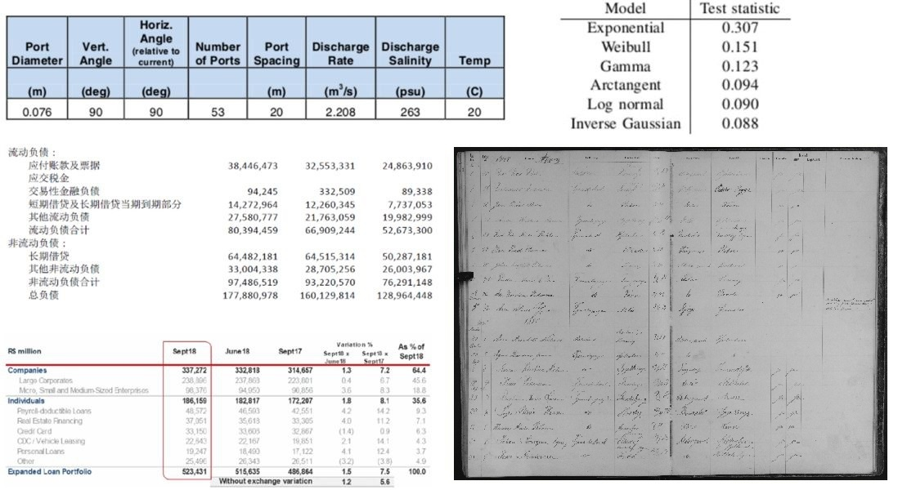
<br>
<div>图1-1 不同场景表格</div>
</div>
<br>

### 1.4 应用场景

&emsp;&emsp;表格结构识别较为基础的应用方向有：

* **信息提取**
在大数据时代背景下，人工从文本图像中提取关键信息至大数据系统中的成本过高，因此自动化的信息提取将大幅节约人工成本并提升效率。

&emsp;&emsp;表格结构识别在其他许多领域中起到关键性作用。 


## 2 方法论

> &emsp;&emsp;随着大数据的普及、计算机硬件系统的迭代更新以及算法研究的推进，深度学习在近年得以快速发展，由此，基于深度学习的方法逐渐成为了文本图像识别的主流方法。提到数字图像的智能处理，神经网络已几乎成为一个不可避免的话题，因为它的出现就是为了模拟视觉中枢的神经结构，这种使用感知方法进行特征提取的过程被一次次的实践有力地证明了其有效性。

&emsp;&emsp;基于深度学习的表格结构识别算法大体可以分为:自底向上的方法、自顶向下的方法和图像到序列生成的方法。

&emsp;&emsp;其中，自底向上的方法主要特点是先进行表格单元格和文本块的检测，再进行单元格关系的分类；自顶向下的方法则先进行表格行列的分割，之后对单元格进行合并等操作；图像文本生成方法是指基于表格图像直接生成表格结构所对应的序列文本(HTML、Latex 等)。

### 2.1 自顶向下的方法

&emsp;&emsp;自顶向下的行列分割和单元格合并的基本流程如图所示，先检测单元格的行和列分隔符，将表格划分为最基本的单元，然后再使用规则类方法或深度学习方法将这些基本单元进行合并。


### 2.2 自底向上的方法

&emsp;&emsp;自底向上的基于单元格检测和单元格关系分类的深度学习算法的基本框架如图。首先进行单元格的检测，然后通过GCN、LSTM、transformer等方法进行单元格关系的判断。
 

### 2.3 序列生成的方法

&emsp;&emsp;得益于 Table2Latex、TableBank等给定 HTML 或 Latex 代码的表格数据集，图像到序列生成的方法逐渐兴起。这种方法通过LSTM、transformer等模型生成表格结构标签。


## 3 相关数据集

&emsp;&emsp;基于深度学习的表格结构识别方法通常需要数据驱动，因此需使用大规模的数据集进行训练以得到效果更好的模型。表格数据集通常包括有表格位置检测、表格结构识别、表格文本内容识别的标签，数据集格式有PDF和图片格式等。（√表示该数据集涉及该任务，×表示该数据集不涉及该任务）

| 数据集          | 表格检测 | 表格识别 | 文本识别 | 内容             | 数量  | 格式     | 下载链接                                                     | github                                                       |
| --------------- | -------- | -------- | -------- | ---------------- | ----- | :------- | ------------------------------------------------------------ | ------------------------------------------------------------ |
| UW-Ⅲ            | √        | ×        | ×        | 文档页面图像     | 120   | 图片     |                                                              |                                                              |
| UNLV            | √        | √        | ×        | 扫描页面图像     | 427   | 图片     |                                                              |                                                              |
| Marmot          | √        | ×        | ×        | 文档页面图像     | 2000  | 图片     |                                                              |                                                              |
| DeepFigures     | √        | ×        | ×        | 生成文档图像     | 5.5M  | 图片     |                                                              |                                                              |
| ICDAR2013       | √        | √        | √        | 电子文档         | 156   | PDF      | <a href="http://www.tamirhassan.com/html/dataset.html">网站链接</a> |                                                              |
| ICDAR2019       | √        | √        | ×        | 文档页面图片     | 2539  | 图片     | <a href="https://cndplab-founder.github.io/cTDaR2019/">网站链接</a> | <a href="https://github.com/cndplab-founder/ICDAR2019_cTDaR">github</a> |
| FUNSD           | √        | √        | √        | 扫描页面图片     | 199   | 图片     |                                                              |                                                              |
| TableBank       | √        | √        | ×        | 文档页面图像     | 417K  | 图片     | <a href="https://doc-analysis.github.io/tablebank-page/index.html">下载链接</a> | <a href="https://github.com/doc-analysis/TableBank">github</a> |
| SciTSR          | ×        | √        | ×        | 表格图像、PDF    | 15k   | 图片&PDF | <a href="https://drive.google.com/file/d/1qXaJblBg9sbPN0xknWsYls1aGGtlp4ZN/view?usp=sharing">下载链接</a> | <a href="https://github.com/Academic-Hammer/SciTSR">github</a> |
| TNCR            | √        | ×        | ×        | 表格图像         | 6621  | 图片     |                                                              |                                                              |
| WTW             | √        | √        | ×        | 文档页面图像     | 14581 | 图片     | <a href="https://tianchi.aliyun.com/dataset/dataDetail?dataId=108587">下载链接</a> | <a href="https://github.com/wangwen-whu/WTW-Dataset">github</a> |
| PubTabNet       | ×        | √        | √        | 文档页面图像     | 568K  | 图片     | <a href="https://dax-cdn.cdn.appdomain.cloud/dax-pubtabnet/2.0.0/pubtabnet.tar.gz">下载链接</a> | <a href="https://github.com/ibm-aur-nlp/PubTabNet">github</a> |
| DECO            | ×        | √        | √        | 电子表格         | 1165  | 图片     |                                                              |                                                              |
| SROIE           | ×        | √        | √        | 表格图像         | 1000  | 图片     |                                                              |                                                              |
| TabLex          | ×        | √        | √        | 表格图像         | 1M    | 图片     |                                                              |                                                              |
| TABLE2LATEX     | ×        | √        | √        | 表格图像         | 450K  | 图片     |                                                              |                                                              |
| FinTab          | √        | √        | √        | 金融文档页面图像 | 110K  | PDF      |                                                              |                                                              |
| PubTables-1M    | √        | √        | √        | 文档页面图像     | 948K  | PDF      |                                                              |                                                              |
| TableGraph-350K | ×        | √        | √        | 表格图像         | 350K  | 图片     |                                                              |                                                              |


备注：ICDAR2019 数据集(cTDaR)分成现代表格和历史表格,两者都能进行表格检测任务,但是只有历史表格(训练 600 + 测试 150)包含结构信息的标注; Tablebank 数据集有两部分，其中有表格检测标注的数据是 417 K，表格结构识别标注的数据是 145 K。


#### SciTSR

&emsp;&emsp;SciTSR是一个大规模的表结构识别数据集，其中包含15000个PDF格式的表格，以及从LaTeX源文件中获得的相应结构标签。

&emsp;&emsp;其中总共有15000个表格，其中将12000个用于培训，3000个用于测试。数据集还提供了只包含复杂表的测试集，称为SciTSR-COMP。SciTSR-COMP的索引存储在SciTSR-COMP.list中。

<div align="center">

<table height=250><tr ><td>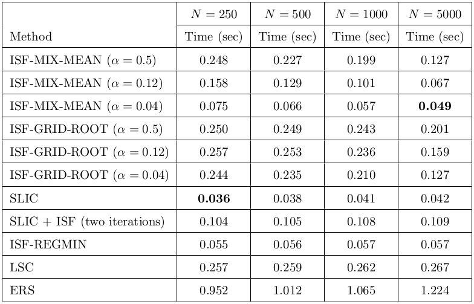</td><td>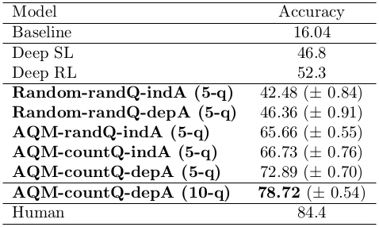</td><td>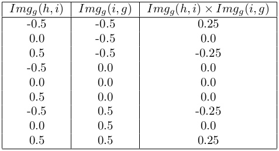</td></tr></table> 
图3-1 SciTSR样例
</div> 

#### ICDAR2013

&emsp;&emsp;ICDAR2013是一个由政府工作文件的PDF导出的数据集，其中PDF的部分页面包含表格。


<div align="center">
<table height=250><tr><td>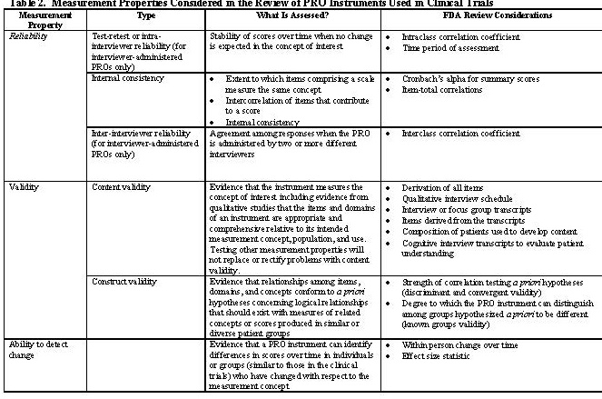</td><td>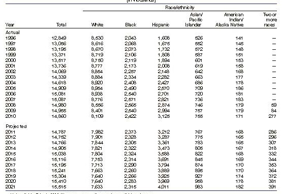</td><td>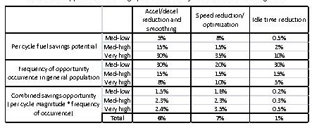</td></tr></table>
图3-2 ICDAR2013样例
</div> 

#### ICDAR2019-cTDaR

&emsp;&emsp;ICDAR 2019 cTDaR旨在评估表格检测(TRACK A)和表格结构识别(TRACK B)方法的性能。对于TRACK A，提供包含一个或多个表的文档图像。对于TRACK B，存在两个子轨迹：第一个子轨迹（B.1）提供表格区域。因此，仅必须执行表结构识别。第二个子轨迹（B.2）不提供先验信息。这意味着必须进行表区域和表结构检测。

&emsp;&emsp;数据集由各种格式的现代文档和存档文档组成，包括文档图像和天生的数字格式，如PDF。注释内容包含文档中的表格实体和单元格实体，不处理嵌套表。数据集收集了1000个现代文档和1000个存档文档作为表区域检测任务的测试数据集，收集了80个文档作为表识别任务的测试数据库（参见下图示例）。

<div align="center">
<table height=250> <tr ><td>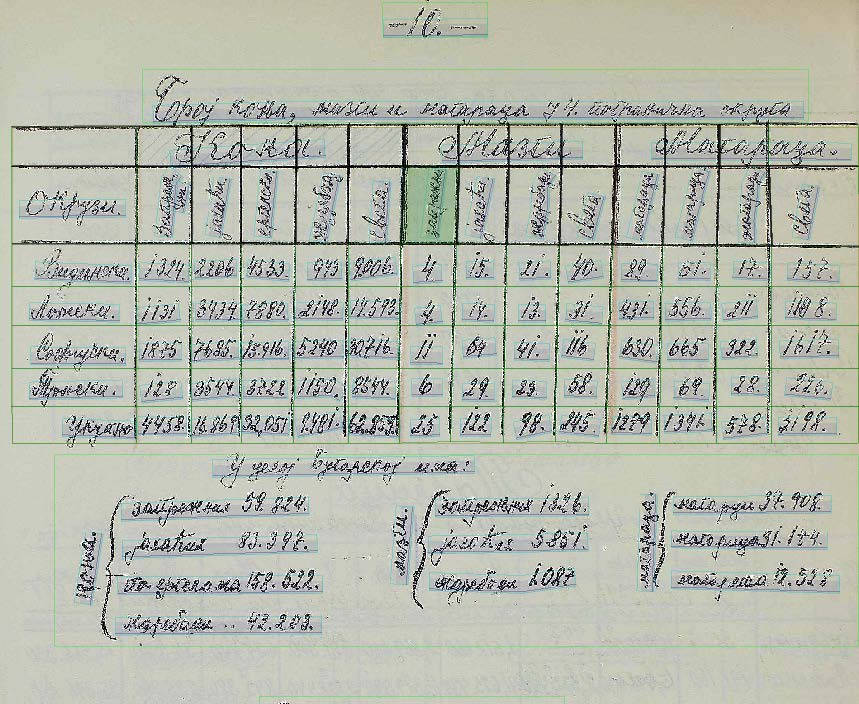</td><td>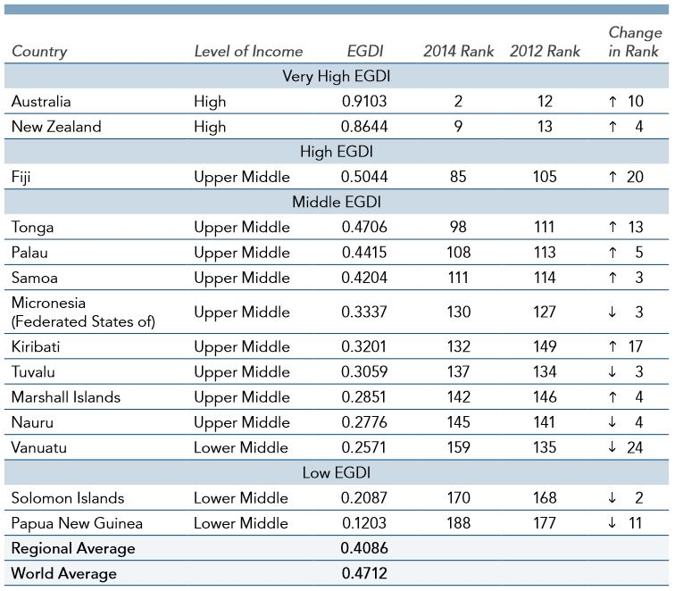
</td></tr></table>
图3-3 ICDAR2019-cTDaR样例
</div> 

#### WTW

&emsp;&emsp;WTW（Wired Table in the Wild），其中包括对多个场景（如照片、扫描文件、网页等）中的多个样式表进行注释良好的结构分析。

&emsp;&emsp;现有研究主要侧重于从扫描的PDF文档中解析具有简单布局的对齐的表格图像。数据集的提出旨在建立一个实用的表格结构解析系统，用于在严重变形、弯曲或遮挡的情况下拍摄或扫描表格输入图像的真实场景。

&emsp;&emsp;WTW数据集中的图像主要来自包含至少一个表格的自然图像。由于提出数据集的目的是在不考虑图像源的情况下解析表结构，因此数据集中还添加了存档文档图像和打印文档图像。来自自然场景、存档和打印文档图像的图像部分分别为50%、30%和20%。

&emsp;&emsp;数据集涵盖了（1）倾斜表、（2）弯曲表、（3）遮挡表或模糊表，（4）极端纵横比表，（5）重叠表、（6）多色表和（7）表结构识别中的不规则表 这7种挑战性情况。


<div align="center">
<table height=250> <tr ><td>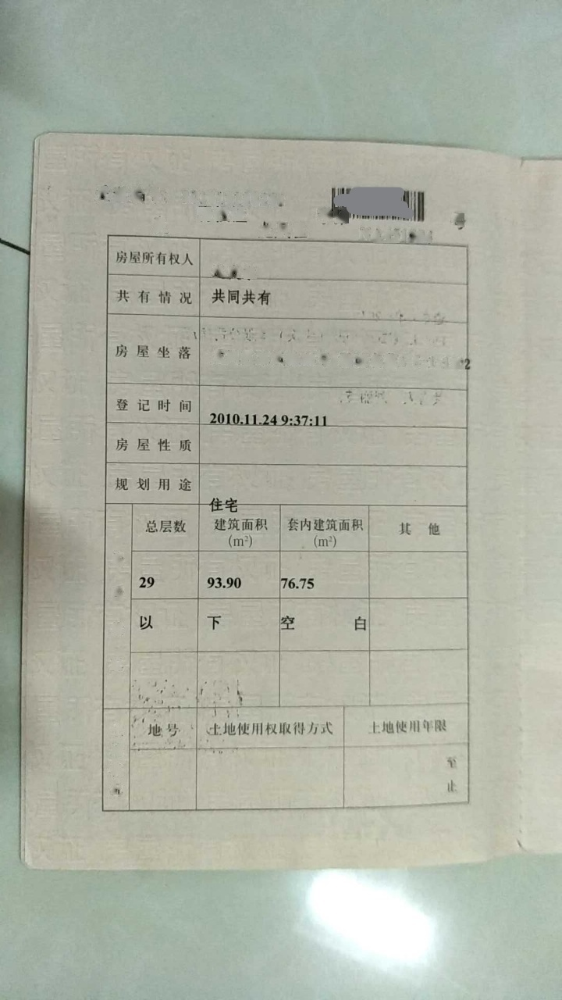</td><td>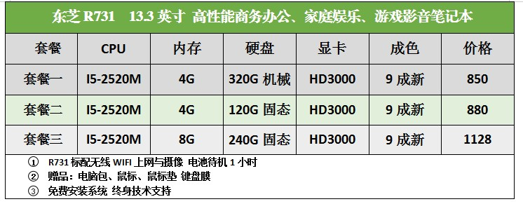
</td><td>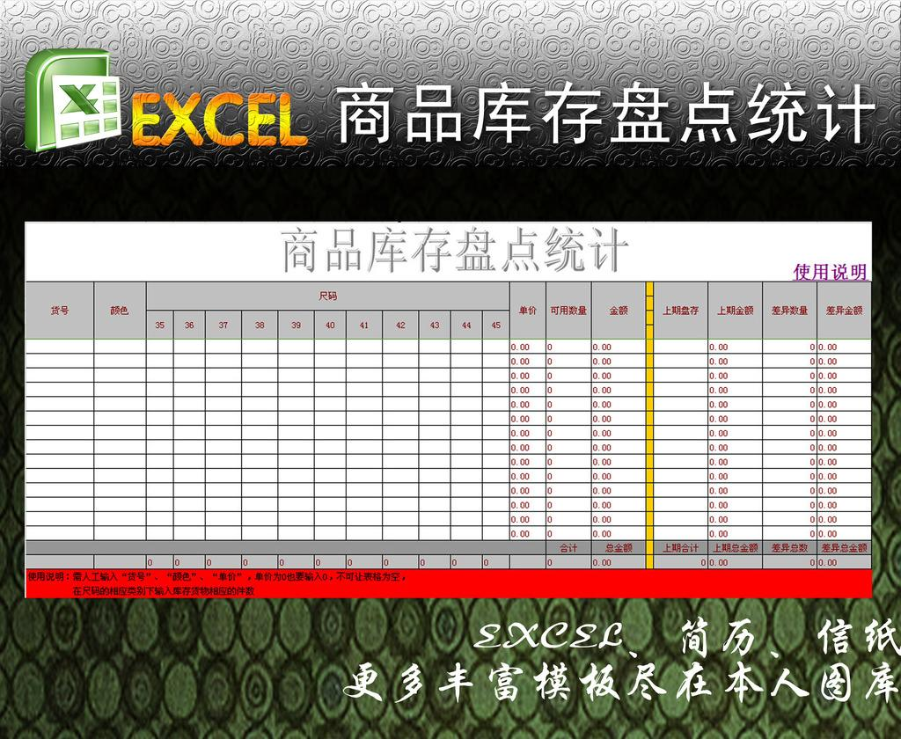</td><td>
</td></tr></table>
图3-4 WTW样例
</div> 


#### PubTabNet

&emsp;&emsp;PubTabNet是一个用于基于图像的表格识别的大型数据集，包含568k+表格数据图像，并用表格的相应HTML表示进行注释。表格图像是从PubMed中央开放访问子集（商业用途集合）中包含的科学出版物中提取的。通过匹配PubMed Central开放访问子集中文章的PDF格式和XML格式来标识表区域。


<div align="center"> 
<table height=250> <tr ><td>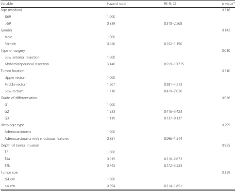</td><td>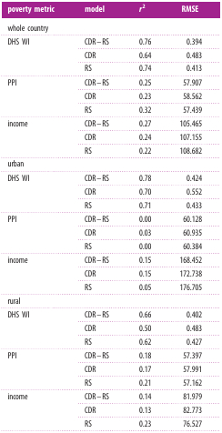</td><td>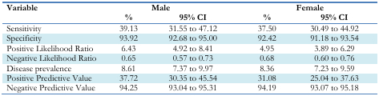</td> </tr></table>
图3-5 PubTabNet样例
</div> 

#### TableBank


&emsp;&emsp;TableBank是一个基于图像的表格检测和识别数据集，它是由互联网上的Word和Latex文档构建的，包含417K个高质量的标记表格。

 

<div align="center"> 
<table height=250> <tr ><td></td><td></td><td></td> </tr></table>
图3-6 TableBank样例</div> 

## 4 论文介绍

> &emsp;&emsp;近年来的表格识别领域在有关基于深度学习方法的相关研究上有了迅猛推进，在每年的各大CV会议和期刊上不乏出现令人眼前一亮的方法。本节将选取表格识别任务中具有代表性和特殊意义的方法，对其论文和模型进行概括和综述。
### 4.1 WTW

#### 论文概述

&emsp;&emsp;本文主要针对自然真实场景有线表格结构识别这一具有挑战性的问题进行研究。为了设计这样一个系统，本文在CenterNet的基础上提出 Cycle-CenterNet，该方法增加新的cycle-pairing模块同时检测表格单元格并将其分组到结构化表格中。在cycle-pairing模块中，提出一个新的损失函数pairing loss用于网络训练。同时本文还提出一个大的数据集名为WTW, 它包含了照片、扫描文件、网页等多个场景，并进行了准确的标注。实验结果表明本文提出的Cycle-CenterNet使用TEDS为评价指标在WTW数据集上提升了24.6%。 

#### 模型方法

**Cycle-CenterNet**

&emsp;&emsp;基于CenterNet，本文提出的网络添加cycle-pairing模块和pairing loss来学习相邻单元格的共同顶点。整个网络结构如下图所示


 

<div align="center"> 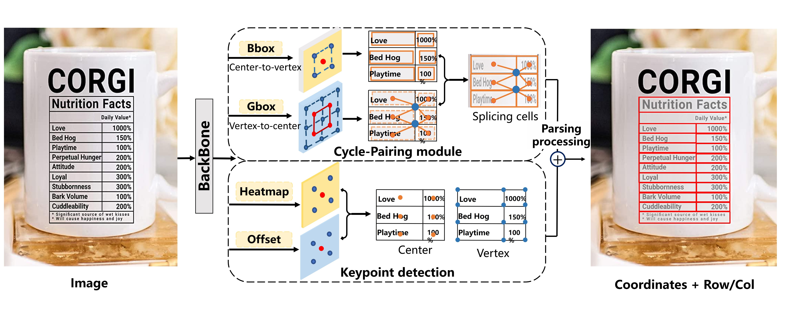
<div>图4-1 Cycle-centerNet网络结构</div></div> 
<br>

&emsp;&emsp;Cycle-CenterNet的pipeline，输入一张图片，我们的模型输出一个2通道的关键点热力图和一个2通道的offset热力图。cycle-pairing模块输出两个8通道的热力图，用来学习中心点和角点之间的相互回归的关系。根据这个关系，单元格会被分组，最终行列信息通过后处理恢复出来。

**Cycle-Pairing模块**

&emsp;&emsp;为了识别表格结构，我们提出Cycle-Pairing模块定位单元格和学习单元格之间的拼接关系，它包含两个分支，一个是中心点到顶点分支，一个是顶点到中心点分支。如图1所示，中心点到顶点分支，我们回归单元格中心点到每个顶点的偏移量，并采用和CenterNet一样的后处理，那么单元格的多边形表示就可以得出。顶点到中心点分支，相同顶点回归与共有这个顶点的偏移量。最终表的拼接信息可以在后处理中得出。 

&emsp;&emsp;中心点到顶点分支，主要是在CenterNet的基础上由中心点回归四个顶点。

&emsp;&emsp;顶点到中心点分支，在CenterNet的基础上由顶点回归四个中心点，如果共有顶点K的单元格的数量小于4，那么对应回归的目标值则是0。


 

<div align="center">
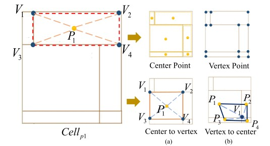 
<div>图4-2 Cycle-Pairing模块</div></div> 
<br>

### 4.2 LGPMA

#### 论文概述

&emsp;&emsp;本文提出了一种统一的表格结构识别框架，称为LGPMA（local and global Pyramid Mask Alignment，局部和全局金字塔掩码对齐）网络，以兼顾局部和全局信息的优点。具体而言，该模型同时学习基于局部掩码RCNN的对齐边界框检测任务和全局分割任务。在这两项任务中，都采用了金字塔软掩码监控，以帮助获得更精确的对齐边界框。在LGPMA中，局部分支（LPMA）通过可见纹理感知器获得更可靠的文本区域信息，而全局分支（GPMA）可以获得更清晰的细胞范围或分裂的空间信息。这两个分支通过联合学习帮助网络更好地学习融合特征，并通过提出的掩码重新评分策略有效地细化检测到的对齐边界框。

#### 模型方法

&emsp;&emsp;LGPMA，其总体工作流程如图所示。


<div align="center">


<div>图4-3 LGPMA模型</div></div> 
<br>

&emsp;&emsp;该模型是基于现有Mask RCNN建立的。边界框分支直接学习非空单元对齐边界框的检测任务。网络同时学习基于RoI对齐操作提取的局部特征的局部金字塔掩码对齐（LPMA）任务和基于全局特征映射的全局金字塔掩码对齐（GPMA）任务。

&emsp;&emsp;在LPMA中，除了学习文本区域掩码的二值分割任务外，还使用水平和垂直方向上的金字塔软掩码监控来训练网络。

&emsp;&emsp;在GPMA中，网络学习所有非空单元对齐边界框的全局金字塔掩码。为了获得更多关于空单元分割的信息，网络还学习了同时考虑非空单元和空单元的全局二值分割任务。

&emsp;&emsp;然后采用金字塔掩码重新评分模块对预测的金字塔标签进行细化。通过平面聚类可以得到精确对齐的边界盒。最后，集成单元匹配、空单元搜索、空单元合并的统一结构恢复管道，得到最终的表结构。

**检测框对齐**

&emsp;&emsp;精确的文本区域匹配的困难主要来自文本区域与真实单元格区域之间的覆盖范围差距。实际单元格区域可能包含行/列对齐的空白，尤其是跨多行/列的单元格。通过文本区域和行/列索引的注释，可以根据每行/列中的最大框高度/宽度轻松生成对齐的边界框注释。对齐边界框的区域与实际单元的区域大致相等。对于打印格式且无视觉旋转或透视变换的表格图像，如果我们能够获得对齐的单元格区域并假设没有空单元格，则很容易根据水平和垂直方向上的坐标重叠信息推断单元格关系。

&emsp;&emsp;采用Mask-RCNN作为基础模型。在边界框分支中，基于对齐的边界框监督对网络进行训练。然而，对齐边界框学习并不容易，因为单元格很容易与空区域混淆。受高级金字塔掩码文本检测器的启发，我们发现使用软标签分割可以突破建议的边界框的限制，并提供更精确的对齐边界框。为了充分利用局部纹理和全局布局的视觉特征，我们建议同时学习这两个折叠中的金字塔遮罩对齐信息。

**局部金字塔掩码对齐**

&emsp;&emsp;在掩模分支中，训练模型学习二值分割任务和金字塔掩模回归任务，称之为局部金字塔掩模对齐（LPMA）。

&emsp;&emsp;二值分割任务与原始模型相同，其中只有文本区域标记为1，其他区域标记为0。检测到的遮罩区域可用于后面文本识别任务。

&emsp;&emsp;对于金字塔mask回归，我们在水平和垂直方向上为建议边界框区域中的像素分配软标签，如图所示。


<div align="center">

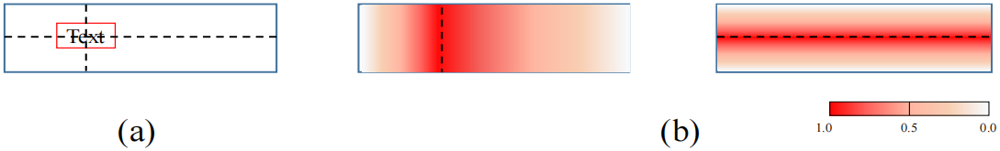

<div>图4-4 局部金字塔掩码对齐</div></div> 
<br>

&emsp;&emsp;具体来说，我们假设所提出的对齐边界框(图中蓝色的框)的形状为H×W,金字塔mask的shape=(2,H,W)，训练目标值是属于[0,1]。两个通道分别表示了水平、垂直mask。对于任意像素(h,w)，这两个值可以由如下形式给出:

$$
t_h^{(w,h)}=
\begin{cases}
{w/x_1}&{ w\le x_{mid}}\\
\frac{W-w}{W-x_2}&{w>x_{mid}}
\end{cases},
t_v^{(w,h)}=
\begin{cases}
{h/y_1}&{ h\le y_{mid}}\\
\frac{H-h}{H-y_2}&{h>y_{mid}}
\end{cases}
$$

&emsp;&emsp;其中 $x_{mid}=\frac{x_1+x_2}{2},y_{mid}=\frac{y_1+y_2}{2}$ 


**全局金字塔Mask对齐**

&emsp;&emsp;虽然LPMA允许预测的掩码突破提议边界框，但局部区域的接受域是有限的。为了确定单元格的准确覆盖区域，全局特征还可能提供一些视觉线索。使用金字塔标签作为每个像素的回归目标，称为全局金字塔掩码对齐（GPMA）。

&emsp;&emsp;与LPMA一样，GPMA同时学习两个任务：全局分割任务和全局金字塔掩码回归任务。在全局分割任务中，我们直接分割所有对齐的单元格，包括非空单元格和空单元格。根据同一行/列中非空单元格的最大高度/宽度生成空单元格的基本真值。请注意，只有此任务才能学习空单元格分割信息，因为空单元格不可能在某种程度上影响区域建议网络的可见文本纹理。我们希望该模型能够根据人类的阅读习惯，在全局边界分割过程中捕捉到最合理的单元格分裂模式，这一点可以通过人工标注的注释反映出来。对于全局金字塔掩码回归，由于只有文本区域可以提供不同峰值的信息，因此所有非空单元格将被分配类似于LPMA的软标签。GPMA中对齐边界框的所有GT将缩小5%，以防止框重叠。

**推理**

&emsp;&emsp;推理过程可以分为两个阶段。我们首先根据金字塔掩码预测得到精确对齐的边界框，然后利用所提出的结构恢复管道生成最终的表结构。

&emsp;&emsp;边界框对齐。局部特征预测更可靠的文本区域mask，而全局预测可以提供更可靠的远距离视觉信息。为了折衷这两种水平的优点，我们提出了一种金字塔掩码重新评分策略，以折衷LPMA和GPMA的预测。对于具有局部金字塔掩码预测的任何建议区域，我们添加来自全局金字塔掩码的信息以调整这些分数。我们使用一些动态权重来平衡LPMA和GPMA的影响。

&emsp;&emsp;对于一个预测的对齐边框 $B=\lbrace (x_1,y_1),(x_2,y_2)\rbrace$，我们首先获得文本区域mask的bbox，记为： $B_t=\lbrace (x_1^{'},y_1^{'}),(x_2^{'},y_2^{'})\rbrace$ 。然后，我们可以在全局分割图中找到匹配的连通区域 $P=\lbrace p_1,p_2,⋯,p_n\rbrace$ ，其中 $p=(x,y)$ 表示像素。我们使用 $P_o=\lbrace p∣x1⩽p.x⩽x2,y1⩽p.y⩽y2\rbrace$ 表示重叠区域。则关于点 $(x,y)∈P_o$ 的预测金字塔标签可以由如下的方式计算：

$$
F(x)=\begin{cases}\frac{x-x_1}{x_{mid}-x_1}F_{hor}^{(L)}(x,y)+\frac{x_{mid}-x}{x_{mid}-x_1}F_{hor}^{(G)}(x,y)&{ x_1\le x\le x_{mid}}\\ \frac{x-x_2}{x_{mid}-x_2}F_{hor}^{(L)}(x,y)+\frac{x_{mid}-x}{x_{mid}-x_2}F_{hor}^{(G)}(x,y)&{ x_{mid}\le x\le x_{2}}\end{cases}
$$

$$
F(y)=\begin{cases}\frac{y-y_1}{y_{mid}-y_1}F_{ver}^{(L)}(x,y)+\frac{y_{mid}-y}{y_{mid}-y_1}F_{ver}^{(G)}(x,y)&{ y_1\le y\le y_{mid}}\\ \frac{y-y_2}{y_{mid}-y_2}F_{ver}^{(L)}(x,y)+\frac{y_{mid}-yx}{y_{mid}-y_2}F_{ver}^{(G)}(x,y)&{ y_{mid}\le y\le y_{2}}\end{cases}
$$

&emsp;&emsp;其中 $x_{mid}=\frac{x_1+x_2}{2},y_{mid}=\frac{y_1+y_2}{2}$ ， $F_{hor}^{(L)}(x,y),F_{hor}^{(G)}(x,y),F_{ver}^{(L)}(x,y),F_{ver}^{(G)}(x,y)$ 分别表示局部水平、全局水平、局部垂直、全局垂直金字塔标签预测。

&emsp;&emsp;接下来，对于任何建议区域，可以使用水平和垂直金字塔mask标签（对应于z坐标）分别拟合三维空间中的两个平面。所有四个平面与零平面的相交线都是细化的边界。例如，要优化对齐框的右边界，我们选择所有使用优化金字塔mask预测 $F(x,y)$ 进行对满足 $P_r={p∣x_{mid}⩽p.x⩽x_2,p∈P_o}$ 的像素拟合平面。如果我们记$ax+by+c−z=0$ ，使用最小二乘法，这个问题可以转化为最小化下面的式子：

$$
min\sum\limits_{y_i=y_1}^{y_2}\sum\limits_{x_i=x_{mid}}^{x_2}(ax_i+by_i+c-F(x_i,y_i))^2,\forall p=(x_i,y_i)\in{P_r}
$$

a,b,c参数可以通过如下的矩阵计算：

$$
\begin{pmatrix}a\\
b\\
c\end{pmatrix}={\begin{bmatrix}\sum x_i^2&\sum x_iy_i&\sum x_i \\
 \sum x_iy_i&\sum y_i^2&\sum y_i \\
  \sum x_i&\sum y_i&||p_o||\end{bmatrix}}^{-1}\begin{pmatrix}x_iF(x_i,y_i)\\
   y_iF(x_i,y_i)\\
    F(x_i,y_i)\end{pmatrix}
$$

&emsp;&emsp;其中 $||P_o||$ 表示集合的大小。然后计算拟合平面与z=0平面之间的交线。假设边界框是轴对齐的，我们计算细化的x坐标作为平均值：

$$
x_{refine}=-\frac{1}{y_2-y1+1}\sum\limits_{y_i=y1}^{y_2}\frac{by_i+c}{a}
$$

**表格结构恢复**

&emsp;&emsp;基于精确对齐的边界框，表结构恢复管道旨在获得最终的表结构，包括三个步骤：单元格匹配、空单元搜索和空单元合并


<div align="center">

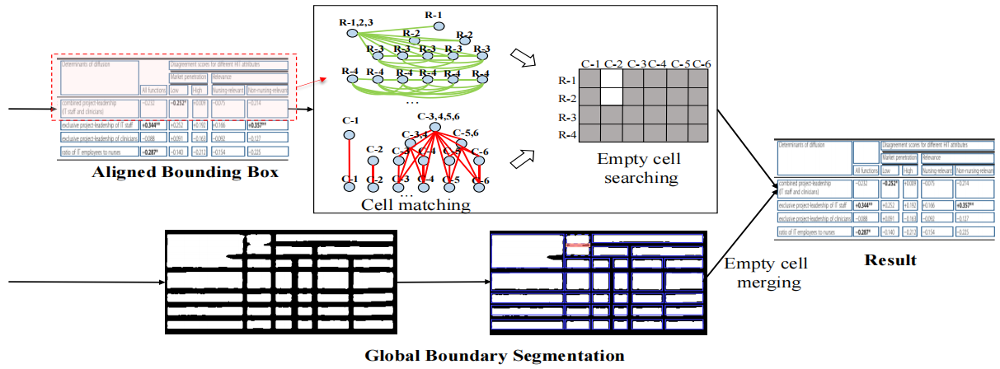
<div>图4-5 表格结构恢复</div></div> 
<br>


&emsp;&emsp;单元格匹配。（这一步相当于行列关系判断）在所有对齐的边界框都是轴对齐的情况下，单元格匹配过程非常简单。连接关系可分为水平和垂直类型。其主要思想是，如果两个对齐的边界框在x/y坐标上有足够的重叠，我们将在垂直/水平方向上匹配它们。 

&emsp;&emsp;空单元格搜索。在获得检测到的对齐边界框之间的关系后，我们将它们视为图中的节点，并且连接关系是边。同一行/列中的所有节点构成一个完整的子图。采用最大团搜索算法来查找图中的所有最大团。以行搜索过程为例，属于同一行的每个节点都将位于同一个群组中。对于跨越多行的单元格，相应的节点将在不同的组中多次出现。通过平均y坐标对这些团进行排序后，我们可以很容易地用其行索引标记每个节点。出现在多个派系中的节点将使用多个行索引进行标记。

&emsp;&emsp;空单元格合并。到目前为止，我们已经获得了最小级别的空单元格（占用1行1列）。为了更可行地合并这些单元格，我们首先将具有对齐边界框形状的单个空单元格指定为同一行/列中单元格的最大高度/宽度。由于全局分割任务学习到的视觉线索，我们可以根据分割结果设计简单的合并策略。我们计算每两个相邻空单元的间隔区域中预测为1的像素比率。如果比率大于预设阈值，我们将合并这两个单元格。


### 4.3 TableStruct-Net

#### 论文概述

&emsp;&emsp;TabStruct-Net是一种端到端可训练的深度学习结构，用于单元检测和表格结构识别。TabStructNet使用表格图像作为输入，并尝试预测表格结构，它使用两个阶段的过程，(A)自上而下阶段(分解阶段)：这是基于掩码RCNN(修改的FPN)的单元检测(基本表格对象)网络(B)自下而上阶段(合成阶段)，其从单元检测网络获取信息(自上而下阶段)，以及它们使用邻接矩阵的行-列关联，并重建整个表格

#### 模型方法

&emsp;&emsp;该方案分为两步，第一步采用自顶向下的策略，通过检测网络来对表格图像进行单元格检测；第二步则采用自底向上的策略，得到单元格之间的行列关系矩阵。


<div align="center">

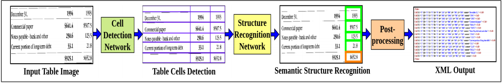
<div>图4-6 TableStruct-Net </div></div> 
<br>

&emsp;&emsp;网络将这两步放在一个网络里实现端到端的表格结构识别，具体来说，单元格检测部分采用maskrcnn网络，单元格关系采用TIES即GCN

&emsp;&emsp;单元格检测难的主要原因：1.单元格的尺寸和长宽比变化大；2.尽管文本数量和位置变化很大，但单元格之间固有的对齐关系还是存在的；3.单元格内容缺乏语境上下文；4.存在空白单元格；5.单元格存在多行文本

&emsp;&emsp;然后这里提出了alignment loss来克服单元格检测的这些问题

$$
L_1=\sum_{r\in SR}\sum_{c_i,c_j\in r}{||y1_{c_i}-y1_{c_j}||}_2^2 , L_2=\sum_{r\in ER}\sum_{c_i,c_j\in r}{||y2_{c_i}-y2_{c_j}||}_2^2
$$

$$
L_3=\sum_{c\in SC}\sum_{c_i,c_j\in c}{||x1_{c_i}-x1_{c_j}||}_2^2,L_4=\sum_{r\in EC}\sum_{c_i,c_j\in c}{||x2_{c_i}-x2_{c_j}||}_2^2
$$

$$
L_{align}=L_1+L_2+L_3+L_4
$$

&emsp;&emsp;网络输入是一张只包含表格区域的图像，输出单元格的坐标以及代表单元格之间关系的行邻接矩阵和列邻接矩阵，之后通过后处理得到表格结构。

&emsp;&emsp;网络的总损失由多个部分组成：一部分继承自maskrcnn，有边框回归损失，边框分类损失，边框mask损失；对齐损失，单元格邻接矩阵的损失

$$
L=L_{box}+L_{cls}+L_{mask}+L_{align}+L_{gnn}
$$

后处理：

&emsp;&emsp;1.将单元格按照左上角y坐标排序

&emsp;&emsp;2.从上向下为每个单元格分配row index，通过行邻接矩阵得到与该单元格同行的其他单元格，并将这个row index分配给它们，

&emsp;&emsp;3.遍历完后每个单元格可能会被分配多个row index，对于每个单元格，SR是所有分到它的row index的最小值，ER是所有分到它的row index的最大值

&emsp;&emsp;4.同理对单元格按照左上角x坐标排序，得到每个单元格的SC和EC


### 4.4 TGRNet

#### 论文概述

&emsp;&emsp;作者总结了主流的三种识别表格的方法以及他们相应的缺点。如下图所示，基于单元格检测的方法忽略了单元格之间的逻辑关系；基于图像到序列的解码方式需要后处理操作；基于邻接关系建模的方法需要复杂的图优化算法。 

&emsp;&emsp;在上述的观察和分析后，作者提出一个面向表格的图重构网络（TGRNet），该方法同时预测单元格的空间位置和逻辑位置：训练时两个支路联合优化；测试时省去复杂的后处理操作。


<div align="center">
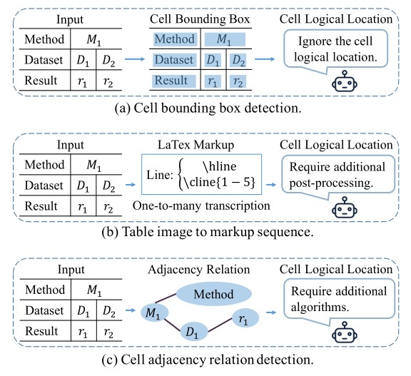
<div>图4-7 三种识别流程 </div></div> 
<br>


#### 模型方法


<div align="center">

<div>图4-8 TGRNET </div></div> 
<br>


&emsp;&emsp;TGRNet包含两条支路，分别处理单元格图像分割和逻辑分析，以下分两点说明。1）在主干网络ResNet-50 (FPN) 提取特征图$f_{inter}$后，分割支路分别在行和列两个方向上得到平均池化结果，并与$f_{seg}$特征拼接到一起后输入后续的网络，得到分割图；2）逻辑支路使用了图卷积网络，结点特征X融合了分割支路的特征和逻辑支路的特征（在$f_{log}$上使用ROIAlign操作以提取相应位置特征），邻接矩阵的定义如下： 

$$
\begin{cases}\begin{aligned}a_{i,j}^{row}=exp\lbrace -(\frac{b_i^y-b_j^y}{H}\cdot \alpha)^2\rbrace \\
 a_{i,j}^{col}=exp\lbrace -(\frac{b_i^x-b_j^x}{W}\cdot \alpha)^2\rbrace \end{aligned}\end{cases}
$$


&emsp;&emsp;即空间距离越大的单元格之间的权重越小。α是一个超参数，可以根据行列数量来调整。

&emsp;&emsp;如何得到最后的行/列逻辑顺序呢？作者没有直接预测该单元格的行/列序号，而是预测T-1个二分类结果（ T为行数/列数），标签定义如下： 

$$
q_i^t=
\begin{cases}
1,&if(t<r_i),\\
0,&otherwise.
\end{cases}
$$

&emsp;&emsp;损失函数定义为：

$$
L(X^{'},\Theta)=-\frac{1}{N}\sum\limits_{i=1}^N\Psi(x_i^{'},\Theta),
$$

$$
\Psi(x_i^{'},\Theta)=\sum\limits_{t=0}^{r_i-1}log(p_t^t)+\sum\limits_{t=r_i}^{T-2}log(1-p_i^t)
$$

&emsp;&emsp;考虑到样本不均衡的问题，作者进一步使用Focal Loss的思想解决这个问题： 

$$
\Psi(x_i^{'},\Theta)=\sum\limits_{t=0}^{r_i-1}(1-p_i^t)^{\gamma _t}log(p_t^t)+\sum\limits_{t=r_i}^{T-2}(1-p_i^t)^{\gamma _t}log(1-p_i^t)
$$

$$
\gamma _t=min(2,-(1-\lambda _t)^2log(\lambda _t)+1
$$

### 4.5 TableMaster

#### 论文概述

&emsp;&emsp;在表格识别中，模型一般先回归出单元格的坐标，然后再根据单元格的坐标得到表格的行列信息。对于有表格线的场景，模型可以比较准确地获取单元格坐标，进而可以利用单元格坐标后处理得到行列信息。对于无表格线情况，通常难以直接得到单元格位置或表格线信息，这时通常需要利用模型训练的方式获取文字块的空间布局。例如在图模型中，常见的识别流程是先由OCR模型获取文字框的坐标和文字内容，然后结合视觉、位置、语义等多模态信息，并利用图网络来预测文字节点的行列属性，进而恢复出表格的结构。

&emsp;&emsp;在平安科技最新发布的表格识别模型TableMaster中，提出了另外一种解决思路，即同时训练得到单元格内的文字块位置和表格结构。这里涉及到表格的另一种表达形式，这种形式在网页中经常被用到，也即用超文本标记语言来定义表格。


<div align="center">
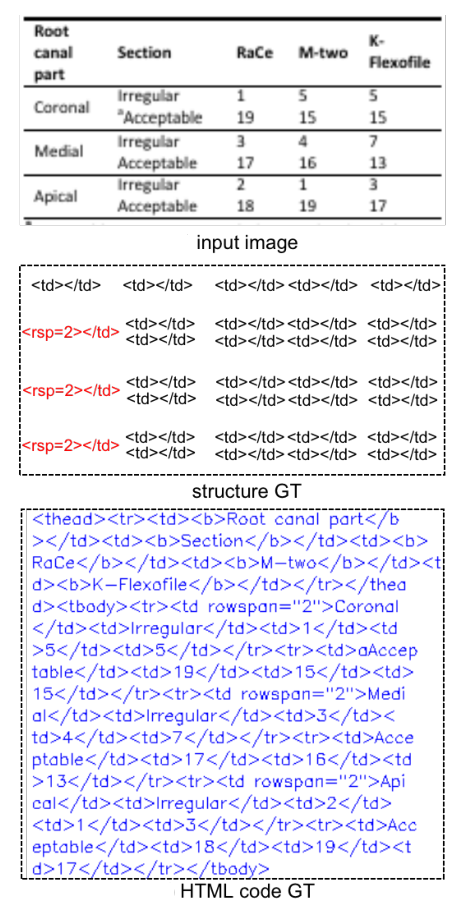
<div>图4-9 表格的HTML识别 </div></div> 
<br>

&emsp;&emsp;根据超文本标记语言的语法规则，表格是由 \<table> 标签来定义，每个表格均有若干行（由 \<tr> 标签定义），每行被分割为若干单元格（由 \<td> 标签定义）。从图可以看出，一个表格被表示成了一段文本字符序列，这样就可以用序列化的模型（seq2seq或transformer）来进行表格结构预测。

**模型方法**

&emsp;&emsp;TableMaster采用多任务的学习模式，它有两个分支，一个分支进行表格结构序列预测，一个分支进行单元格位置回归。在TableMaster识别结束后，识别结果经过后处理匹配算法，融合表格结构序列和单元格文本内容，得到表格最终的html。

**网络架构**

&emsp;&emsp;TableMaster基于Master模型进行了修改。Master是平安自研的文本识别模型， 其网络结构分为编码和解码两个部分。编码的网络结构借鉴ResNet的残差连接结构。TableMaster特征提取模型也即编码结构和Master一致，和Master结构不同的地方在解码部分。TableMaster的解码部分相对于Master增加了一个分支：在经过一个Transformer层之后，TableMaster的解码部分分成两个分支。之后每个分支再接两个Transformer层，分别对应两个学习任务：单元格文字框的回归以及表格结构序列的预测。


<div align="center">
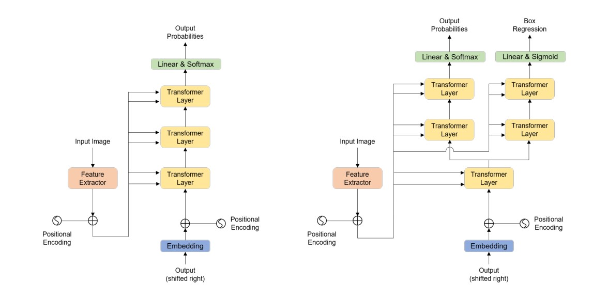
<div>图4-10 TableMaster模型 </div></div> 
<br>

**输入和输出**

&emsp;&emsp;TableMaster特征提取阶段输入图片的维度为480×480×3，输出的维度为7×7×500，然后把输出的序列特征reshape到49×500，输入到解码阶段。其中500是模型的序列长度，49为每个位置序列特征的维度。表格的类别标签有38个（如图5），再加上开始和结束两个标签，模型中用到的类别标签一共是41个，如下图。


<div align="center">
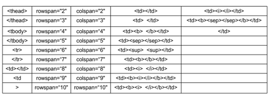
<div>图4-11 TableMaster用到的标签 </div></div> 
<br>

&emsp;&emsp;其中有两个\<td>\</td>，一个表示空单元格，一个表示非空单元格。

&emsp;&emsp;标记符中有\<tbody>、\</tbody>、\<tr>、\</tr>等表示表格开始和行的标记符以及空单元格的标记符。这些标记符没有对应的文字块坐标。因此标记符序列长度比实际的单元格序列长。为了使得单元格序列和标记符序列一样长，在单元格序列中，对应于\<tbody>、\</tbody>、\<tr>、\</tr>标记的位置会填充为0。而这些位置的坐标在回归单元格坐标时不用于参数的更新，会被一个Mask过滤掉。

&emsp;&emsp;下图展示了TableMaster识别的表格结构序列和单元格坐标： 


<div align="center">
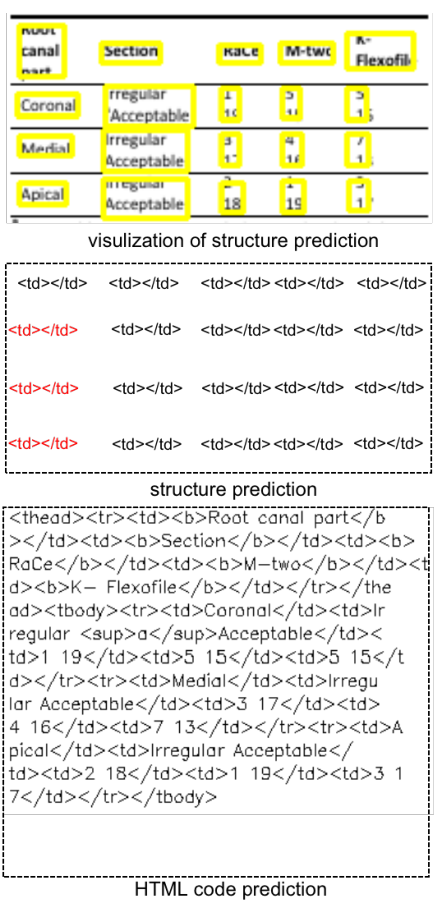
<div>图4-12 TableMaster结果样式 </div></div> 
<br>

**文字框定位和识别**

&emsp;&emsp;在文字检测和识别阶段用到的文字检测模型为经典的PSENet。文字识别用到的模型就是上文提到的Master。利用PSENet+Master模型组合，文字端到端的识别精度可以达到0.9885。

**还原完整的html**

&emsp;&emsp;TableMaster网络输出的表格结构序列并不是最终的html序列。为了得到表格最终的html序列还需要在表格结构标记符中填充对应的文字内容，其流程如下：（a为流程图，b为最终的html序列，c为html序列可视化）


<div align="center">
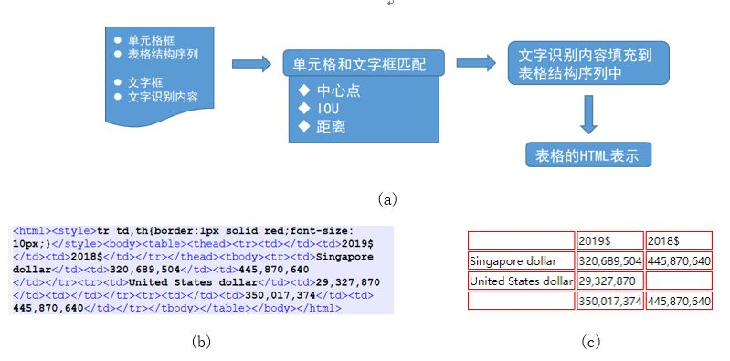
<div>图4-13 TableMaster Pipeline </div></div> 
<br>

&emsp;&emsp;其中重要的一步就是单元格的匹配：根据单元格坐标和文字框坐标，把文字框坐标和单元格坐标进行对齐，然后就可以把对应文字框的识别内容填充到对应单元格的标记符序列中，从而得到最终的html文本。文字框的对齐主要基于三个规则：1、中心点规则，如果文字框的中心点在单元格框内，则把文字框相应的文字内容填充到对应的\<td>\</td>中；2、IOU规则，在第一点不满足的情况下，计算和文字框具有最大IOU的单元格框作为匹配项；3、距离原则，如果以上两点都不满足，则计算所有单元格和文字框的距离，选取距离最小的单元格框作为匹配项。


## 5 任务实践

> &emsp;&emsp;针对表格结构识别的相关任务，FudanVIA提供了一套较为完整的解决方案，其中已封装了具有代表性的表格结构识别模型的对应功能接口，可供系统开发和学习交流使用。本节将基于这些接口介绍具体的任务实践。

### 5.1 模型组件介绍
**介绍算法库中有关文本识别任务的组件及其构成，简单阐述工作原理*
### 5.2 模型组件接口调用
**介绍模型组件接口的方法、参数和注意事项等*

&emsp;&emsp;FudanVIA中有关文本识别组件的接口为`FudanVIA.getTSRComponent(model_name: str)`，若要调用接口，首先需要对FudanVIA库进行引入：

```python
import FudanVIA
```

&emsp;&emsp;文本识别组件接口`getTSRComponent()`含有一个参数`model_name`，为字符串类型数据。在该参数中输入需要使用的文本识别模型的名称，`getTSRComponent()`方法将会返回一个TSRBaseComponent类的实例化对象，其中包含了与名称对应的初始化文本识别模型：

```python
TGRNet = FudanVIA.getTSRComponent("TGRNet")
```

目前可输入的名称范围为("TGRNet" ) ；输入其他字符串则将报错。后续将逐步在算法库中更新更多表格结构识别模型。

&emsp;&emsp;由此，通过接口调用完成了一个表格结构识别模型组件的初始化。接下来，通过调用模型组件的接口，即可完成模型训练、模型测试、模型预测等功能。

#### 权重加载
&emsp;&emsp;调用`load_checkpoint()`方法以加载预先完成训练的模型权重：

```python
TGRNet.load_checkpoint(weight_dir="PATH_TO_WEIGHT")
```

该接口接收1个输入参数`weight_dir`，为字符串型参数，用于指定权重路径；而该接口无返回值，直接将权重参数载入已完成初始化的模型中。

#### 模型训练
&emsp;&emsp;若要实现模型的训练功能，应调用模型组件的train()方法：

```python
TGRNet.train(
    train_dir="PATH_TO_TRAIN_DATASET",
    val_dir="PATH_TO_VAL_DATASET",
    output_dir="PATH_TO_SAVE_WEIGHTS_AND_LOGS",
    nun_epoch=0
)
```

需要向其传入4个参数：
* `train_dir`：字符串型参数，指定训练数据集所在的路径；
* `val_dir`：字符串型参数，指定验证数据集所在的路径；
* `output_dir`：字符串型参数，指定存放训练所得权重和训练记录的位置；
* `num_epoch`：整型参数，默认值为0，用于指定从第几个epoch开始训练模型，通常用于中断训练后指定继续开始位置。

由此完成对表格识别模型的训练。`train()`方法没有返回值，训练结果将直接以计算机文件的形式进行持久化。

#### 模型测试
&emsp;&emsp;调用模型组件的`test()`方法，即可实现模型的测试功能：

```python
test_acc = TGRNet.test(
    test_dir="PATH_TO_TEST_DATASET",
    log_dir="PATH_TO_SAVE_TEST_LOGS"
)
```

需要向其传入2个参数：
* `test_dir`：字符串型参数，指定测试数据集所在的路径；
* `log_dir`：字符串型参数，指定保存测试结果记录的路径。

`test()`方法拥有一个float型返回值，返回测试得到的表格识别模型的F1。`test()`方法实则在测试数据集上仅执行一次验证功能的`train()`方法。

#### 模型预测
&emsp;&emsp;模型预测功能需要调用`inference()`方法：

```python
rec_list = TGRNet.inference(img_list=[imgA, imgB, imgC])
```

`inference()`方法接受列表类型的输入，输入的列表长度应大于0，且列表中的所有元素应为numpy数组格式的图像。经过预测后，`inference()`方法会返回与输入图像序列一一对应的识别结果列表，列表的长度与输入列表长度相等，列表内的所有元素为字符串类型的数据。

### 5.3 任务范例
&emsp;&emsp;根据FudanVIA提供的模型组件接口，可基本实现表格结构识别模型的全部内容。本节将给出一个基于FudanVIA的模型组件接口的简易表格识别器的实现。

#### 训练模块代码

```python
import FudanVIA

def training_module():
    TGRNet = FudanVIA.getTSRComponent("TGRNet")
    TGRNet.train(
        train_dir="../dataset/train_dataset",
        val_dir="../dataset/val_dataset",
        output_dir="./save"
    )
    test_acc = TGRNet.test(test_dir="../dataset/test_dataset")
    
    return test_acc
```

#### 预测模块代码

```python
import cv2
import FudanVIA

def inferring_module():
    TGRNet = FudanVIA.getTSRComponent("TGRNet")
    TGRNet.load_checkpoint(weight_dir="./save/model_best.pth")
    
    img_path = ["../demo/1.jpg", "../demo/2.jpg", "../demo/3.jpg", "../demo/4.jpg", "../demo/5.jpg"]
    img_list = [cv2.imread(i) for i in img_path]
    
    rec_list = TGRNet.inference(img_list)

    return rec_list
```

### 5.4 常见问题Q&A
**在此列出开发实践过程中遇到的有记录价值的问题，并给出详细解答*

 