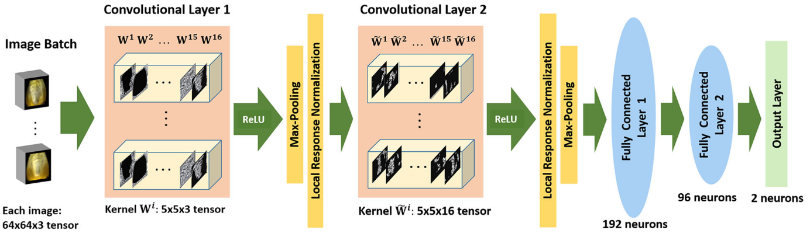
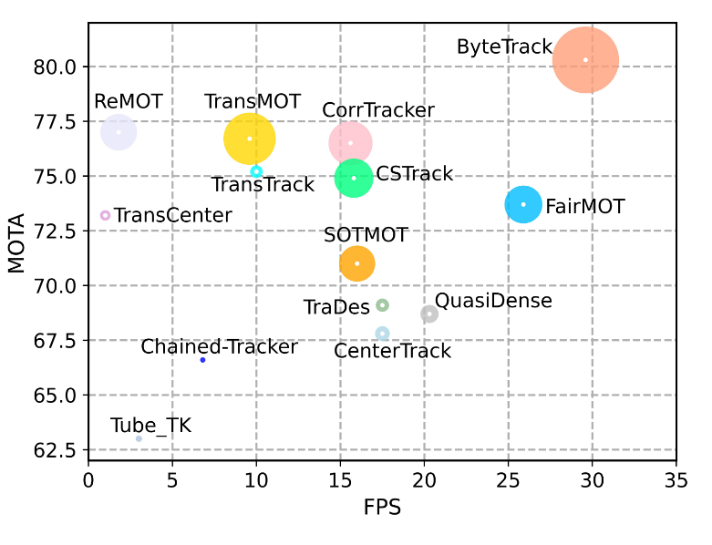
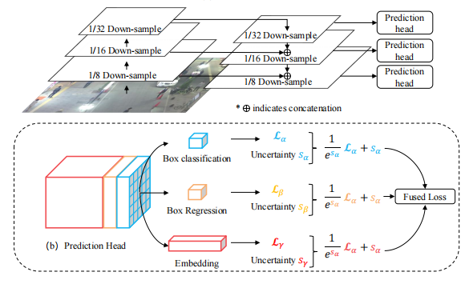
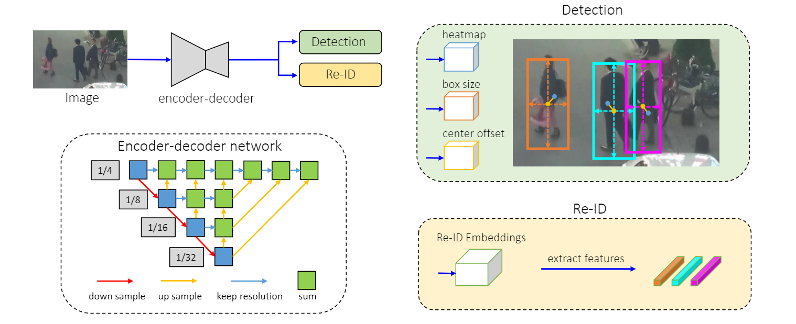
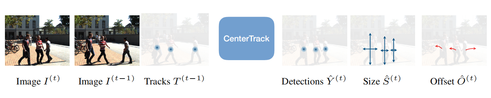
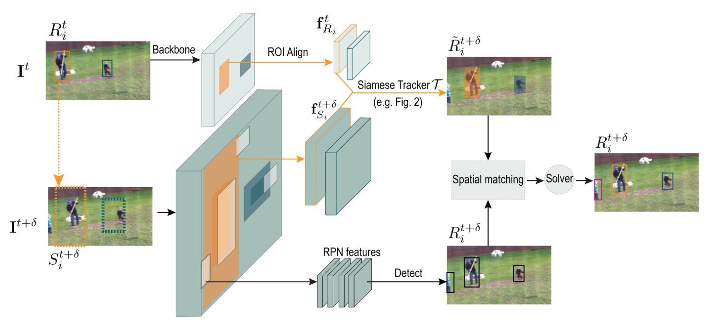
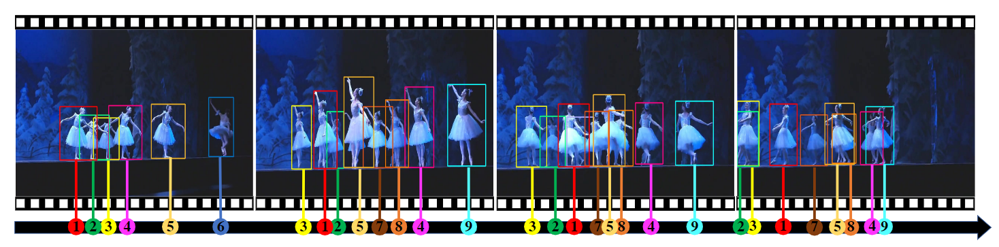

# 多目标追踪

## 1 基础知识
> ​		MOT是计算机视觉领域的一项关键技术，在自动驾驶、智能监控、行为识别等方向应用广泛。对于输入视频，输出目标的跟踪结果，包括目标包围框和对应的ID编号。理论上，同一个目标的ID编号保持不变。

### 1.1 任务定义
&emsp;&emsp;多目标跟踪，一般简称为MOT(Multiple Object Tracking)，也有一些文献称作MTT(Multiple Target Tracking)。在事先不知道目标数量的情况下，对视频中的行人、汽车、动物等多个目标进行检测并赋予ID进行轨迹跟踪。不同的目标拥有不同的ID，以便实现后续的轨迹预测、精准查找等工作。

&emsp;&emsp;常见的多目标追踪的任务根据不同的目标类别，又分为了多人物追踪和通用的多目标追踪。

### 1.2 评价指标
&emsp;&emsp;模型对于目标的追踪结果，对于不同的角度，现如今学术界对该任务的评价指标也分为多种，比较准确的反应模型优劣的指标有MOTA（Multiple Object Tracking Accuracy）和HOTA（Higher Order Tracking Accuracy）。除此之外，对于模型的检测能力和匹配能力，都有对应的指标进行评测。

​		**ID Switches（ID Sw.）**：该指标代表目标身份发生错误的改变的次数，理论上，同一个目标的ID编号不会发生改变，如果发生改变导致一个目标拥有了多个编号，则称发生了ID Switch现象，该指标则代表了发生该问题的次数，发生的次数越少，则代表模型的追踪效果越好。

&emsp;&emsp;**False Positives（FP）**：该指标代表整个视频序列中预测位置不能和真实的目标位置相匹配的数量，该指标代表了模型对于目标的检测能力。

&emsp;&emsp;**False Negatives（FN）**：该指标代表了整个视频序列中没有得到匹配的真实目标的数量，该指标同样代表了模型对于目标的检测能力。

&emsp;&emsp;**Mostly Tracked tracklets（MT）**：该指标代表了在整个视频序列中80%的时间都可以被正常跟踪的目标的数量，该指标越高，代表了模型的追踪能力越强。

&emsp;&emsp;**Mostly Lost tracklets（ML）**：该指标代表了在整个视频序列中少于20%的时间能够被模型追踪到的目标的数量，该指标越低，说明模型的检测追踪能力越强。

&emsp;&emsp;为了更好的评价模型的能力，根据上述的指标，出现了新的评价指标。

&emsp;&emsp;**Multiple Object Tracking Accuracy（MOTA）**:该指标表示的是除了上述ID Sw、FN和FP之外的正确预测样本占据所有样本的比例，衡量了跟踪器在检测目标和保持轨迹时的性能，与目标位置的估计精度无关。多目标跟踪准确度的分数 MOTA如下计算：
$$
MOTA=1-\frac{FN+FP+IDSW}{GT}\epsilon(0,1)
$$
&emsp;&emsp;这里 MOTA的分数可能为负数，因为假阴性、假阳性和身份跳变的数量可能会大于视频序列中真实目标的数量。

&emsp;&emsp;**Multiple Object Tracking Precision(MOTP)**:MOTP默认检测框重合度阈值下正确预测的目标与预测目标总数之比，衡量检测器的定位精度。.多目标跟踪精确度的分数 MOTP 如下计算：
$$
MOTP=\frac{\sum_{t,i}d_{t,i}}{\sum_{t}c_{t}}
$$
&emsp;&emsp;ct 表示为在第 t 帧时候总共匹配的数量，d 表示假设边界框与真实边界框之间的距离值。

&emsp;&emsp;**Higher Order Tracking Accuracy（HOTA）**：基于多目标跟踪准确度(MOTA)的基础上，HOTA 指标引入了更高维跟踪精度指标，能够更加全面、更加均衡地衡量多目标跟踪器的性能。

&emsp;&emsp;HOTA：更高维跟踪精度；HOTA的分数计算过程由多个部分组成，更加重视目标检测和数据关联精度的平均性衡量。主要计算如下：
$$
HOTA_{\alpha}=\sqrt{\frac{\sum_{c\epsilon{TP}}A(c)}{TP+FN+FP}}
$$
&emsp;&emsp; A表示数据关联分数。TP 则表示在整个视频中检测目标被正确跟踪的数量。


### 1.3 任务难点
&emsp;&emsp;虽然MOT是一个起步较早的任务，但到目前为止，仍然有大量的困难等待被解决
* **背景**
由于该任务的适用场景常常为拥有大量目标的拥挤场景，所以背景经常会影响模型对于小目标的检测和追踪。


* **ID Switch**
ID Switch依旧是该任务最大的难点，因为在场景中有大量的遮挡问题，所以会有物体被遮挡后无法被模型检测到的问题，这就要求模型具有时间上的记忆和无目标时的关联能力。


* **小目标**
目标较小的情况下很难提取到足够优秀的外表特征，就导致模型失去了关联的依据之一，对模型的空间预测能力提出了更高的要求。


* **获取方式**
该任务的数据集标注特别困难，导致专业的学术数据集很少。

### 1.4 应用场景
&emsp;&emsp;在计算机视觉的领域中，多目标的跟踪是一个较为下游的任务，根据得到的物体踪片（即物体的轨迹序列），后续可以进行多种上游的任务。

&emsp;&emsp;文本识别较为基础的应用方向有：

* **自动驾驶**
自动驾驶的研发中，常常需要进行物体的追踪和预测。


* **智能监控**
在大数据时代背景下，在一些公共场所往往可以进行固定物体的追踪，已得到物体的路径数据，从而进行位置的预测和后续任务。


* **行为识别**


## 2 方法论
> &emsp;&emsp;随着大数据的普及、计算机硬件系统的迭代更新以及算法研究的推进，深度学习在近年得以快速发展，由此，基于深度学习的方法逐渐成为了多目标追踪的主流方法。提到数字图像的智能处理，神经网络已几乎成为一个不可避免的话题，因为它的出现就是为了模拟视觉中枢的神经结构，这种使用感知方法进行特征提取的过程被一次次的实践有力地证明了其有效性。

### 2.1 算法框架
&emsp;&emsp;在多目标追踪任务中，往往包含了多个可拆分的流程步骤，因此可将整个处理流程细化分解为多个子任务。对于这类模型的分类也根据模型在处理某一帧时，可以使用的序列范围而划分为离线模型和在线模型。前者可以使用全部的视频帧，而后者只能使用当前处理的额视频帧之前的帧序列数据。由于离线模型在实际应用中无法得到后面时间的帧，所以并不常用，本文只介绍在线模型。

&emsp;&emsp;按照模型的整体框架，模型又分为了Tracking by Detection（TBD）范式和Joint Detection and Embedding（JDE）范式。随着技术的不断进步和Transformer架构的出现，在模型的分类上有根据是否是绝对的端到端模型分为了In-Network模型和Out-Network模型。

&emsp;&emsp;无论是哪一类的模型，都会有一个检测模块，这个模块负责将该帧的目标检测出来，得到模型的真实位置或者是目标位置的向量表示，在JDE范式中，该向量会连接新的网络模块同时生成物体的真实位置和物体的外表特征向量表示（如果后续步骤需要用到外表特征的话）；而在TBD范式中，该模块则会输出完整的物体坐标信息，随后的外表特征预测则会将该坐标圈出的部分作为输入。

&emsp;&emsp;为了更好的将本帧的物体信息和之前的物体进行关联，通常会在上一帧处理完成后对所有的物体进行运动学的预测，这种预测通常可以使用卡尔曼滤波器，因为物体大多速度不快，所以该预测器的效果可以达到标准，但随着学界提出减少模型外的计算消耗的目标后，也逐渐出现了使用卷积神经网络和Transformer代替卡尔曼滤波器的网络模型。

&emsp;&emsp;在得到现存目标的预测位置和特征表示后，这些特征会与本帧的物体的空间和外表特征进行比对和分配，然后将本帧的物体分配到现有的轨迹中，同时将结束的轨迹删除以及初始化新出现的轨迹。这个过程往往使用匈牙利匹配来进行。

### 2.2 多目标追踪模型简介
&emsp;&emsp;多目标追踪分为目标检测模块、运动信息提取模块、外表信息（ReID信息）提取模块、匹配模块、以及后续的轨迹整理模块。

#### 目标检测模块

&emsp;&emsp;大多数 MOT 模型基于某个目标检测模型而来，因此一个好的目标检测神经网络对于最后的结果至关重要。SORT 算法的作者提出仅仅更换更好的目标检测模型，就可以使最后的结果提高 10%以上，因此，目前使用的检测模型也层出不穷，比如该问题中最初的深度模型SORT[7]以及 Deep SORT[8]算法就使用FasterRCNN[1]和 Mask RCNN[2]作为目标检测网络；目前MOT challenge 榜首的ByteTrack[9]使用了 YOLOX[3]模型作为目标检测器。除此之外，JDE 方法中，anchor-free 的目标检测器 CenterNet[4]的作者将该模型改进成为了CenterTrack[5]，达到了速度和精度的双重提升。随后，FairMOT[12]模型提出并证明了使用 anchor-free 的模型会比使用 anchor-based 的模型有更好的效果，成为了后续 JDE 方法研究的 baseline。

#### 运动信息提取
&emsp;&emsp;为了得到更好的帧间匹配，通常使用预测算法预测前一帧中物体在当前帧中的位置。当前的算法基本都采用了卡尔曼滤波（Kalman filter）来进行物体位置的预测，卡尔曼滤波过程分为两个步骤：预测和更新。预测步骤通过前面更新得到的物体的速度和位置信息，预测得到物体在在该帧中的位置。随后使用该帧的真实值（即检测出的物体位置）进行参数的更新。卡尔曼滤波在绝大多数现实场景中都能得到非常好的效果，而且由于原理简单，该算法的预测时间几乎可以忽略不计，足以胜任绝大多数的科研和应用场景。但是，对于物体因遮挡等原因而无法得到更新时，该滤波器可能得到发散的结果。


#### 外表信息（ReID）提取
&emsp;&emsp;Deep SORT[8]在 SORT[7]的基础上 使用一个预训练的神经网络将外表信息加入到了匹配的考虑因素之中，并且达到了更好的效果。因为行人外表的差异性，Reid 特征在部分场景中会得到比 motion 信息更好的效果，得到了人们的关注。起初，模型会使用一个额外的预训练好的模型，对每个检测结果进行Reid 特征提取，但因为该方法糟糕的时间效率，人们逐渐将该特征作为目标检测网络的一个预测分支，在一个端到端的模型同时输出检测结果和Reid 特征。

#### 匹配方法
&emsp;&emsp;通过上述Reid信息和motion信息，可以得到现有轨迹与检测框的匹配程度，通过阈值筛选，可以得到二者可能存在的匹配关系。通过匹配算法，可以将检测物体分配给轨迹，因为该算法要解决的是一个二分匹配问题。所以匈牙利算法可以很好的解决该问题。

&emsp;&emsp;匈牙利算法的核心就是寻找增广路径，它是一种用增广路径求二分图最大匹配的算法。算法尽可能地给多的点找到匹配，通过不断寻找原有匹配M 的增广路径，就意味着一个更大的匹配 M’，其恰好比 M 多一条边。

&emsp;&emsp;匈牙利算法的复杂度为 O（V\*E），是一个非常高效的算法，非常适合解决目标和轨迹的匹配问题。

#### 轨迹的初始化和删除

&emsp;&emsp;对于在上述匹配阶段完成后，会有一部分检测结果没有得到轨迹进行匹配，同时，也会有一部分轨迹没有在该帧得到对应的匹配物体，这就牵扯到了轨迹的初始化和轨迹的销毁问题。

&emsp;&emsp;对于没有得到轨迹匹配的检测物体，在大多数算法中，会有一定的考验期（大多数设为三帧），也就是说，若该物体连续三帧都存在于图像并且没有被连接到之前就存在的轨迹中的话，就将该物体视为新的轨迹，分配新的轨迹id。

&emsp;&emsp;若某一个轨迹在当前帧中没有得到物体，会将该轨迹标记为unactived，在连续的一段时间内（大部分为 30 帧），依旧会预测轨迹的位置并且尝试进行匹配，若在此时间内依旧没有匹配的话，就会视为该轨迹结束，销毁id 和位置预测。

## 3 论文介绍
> &emsp;&emsp;近年来的文本识别领域在有关基于深度学习方法的相关研究上有了迅猛推进，在每年的各大CV会议和期刊上不乏出现令人眼前一亮的方法。本节将选取文本识别任务中具有代表性和特殊意义的方法，对其论文和模型进行概括和综述。
### 3.1 SORT和Deep SORT
#### 论文概述
&emsp;&emsp;SORT算法是近年来第一个使用深度学习方法进行多目标追踪的方法，相比于之前的算法，该算法可以进行实时的在线匹配算法，并且该文使用了卡尔曼滤波和匈牙利匹配这种简单的算法就达到了在当时非常好的精度表现，并且该文证明检测网络的能力很大程度上决定了整个任务的表现，通过更换更好的检测网络，作者证明可以提高18.9%的精度。为了更好的速度效果，SORT只使用上一帧的检测和追踪结果，并且忽略了外表信息，只使用了Bounding box的位置和大小信息来进行运动估计和数据关联，这些也就导致了在长短期的遮挡问题和剧烈位置移动的情况下，该模型的表现不会太好。

&emsp;&emsp;Deep SORT相比于前作SORT，增加了对外表信息的使用，这样一来就减少了id切换的数目，同时可以解决更长时间的遮挡问题。该模型通过使用了大量的时间进行了模型的预训练，从而在一个reid的大型训练集上训练得到了一个深度关联度量（deep association metric)，而在在线的分配关联阶段，使用视觉信息的近邻查询建立测量到追踪的关联。

#### 模型方法
&emsp;&emsp;因为Deep SORT是在SORT的基础上做的修改和改进，所以本文在此只进行Deep SORT的介绍。SORT主要由由三个部分组成，即用于位置预测的卡尔曼滤波、用于先验知识和检测结果的匹配的匈牙利匹配过程和用于外表特征提取的CNN层。除此之外，一些额外的算法也在该模型中被用来提升效果。

<div align="center">

<br>
<div>图3-1 Deep SORT网络结构</div>
</div>

&emsp;&emsp;在进行轨迹的预测中，模型认为物体始终在做匀速运动，并且相机也没有进行明显的位移，模型对物体的运动进行了八元组的建模，分别为中心点坐标u，v;纵横比r和高度h，以及以上四个量相对于北京的速度在将图像输入CNN部分后，模型首先按比例将所有图像缩放至指定的统一高度。对于每个轨迹，记录距离上一次出现到目前帧的帧数，如果当前帧里面有该轨迹目标，则重置为0，在没有检测到的帧里面使用卡尔曼滤波器一直进行位置的预测，如果这个数大于某个数的话，就视为该轨迹目标已经退出，销毁该轨迹id。如果某个检测没有联系到任何一个轨迹的话，视为一个新目标，但是有三帧的试用期，一直出现才可以，防止误判。

&emsp;&emsp;在进行检测结果和现有轨迹的匹配的过程时，首先需要计算两者的马氏距离：
$$
d^{(1)}(i,j)=(d_j-y_j)^TS_i^{-1}(d_j-y_j)
$$
&emsp;&emsp;其中S矩阵为卡尔曼滤波器里面的当前时刻的观测空间的协方差矩阵，对上述的距离进行阈值检测：
$$
b_i,j^{(1)} = \mathbb{1}[d^{(1)}(i,j)\le t^{(1)}]
$$
&emsp;&emsp;这里t为卡方分布的0.95分位点（即t=9.4877）。但是只使用马氏距离在一些剧烈移动的场景下的适用性并不能达到要求，为了追求更好的精度，Deep SORT引入了外表信息。对于每一个轨迹，保留最后的100个踪片的外表信息，并且将这些外表信息通过CNN映射为||r||=1的向量r：
$$
d^{(2)}(i,j)=min\{1-r_j^Tr_k^{i}|r_k^{(i)}\in R_i\}
$$
&emsp;&emsp;同样也会对该变量进行阈值过滤：
$$
b_{i,j}^{(2)} = \mathbb{1}[d^{(2)}(i,j)\le t^{(2)}]
$$
&emsp;&emsp;这里这里，t2使用单独的数据集得到，CNN离线训练。随后，将两个指标进行相加操作,或者使用门控操作：
$$
c_{i,j} = \lambda^{(1)}(i,j)+(1-\lambda)d^{(2)}(i,j)\\
b_{i,j}=\prod_{m=1}^2b_{i,j}^{(m)}
$$
&emsp;&emsp;使用的CNN层次信息如下：

<div style="display:table; margin:auto" align="center">

|            Name            | Patch size | Stride | Output Size |
| :------------------------: | :--------: | :----: | :---------: |
|           Conv1            |    3×3     |   1    |  32×128×64  |
|           Conv2            |    3×3     |   1    |  32×128×64  |
|         Max Pool 3         |    3×3     |   2    |  32×64×32   |
|         Residual 4         |    3×3     |   1    |  32×64×32   |
|         Residual 5         |    3×3     |   1    |  32×64×32   |
|         Residual 6         |    3×3     |   2    |  64×32×16   |
|         Residual 7         |    3×3     |   1    |  64×32×16   |
|         Residual 8         |    3×3     |   2    |  128×16×8   |
|         Residual 9         |    3×3     |   1    |  128×16×8   |
|          Dense 10          |     -      |   -    |     128     |
| Batch and l2 Normalization |     -      |   -    |     128     |

<div align="center">表3-1 Deep SORT中的CNN配置</div></div>

#### 模型效果
&emsp;&emsp;两篇论文在MOT领域开创了使用深度学习解决问题的先河，其中SORT创新性的使用了卡尔曼滤波和匈牙利匹配算法，达到了很不错的准确率，但是模型只使用了简单的运动和预测模型，在变换剧烈的情况下模型的适应性较差，为此，Deep SORT引入了外表信息，通过同时比较运动信息和外表信息，该模型在实时的性能下，达到了当时较高的精度。

&emsp;&emsp;论文对模型在几个通用的数据集上进行训练和测试。在MOT16数据集上，SORT可以达到59.8的MOTA指标，而Deep SORT则可以将该指标提升至61.4.

### 3.2 Byte Track

#### 论文概述

&emsp;&emsp;为了解决之前方法丢弃低分检测框的不合理性，我们提出了一种简单、高效、通用的数据关联方法BYTE （《 ByteTrack: Multi-Object Tracking by Associating Every Detection Box》） 。直接地将低分框和高分框放在一起与轨迹关联显然是不可取的，会带来很多的背景（false positive）。BYTE将高分框和低分框分开处理，利用低分检测框和跟踪轨迹之间的相似性，从低分框中挖掘出真正的物体，过滤掉背景。整个流程如下所示：

（1）BYTE会将每个检测框根据得分分成两类，高分框和低分框，总共进行两次匹配。

（2）第一次使用高分框和之前的跟踪轨迹进行匹配。

（3）第二次使用低分框和第一次没有匹配上高分框的跟踪轨迹（例如在当前帧受到严重遮挡导致得分下降的物体）进行匹配。

（4）对于没有匹配上跟踪轨迹，得分又足够高的检测框，我们对其新建一个跟踪轨迹。对于没有匹配上检测框的跟踪轨迹，我们会保留30帧，在其再次出现时再进行匹配。

&emsp;&emsp;我们认为，BYTE有效的原因是遮挡往往伴随着检测得分由高到低的缓慢降低：被遮挡物体在被遮挡之前是可视物体，检测分数较高，建立轨迹；当物体被遮挡时，通过检测框与轨迹的位置重合度就能把遮挡的物体从低分框中挖掘出来，保持轨迹的连贯性。

#### 模型方法

&emsp;&emsp;ByteTrack使用当前性能非常优秀的检测器YOLOX得到检测结果。在数据关联的过程中，和SORT一样，只使用卡尔曼滤波来预测当前帧的跟踪轨迹在下一帧的位置，预测的框和实际的检测框之间的IoU作为两次匹配时的相似度，通过匈牙利算法完成匹配。这里值得注意的是，我们没有使用ReID特征来计算外观相似度，原因如下：

（1）第一点是为了尽可能做到简单高速，第二点是我们发现在检测结果足够好的情况下，卡尔曼滤波的预测准确性非常高，能够代替ReID进行物体间的长时刻关联。实验中也发现加入ReID对跟踪结果没有提升。

（2）如果需要引入ReID特征来计算外观相似度，可以将BYTE应用到JDE，FairMOT等joint-detection-and-embedding方法中。

（3）ByteTrack只使用运动模型没有使用外观相似度能在MOT17，20取得高性能的本质原因是MOT数据集的运动模式比较单一。（论文提出了一个新数据DanceTrack。）

#### 模型结果

&emsp;&emsp;ByteTrack依旧沿用了TBD范式，并且在MOT17等多个数据集上都达到了SOTA的效果，是目前最佳的MOT模型。通过换用更加优秀的检测器，以及更好的检测框选取策略，解决了因为遮挡而导致预测框的置信度较低的问题。

&emsp;&emsp;在MOT系列的数据集上，ByteTrack在MOT17上达到了80.3的精度，在MOT20达到了77.8的精度。该模型的同其他的模型的对比如下，其中横轴代表FPS，纵轴代表模型的精度（MOTA），圆半径代表着模型的IDF1评分：

<div align="center">

<br>
<div>图3-2 ByteTrack精度对比</div>
</div>

### 3.3 JDE

#### 论文概述

&emsp;&emsp; JDE（《towards real-time multi-object tracking》）核心思想是一种联合检测和嵌入向量的模型，即Joint Detection and Embedding model，既然是tracking by detection的策略，那么检测模型是必不可少的，剩下的embedding在前后帧的ID匹配过程中起到关键的作用，而JDE提出了这两部分共享一个模型，与之对应的就是Separate Detection and Embedding (SDE) model，即检测和后续的Embedding是分开的，独立的两个部分，后续ID匹配的过程只需要检测模型提供bbox就可以，和检测模型本身并没有任何关系，SDE model的典型代表就是DeepSort。

#### 模型方法

&emsp;&emsp;JDE的Backbone和预测头部分的结构如下图所示：

<div align="center">

<br>
<div>图3-2 JDE网络结构</div>
</div>

&emsp;&emsp; JDE的基础检测模型，用了FPN结构，一共有三层，分别做1/32、1/16和1/8的下采样，每一层都会接出预测头（Predicion Head），而预测头除了常规的分类和定位分支外，会加上一个Embedding分支，这个分支后续用来做Re-ID。三个分支的Shape分别是：

- classification results ： 2 A × H × W 
- regression coefficients：4 A × H × W 
- dense embedding map：D × H × W  其中A是anchor的数量，embedding特征图的厚度是D。这种分支的形式就联合了检测模型和Re-ID模型，将两者合并为一个。

&emsp;&emsp;既然是前后帧的匹配，前一帧的输出信息需要被保留下来，当前帧同样输出三个分支信息后，根据Embedding结果进行匹配，Embedding layer输出为D×H×W，特征图宽高的维度和检测输出的特征图是一致的，特征图中每一个位置都是一个潜在的object，这也就意味着，每一个object的embedding vector的维度都是D，在源码中这个D=512，而具体是不是目标，以及目标的位置就由另外两个分支决定了。 得到了前一帧后当前帧的所有目标，以及embedding vector后，依照下面的过程进行匹配，假设前一帧的目标数量为m ，当前帧的目标数量为n ：

- 根据检测的信息，拿到Embedding feature map上对应的embedding vector，当前帧fc有n个目标，维度为D ；
- 前一帧fc−1有m个目标，需要注意的是，处理短暂的object lost已经是现在MOT方法的标配，也就是说如果检测器不准，或者目标出现遮挡，在某一帧中目标没有被检测出来，但是之后几帧又回再次出现，此时跟踪算法不应该出现ID switch，所以fc−1帧的 m个目标中，要加上 fc−1帧之前ID losted的情况，假设有k个，所以总的ID数量就是m+k；
- fc−1帧得到m+k个目标，当前帧n个目标的embedding vector两两计算余弦距离，并与0比较较大值，生成一个(m+k)×n 的距离矩阵：cost_matrix；
- 根据卡尔曼估计更新cost_matrix，具体做法为：估计前一帧的object在下一帧的位置，这个位置由和当前帧检测到的实际位置计算距离，显然这个距离矩阵又是 (m+k)×n的，而这个距离大于一个设定阈值的话，cost_matrix中对应位置将被置为正无穷，即绝对不可能是同一个ID。这一点和DeepSort很相似；
- 在cost_matrix中卡阈值，选择小于阈值的距离，这就是为什么上一步中会选择置为无穷大；
- 二次关联，使用的是IOU距离，不过计算IOU的bbox是由两次检测得到的，而不是卡尔曼滤波器估计得到的，然后再次卡阈值；
- new ID and lost ID，如果 fc帧 n个目标有一个bbox没有和之前的任何ID匹配上，那只能创建一个新的ID，相对应的，如果fc−1帧中有ID没有匹配到fc帧，那么就继续作为ID lost，留作下次更新；
- 更新状态，卡尔曼估计是非常不准的，所以卡尔曼滤波器的状态要一直根据检测结果做更新，让它每次都只预测下一帧；
- 更新ID losted，保留先前丢失ID的做法可以有效改善ID switch，但是如果跟踪一直做，那么ID losted就越来越多，时间越久就越不可能被找回来，并且加重了计算的负担，所以ID losted需要根据已经丢失的帧数做清理，清理之后，就没有任何再找回来的可能了。

#### 模型结果

&emsp;&emsp;与现有方法相比，JDE的IDF1得分更低，ID切换更多。首先，我们怀疑原因是联合学习的嵌入可能比单独学习的嵌入弱。但是，当我们用单独学习的嵌入替换共同学习的嵌入时，IDF1得分和ID切换的数量几乎保持不变。最后，我们发现，主要原因是当多个行人彼此之间有大量重叠时，检测结果不准确。图5显示了JDE的这种失败情况。这样不准确的盒子会引入很多ID切换，但是不幸的是，这样的ID切换经常出现在轨迹的中间，因此IDF1得分较低。在我们的未来工作中，当行人重叠很大时，如何改进JDE以做出更准确的预测框仍有待解决。

&emsp;&emsp;在MOT17数据集上，JDE可以拿到64.4的精度值，但是只能得到55.8的IDF1分值，并且随着MOTA值的上升，IDF1却呈现了逐步下降的方式。

### 3.4 FairMOT

#### 论文概述

&emsp;&emsp;FairMOT（《FairMOT: On the Fairness of Detection and Re-Identification in Multiple Object Tracking》）目前成为了单阶段的追踪器的baseline方法，现有的绝大多数单阶段方法都会和FairMOT进行比较，论文提出了在MOT问题的解决方法上，有几个“不公平“的地方，如下所示：

(1)将ReID视为次要任务，其准确性在很大程度上取决于主要检测任务。 因此，训练在很大程度上偏向于检测任务，而忽略了re-ID任务;

(2)它们使用ROI-Align去直接提取目标检测中的特征用于re-ID任务;

&emsp;&emsp;这样会导致所采样的目标特征点可能属于实例和背景中干扰项。为了解决这样的问题，提出了一种简单的方法FairMOT，由两个齐次的分支去用于预测像素级的目标度分数和re-ID特征，任务之间实现的公平性使FairMOT获得高水平的检测和跟踪精度，并在几个公开数据集上大大超过了以前的先进技术。

&emsp;&emsp;论文首先采用anchor-free检测方法来估计高分辨率特征地图上的目标中心。锚点的消除缓解了模糊问题，并且使用高分辨率特征地图使Re-ID特征更好地与对象中心对齐。然后，我们添加了一个平行分支来估计像素级的Re-ID特征，用于预测对象的身份。特别是，我们学习了低维Re-ID特征，不仅减少了计算时间，而且提高了特征匹配的鲁棒性。我们在backbone配置了深层聚合算子，以融合来自多个层次的特征，以处理不同规模的对象。

#### 模型方法

&emsp;&emsp;FairMOT的网络结构如下图所示：

<div align="center">

<br>
<div>图3-4 FairMOT网络结构</div>
</div>

&emsp;&emsp;我们采用ResNet-34作为我们的主干，以便在准确性和速度之间取得良好的平衡。为了适应不同规模的对象，在主干上应用了一个深部层聚合（DLA）的变体，如图2所示。与原始的DLA不同，它在低级和高级特性之间有更多的跳过连接，类似于功能金字塔网络(Feature  Pyramid Network,  FPN)。此外，上采样模块中的所有卷积层都被可变形卷积层所替代，使它们能够根据物体的尺度和姿态动态地适应感受野。这些修改也有助于缓解对齐问题。最终的模型被命名为DLA-34。输出图像尺寸是输入图像尺寸的1/4倍。

&emsp;&emsp;将目标检测作为高分辨率特征地图上的基于中心的bbox回归任务。特别是，三个平行的回归头被附加到骨干网，分别估计热图，目标中心偏移和Bounding box。每个头通过应用3×3卷积(有256个通道)到骨干网络的输出特征映射，然后应用1×1卷积层生成最终目标。身份嵌入分支的目标是生成能够区分不同对象的特征。理想情况下，不同物体之间的距离应该大于同一物体之间的距离。为了实现这一目标，我们在主干特征上应用了一个128个核的卷积层来提取每个位置的身份嵌入特征。

&emsp;&emsp;在模型的Loss function上面，该论文使用了三个loss，分别是热图Heatmap的loss，偏移和尺寸预测的loss以及外表信息编码的loss：
$$
\begin{equation}
L_{heatmap}=-\frac{1}{N}\sum_{xy}
\begin{cases}
(1-\hat{M}\_{xy})^\alpha log(\hat{M}\_{xy}) & if &M_{xy}=1;\\\\
(1-M_{xy})^\beta (\hat{M}\_{xy})^\alpha log(1-\hat{M}\_{xy})&otherwise,
\end{cases}
\end{equation}
$$

$$
L_{box}=\sum_{i=1}^N||o^i-\hat{o}^i||\_1+||s^i-\hat{s}^i||\_1
$$

$$
L_{identity}=-\sum_{i=1}^N\sum_{k=1}^KL^i(k)log(p(k))
$$

&emsp;&emsp;与以前的工作JDE相同,网络以大小为1088×608的帧作为输入，在预测的热图之上，根据热图分数执行非最大抑制(NMS)，以提取峰值关键点。保留热图分数大于阈值的关键点的位置。然后，根据估计的偏移量和框大小计算相应的包围框。论文还在估计的对象中心提取标识embedding。遵循标准的在线跟踪算法来关联框。首先根据第一帧中的估计框初始化一些轨迹。 然后，在随后的帧中，根据在Re-ID特征上计算的余弦距离将检测到的与现有的轨迹进行链接，并通过Bipartite matching将它们的盒重叠。论文还使用卡尔曼滤波来预测当前帧中轨迹的位置。如果它离链接到的检测太远，将相应的成本设置为无穷大，这有效地防止检测目标移动过大。 在每个时间步骤中更新跟踪器的外观特征，以处理外观变化。

#### 模型结果

&emsp;&emsp;总体来说，FairMOT正如他的论文名说的那样，是一个很简单好用的多目标追踪Baseline。FairMOT的特色主要在于检测算法和reid特征的融合在一起，检测目标的同时，输出reid特征，而且用了anchor-free的centerNet检测算法，相比于anchor类的方法有很多优势。

&emsp;&emsp;在MOT数据集上，FairMOT在MOT15数据集上达到了59.0的MOTA效果，在MOT16上面的MOTA分数为68.7，在MOT17和MOT20上面分别达到了67.5和58.7。

### 3.5 CenterTrack

#### 论文概述

&emsp;&emsp;CenterTrack（《Tracking Objects as Points》）是目标检测网络CenterNet的作者在MOT领域的成果，该论文提出了一个基于点的联合检测和跟踪框架。每个对象在其包围框的中心用一个点表示。然后通过时间跟踪这个中心点。具体来说，作者使用CenterNet检测器来定位对象中心。将检测器设置在两个连续的帧上，以及先前轨迹的热图，表示为点。训练的检测器也输出一个偏移向量从当前对象到它中心的前一帧。仅仅基于这个预测的偏移量和上一个帧中检测到的中心点之间的距离，就足以进行对象关联。Centertrack只关联相邻帧中的对象，而不重新初始化丢失的远程追踪，以便提速提精度。

&emsp;&emsp;总体来说，用点来跟踪目标简化了跟踪流程的两个关键部分：

- 第一，它简化了基于跟踪的检测。如果之前帧里每个目标都用一个简单点来表示，那么多个目标就可以用一个包含多个点的热图来表示。基于跟踪的检测器可以直接提取该热图，并在关联多个帧中的目标时对它们执行联合推理；
- 第二，基于点的跟踪简化了跨时间的目标关联。类似稀疏光流的简单位移预测就可以把不同帧中的目标连接起来。位移预测基于先前的检测结果，它能够联合检测当前帧中的目标，并将它们与先前的检测结果相关联。

#### 模型方法

&emsp;&emsp;CenterTrack 把之前帧的热图作为输入，轻松学会重复之前帧的预测，从而在不会引起较大训练误差的情况下拒绝跟踪当前帧目标。研究者在训练阶段通过强大的数据增强方案来避免这种情况。事实上，数据增强方案足以让模型学会基于静态图像跟踪目标。也就是说，在没有实时视频输入的情况下，CenterTrack 模型可以在静态图像数据集上成功训练。

&emsp;&emsp;CenterTrack 是完全局部的方法。它只关联相邻帧中的目标，不会重新初始化已丢失的时间较远的跟踪。该方法舍弃了重新连接时间较远的跟踪，换来局部时间范围内跟踪的简单、高速和高准确率。

&emsp;&emsp;CenterTrack的输入输出如下图所示：

<div align="center">

<br>
<div>图3-5 CenterTrack输入输出</div>
</div>

&emsp;&emsp;在这篇论文中，研究者从局部的角度研究跟踪技术。也就是说，当目标离开画面或者被其他物体遮挡后再出现时，要被重新赋值新 id。研究者把跟踪看作一个跨连续帧传播检测 id 的问题，而不需要跨时间间隔重新建立关联。

&emsp;&emsp;在时间 t 处，给定当前帧 $I^{(t)} ∈ R^W×H×W$和前一帧$ I^{(t−1)} ∈ R^W×H×3$ 的图像，以及前一帧中的跟踪目标 $T^{(t−1)} = {b^{(t−1)}\_0 , b^{(t−1)}\_1 , . . .}i$。每个目标被表示为 b = (p, s, w, id)，其中中心点位置$ p ∈ R^2$，大小$ s ∈ R^2$，检测置信度 w ∈ [0, 1]，唯一身份 id ∈ I。该研究旨在检测和跟踪当前帧 t 中的目标 $T (t) = {b^{(t)}\_0 , b^{(t)}\_1 , . . .}$，并给在前后两个帧中都出现的同一目标分配一样的 id。

&emsp;&emsp;这里存在两个主要问题。第一个是找到每一帧画面中所有的目标，包括被遮挡住的目标。第二是按时间关联这些目标。该研究通过一个端到端训练的深度网络解决了这两个难题。

&emsp;&emsp;然而，在当前帧中不直接可见的目标是无法被找到的，检测到的目标可能在时间上没有连贯性。提高时间连贯性的一种自然方式是添加之前帧中的图像作为检测器输入。在 CenterTrack 中，研究者向检测网络提供两个帧作为输入：当前帧 $I^{(t)}  $和前一个帧 $ I^{(t−1)} $。这使得网络可以预估画面的变化，并且利用时间 t − 1 处的可见目标恢复在时间 t 处被遮挡的物体。

&emsp;&emsp;CenterTrack 还将先前的检测结果$ {p^{(t−1)}\_0 , p^{(t−1)}\_1 , . . .} $作为额外输入。那么怎样表示这些检测结果才能将它们更容易地提供给检测网络呢？

踪片基于点的属性就派上用场了。由于每一个被检测目标都由单个点来表示，于是我们可以很方便地使用与基于点的探测器训练中相同的高斯渲染函数来渲染所有的检测结果，并呈现在一张类别无关的单通道热图  $H^{(t−1)} = R({p^{(t−1)}\_0 , p^{(t−1)}\_1 , . . .}) $ 中。为了减小假正类检测结果的影响，研究者仅渲染置信度大于阈值 τ 的目标。

&emsp;&emsp;CenterTrack 的架构和 CenterNet 基本相同，但 CenterTrack 具备 4 个额外输入通道。

&emsp;&emsp;为了按时间关联检测结果，CenterTrack 将 2D 位移的预测作为两个额外输出通道。对于在位置 $ \hat{p}^{(t)} $ 处检测到的每个目标，位移  $\hat{d}^{(t)} = \hat{D}^{(t)}{\hat{p}^{(t)}} $ 捕获的是在当前帧  $\hat{p}^{(t)} $ 和前一帧  $\hat{p}^{(t− 1)} $ 中目标位置的差异： $\hat{d}^{(t)} ＝ \hat{p}^{(t)} − \hat{p}^{(t-1)} $。研究者使用相同的回归目标作为大小或位置改变，从而学得此位移：
$$
L_{off}=\frac{1}{N}\sum_{i=1}^N|\hat{D}\_{p\_i^{(t)}}-(p\_i^{(t-1)}-p\_i^t)
$$
&emsp;&emsp;通过较好的偏移量预测，简单的贪婪匹配算法就能够跨时间关联目标。对于位置 p hat 处的每个检测结果，研究者将其与位置 $\hat{p} − \hat{D}\_\hat{p} $处最近且不匹配的之前检测结果关联起来，并以置信度 $\hat{w}$ 降序排列。如果在半径κ范围内没有不匹配的先前检测结果，则生成一个新的踪片。研究者将κ定义为每个踪片预测边界框的宽度和高度的几何平均值。这种贪婪匹配算法的简易性再次凸显了将目标作为点进行跟踪的优势。简单的位移预测足以跨时间关联对象，而不需要复杂的距离度量或图匹配。

#### 模型结果

&emsp;&emsp;CenterTrack 的思想比较简洁：直接预测相邻两帧同一物体在图像上的 2D 位移，然后通过它们之间的距离去判断两个 detection 是否是属于同一个物体。在MOT17数据集上面，该模型达到了66.1的MOTA分数。

### 3.6 SiamMOT

#### 论文概述

&emsp;&emsp;《SiamMOT: Siamese Multi-Object Tracking》这篇论文中，作者探索了以SORT为基础的一系列online多目标跟踪方法中运动建模的重要性。在SORT中，一个更好的运动模型是提高跟踪精度的关键，原始的SORT中采用基于简单几何特征的卡尔曼滤波进行运动建模，而最近的一些SOTA方法学习一个深度网络来基于视觉和几何特征进行位移预测，这极大地提高了SORT的精度。

&emsp;&emsp;作者利用基于区域的孪生多目标跟踪网络来进行运动建模的探索。作者组合了一个基于区域的检测网络（Faster R-CNN）和两个思路源于孪生单目标跟踪的运动模型（分别是隐式运动模型（IMM）和显式运动模型（EMM））。不同于CenterTrack基于点的特征进行隐式的目标运动预测，SiamMOT使用基于区域的特征并且开发了显式的模板匹配策略来估计模板的运动，这在一些挑战性的场景下更加具有鲁棒性，比如高速运动的场景下。

&emsp;&emsp;作者还通过额外的消融实验证明目标级别的运动建模对鲁棒多目标跟踪至关重要，特别是在一些挑战性场景下。而且，实验表明，SiamMOT的运动模型可以有效提高跟踪的性能，尤其是当相机高速运动或者行人的姿态变化较大时。

#### 模型方法

&emsp;&emsp;SiamMOT是基于Faster R-CNN构建的，Faster R-CNN是一个非常流行的目标检测器，它包含一个区域推荐网络（RPN）和一个基于区域的检测网络。在标准的Faster R-CNN上，SiamMOT添加了一个基于区域的孪生跟踪器来建模实例级别的运动。下图是整个SiamMOT的框架结构，它以两帧图像$I_t$, $I_{t+δ} $作为输入，并且已有第t帧上的检测框集合 $Rt={R_1^t,…R_i^t,…} $。在SiamMOT中，检测网络输出第t+δ帧的检测结果集 $R^{t+δ} $，跟踪器则将 $R^t $传播到t+δ帧上以生成预测框集合 $\tilde{R}^{t+δ} $。接着，t帧上的目标在t+δ帧上的预测框和t+δ帧上的检测框进行匹配，从而关联起来形成轨迹，这个思路和SORT中是一样的。该模型网络结构如下图所示：

<div align="center">

<br>
<div>图3-5 SiamMOT网络结构</div>
</div>

&emsp;&emsp;给定第t帧的实例i，孪生跟踪器根据其在t帧中的位置在t+δ帧的一个局部窗口范围内搜索对应的实例，形式上表述如下。这里的T表示参数为Θ的孪生跟踪器，$f_{R_i}^t$则是根据检测框$R_i^t$在t+δ帧上获得的搜索区域$S_i^{t+δ}$提取的特征图。而搜索区域$S_i^{t+δ}$的获得则通过按照比例因子r(r>1)来扩展检测框$R_i^t$来获得，拓展前后具有同样的集合中心，如上图中的黄色实线框到黄色虚线框所示。当然，不管是原来的检测框还是拓展后的预测框，获得其特征$f_{R_i}^t$和$f_{S_i}^{t+δ}$的方式都是不受大小影响的RoIAlign层。孪生跟踪器输出的结果有两个，其中$\tilde{R}\_i^{t+δ}$为预测框，而$v_i^{t+δ}$则是预测框的可见置信度，若该实例在区域$S_i^{t+δ}$是可见的，那么T将会产生一个较高的置信度得分$v_i^{t+ε}$，否则得分会较低。
$$
(v_i^{t+δ},\tilde{R}\_i^{t+δ})=T(f_{R_i}^t,f_{S_i}^(t+δ);Θ)
$$
&emsp;&emsp;这个公式的建模过程其实和很多孪生单目标跟踪器的思路非常类似，因此在多目标跟踪场景下只需要多次使用上式即可完成每个$R_i^t∈R^t$的预测。重要的是，SiamMOT允许这些操作并行运行，并且只需要计算一次骨干特征（由于RoIAlign），这大大提高了在线跟踪推理的效率。

&emsp;&emsp;作者发现，运动建模对于多目标跟踪任务至关重要，一般在两种情况下$R^t$和$R^{t+δ}$会关联失败，一是$\tilde{R}^{t+δ}$没有匹配上正确的$R^{t+δ}$，二是对于t+δ帧上的行人得到的可见得分$v_i^{t+δ}$太低了。

&emsp;&emsp;此前的很多工作为了实现$R_i^t$到$\tilde{R}^{t+δ}$的预测，一般采用将两帧的特征输入网络中，所以它们都是隐式建模实例的运动。然而，很多单目标跟踪的研究表明，在极具挑战性的场景下，细粒度的空间级监督对于显式学习一个鲁棒性的目标匹配函数是非常重要的。因此，作者提出了两种不同的孪生跟踪器，一个是隐式运动模型一个是显式运动模型。

&emsp;&emsp;首先来看隐式运动模型（Implicit motion model，IMM），它通过MLP来估计目标两帧间的运动。具体而言，它先将特征$f_{R_i}^t$和$f_{S_i}^{t+δ}$按通道连接在一起然后送入MLP中预测可见置信度$v_i$和相对位置和尺度偏移，如下所示，其中($x_i^t$,$y_i^t$,$w_i^t$,$h_i^t$)为目标框的四个值，通过$R_i^t$和$m_i$我们可以轻易解出$\tilde{R}^{t+δ}$。
$$
m_i=[\frac{x_i^{t+δ}−x_i^t}{w_i^t},\frac{y_i^{t+δ}−y_i^t}{h_i^t},log\frac{⁡w_i^{t+δ}}{w_i^t}log\frac{h_i^{t+δ}}{h_i^t}]
$$


&emsp;&emsp;给定$(R_i^t,S_i^{t+δ},R_i^{t+δ})$，IMM的训练可以采用下面的损失来进行，其中$v_i^∗$和$m_i^∗$是根据$R_i^{t+δ}$计算的Gt标签，1为指示函数，$ℓ_{focal}$为分类损失，$ℓ_{reg}$ 为常用的smooth l1回归损失。
$$
L=ℓ_{focal} (v_i,v_i^∗)+1[v_i^∗]ℓ_{reg} (m_i,m_i^∗)
$$
&emsp;&emsp;接着来看显式运动模型（Explicit motion model，EMM）。具体而言，如上图所示，它通过逐通道的互相关操作（\*）来生成像素级别的响应图$r_i$，该操作已被证明对于密集光流估计和实例级别的运动建模是很有效的。在SiamMOT中，这个操作用目标特征图$f_{R_i}^t$和搜索图像特征图$f_{S_i}^{t+δ}$的每个位置计算相关性，得到$r_i=f_{S_i}^{t+δ}∗f_{R_i}^t$，所以每个$r_i[k,:,:]$表示一个相似程度。受到FCOS的启发，EMM使用全卷积网络ψ来检测$r_i$中匹配的目标。

&emsp;&emsp;详细来看，ψ预测一个密集的可见置信度图$v_i$来表示每个像素包含目标图像的可能性，再预测一个密集的定位图$p_i$来编码该像素位置到框的左上角和右下角的偏移量。因此，处在(x,y)的目标可以通过$R(p(x,y))=[x−l,y−t,x+r,y+b]$解出边界框，其中$p(x,y)=[l,t,r,b]$（两个角点的偏移）。最终，特征图可以通过下面的式子解码，此处的⊙表示逐元素相乘，ηi是一个惩罚图，为每一个候选区域设置非负的惩罚得分。
$$\tilde{R}\_i^{t+\sigma}=R(p_i(x^\star,y^\star));  v_i^{t+\sigma}=v_i(x^\star,y^\star)\\\\
s.t.(X^\star,y^\star)=\underset{x,y}{argmax}(v_i\odot\eta_i)$$
&emsp;&emsp;惩罚得分的计算如下式，其中λ是一个加权系数（0≤λ≤1），C则是关于目标区域$R_i^t$几何中心的余弦窗口函数，S是关于候选区域p(x,y)和$R_i^t$之间的相对尺度变化的高斯函数。惩罚图ηi的引入是为了阻止跟踪过程中剧烈的运动。
$$
\eta_i(x,y)=\lambda C+(1-\lambda)S(R(p(x,y)),R_i^t)
$$
&emsp;&emsp;考虑$(R_i^t,S_i^{t+δ},R_i^{t+δ})$，EMM的训练损失如下式子所示。其中(x,y)表示$S_i^{t+δ}$中的所有有效位置，$ℓ_{req}$是用于回归的IoU损失，$ℓ_{focal}$ 是用于分类的损失。$v_i^∗$和$p_i^∗$是像素级的GT图。如果(x,y)在$R_i^{∗t+δ}$的范围内那么$v_i^∗(x,y)=1$，否则为0；$p_i^∗(x,y)=[x−x_0^∗,y−y_0^∗,x_1^∗−x,y_1^∗−y]$，其中的$(x_0^∗,y_0^∗)$和$(x_1^∗,y_1^∗)$表示GT框的两个角点的坐标。此外，作者还修改了回归任务，添加了一个w(x,y)表示中心度，有$w(x,y)=\sqrt{\frac{min(x−x_0,x_1−x)}{max(x−x_0,x_1−x)}⋅\frac{min(y−y_0,y_1−y)}{max(y−y_0,y_1−y)}}$。
$$
L=\sum_{x,y}ℓ_{focal} (vi(x,y),v_i^\star(x,y))+\sum_{x,y}1(v_i^\star(x,y)=1)(w(x,y)⋅ℓ_{reg}(p_i(x,y),p_i^\star(x,y)))
$$
&emsp;&emsp;相比于IMM，EMM有两点改进。第一，它使用通道分离的相关性操作来允许网络显式学习相邻帧上同一个目标的相似性；第二，它采用一个细粒度的像素级监督，这有效减少了错误匹配。

#### 模型结果

&emsp;&emsp;通过引入一个基于区域的孪生多目标跟踪网络，设计了一个新的online多目标跟踪框架，名为SiamMOT。SiamMOT包含一个运动模型来估计两帧之间目标的移动从而关联两帧上检测到的目标。为了探索运动建模如何影响其跟踪能力，作者提出了孪生跟踪器的两种变体，一种隐式建模运动，另一种显式建模运动。在三个MOT数据集上进行实验，作者证明了运动建模对于多目标跟踪的重要性并验证了SiamMOT达到SOTA的能力。而且，SiamMOT是非常高效的，它可以在单个GPU上720P视频上达到17的FPS。同时在MOT17数据集上面，也可以达到65.9的MOTA分数


## 4 常用数据集
&emsp;&emsp;由于多目标追踪领域的数据集标注难度非常大，所以该领域进行了目前并没有太多的学术数据集。

#### MOT

&emsp;&emsp;MOT 数据集为 MOT challenge 大赛所提供的数据集，现在有 MOT15、MOT16、 MOT17 和 MOT20 版本。该数据集主要针对于行人的多目标追踪任务，自 17 年以来，数据集以图片的形式给出一段视频的连续帧，并且还包括了该帧中行人的位 置 bounding box 坐标以及行人所属的id。这有助于更好的评估后续的数据关联算法而忽略目标检测所带来的检测差距。当然，该挑战赛也提供 free 赛道支持使用自己的检测器。

#### KITTI数据集

&emsp;&emsp;该数据集是目前全球最大的自动驾驶场景数据集，支持双目、光流、视觉测距、3D 目标检测和 3D 追踪等任务。对于 MOT 任务，该数据集提供了激光雷达点云和 3D 包围框轨迹。

#### DanceTrack

&emsp;&emsp;提出DanceTrack这个数据集的动机，就是为了强调一些被已有数据集所忽略的目标追踪线索，避免Multi-Object Tracking变成完全的Detection + ReID。作者希望DanceTrack可以促进之后的算法在关注目标检测之外，可以在目标匹配上更多地关注目标外观之外的线索。为了实现这个目标，作者收集了100段视频，内容包括集体舞蹈、功夫、体操等，他们共同的特点是：（1）目标人物穿着相似甚至一致；（2）目标之间有大量的遮挡和位置交错；（3）目标的运动模式非常复杂多样，呈现明显的非线性，并且时常伴随多样的肢体动作。该数据集数据示例如下图所示：

<div align="center">

<br>
<div>图3-5 DanceTrack数据集</div>
</div>

#### 其他数据集

&emsp;&emsp;除此之外，还有一部分时间较长的数据集，现在基本很少使用。主要有UA-DETRAC 数据集、TUD 数据集和 PETS2009 数据集，虽然很少使用作主要的训练数据集。但可以用作 pretrain 数据集作为提升精度的方法。


## 5 任务实践
> &emsp;&emsp;针对文本识别的相关任务，FudanVIA提供了一套较为完整的解决方案，其中已封装了具有代表性的文本识别模型的对应功能接口，可供系统开发和学习交流使用。本节将基于这些接口介绍具体的任务实践。
### 5.1 模型组件介绍
**介绍算法库中有关文本识别任务的组件及其构成，简单阐述工作原理*
### 5.2 模型组件接口调用
**介绍模型组件接口的方法、参数和注意事项等*

&emsp;&emsp;FudanVIA中有关多目标追踪组件的接口为`FudanVIA.get_tracking_component(model_name: str)`，若要调用接口，首先需要对FudanVIA库进行引入：

```python
import FudanVIA
```

&emsp;&emsp;文本识别组件接口`get_tracking_component()`含有一个参数`model_name`，为字符串类型数据。在该参数中输入需要使用的文本识别模型的名称，`get_tracking_component()`方法将会返回一个ByteTrackComponent类的实例化对象，其中包含了与名称对应的初始化文本识别模型：

```python
track = FudanVIA.get_tracking_component('ByteTrack',exp_file)
```

&emsp;&emsp;后续将逐步在算法库中更新更多文本识别模型。

&emsp;&emsp;由此，通过接口调用完成了一个文本识别模型组件的初始化。接下来，通过调用模型组件的接口，即可完成模型训练、模型测试、模型预测等功能。

#### 权重加载
&emsp;&emsp;调用`load_checkpoint()`方法以加载预先完成训练的模型权重：

```python
tracker.load_checkpoint(checkpoint_file)
```

该接口接收1个输入参数`checkpoint_file`，为字符串型参数，用于指定权重路径；而该接口无返回值，直接将权重参数载入已完成初始化的模型中。

#### 模型训练
&emsp;&emsp;因为多目标追踪难以标注数据，所以暂时无需进行模型的训练，本文着重介绍模型的预测，若要实现模型的训练功能，应调用模型组件的train()方法：

```python
track.train(
    train_dir="PATH_TO_TRAIN_DATASET",
    val_dir="PATH_TO_VAL_DATASET",
    output_dir="PATH_TO_SAVE_WEIGHTS_AND_LOGS",
    nun_epoch=0
)
```

需要向其传入4个参数：
* `train_dir`：字符串型参数，指定训练数据集所在的路径；
* `val_dir`：字符串型参数，指定验证数据集所在的路径；
* `output_dir`：字符串型参数，指定存放训练所得权重和训练记录的位置；
* `num_epoch`：整型参数，默认值为0，用于指定从第几个epoch开始训练模型，通常用于中断训练后指定继续开始位置。

由此完成对识别模型的训练。`train()`方法没有返回值，训练结果将直接以计算机文件的形式进行持久化。

#### 模型测试
&emsp;&emsp;调用模型组件的`test()`方法，即可实现模型的测试功能：

```python
tracklet,id,scores = tracker.run(img)
```

需要向其传入2个参数：
* img：测试图像的路径

`test()`方法拥有三个返回值，返回图像中目标的切片、轨迹ID和预测时的置信度。`test()`方法实则在测试数据集上仅执行一次验证功能的`train()`方法。


### 5.3 任务范例
&emsp;&emsp;根据FudanVIA提供的模型组件接口，可基本实现文本识别模型的全部内容。本节将给出一个基于FudanVIA的模型组件接口的简易文本识别器的实现。

#### 训练模块代码

```python
import FudanVIA

def training_module():
    model_name = 'ByteTrack'
    exp_file = '../../../ByteTrack/exps/example/mot/yolox_x_mix_det.py'
    checkpoint_file = '../../../ByteTrack/pretrained/bytetrack_x_mot20.tar'
    tracker = FudanVIA.get_tracking_component(model_name,exp_file)
    tracker.init_model()
    track.train(
        train_dir="../dataset/train_dataset",
        val_dir="../dataset/val_dataset",
        output_dir="./save"
    )
   
```

#### 预测模块代码

```python
import cv2
import FudanVIA

def inferring_module():
    model_name = 'ByteTrack'
    exp_file = '../../../ByteTrack/exps/example/mot/yolox_x_mix_det.py'
    checkpoint_file = '../../../ByteTrack/pretrained/bytetrack_x_mot20.tar'
    tracker = FudanVIA.get_tracking_component(model_name,exp_file)
    tracker.init_model()
    tracker.load_checkpoint(checkpoint_file)
    imgs_path = '../../../11.jpg'
    img = cv2.imread(imgs_path)
    tracklet,id,scores = tracker.run(img)

    print(tracklet,id,scores)
```

### 5.4 常见问题Q&A
**在此列出开发实践过程中遇到的有记录价值的问题，并给出详细解答*


## 参考文献
[1] Ren, Shaoqing et al. “Faster R-CNN: Towards Real-Time Object Detection with RegionProposal Networks.” IEEE Transactions on Pattern Analysis and Machine Intelligence 39(2015): 1137-1149.

[2] He, Kaiming et al. “Mask R-CNN.” IEEE Transactions on Pattern Analysis and MachineIntelligence 42 (2020): 386-397.

[3] Ge, Zheng et al. “YOLOX: Exceeding YOLO Series in 2021.” ArXiv abs/2107.08430 (2021): n. pag.

[4] Duan, Kaiwen et al. “CenterNet: Keypoint Triplets for Object Detection.” 2019 IEEE/CVFInternational Conference on Computer Vision (ICCV) (2019): 6568-6577.

[5] Zhou, Xingyi et al. “Tracking Objects as Points.” ArXiv abs/2004.01177 (2020): n. pag.

[6] Wang,Zhongdao et al. “Towards Real-Time Multi-Object Tracking.” ArXiv abs/1909.12605(2020): n. pag.

[7] Bewley, Alex et al. “Simple online and realtime tracking.” 2016 IEEE InternationalConference on Image Processing (ICIP) (2016):  3464-3468.

[8] Wojke, Nicolai et al. “Simple online and realtime tracking with a deep associationmetric.” 2017 IEEE International Conference on Image Processing (ICIP) (2017):3645-3649.

[9] Zhang, Yifu et al. “ByteTrack: Multi-Object Tracking by Associating Every DetectionBox.” ArXiv abs/2110.06864 (2021): n. pag.

[10] Wu, Jialian et al. “Track to Detect and Segment: An Online Multi-Object Tracker.” 2021IEEE/CVF Conference on Computer Vision and Pattern Recognition (CVPR) (2021):12347-12356.

[11] Shuai, Bing et al. “SiamMOT: Siamese Multi-Object Tracking.” 2021 IEEE/CVF Conferenceon Computer Vision and Pattern Recognition (CVPR) (2021): 12367-12377.

[12] Zhang, Yifu et al. “FairMOT: On the Fairness of Detection and Re-identification in MultipleObject Tracking.” Int. J. Comput. Vis. 129 (2021): 3069-3087.

[13] Sun, Pei et al. “TransTrack: Multiple-Object Tracking withTransformer.” ArXiv abs/2012.15460 (2020): n. pag.

[14] Redmon, Joseph et al. “You Only Look Once: Unified, Real-Time Object Detection.” 2016IEEE Conference on Computer Vision and Pattern Recognition (CVPR) (2016): 779-788.

[15] Redmon, Joseph and Ali Farhadi. “YOLO9000: Better, Faster, Stronger.” 2017 IEEEConference on Computer Vision and Pattern Recognition (CVPR) (2017): 6517-6525.

[16] Redmon, Joseph and Ali Farhadi. “YOLOv3: An Incremental Improvement.” ArXiv abs/1804.02767 (2018): n. pag. 

[17] Bochkovskiy, Alexey et al. “YOLOv4: Optimal Speed and Accuracy of Object Detection.” ArXiv abs/2004.10934 (2020): n. pag.

[18] Alahi A , Goel K , Ramanathan V , et al. Social LSTM: Human Trajectory PredictioninCrowded Spaces[C]// 2016 IEEE

Conference on Computer Vision and Pattern Recognition(CVPR). IEEE, 2016. 

[19] Bergmann P , Meinhardt T , Leal-Taixe L . Tracking without bells and whistles[C]// 2019 IEEE/CVF International Conference on Computer Vision (ICCV). IEEE, 2019.

[20] G Brasó, L Leal-Taixé. Learning a Neural Solver for Multiple Object Tracking[J]. 2019. 

[21] Dendorfer P , Rezatofighi H , Milan A, et al. MOT20: A benchmark for multi object tracking in crowded scenes[J]. 2020. 

[22] Karthik S , Prabhu A , V Gandhi. Simple Unsupervised Multi-Object Tracking[J]. 2020.

[23] Salzmann T , Ivanovic B , Chakravarty P , et al. Trajectron++: Multi-Agent GenerativeTrajectory Forecasting With Heterogeneous Data for Control[J]. 2020. 

[24] Sadeghian A , Kosaraju V , Sadeghian A , et al. SoPhie: An Attentive GAN for PredictingPaths Compliant to Social and Physical Constraints[J]. arXiv, 2018.

 [25] Ycy A , Du Y , Yms D , et al. Online Multiple Pedestrians Tracking using Deep Temporal Appearance Matching Association[J]. Information Sciences, 2020.
