# 文本检测

## 1基础知识

文字的历史可以追溯到几千年前，文本所承载的丰富的语义信息在基于视觉的应用场景中非常重要。因此，自然场景图片中的文本检测与识别任务一直是计算机视觉领域的一个活跃研究领域。近年。随着深度学习的兴起和发展，许多方法在创新、实用和效率方面都表现出了良好的前景。这里总结了与场景文本检测相关的基本问题和研究进展，对不同方法的特点进行了总结，并对未来可能的研究方向进行了思考与陈述。

### 1.1 背景

文字检测与识别属于图像理解的重要组成部分，相比于一般的视觉元素如点、线、面等及其相互关系，文字信息拥有更丰富的上下文约束，表达更为直接与清晰的信息，属于高层的视觉元素。已有的文字检测方法在通用目标检测算法的基础上根据文字的独特特征进行修改，从而实现检测文字的效果。在现实生活场景中有着各式各样的设计形式的文字，例如广告牌上不同的艺术字体、各种曲线样式的文字；同时由于拍摄的图片还有不同程度的旋转、缩放、透视变换等形变，因此自然场景图片的文字呈现出形状任意多变、多尺度、背景复杂的特点。

### 1.2 任务定义

光流字符识别（OCR）任务当中的一个重要子任务，任务主要是将图像上的字符区域以准确的坐标构成候选框（左，上，右，下）的形式表示出来。表示的越准确则说明算法的检测效果越好。当下的自然场景字符识别任务都以字符检测任务为前提，先将字符区域从整图中截取，之后输入到识别算法当中进行识别任务。

### 1.3 评价指标

字符检测任务是光流字符识别总任务中的子任务，也是字符识别任务的前置任务，检测结果的好坏对随后识别结果的影响至关重要。如前所述，字符检测任务需要算法将图片中的字符区域以坐标位置的形式预测出来。由于在实际的场景当中，图片当中的字符区域因拍摄角度的关系，所呈形状并不一定是水平或竖直的矩形形状，实际出现的形状总是会经过一定程度的透视变换从而呈现的形式通常是不规则的四边形。如果模型预测产生的字符区域不够紧致，则会对随后的识别模型预测的结果产生很大影响，通常会使得整个预测结果质量下滑。

<div align="center">
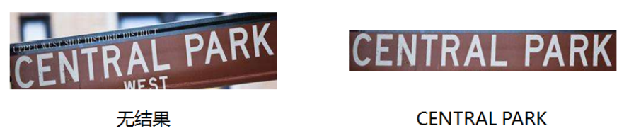
<br>
<div>图1-1 不同检测模型对识别结果的影响</div>
</div>

<br>
图1-1为两种模型预测的检测区域在识别算法 PhotoOCR 上的识别结果，第一种算法预测的结果是水平矩形，而其中的字符呈现方式并不是水平的。第二种算法预测的是带字符区域朝向的矩形，可以预测出字符区域的朝向。明显看出后者预测出来的字符区域，明显比前者的预测结果要更为准确和紧致。从识别的结果来看，后者能够预测出准确的结果，而前者无法识别。检测任务的重要性由此可见一斑。

目前字符检测算法逐渐趋向于采用深度神经网络模型对字符区域位置进行预测。而目前所采用的深度神经网络字符检测算法主要分为两种，其一为基于检测框的通用物体检测（generic object detection）框架进行改进，用以预测更为紧致的字符区域，其二则是采用基于图像分割任务深度学习算法，预测出字符区域像素级的位置，再通过轮廓计算出最后的字符区域。如下图（图 1-2）所示.

<div align="center">
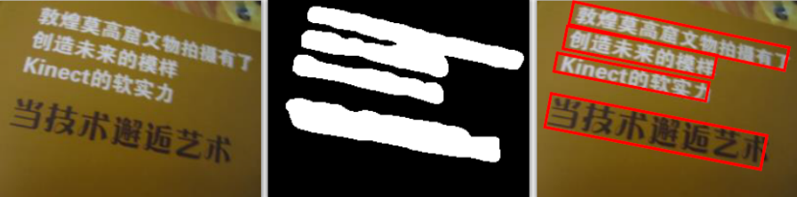
<br>
<div>图1-2 当下两种主流字符检测算法结果</div>
</div>

<br>

左图为原图，中图为图像分割算法结果，右图为候选框检测结果。
因此为了衡量算法的性能，当下几大标准数据集（benchmark）都通过评估矩形框交并比的办法给出定量指标。
正确的检测结果：

<div align="center">
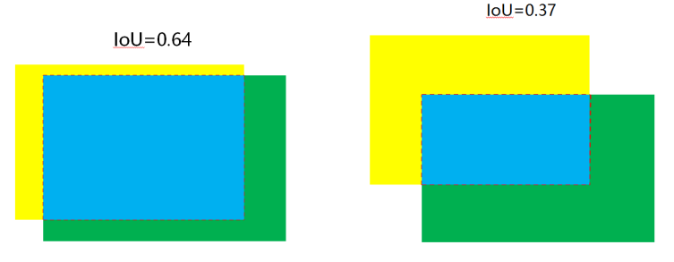
<br>
<div>图1-3 预测结果与标注区域交并比</div>
</div>

<br>
我们通过计算两个矩形框的交并比的值，并与规定好的检测正样本阈值（IoU=0.5）作为对比，筛选出正确的检测结果与错误的检测结果。记标注区域为 GT，预测的结果为 P。
则交并比的计算方式为：
$$
IoU = (GT∩P) / (GT∪P)
$$
计算好的值取值范围在（0, 1）。图 9 中蓝色区域为两结果交集的区域，黄色为算法预测候选框，绿色为真实的标注信息 GT。左边的交并比为 0.64，大于 0.5，因此是一个正确的预测结果；而图 9 右边的预测交并比为 0.37，小于 0.5. 所以右边的检测结果是假阳性（False Positive）结果。

（1）准确率（precision）：
准确率的计算为所有正确的检测框（True Positive）比上所有算法预测出来的结果：
$$
precision = TP / (TP + FP)
$$
（2）召回率（recall）：
召回率的计算为所有正确的检测框（True Positive）比上所有应该预测的正确结果：
$$
recall = TP / (TP + TN)
$$
（3）F-measure:
F-measure 是准确率与召回率的均衡值，F-measure 高表明一个算法对准确率和召回率的兼顾较为到位。
$$
F-measure = 2 × precision × recall / (precision + recall)
$$
补充：某一些数据集在评测时会根据检测结果自动将同一行上的多个检测框合并成为单独一行作为最后评比结果（如 ICDAR2013，ICDAR2015 和 ICDAR2017），这样结果会更为自由。

### 1.4 任务难点

文本检测的目标是通过模型将图片中的文本区域以坐标的形式标注出来，通常输出文本行的边缘包围框作为结果。最开始文字包围框的形式为水平的矩形包围框，为了能够更好的框定有角度的倾斜 文本或是竖直文本，包围框演变为带角度的矩形文本框。随着越来越多带有弯曲、大小变化、透视变换的文本检测任务的出现，检测框进一步演变为任意形状的多边形标注。文本检测算法作为图片字符语义识别任务的第一步，是之后的识别任务和其他分析任务的重要先决条件。优秀的检测算法能够精确的预测文字位置以及文本包围框大小，并尽可能地减少背景的干扰，提高后续任务的精度。 在过去的几年里，文本检测技术快速发展并被大规模的商业部署。但在真实世界场景中检测和识别文本仍然是一项重要且具有挑战性的任务。因为场景文本存在着诸多挑战:

#### 复杂背景

在自然环境中常出现多种人造物，如建筑物、符号和绘画，它们具有与文本相似的结构和外观。场景复杂性的挑战在于周围的场景使得文 本和非文本难以区分。场景文本可以出现在各种背景中，包括但不限于标识、墙壁、玻璃甚至悬在空中，这就导致要将文本与其背景区别开来非常困难。

#### 不均匀光照

在室外拍摄图像时，由于光照和感官设备的不均匀响应，图像上常出现光线不均匀的情况。而不均匀的光照会导致色彩上的失真和视觉 特征的退化，从而导致错误的检测、分割和识别结果。 

#### 模糊和退化

在多种环境条件下由于相机聚焦问题，文本图像会出现散焦和模糊问题。图像/视频压缩和解压程序也会降低文本的质量。散焦、模糊 和退化造成的影响主要是降低了字符的清晰度，使分割等基本任务变得困难。 

#### 长宽比

文字的长宽比变化极大，在诸如交通标志、标牌等场景中出现的文字大多为词汇和短语，一般长度很短，而其他文字，如广告词、标语，一般长度很长。不同的文本具有不同的纵横比，为了准确的框定文本需要考虑位置、尺度和长度的搜索过程，这会导致很高的计算复杂度。 

#### 透视变化

当相机光轴不垂直于文本平面时，会发生透视失真，文本边界不再保持矩形形状，字符也会发生变形，这会降低了在未变形样本上训练的模型的性能。

#### 字体

各种字体的字符类内变化较大，形成许多模式子空间，当字符类数较大时，很难进行准确识别。有些字体中的字符可能会产生粘粘或者重叠，这使得很难进行分割。

#### 多语言环境

大多数拉丁语言只有数十个字符， 而汉语、日语和韩语等语言有数千个字符类，阿拉伯语有连接的字符，它们根据上下文形状还会产生 变化。在多语言环境下，扫描文档中的文本检测与识别仍然是一个研究问题，而场景图像中的文本识别则更加困难。


## 2 方法论

文本检测任务是对输入图像中的文本区域进行定位。近年来，学术界对文本检测进行了大量的研究。一类方法将文本检测作为目标检测中的一个特定场景，对一般的目标检测算法进行修改，用于文本检测。例如，TextBoxes[4]基于一级目标探测器SSD[23]，而CTPN[3]是由Faster RCNN[1]发展而来。然而，文本检测和目标检测在目标信息和任务本身上仍然存在一些差异。例如，文本通常很长，看起来像“条纹”，行间距小，文本是弯曲的，等等。因此，也有许多专门用于文本检测的算法被衍生出来。

目前比较流行的一些文本检测算法大致可以分为两类:

基于回归的算法和基于分割的算法。也有一些算法将两者结合起来。基于回归的算法借鉴了一般的目标检测算法，通过设置锚点来实现检测框回归，或者直接进行像素回归。这种类型的方法在识别规则形状的文本时表现很好，但在Irregular形状的文本时表现很差。如CTPN[3]对水平文本的识别能力较好，但对扭曲和弯曲文本的检测能力较差。SegLink更适合于长文本，但不适合检测稀疏分布的文本。基于分割的算法引入了Mask-RCNN，这类算法在各种场景和各种形状的文本中都能较好地检测，但缺点是后期处理复杂，速度可能较慢，无法检测出重叠的文本。

### 2.1 基于回归的方法

基于回归的算法类似于目标检测算法。而文本检测方法只有两个图像的文本是要检测的目标，其余部分是背景。之前的字符检测大多直接使用通用目标检测的算法，而通用目标检测的算法没有考虑到文本目标自身的特点：如文本行一般以长条矩形形式存在，而文字之间都会有着一定间隔。基于回归的方法一般在通用检测目标算法的基础上，针对文本自身的特点进行改进。

### 2.2 基于分割的方法

基于语义分割的检测方法因为避免了检测框的限制，能够较好的定位弯曲文本，但是不容易将相邻文本区分开，容易产生文本行的粘连问题。

### 2.3 结合两种方式的方法

这类方法一般在回归方法的基础上，通过分割获取文本中心线和大致的文本区域，在长文本的情况下能够取得不错的效果。或者先大致确定文本位置后再基于语义分割进行预测。这些方法的模型大都比较复杂，流程比较繁琐，需要进行大量的预测和复杂的后处理过程。


## 3 相关数据集

神经网络方法离不开数据的驱动，随着文本检测与识别任务受到的关注，文本检测数据集也不断发展。用于场景文本检测的数据集如下表所示。

| Datasets              | Language     | Images | Instances |  Arbitrary-Quadrilateral    | Char-Level Label | Regularity | Source Code                                                                                                     |
|-----------------------|--------------|--------|-----------|--------------|------------------|------------|-----------------------------------------------------------------------------------------------------------------|
| Synth80k              | ENG          | 8M     | 8M        | ×            | ×                | Regular    | http://www.robots.ox.ac.uk/vgg/data/text/                                                                       |
| SynthText             | ENG          | 6M     | 6M        | √            | √                | Regular    | https://github.com/ankush-me/SynthText                                                                          |
| SVT                   | ENG          | 350    | 725       | √           | ×                | Regular    | http://vision.ucsd.edu/kai/svt                                                                                  |
| IC03                  | ENG          | 509    | 2268      | × | √                | Regular    | http://www.iapr-tc11.org/mediawiki/index.php?title=ICDAR_2003_Robust_Reading_Competitions                       |
| IC13                  | ENG          | 561    | 5003      | ×            | √                | Regular    | http://dagdata.cvc.uab.es/icdar2013competition/?ch=2&com=downloads                                              |
| IC15                  | ENG          | 1500   | 6545      | √            | ×                | Irregular  | http://rrc.cvc.uab.es/?ch=4&com=downloads                                                                       |
| COCO-Text             | ENG          | 63686  | 145859    | √            | ×                | Irregular  | https://vision.cornell.edu/se3/coco-text-2/                                                                     |
| Total-Text            | ENG          | 1555   | 11459     | √            | ×                | Irregular  | https://github.com/cs-chan/Total-Text-Dataset                                                                   |
| RCTW-17               | CHN/ENG      | 12514  | -         | √            | ×                | Regular    | http://rctw.vlrlab.net/dataset/                                                                                 |
| MTWI                  | CHN/ENG      | 20000  | 290206    | √            | ×                | Regular    | https://pan.baidu.com/s/1SUODaOzV7YOPkrun0xSz6A#list/path=%2F (pw: gox9)                                        |
| CTW                   | CHN/ENG      | 32285  | 1018402   | √            | √                | Regular    | https://ctwdataset.github.io/                                                                                   |
| SCUT-CTW1500          | CHN/ENG      | 1500   | 10751     | √            | ×                | Irregular  | https://github.com/Yuliang-Liu/Curve-Text-Detector                                                              |
| LSVT                  | CHN/ENG      | 450K   | -         | √            | ×                | Irregular  | https://rrc.cvc.uab.es/?ch=16&com=downloads                                                                     |
| ArT                   | CHN/ENG      | 10166  | 98455     | √            | ×                | Irregular  | https://rrc.cvc.uab.es/?ch=14&com=downloads                                                                     |
| ReCTS-17             | CHN/ENG      | 25000  | 119713    | √            | √                | Irregular  | https://rrc.cvc.uab.es/?ch=12&com=downloads                                                                     |
| MLT                   | Multilingual | 20000  | 191639    | √            | ×                | Regular | https://rrc.cvc.uab.es/?ch=15&com=downloads                                                                     |

<div align="center">表3-1 文本检测数据集</div>

<br>

根据标注形式的不同，文本检测数据集也分为四边形数据集与任意多边形数据集，接下来对其中常用的数据集进行介绍。

### 四边形数据集

#### ICDAR2013
ICDAR2013 又称 Focused Scene Text Challenge, 数据集在 2013 年发布，作为 2013 年的 Robust Reading Competition 的标准数据集。图片多为水平字符区域，区域较为居中。数据集中 229 张图片组成训练集，233 张图片组成测试集。示例如下，数据的标注为每个字符区域由 left, top, right, bottom 四个边界坐标组成。
<div align="center">
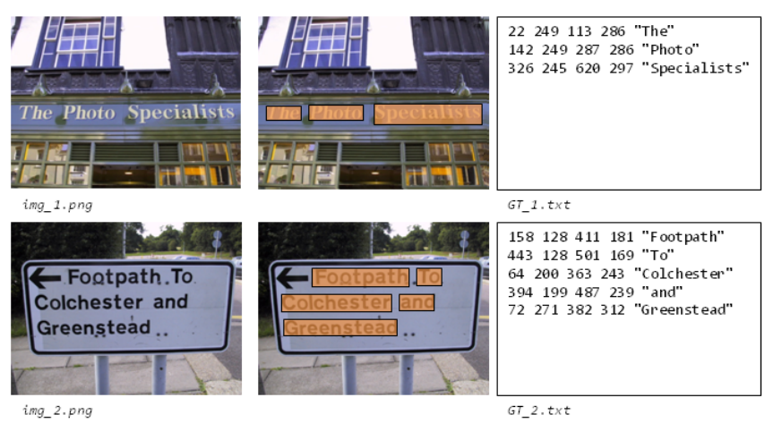
<br>
<div>图3-1 ICDAR2013 原图以及标注</div>
</div>

<br>

#### ICDAR2015 
ICDAR2015 又称 Incidental Scene Text Challenge，数据集在 2015 年作为当年的 Robust Reading Competition 的标准数据集发布。图片中的字符区域相较 ICDAR2013 出现的更为不规则，出现的字符区域形状多呈任意四边形（因为相机视角问题而产生的透视变换）。整个数据集样本数量也远大于 ICDAR2013。训练集样本数量为 1000，测试集样本数量为 500。示意图如下，因为出现的字符区域并不是规整的长方形，因此标注的形式与 ICDAR2013 有所区别，标注的信息为字符区域不规则四边形的四个顶点横纵坐标（x1, y1, x2, y2, x3, y3, x4, y4），所给的字符内容若标志为“###”，则该区域内的字符不需要做识别。
<div align="center">
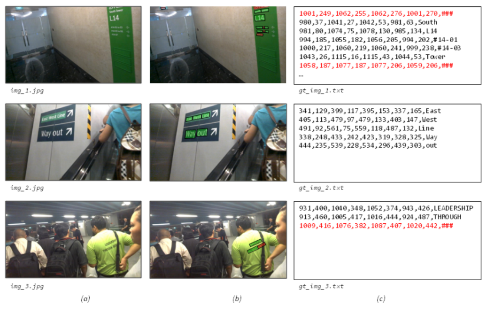
<br>
<div>图 3-2 ICDAR2015 原图以及标注</div>
</div>

<br>

#### ICDAR2017-MLT 
ICDAR2017-MLT又称作 Multi-lingual scene text detection。是 Robust Reading Competition系列第一次发布的多语种的字符检测与识别数据集。该数据集涉及的语言有 6 种，总共为
"Arabic"，"Latin"，"Chinese"，"Japanese"，"Korean"，"Bangla"（阿拉伯语，拉丁语，汉语，日语，韩语，孟加拉语）。数据集总共包括 9000（7200 张用于训练，1800 张用于验证）张训练图片，测试集需要向组织者（nibal.nayef@univ-lr.fr）发送邮件进行获取。标注的形式与 ICDAR2015 相近，标注为任意四边形的四个顶点坐标，以顺时针顺序排列（x1, y1, x2, y2, x3, y3, x4, y4），最后两项为语言种类和语言内容。标注文件编码为 utf-8。相较 ICDAR2015数据集，数据样本数量再次增大。

#### ICDAR2017 COCO-Text 
该数据集的数据样本来自著名的图片数据集MS COCO，该数据集由康奈尔大学发布，数据集标注了数据集当中所有的字符区域，并对字符区域进行了较为细粒度的标注，包括，是否易读（legible / illegible），是否是英文（English / non-English），是否印刷体（machine printed / handwritten / others）。训练集采用 43686 张图片作为训练样本，10000 张图片作为验证集，10000 张图片作为测试集。总共为 63686 张图片。标注格式为，左上角横纵坐标与长方形框的长宽（x, y, w, h）。标注示意如下：
<div align="center">
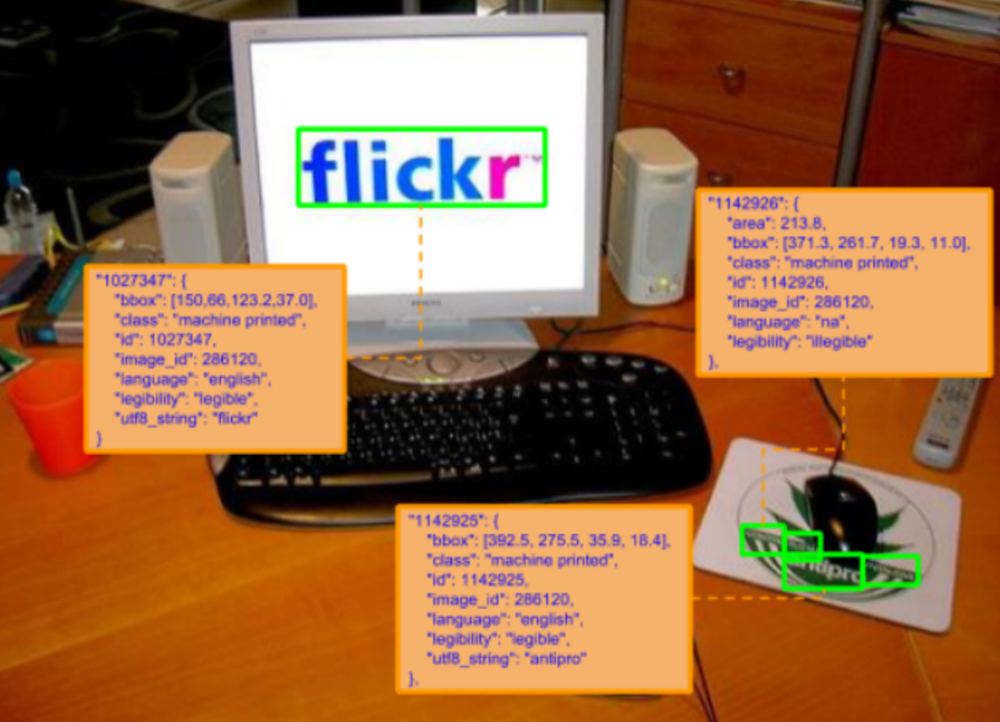
<br>
<div>图 3-3 ICDAR2017 COCO-Text 数据集图片及标注</div>
</div>

<br>

####  RCTW-17
RCTW-17 由华中科技大学发布，数据样本特点主要为经过透视变换的多朝向字符区域，该数据集ᨀ供检测和识别两级标注。检测字符区域的标注为四个顶点坐标（x1, y1, x2, y2, x3, y3, x4, y4）以及对应字符区域的内容。该数据集语言主要为中文和英文两种。中文为按行标注，英文为按词标注。训练集包括 8034 张图片，测试集图片若干（总数超过 12000 张）。图片样本如下图：
<div align="center">
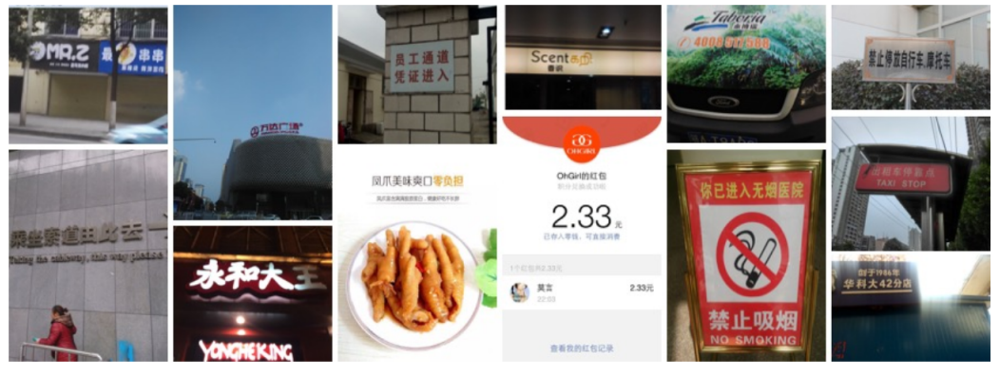
<br>
<div>图 3-4 ICDAR RCTW 图片样例</div>
</div>

<br>


#### MSRA-TD500
该数据集由微软亚洲研究院的 Cong Yao 发布，数据集内容主要针对多朝向字进行标注。数据集包括 300 个训练样本，以及 200 个测试样本。标注的格式包括任意字符朝向的中心点x，y，任意朝向的矩形框的长宽，最后是弧度制的角度 θ。标注示意如下图（图 3-5）：

<div align="center">
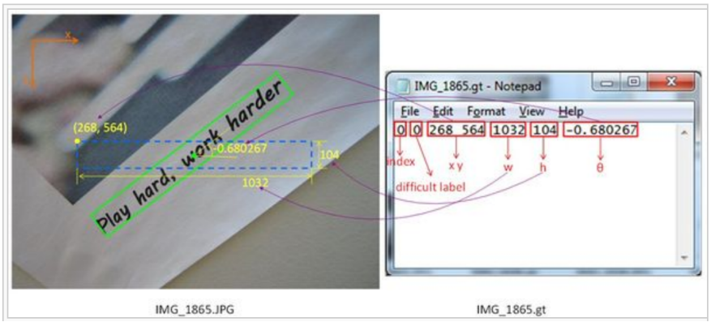
<br>
<div>图 3-5 MSRA-TD500 图片样本</div>
</div>

<br>

### 多边形数据集
#### SCUT-CTW1500
由华南理工大学发布，数据样本主要是针对形变更为强烈的弯曲字符区域进行采集。该数据集包括 1000 张图片用于训练，500 张图片用于测试。其混合了水平文本、倾斜文本和任意形状的文本。其标注级别为文本行级别，因此冗杂了较多单词间的空隙，标注格式为固定数量的 14 个点构成的多边形每个顶点的横纵坐标。样本图片示意如下（图 3-6）：

<div align="center">
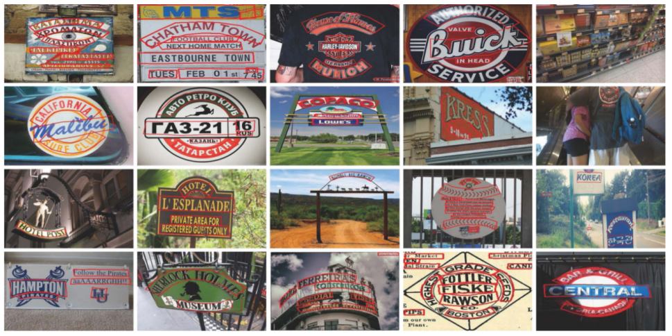
<br>
<div>图 3-6 SCUT-CTW1500 图片样本</div>
</div>

<br>

#### Total Text

Total-Text 数据集由水平、多朝向和弯曲形状等多种形状的文本实例图片组成，训练集包含 1255 张图像，测试集包含 300 张图像，总文本实例达到约一万一千。通过任意顶点数量的多边形对 单词级别的文本实例的包围框进行标注，能够很好的验证检测模型对于任意形状文本检测的效果。虽然图片中包含多类别语言的文本，但只对英文字符行标注和检测的要求。 

#### ReCTS

ReCTS 数据集是一个大型中国街景商标数据 集，它提供中文单词和中文文本行级标注。标记方法为任意四边形标记。它总共包含 20000 张图片。 

#### LSVT

LSVT 数据集由 20,000 张测试图片、30,000 张完整标注的训练图像和 400,000 张部分标注的弱标 注训练图片组成，文本区域的标注显示了文本的多样属性: 水平的、多方向或是弯曲的。

#### ArT

 ArT 数据集包含 10166 张图像，其中 5603 张 用于训练，4563 张用于测试。该数据集主要对多种文本形状图像进行收集，不同形状的文本在 ArT 数据集中都占有不少的比例。

以上部分数据集的实例如图3-7所示：

<div align="center">
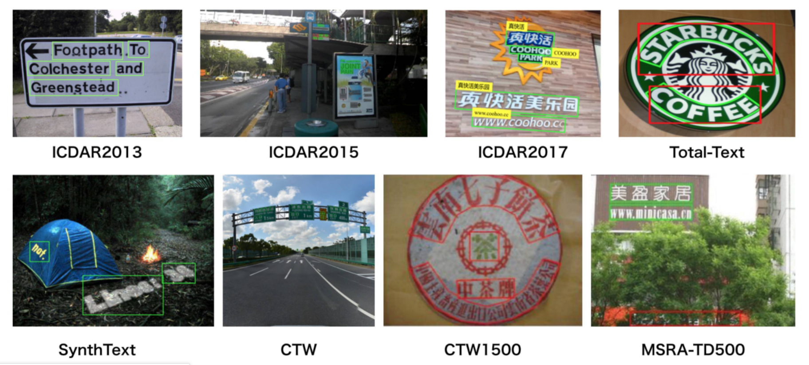
<br>
<div>图 3-7 不同数据集上的各类场景文本图片示例</div>
</div>

<br>


## 4主流算法介绍
### 4.0 通用目标检测方法

基于回归的方法在通用目标检测方法上发展而来，这一小节首先对常见的通用目标检测方法进行简要的介绍。

#### RCNN

RCNN[18]首先使用 selective search 算法，从图片中取出 2000 个可能包含有目标的区域，再将这 2000 个候选区（ROI：region of interest）压缩到统一大小（227×227）送入卷积神经网络中进行特征提取，在最后一层将特征向量输入 SVM分类器，得到该候选区域的种类。整体上看 R-CNN 比较简单，与此同时也有两个重大缺陷：
1）selective search 进行候选区域提取的过程在 cpu 内计算完成，占用了大量计算时间。
2）对 2000 个候选框进行卷积计算，提取特征的时候，存在大量的重复计算，进一步增加了计算复杂度。针对以上两个缺点，R Girshick 分别在 Fast-RCNN 和 Faster-RCNN 中进行了改进。

<div align="center">
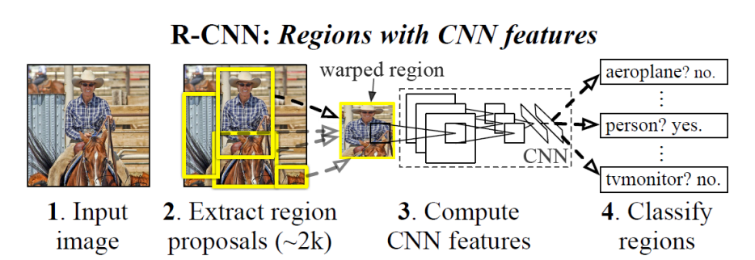
<br>
<div>图 4-1 RCNN 检测网络结构图</div>
</div>


<br>

#### Fast-RCNN
a) SPP-Net [20]

由于 Fast-RCNN[21] 借鉴了 SPP-Net 的思想，所以先来了解一下 SPP-Net。在 RCNN 种需要对 2000 个候选框进行卷积特征计算，而这 2000 个候选框是来自与同一张图片的，所以，作者考虑到先对整张图片进行一次卷积计算，得到整张图片的卷积特征，然后依据每个候选框在原始图片中的位置，在卷积特征图中取出对应的区域的卷积特征。再将卷积图中的到的特征向量送入分类器，在这里产生了一个问题，就是每个候选框的大小是不一样的，得到的卷积特征的维度也会不一样，无法送入全连接层，导致分类无法进行，为了将所有候选框的特征维度统一起来，作者就设计了 SPP-Net:

<div align="center">
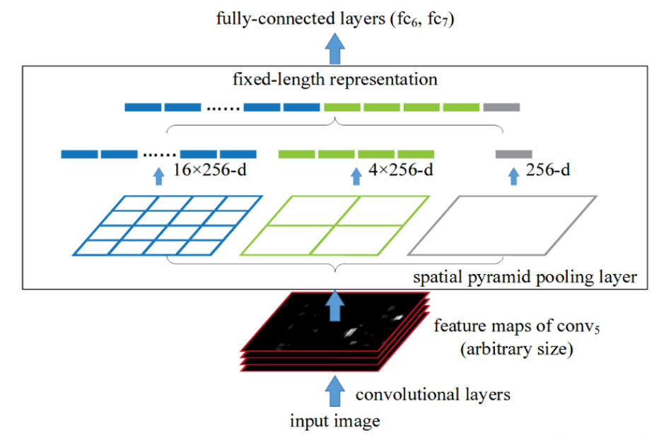
<br>
<div>图 4-2  SPP-Net 网络结构图</div>
</div>

<br>
b) ROI pooling layer

在 Fast-RCNN 中作者采用了 SPP-Net 的简化版：只对 SPP-Net 进行了一种尺度的切分，
之后直接下采样，得到特征向量。

<div align="center">
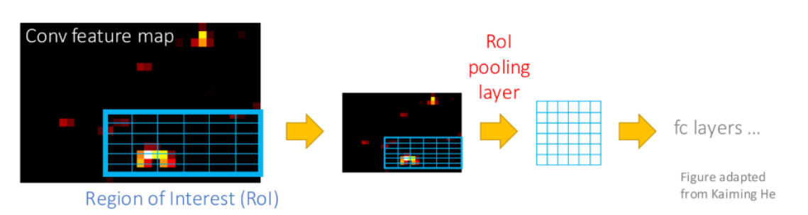
<br>
<div>图 4-3   RoI Pooling 操作图</div>
</div>


<br>
c）Fast-RCNN 整体框架

在RCNN中进行卷积特征提取的时候，需要对图片中的 2000 个候选框进行卷积计算，其中很多计算是重复的，同时 SPP-Net 和 RCNN 都需要多阶段的训练包括特征提取、微调网络、训练 SVM 分类器、边框回归等，不仅过程繁杂而且中间会产生大量的中间结果文件，占用大量内存。为此作者除了采用roi-pooling layer以外还设计了多任务损失函数(multi-task loss)，将分类任务和边框回归统一到了一个框架之内，整体思路如下：

<div align="center">
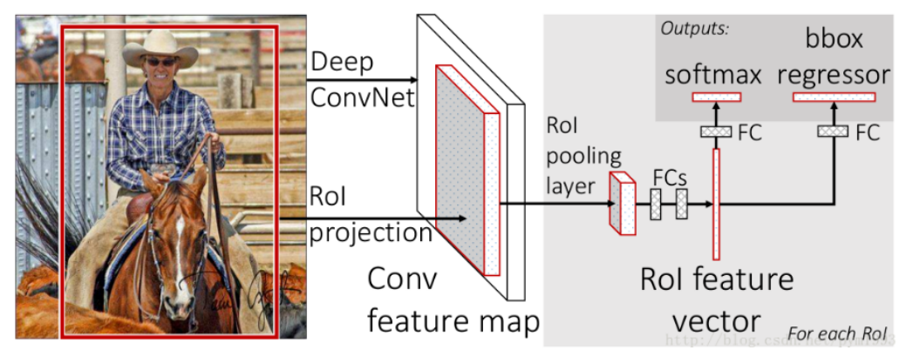
<br>
<div>图 4-4   Fast-RCNN 整体框架图</div>
</div>
<br>
用 selective search 方法从原始图片中提取 2000 个候选框（ROI），对整张图片进行卷积计算，得到卷积特征图（conv feature map）,然后利用 ROI pooling layer 从卷积特征图中提取每个候选框的特征向量，通过全连接层之后，特征向量进入两个输出层：一个进行分类，判断该候选框内的物体种类，另一个进行边框回归，判断目标在图中的准确位置。Fast-RCNN 缺陷在于仍然没有解决 selective search进行候选框选择的时候计算速度慢的问题。

#### Faster-RCNN

Faster-RCNN[1]针对 selective search 在 cpu 内进行计算速度慢等问题，作者创建了 RPN 网络替代selective search 算法进行候选框选择，使得整个目标识别真正实现了端到端的计算，将所有的任务都统一在了深度学习的框架之下，所有计算都在 GPU 内进行，使得计算的速度和精度都有了大幅度提升。
a) RPN 网络

<div align="center">
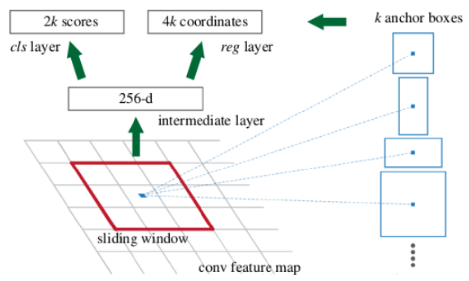
<br>
<div>图 4-5   RPN 网络结构</div>
</div>

<br>


RPN 网络的全称 region proposal network,目的是利用神经网络进行候选框的选择，其实RPN 也可以看做是一个分类网络，不过他的目标是分开前景（包含有 ROI 的部分）和背景（包含有 ROI 的部分），也就是一个二分类问题。

为了提取候选框，作者使用了一个小的神经网络也即就是一个 $n×n$ 的卷积核(文中采用了 $3×3 $的网络)，在经过一系列卷积计算的特征图上进行滑移，进行卷积计算。每一个滑窗计算之后得到一个低维向量（例如 VGG net 最终有 512 张卷积特征图，每个滑窗进行卷积
计算的时候可以得到 512 维的低维向量），得到的特征向量，送入两种层：一种是边框回归层进行定位，另一种是分类层判断该区域是前景还是背景。$3×3 $滑窗对应的每个特征区域同时预测输入图像 3 种尺度（128,256,512），3 种长宽比（1:1,1:2,2:1）的 region proposal，这种映射的机制称为 anchor。所以对于 40×60 图图，总共有约 20000(40×60×9)个 anchor，也就是预测 20000 个 region proposal。

b) Faster-RCNN 整体思路

<div align="center">
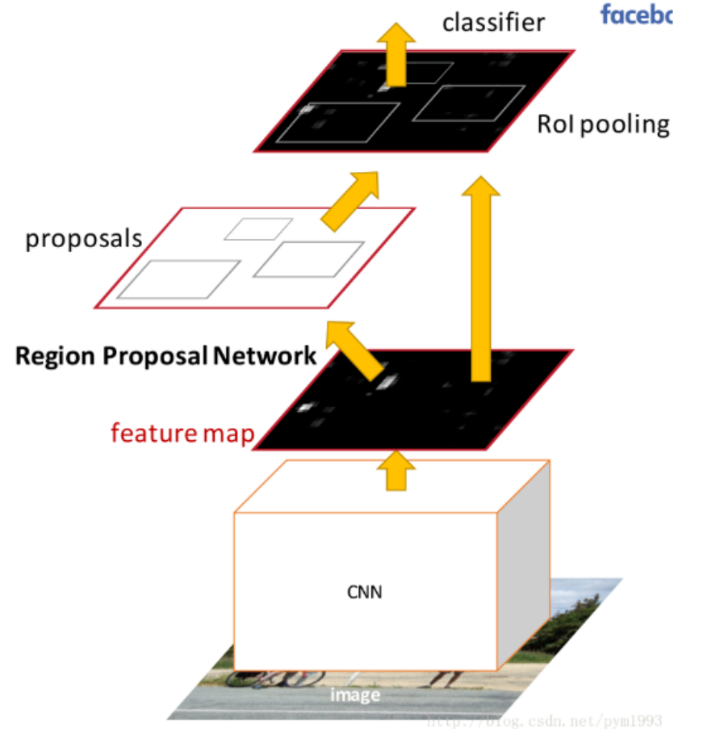
<br>
<div>图 4-6   Faster-RCNN 整体架构图</div>
</div>


<br>

首先对整张图片进行卷积计算，得到卷积特征，然后利用 RPN 进行候选框选择，再返回卷积特征图取出候选框内的卷积特征利用 ROI 提取特征向量最终送入全连接层进行精确定位和分类，总之：RPN+Fast-RCNN=Faster-RCNN。

#### YOLO

尽管 Faster-RCNN 在计算速度方面已经取得了很大进展，但是仍然无法满足实时检测的要求，因此有人提出了基于回归的方法直接从图片种回归的出目标物体的位置以及种类。具有代表性的两种方法是 YOLO [22]和 SSD[23]。

<div align="center">
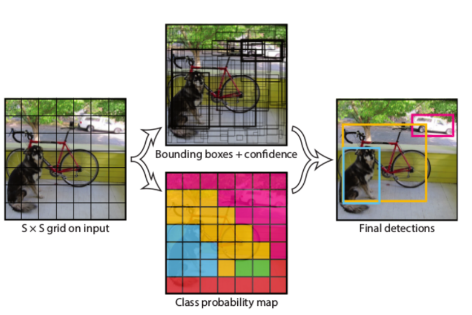
<br>
<div>图 4-7  YOLO 整体方法</div>
</div>

<br>

给定一个输入图像，首先将图像划分成 $7×7$的网格。其次，对于每个网格，我们都预测2个边框（包括每个边框是目标的置信度以及每个边框区域在多个类别上的概率）。然后，根据上一步可以预测出 $7×7×2$ 个目标窗口，然后根据阈值去除可能性比较低的目标窗口，最后非极大值抑制去除冗余窗口即可。可以看到整个过程非常简单，不需要中间的 region proposal 在找目标，直接回归便完成了位置和类别的判定。

YOLO 的网络结构跟 GoogLeNet 的模型比较类似，主要的是最后两层的结构，卷积层之后接了一个 4096 维的全连接层，然后后边又全连接到一个 $7×7×30$维的张量上。实际上这 $7×7$ 就是划分的网格数，现在要在每个网格上预测目标两个可能的位置以及这个位置的目标置信度和类别，也就是每个网格预测两个目标，每个目标的信息有 4维坐标信息(中心点坐标+长宽)，1 个是目标的置信度，还有类别数 20(VOC 上 20 个类别)，总共(4+1)×2+20 = 30 维的向量。这样可以利用前边 4096 维的全图特征直接在每个网格上回归出目标检测需要的信息（边框信息加类别）。
Yolo 方法的缺点显而易见，虽然舍弃了 Region proposal 阶段，加快了速度，但是定位精度比较低，与此同时带来的问题是，分类的精度也比较低。


### 4.1 检测框回归方法

#### CTPN
文章标题为 Detecting Text in Natural Image with Connectionist Text Proposal Network[3], 发表在 ECCV 2016 （深圳先进研究院），框架图如下：
<div align="center">
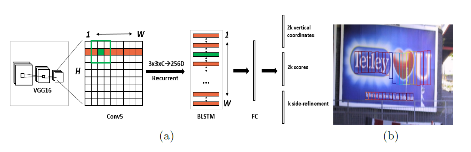
<br>
<div>图 4-8  CTPN 框架图</div>
</div>

<br>

本文主要改进了传统通用物体检测方法 Faster-RCNN[1]，并增加检测算法在文字检测上的鲁棒性。文章主要的网络架构为 RPN(Region Proposal Networks) + BLSTM，在 VGG16 的conv5_3 卷积特征上以 $3×3$ 的窗口进行滑窗操作并转换成 256 维特征为单位的序列，送入随后的 BLSTM 网络，最后通过一层全连接层输出三组预测结果：$2k$ 个 vertical coordinate，因为一个 anchor 用的是中心位置的高（$y$ 坐标）和矩形框的高度两个值表示的，所以一个用$2k$个输出。（注意这里输出的是相对anchor的偏移）。$2k$ 个score，因为预测了 $k$ 个text proposal，所以有  $2k $ 个分数，text 和 non-text 各有一个分数。$k$ 个 side-refinement，这部分主要是用来精修文本行的两个端点的，表示的是每个 proposal 的水平平移量。


#### IncepText
算法 IncepText: A New Inception-Text Module with Deformable PSROI Pooling for  Multi-Oriented Scene Text Detection[7] 发表于 IJCAI 2018 （阿里巴巴）。

<div align="center">
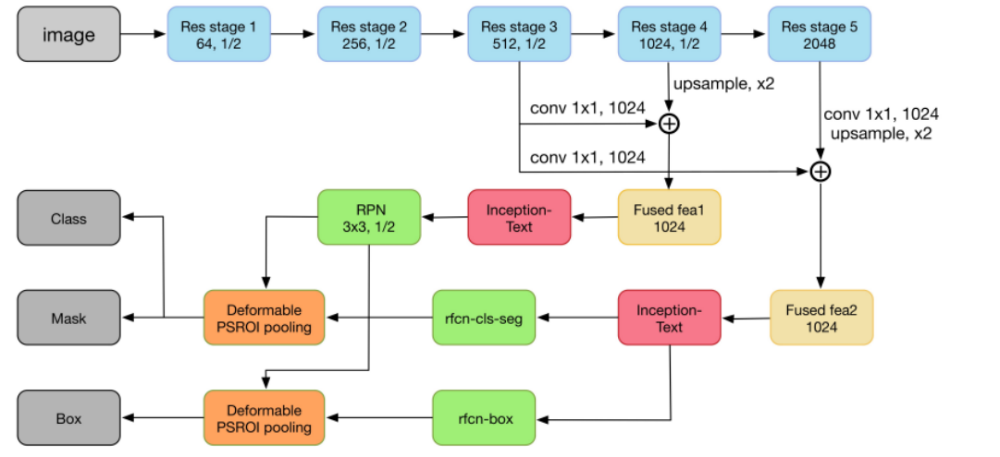
<br>
<div>图 4-9  InceptText 算法网络框架图
</div>
</div>

<br>

<div align="center">
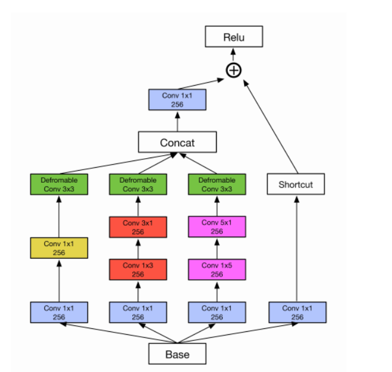
<br>
<div>图 4-10  Inception 模块</div>
</div>

<br>

本篇文章在网络特征选择部分提出 Inception 模块，并结合 Deformable PSROI pooling，即一种可以自动选择特征图上连续点位置，通过双线性插值（bilinear interpolation）的方式取得坐标位置上的特征的池化操作，组合成本篇文章的核心部分。图片输入Inception-ResNet-V2 之后，形成两个网络分支，最后分别经过Deformable PSROI pooling,其中一支产生字符区域的回归位置坐标，另一支则产生字符位置区域的分割轮廓结果。

#### RRPN
实验室提出的检测算法为 Arbitrary-Oriented Scene Text Detection via Rotation Proposals[2]。motivation 如下：自然场景中字符出现的并不只有水平和竖直方向，很有可能是任意朝向，因此直框无法准确的表达出字符的朝向，可能会使字符的阅读顺序丢失，导致识别算法失准或失效, 从而使直框检测算法在多朝向任务上的实用度大打折扣。
采用检测网络+朝向信息，对现有检测网络进行扩展，使得检测网络能够适应多朝向的检测任务，并能够对自然场景中的字符阅读顺序（朝向）进行预测。

<div align="center">
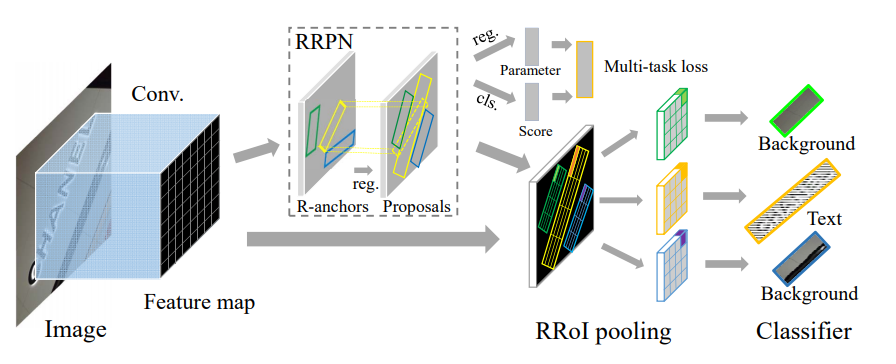
<br>
<div>图 4-11   RRPN 算法框架图</div>
</div>

<br>


方法基于 Faster-RCNN 框架，提出 RRPN 子网络，用于学习带角度的锚点（anchor）的分类（classification）与回归（regression）。锚点则是在 Faster-RCNN 锚点设定的基础上，除了 Scale（尺寸大小）和 Ratio（长宽比例）之外，还增加了 Angle（初始角度），如下图所示
<div align="center">
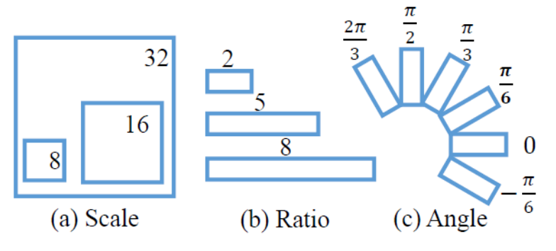
<br>
<div>图 4-12   Rotate Anchor 对应三组参数</div>
</div>

<br>

总共增加了锚点的 6 个初始化角度，均匀分布在[-45, 135]，大小为 180 度的区间之内，因此锚点需要回归的角度被限制在[-15, 15]度之间。这样就能够保证设定的锚点能够覆盖[-45, 135]的区间。从而使得锚点经过微小的调整就能与 Ground Truth 对齐。Faster-RCNN 后端部分因为需要将候选框对应的局部特征从全局特征图中截取，若采用原框架对应的感兴趣区域池化（RoI pooling）。由于对应的候选框并非水平或竖直方向，若保持取最小外接水平框的区域截取特征，则会带入太多背景信息，对最后的第二步分类与回归效果较差。示意图如下：
<div align="center">
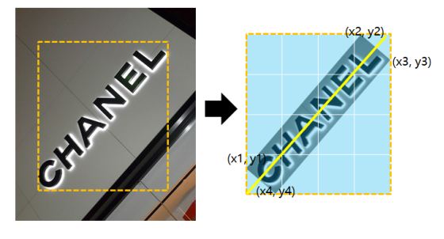
<br>
<div>图 4-13    RoI Pooling 示意图</div>
</div>

<br>

因此我们采取了一种对旋转矩形框更为友好的池化方式 RRoI Pooling，使得特征的截取能够按候选框的朝向进行，下图中展示了 RRoI Pooling 截取特征的过程：
<div align="center">
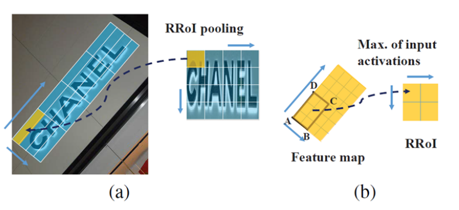
<br>
<div>图 4-14    RRoI Pooling 示意图</div>
</div>

<br>
RRoI Pooling 直接按候选框截取特征，随后经过最大值池化（max pooling）取得一定尺寸的特征，特征随后送入的 RCNN 部分进行第二步的分类与回归，从而取得更好的检测效
果。

### 4.2 语义分割方法

基于语义分割的检测方法因为避免了检测框的限制，能够较好的定位弯曲文本，但是不容易将相邻文本区分开，容易产生文本行的粘连问题。 

#### PSEnet

PSENet[24]为此提出对文本行的不同大小的核进行 预测，然后采用渐进式算法将小尺度的核拓展到原始文本行大小。这些不同大小的核与原始的文本行都具 有相同的形状，并且中心和原始文本行相同，生成过程采用收缩算法 Vatti clipping Algorithm对原始文本多边形进行收缩。在从最小尺度的核拓展时，采用广度优先搜索 (Breath-First Search) 逐渐扩增到更大尺度的核，直到扩增到原始文本行大小。这样就通过小尺度的文本中心预测避免了不同文本实例的粘连问题。

<div align="center">
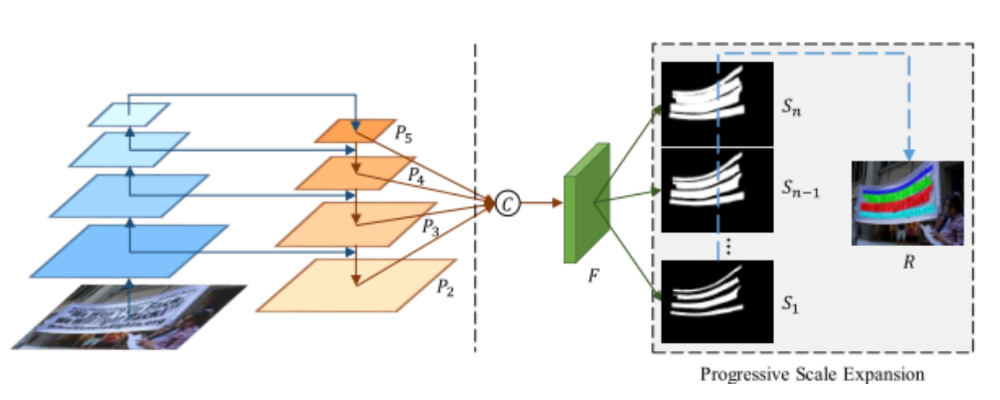
<br>
<div>图 4-15    PSENet 的网络结构</div>
</div>

PSEnet模型的网络结构采用 ResNet与特征金字塔网络结构 (Feature Pyramid Net, FPN)作为特征提取网络，不同尺度的特征图在合并后经过卷积、批归一化以及激活函数等得到 n 个分割结果 $S_1, S_2, . . . , S_n$。为了更好将文本区域和栅栏等相近纹理区分，在训练时采用了在线难例挖掘 (Online Hard-Example Mining, OHEM)算法以降低误检的概率。其优化目标表示为：
$$
L=\lambda L_c+(1-\lambda) L_s
$$

$ L_c$为整个文本实例的损失，$L_s$ 为收缩后文本区 域的损失，λ 用于平衡两者权重。损失采用 dice coefficient的形式$ D (S_i , G_i)$，计算公式如下：
$$
D\left(S_i, G_i\right)=\frac{2 \sum_{x, y}\left(S_{i, x, y} * G_{i, x, y}\right)}{\sum_{x, y} S_{i, x, y}^2+\sum_{x, y} G_{i, x, y}^2}
$$
$S_{i,x,y}$ 和 $G_{i,x,y}$ 分别表示像素点$ (x, y)$ 处的分割预测 值和标签值。 PSEnet 模型主要基于语义分割的方法，对文本行实例进行逐像素的预测；基于语义分割的方法可以更容易的对任意形状的文本检测进行表征，在得到相应的概率图后进行一定的后处理算法即可确定文本区域。相比于基于检测的方法，语义分割的方法灵活性更高，更容易表示弯曲文本。常见的语义分割文字检测方法直接对整个文本进行预测，没有对边界和文本中心进行区分，由于边界预测的不稳定会导致生成结果质量降低。因此本文选择语义分割的方法作为基准模型，尝试对文本的表征进行优化，对文本中心和边界区域同时进行预测，以提高模型的检测效果。

#### DBnet / DBnet++

在通用目标检测中加入物体周围区域的上下文信息进行辅助检测能够有效增强模型的检测效果。 考虑到字符区域的周围相比背景、文字中心区域有着独特的纹理、颜色信息，边界检测模型在模型设计时也加入周围区域的特征作为先验，这和使用检测文字区域的边界相似。

<div align="center">
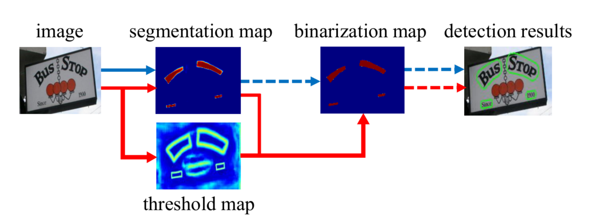
<br>
<div>图 4-16    DB 模型的流程图，上行为文本中心预测，下行为文本边界预测</div>
</div>

DB[25]模型将文本边框的周围区域作为特殊的边界类别预测，以辅助文本区域的生成。DB[10]方法共有两个输出，分别是文本中心区域的概率分数和边界区域的概率分数。因此损失函数 $L$ 可以表示为文本中心的概率图$ L_s$ 的损失 和边界区域的损失 $L_t$ 的加权和。


### 4.3 结合两种方式的方法

#### TextSnake

Text Snake[26]利用文本中心线和圆心在线上的 一系列圆来表示整个文本行区域。网络输出的预测包括文本区域的分割、文本行中心线的分割以及每一个圆的半径和圆心处切线的角度值。其网络基础结构为 VGG16[16]，网络首先进行下采样，后续部分又进行上采样特征融合。对于输入的图片，其利用全卷积网络和特征金字塔得到三个输出。利用文本区域和文本中心线得到实例分割的结果，并结合预测的半径最终得到文本检测区域。该方法的召回率较高，在基准数据集上取得了不错的效果。但这也导致其流程比较复杂，需要经过复杂的预测和后处理过程。

<div align="center">
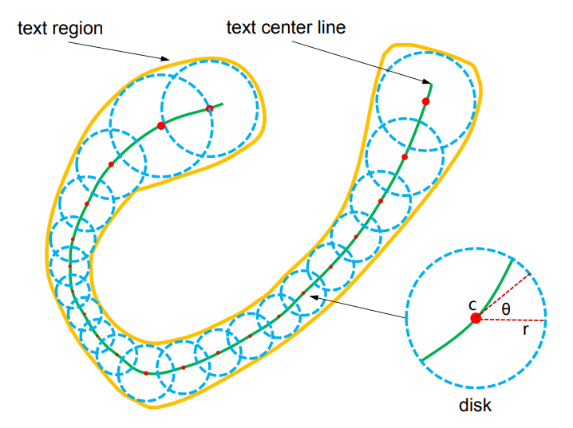
<br>
<div>图 4-17    TextSnake 的文字表示示意图，利用中心线和圆建模表示弯曲文本</div>
</div>

#### LOMO

受限制于卷积神经网络感受野大小和文本行的表征方式，长文本行和曲线文本检测是字符检测的难点。参考人类阅读复杂文本信息时可以反复浏览的思路，LOMO 模型 [2]通过多次逐步调整文本信 息解决挑战。LOMO 模型由三个部分组成：直接回归模块 (Direct Regressor, DR)、迭代修正模块 ( Iterative Refinement Module, IRM)、和形状表征模块 (Shape Expression Module, SEM)，整体架构见图7。首先由直接回归模块产生粗略的矩形候选文本框，接着通过迭代修正模块得到完整的文本行外接矩形，最后将迭代修正模块的结果结合文本行区域、文本中心线及文本边界偏移值得到最终的文本行。

<div align="center">
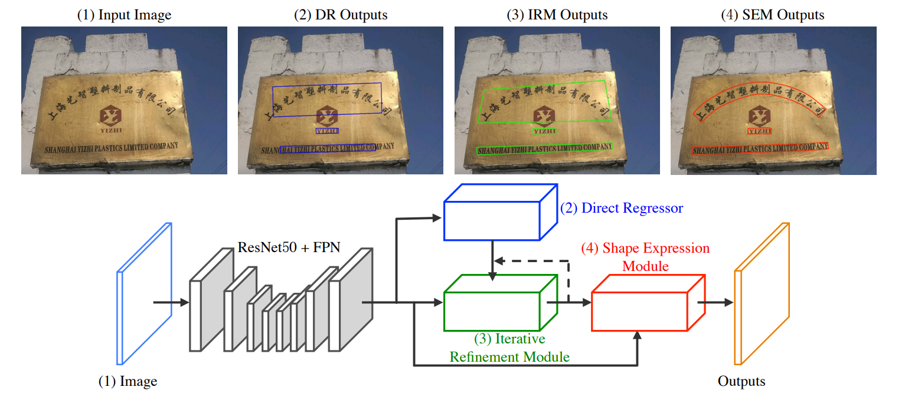
<br>
<div>图 4-18    LOMO 的网络架构</div>
</div>

LOMO 采用 ResNet-50作为骨干网络，并将骨干网络提取的多层特征经过特征金字塔的结构进行融合。特征金字塔网络能够将不同尺度的特征图进行采样后融合，使得最后的特征图能够不失去底层的图像特征，对于解决多尺度检测问题有不错的效果。融合之后的卷积特征输入到三个组件中。

直接回归模块以每像素的形式预测单词或文本行的矩形框，其输出是逐像素的文本概率值 (score map) 按阈值处理后正样本的点对应原图上的正样本区域。该模块的损失包括目标的分类损失 $L_{cls}$ 和 回归损失 $L_{loc}$。回归采用 smooth L1距离进行监督。在分类损失$L_{cls}$上, 针对二值化分割任务作者 特别提出尺度无关的损失函数，用于增强网络对于尺度变化的鲁棒性：
$$
L_{c l s}=1-\frac{2 * \operatorname{sum}(y \cdot \hat{y} \cdot w)}{\operatorname{sum}(y \cdot w)+\operatorname{sum}(\hat{y} \cdot w)}
$$
其中 $y$ 是标签的二值化图，$\hat{y}$ 是预测的概率图，$sum$ 是 2D 空间的累加函数，$w$ 是一个 2 维的权值图。

迭代修正模块可以从直接回归模块或者自己的输出中迭代的细化输入建议区域 (proposals)，使其更接近真实边界框。设计上舍弃了常用的兴趣区域池化层或兴趣区域对齐层的设计，采用了兴趣区域变换层 (RoI Transform) 来提取文本四边形特征块，这样能够保持提取的特征区域纵横比不变。因为文本行角点能够为文本行边界提供精确信息，修正时采用角点注意力机制对角点坐标的偏移回归。

形状表征模块对文本进一步的拟合，使得模型能够对弯曲的文本行更好的表征。模块对文本的三种几何属性进行了回归：文本行区域、文本中心线和文本行上下边界线的偏移。

LOMO 对文本表征的建模使得模型能够对长文本和曲线文本有着较为精确的表示， 网络结构和损失函数的设计使得模型在一定程度上对多尺度目标更加鲁棒。


## 5 任务实践
> &emsp;&emsp;针对文本识别的相关任务，FudanVIA提供了一套较为完整的解决方案，其中已封装了具有代表性的文本识别模型的对应功能接口，可供系统开发和学习交流使用。本节将基于这些接口介绍具体的任务实践。
### 5.1 模型组件介绍
**介绍算法库中有关文本检测任务的组件及其构成，简单阐述工作原理*

### 5.2 模型组件接口调用
**介绍模型组件接口的方法、参数和注意事项等*

&emsp;&emsp;FudanVIA中有关文本识别组件的接口为`FudanVIA.get_text_detection_component(model_name: str)`，若要调用接口，首先需要对FudanVIA库进行引入：

```python
import FudanVIA
```

&emsp;&emsp;文本识别组件接口`get_text_detection_component()`含有一个参数`model_name`，为字符串类型数据。在该参数中输入需要使用的文本识别模型的名称，`get_text_detection_component()`方法将会返回一个TextDetectionBaseComponent类的实例化对象，其中包含了与名称对应的初始化文本识别模型：

```python
db_model = FudanVIA.get_text_detection_component("DB")
```

目前可输入的名称范围为("DB")，分别对应了DB检测模型；输入其他字符串则将报错。后续将逐步在算法库中更新更多文本检测模型。

&emsp;&emsp;由此，通过接口调用完成了一个文本检测模型组件的初始化。接下来，通过调用模型组件的接口，即可完成模型训练、模型测试、模型预测等功能。

#### 权重加载
&emsp;&emsp;调用`load_checkpoint()`方法以加载预先完成训练的模型权重：

```python
db_model.load_checkpoint(weight_dir="PATH_TO_WEIGHT")
```

该接口接收1个输入参数`weight_dir`，为字符串型参数，用于指定权重路径；而该接口无返回值，直接将权重参数载入已完成初始化的模型中。

#### 模型训练
&emsp;&emsp;若要实现模型的训练功能，应调用模型组件的train()方法：

```python
db_model.train(
    train_dir="PATH_TO_TRAIN_DATASET",
    val_dir="PATH_TO_VAL_DATASET",
    output_dir="PATH_TO_SAVE_WEIGHTS_AND_LOGS",
    nun_epoch=0
)
```

需要向其传入4个参数：
* `train_dir`：字符串型参数，指定训练数据集所在的路径；
* `val_dir`：字符串型参数，指定验证数据集所在的路径；
* `output_dir`：字符串型参数，指定存放训练所得权重和训练记录的位置；
* `num_epoch`：整型参数，默认值为0，用于指定从第几个epoch开始训练模型，通常用于中断训练后指定继续开始位置。

由此完成对识别模型的训练。`train()`方法没有返回值，训练结果将直接以计算机文件的形式进行持久化。

#### 模型测试
&emsp;&emsp;调用模型组件的`test()`方法，即可实现模型的测试功能：

```python
test_acc = db_model.test(
    test_dir="PATH_TO_TEST_DATASET",
    log_dir="PATH_TO_SAVE_TEST_LOGS"
)
```

需要向其传入2个参数：
* `test_dir`：字符串型参数，指定测试数据集所在的路径；
* `log_dir`：字符串型参数，指定保存测试结果记录的路径。

`test()`方法拥有一个float型返回值，返回测试得到的识别模型的WRA。`test()`方法实则在测试数据集上仅执行一次验证功能的`train()`方法。

#### 模型预测
&emsp;&emsp;模型预测功能需要调用`inference()`方法：

```python
rec_list = db_model.inference(img_list=[imgA, imgB, imgC])
```

`inference()`方法接受列表类型的输入，输入的列表长度应大于0，且列表中的所有元素应为numpy数组格式的图像。经过预测后，`inference()`方法会返回与输入图像序列一一对应的识别结果列表，列表的长度与输入列表长度相等，列表内的所有元素为字符串类型的数据。

### 5.3 任务范例
&emsp;&emsp;根据FudanVIA提供的模型组件接口，可基本实现文本检测模型的全部内容。本节将给出一个基于FudanVIA的模型组件接口的简易文本检测器的实现。

#### 训练模块代码

```python
import FudanVIA

def training_module():
    db_model = FudanVIA.get_text_detection_component("DB")
    db_model.train(
        train_dir="../dataset/train_dataset",
        val_dir="../dataset/val_dataset",
        output_dir="./save"
    )
    test_acc = db_model.test(test_dir="../dataset/test_dataset")
    
    return test_acc
```

#### 预测模块代码

```python
import cv2
import FudanVIA

def inferring_module():
    db_model = FudanVIA.get_text_detection_componentt("DB")
    db_model.load_checkpoint(weight_dir="./save/model_best.pth")
    
    img_path = ["../demo/1.jpg", "../demo/2.jpg", "../demo/3.jpg", "../demo/4.jpg", "../demo/5.jpg"]
    img_list = [cv2.imread(i) for i in img_path]
    
    rec_list = db_model.inference(img_list)

    return rec_list
```

### 5.4 常见问题Q&A
**在此列出开发实践过程中遇到的有记录价值的问题，并给出详细解答*


### 参考文献

[1]Ren, Shaoqing, et al. "Faster r-cnn: Towards real-time object detection with region proposal  networks." Advances in neural information processing systems. 2015

[2] Ma, Jianqi, et al. "Arbitrary-oriented scene text detection via rotation proposals." IEEE  Transactions on Multimedia (2018). 

[3] Tian, Zhi, et al. "Detecting text in natural image with connectionist text proposal network."  European conference on computer vision. Springer, Cham, 2016.

[4] Liao, Minghui, et al. "TextBoxes: A Fast Text Detector with a Single Deep Neural Network."  AAAI. 2017. 

[5] Liao, Minghui, Baoguang Shi, and Xiang Bai. "Textboxes++: A single-shot oriented scene text  detector." IEEE Transactions on Image Processing 27.8 (2018): 3676-3690. 

[6] Liu, Xuebo, et al. "FOTS: Fast Oriented Text Spotting with a Unified Network." Proceedings  of the IEEE Conference on Computer Vision and Pattern Recognition. 2018. 

[7] Yang, Qiangpeng, et al. "IncepText: A New Inception-Text Module with Deformable PSROI  Pooling for Multi-Oriented Scene Text Detection." arXiv preprint arXiv:1805.01167 (2018). 

[8] Shi, Baoguang, Xiang Bai, and Serge Belongie. "Detecting oriented text in natural images by  linking segments." arXiv preprint arXiv:1703.06520 (2017). 

[9] Liu, Yuliang, and Lianwen Jin. "Deep matching prior network: Toward tighter multi-oriented  text detection." Proc. CVPR. 2017. 

[10] Lin, Tsung-Yi, et al. "Feature pyramid networks for object detection." CVPR. Vol. 1. No. 2.  2017. 

[11]Liu, Wei, et al. "Ssd: Single shot multibox detector." European conference on computer vision.  Springer, Cham, 2016. 

[12] Zhou, Xinyu, et al. "EAST: an efficient and accurate scene text detector." Proc. CVPR. 2017. 

[13] Bottou, Leon, Y. Bengio, and Y. L. Cun. "Global Training of Document Processing Systems  Using Graph Transformer Networks." Computer Vision and Pattern Recognition, 1997.  Proceedings. 1997 IEEE Computer Society Conference on IEEE, 1997:489-494. 

[14] Krizhevsky, Alex, I. Sutskever, and G. E. Hinton. "ImageNet classification with deep  convolutional neural networks." International Conference on Neural Information Processing  Systems Curran Associates Inc. 2012:1097-1105. 

[15] Szegedy, Christian, et al. "Going deeper with convolutions." (2014):1-9. 

[16] Simonyan, Karen, and A. Zisserman. "Very Deep Convolutional Networks for Large-Scale  Image Recognition." Computer Science (2014).

 [17] He, Kaiming, et al. "Deep Residual Learning for Image Recognition." (2015):770-778. 

[18] Girshick, Ross, et al. "Rich feature hierarchies for accurate object detection and semantic  segmentation." Proceedings of the IEEE conference on computer vision and pattern recognition.  2014. 

[19] Uijlings, J. R. R., et al. "Selective Search for Object Recognition." International Journal of  Computer Vision 104.2(2013):154-171. 

[20] He, Kaiming, et al. "Spatial pyramid pooling in deep convolutional networks for visual  recognition." European conference on computer vision. Springer, Cham, 2014. 

[21] Girshick, Ross. "Fast r-cnn." Proceedings of the IEEE international conference on computer  vision. 2015.

[22] Redmon, Joseph, et al. "You only look once: Unified, real-time object detection." Proceedings  of the IEEE conference on computer vision and pattern recognition. 2016.

[23] Liu, Wei, et al. "Ssd: Single shot multibox detector." European conference on computer vision.  Springer, Cham, 2016

[24] Wenhai Wang, Enze Xie, Xiang Li, Wenbo Hou, Tong Lu, Gang Yu, and Shuai Shao. Shape Robust Text Detection With Progressive Scale Expansion Network. In 2012 IEEE Conference on Computer Vision and Pattern Recognition, pages 9336–9345, 2019. 1, 3, 5, 7

[25] Minghui Liao, Zhaoyi Wan, Cong Yao, Kai Chen, and Xiang Bai. Real-Time Scene Text Detection with Differentiable Binarization. Proceedings of the AAAI Conference on Artificial Intelligence, 34(07):11474– 11481, Apr. 2020. Number: 07. 3, 7

[26]  Shangbang Long, Jiaqiang Ruan, Wenjie Zhang, Xin He, Wenhao Wu, and Cong Yao. TextSnake: A Flexible Representation for Detecting Text of Arbitrary Shapes. In Proceedings of the European Conference on Computer Vision (ECCV), pages 20–36, 2018. 3, 5, 6, 7

[27] Chengquan Zhang, Borong Liang, Zuming Huang, Mengyi En, Junyu Han, Errui Ding, and Xinghao Ding. Look More Than Once: An Accurate Detector for Text of Arbitrary Shapes. In 2012 IEEE Conference on Computer Vision and Pattern Recognition, pages 10552–10561, 2019. 3, 6

