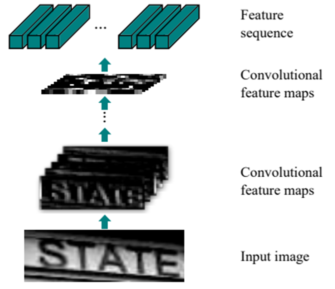
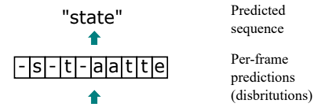
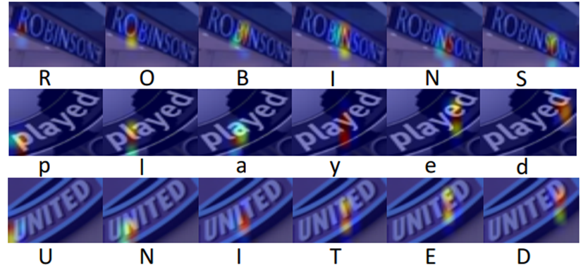
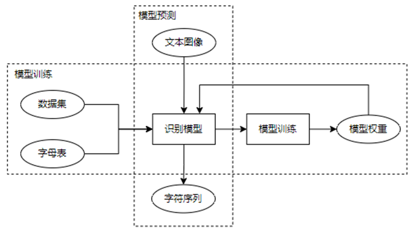
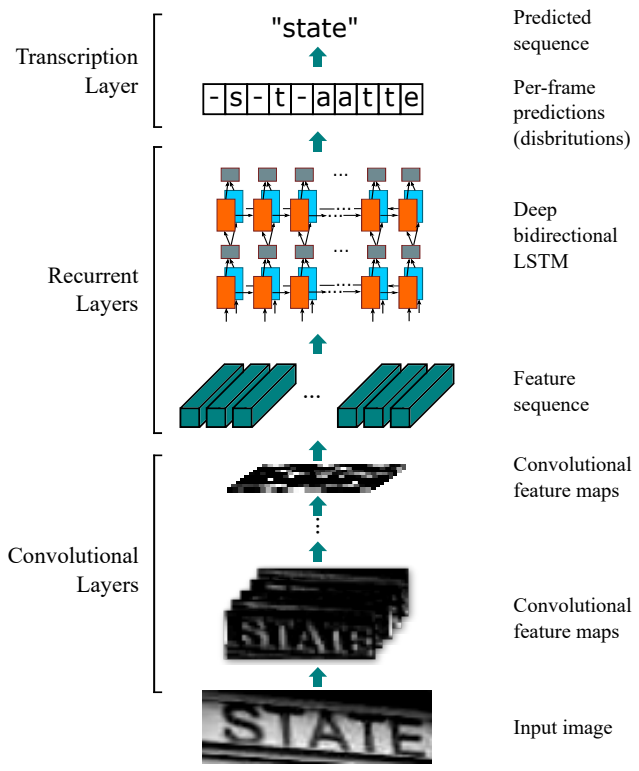
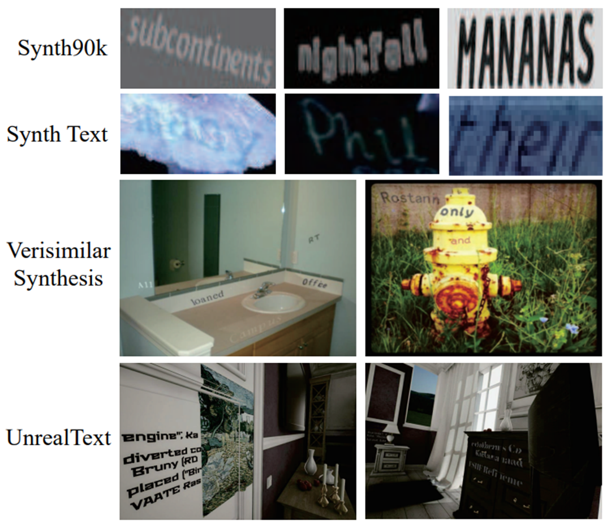
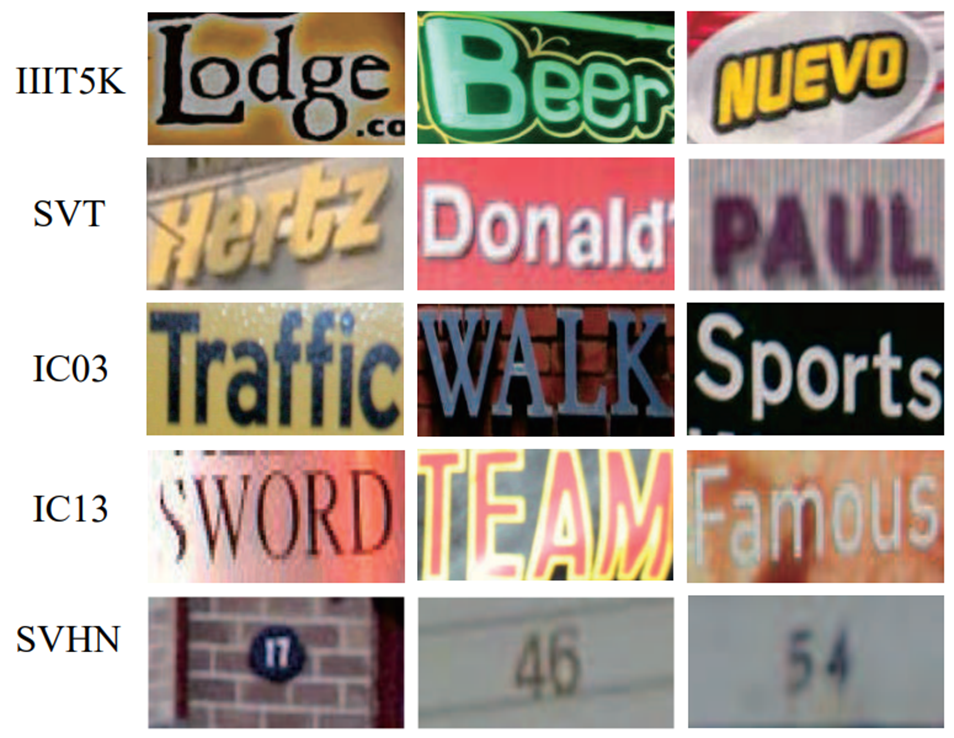
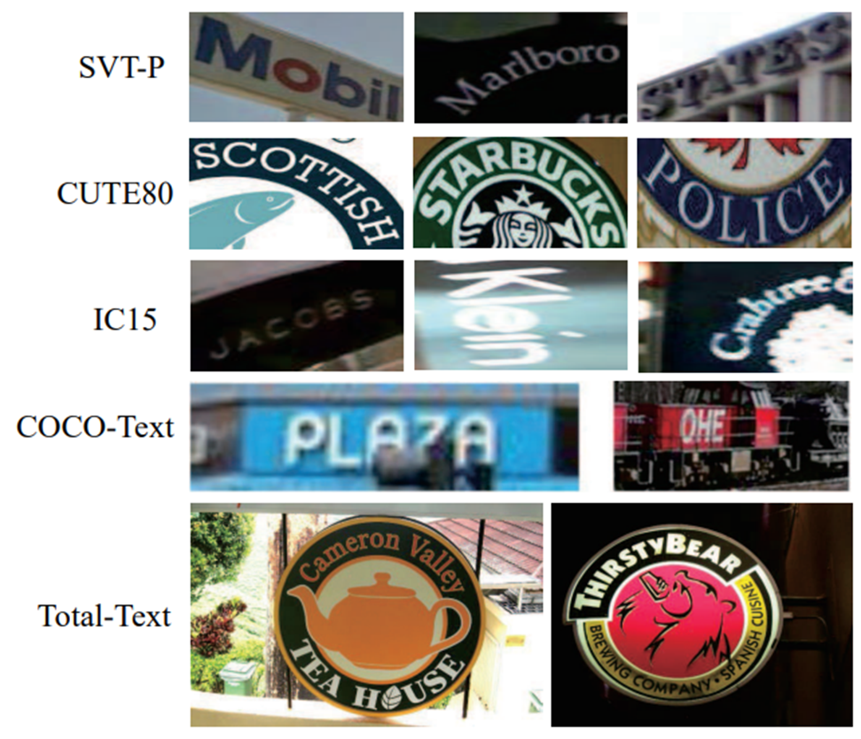
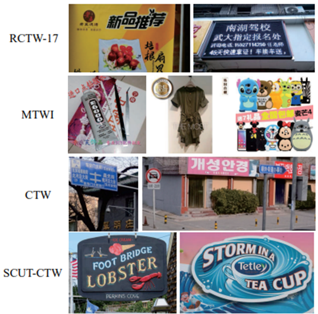
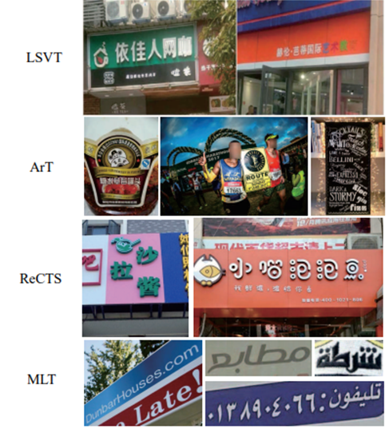

# 文本识别

## 1 基础知识
> &emsp;&emsp;语言是人类文明的一大重要符号系统，而文字则以具象化的形式对语言进行表示。对计算机而言，一个字符既无读音也无释义，仅仅只是简单的符号。这种符号可能以图像，即像素点矩阵的形式表现；或以文字编码向量的形式表现。

### 1.1 任务定义
&emsp;&emsp;文本，是透过存在过的语言或文字所组合而成的内容，且具有连贯性及编码意义。图像，通常指数字图像，是二维图像用有限数字数值像素的表示。文本图像识别任务，实则从图像到文本的跨模态信息转换，从图像中提取文本信息，其本质即将像素点数值矩阵格式的符号转换为文字编码向量格式的符号。这实际上是一类中间处理任务，把这个任务单独拿出来没有实际的意义，但在许多其他AI领域的任务中需要文本图像识别的辅助，如字段匹配、语言处理等任务。

&emsp;&emsp;通常的文本图像识别指代传统的光学字符识别（OCR），即由扫描仪扫描而得的文档文本图像；然而随着影像技术的发展，通过相机捕捉得到的场景图像中的场景文本识别任务（STR）也逐渐成为研究的主流趋势。此外还有手写文本识别（HTR）、中文文本识别（CTR）等特殊条件下的文本图像识别任务。

&emsp;&emsp;**OCR（Optical Character Recognition, 光学字符识别）**
传统上指对图像进行处理及分析，识别出图像中的文字信息；

&emsp;&emsp;**STR（Scene Text Recognition，场景文字识别）**
指识别自然场景图片中的文字信息，通常被认为是一种特殊的OCR。

&emsp;&emsp;目前扫描文档的OCR技术基本已经饱和，但由于复杂背景、字体、成像条件差等因素，STR仍然有极大提升空间。

### 1.2 评价指标
&emsp;&emsp;对于某一模型在文本图像上识别的效果，需要有定量的指标进行衡量。目前文本识别任务中公认的通用评估指标主要有WRA和WER。

&emsp;&emsp;对于单词识别准确率（WRA），有

$$WRA=\frac{W_r}{W}$$

&emsp;&emsp;对于单词错误率（WER），有

$$WER=1-WRA=1-\frac{W_r}{W}$$

&emsp;&emsp;其中 $W$ 为测试样本中的单词总数， $W_r$ 为其中被正确预测的单词数。

&emsp;&emsp;除此之外，由于中文汉字等语种的特殊性，WER和WRA无法更细化、更立体地对模型效果进行评估，因此另一个指标NED也被经常使用。

&emsp;&emsp;对于多语种文本识别评价指标，模型预测的归一化编辑距离（NED）有

$$NED=\frac{1}{N}\sum_{i=1}^{N}D(s_i,\hat{s}_i)/max(l_i,\hat{l}_i)$$

&emsp;&emsp;其中函数 $D$ 表示两个字符串的Levenshtein距离， $s_i$ 和 $\hat{s}_i$ 分别表示预测结果和对应文本图像的ground truth标签， $l_i$ 和 $\hat{l}_i$ 为他们的文本长度， $N$ 为测试样本的总数。由此，NED指标衡量预测本文与目标文本的非匹配度，而模型的识别能力则用$1-NED$进行衡量，其值越大，就表示模型的识别能力越强。

&emsp;&emsp;考虑预测结果"abcde"和ground truth标签"abade"。根据WRA的定义，模型对这个样本做出了错误的预测；而根据NED的定义，模型对样本中大部分的内容做出了正确的预测。若一个测试数据集中所有样本的预测结果都诸如此类，则从WRA的标准来看，模型的WRA为0，但其NED仍为一个较为可观的数值。而客观上来说，该模型确实具备一定的拟合能力，因此NED能更加立体地对模型的性能做出评定。

### 1.3 任务难点
&emsp;&emsp;目前扫描文档的OCR技术基本已饱和，但在STR相关任务中仍存在有待攻克的难关。与OCR相比，STR的难点主要有：
* **背景**
与扫描文档的OCR不同，自然场景中的文本可能在任何地方出现，如广告板、墙上或产品包装上。因此场景文本图像有**更复杂的背景**。此外，背景纹理可能与文本很相似，导致了识别难度的上升。


* **噪声**
自然场景文本图像经常受到噪声干扰，如**遮挡、光照不均、低分辨率和动态模糊**，较差地识别条件会导致场景文本识别的错误。


* **样式**
扫描文档中的字体一般使用单一颜色、规整的字体、一致的尺寸和规范的排版印刷，而自然场景中的文本通常有**多种颜色、不规整的字体、不同尺寸且排布方向多样**。这种文本样式的多样性给STR任务增加了难度。


* **获取方式**
扫描文档文本通常占据了图像中的主要部分，而场景文本则是**从现实场景中随意抓拍**而得，这会导致透视失真之类的变形。文本形状的多样性增加了STR的难度。

### 1.4 应用场景
&emsp;&emsp;在广泛的视觉应用场景中，文本所携带的丰富语义信息至关重要。故自然场景文本识别已经成为计算机视觉和模式识别的活跃研究领域，其应用范围包括图像搜索、智能检查、工业自动化、机器人导航和实时翻译等领域。

&emsp;&emsp;文本识别较为基础的应用方向有：

* **智能翻译**
与机器翻译相结合，对场景图像中的文本进行实时检测、识别和翻译。


* **信息提取**
在大数据时代背景下，人工从文本图像中提取关键信息至大数据系统中的成本过高，因此自动化的信息提取将大幅节约人工成本并提升效率。


* **文本视觉信息问答（text VQA）**


* **多媒体搜索**


* **用于助残的视觉-文本-语音转换**

&emsp;&emsp;其中有一个场景应用上的误区：很多人认为文本识别可以应用于自动驾驶技术中，从而使自动驾驶的汽车能够识别马路上的道路交通标志，并做出对应行为。但很显然这并非实现自动驾驶的最好方法。在自动驾驶技术普及后，大数据技术将取代传统的路标。对于人类来说，需要通过看到路标来做出对应的行为；而对计算机而言，只需要地理定位等信息，即可由大数据对车辆的行为直接进行控制，而无需路标的指示，因此自动驾驶并非文本识别的一个可应用方向。

&emsp;&emsp;但文本识别仍在其他许多领域中起到关键性作用。换句话说，只要人类还在使用语言和文字，这个任务就会继续存在。


## 2 方法论
> &emsp;&emsp;随着大数据的普及、计算机硬件系统的迭代更新以及算法研究的推进，深度学习在近年得以快速发展，由此，基于深度学习的方法逐渐成为了文本图像识别的主流方法。提到数字图像的智能处理，神经网络已几乎成为一个不可避免的话题，因为它的出现就是为了模拟视觉中枢的神经结构，这种使用感知方法进行特征提取的过程被一次次的实践有力地证明了其有效性。

### 2.1 算法框架
&emsp;&emsp;在一个完整的STR任务中，往往包含了多个可拆分的流程步骤，因此可将整个处理流程细化分解为多个子任务。这些任务通常有：文本检测、文本定位、文本验证、文本分割、文本识别、端到端系统等；而在一些特殊场景下，也会有其他的相关子任务，如语种识别、文本增强、文本追踪和自然语言处理等。本章则主要针对文本识别这一个STR子任务进行深入的介绍，其余处理流程的相关介绍可参见其他章节。

&emsp;&emsp;按照不同的处理流程，可将主流的文本识别方法分为两类，即基于图像分割的文本识别方法和基于非分割的文本图像识别方法。 [1]

&emsp;&emsp;基于图像分割的文本识别方法的主要流程包含了图像预处理、字符分割和字符识别几个部分，它通常对文本图像进行逐字符分割，再利用字符分类器进行识别，最终按文本行信息组合字符，得到识别结果。但这样的方法存在一定的问题。一方面，这种方法需要较为精准的字符级检测标注，然而获取标注的成本往往很高，且一些标注不准确的情况容易影响识别性能；另一方面，基于分割的方法仅对单个字符进行分类，无法对文本行的上下文关系进行建模，因此在单词级别上会预测出较差的结果，在遇到噪声干扰时也无法根据上下文正确判断出受干扰的文本内容。

&emsp;&emsp;本章中所述模型介绍以及相关论文的介绍，将以无分割方法为主。

### 2.2 无分割文本识别方法模型简介
&emsp;&emsp;无分割方法将从完整图像中裁剪出的文本图像（通常包含一个文本行）视为一个整体，送入编解码器架构中，直接得到预测的字符序列，因此不需要进行字符级分割。其通常包含了四个流程，即图像预处理、特征提取、序列建模和序列预测，接下来将逐阶段进行介绍。

#### 图像预处理
&emsp;&emsp;该步骤将图像中的干扰项去除，从改进图像质量的角度降低文本识别难度，提升特征提取和识别的效果。例：

* **背景移除**
当背景的纹理特征与文本的纹理特征相接近时，文本识别的难度将大幅提升。此时对文本内容和背景进行分离可以较为合理解决这个问题。对传统文档类图像的处理通常使用二值化方法，而对自然场景下的文本图像，则可使用基于GAN的方法。（图2-1）

<div align="center">

<br>
<div>图2-1 背景移除</div>
</div>
<br>

* **文本图像超分辨率**
低分辨率图像会引起大量的错误识别，而超分能根据低分辨率的原图还原其高分辨率图像。（图2-2）

<div align="center">

<br>
<div>图2-2 文本图像超分辨率</div>
</div>
<br>

* **文本矫正**
文本矫正主要对场景文本图像中扭曲或任意方向的文本行进行修正，将不规则的文本转变为规则文本，便于识别模型进行预测。经典的文本矫正方法包括了空间变换网络（STN）和薄板样条插值（Thin-Plate-Spline，TPS），而后续的文本矫正方法多为在这两者的基础上进行改进而得。文本矫正方法虽有助于模型进行识别，但会影响系统的时间性能和空间性能，因此在不同应用场景中应取得合适的耗能和效果的中和。（图2-3）

<div align="center">

<br>
<div>图2-3 文本矫正</div>
</div>
<br>

&emsp;&emsp;通常图片预处理流程在识别模型的pipeline中可有可无，但针对裁剪后图像的预处理操作通常在识别模型中完成，因为在实际应用中，往往会希望模型具有更强的泛化性，其输入图像应是任意可变的，而非由前置任务完成特定的处理后再输入识别模型。图像预处理会将原始文本图像转化为适用于对应识别模型的图像。

#### 特征提取
&emsp;&emsp;该阶段对原始文本图像中的特征进行表示，去除了图像中的无关特征，如字体、样式和背景等，将原图压缩至无冗余的特征图，最广泛使用的方法即卷积神经网络（CNN）。（图2-4）

<div align="center">

<br>
<div>图2-4 特征提取</div>
</div>
<br>

&emsp;&emsp;神经网络结构越复杂，其深度越大，其承载的表征能力也就越强，因此CNN是一种适用于处理复杂场景文本图像的方法，但同时也对内存和算力有较高要求。

&emsp;&emsp;特征提取的输入为原始图像，输出通常为特定大小的多通道特征图，或高度为1的多通道特征图，用于表征文本的序列信息。

#### 序列建模
&emsp;&emsp;序列建模主要用于获取字符序列中的上下文信息，以用来预测后阶段的字符，其中最典型、最广泛使用的建模方法为双向长短期记忆循环神经网络（BiLSTM）。

&emsp;&emsp;由于BiLSTM的训练需要消耗大量时间和算力，而且容易引发梯度消失和梯度爆炸的问题，因此序列建模的另一种方法是滑动窗口或基于限定感受野的一维CNN。此外，近期的Transformer方法基于全局语义信息监督进行序列建模，同样表现出较好的效果。基于CNN和Transformer的方法在利用上下文线索建立序列模型的情况中，可以更快更有效解决长序列问题，因此正在逐渐代替基于RNN的方法。

#### 模型预测
&emsp;&emsp;该阶段的目标是从图像特征的序列模型中预测出目标字符串序列，主要有基于CTC和基于注意力的两种方法。

1. **基于CTC的方法**

&emsp;&emsp;连接时序模型（Connectionist Temporal Classification, CTC）通过文本序列级别的标注直接对序列模型进行训练，避免了字符级标注，因而能够避免字符分割导致的错误，显著提升性能。CTC在多个领域中都取得了显著的效果，如语音识别、在线手写字符检测等。

&emsp;&emsp;在字符识别领域，CTC方法主要用于最后的预测阶段。CTC转录层通过计算条件概率，将CNN和RNN提取的特征序列直接解码为目标字符串序列。

<div align="center">

<br>
<div>图2-5 文本识别模型中的CTC</div>
</div>
<br>

&emsp;&emsp;CTC原理简述：在识别模型的CTC模块中，用 $y=(y_1,y_2,…,y_T)$ 表示上一阶段输入的特征序列， $T$ 表示序列长度，则对 $y_n(1≤n≤T)$ 中的任一列 $y_t$ ，都是 $L$ 上的一个概率分布，其中 $L$ 表示标签集，它包括了所有字母表中的字符和空白符。CTC路径 $\pi$ 是长度为 $T$ 的序列，其中包含了空白符和标签索引。但由于映射至转录 $l$ 的路径有多种可能，因此需要使用CTC映射函数 $B$ 来删去路径中的重复标签和空白符，然后将所有路径通过B函数可能映射至l的概率和相加，计算条件概率，其公式如下所示：

$$p(l|y)=\sum_{\pi:B(\pi)=l}^{}p(\pi|y)$$

其中对任意的路径 $\pi$ 的概率为：

$$p(\pi|y)= {\prod_{t=1}^{T}}y_{\pi_{t}}^{t}$$

 $y_{\pi_{t}}^{t}$ 是 $t$ 时间时路径标签为 $\pi_{t}$ 的概率。上述概率的计算成本较大，因此大部分情况使用前向后向算法进行概率计算。最终，一般框架的模型通过梯度 $\frac{\partial p(l|y)}{\partial w}$ 的反向传播对前阶段中的RNN参数进行训练，使条件概率 $p(l|y)$ 的值最大。

&emsp;&emsp;在CTC被应用于文本图像识别任务后，许多基于CTC方法的改进大幅提升了文本识别模型的能力和效率。

&emsp;&emsp;尽管CTC方法具有较强的性能和稳定性，但也存在以下问题:
* 当序列长度增加时，CTC的算力成本也大幅升高；
* 峰值分布问题;
* 仅适用于一维序列，当面对诸如非规则STR问题时，由于场景文本复杂的空间结构，CTC方法将不再适用。即便后续有人提出2D-CTC，但仍无法彻底解决二维预测问题。

2. **基于注意力的方法**

&emsp;&emsp;注意力机制最早被用于机器翻译领域中，随后因其有效性被逐步应用于多个领域，包括图像命名、遥感图像分类和字符识别。在字符识别任务中，注意力机制通常和RNN共同组成预测模块。（图2-6）

<div align="center">

<br>
<div>图2-6 基于注意力的文本识别方法</div>
</div>
<br>

&emsp;&emsp;注意力机制原理简述：概括来说，注意力机制根据出现过的目标字符和由RNN编码得到的特征向量来学习图像和字符序列之间的对应关系。用 $o=(o_1,o_2,\dots,o_M)$ 来表示输出的预测序列，其中 $M$ 表示解码最大步长，那么在 $t$ 时刻输出的预测 $o_t$ 由如下公式得出：

$$o_t=Softmax(W_os_t+b_o)$$

其中 $s_t$ 是RNN在 $t$ 时刻的隐藏状态。一般的模型框架使用门控循环单元（GRU）来更新 $s_t$ 的值，有下列公式：

$$s_t=GRU(o_{prev},g_t,s_{t-1})$$

其中 $o_{prev}$ 为上一时刻的输出 $o_{t-1}$ 的嵌入向量， $g_t$ 为特征向量 $h=(h_1,h_2,\dots,h_N)$ 的加权和，有：

$$g_t=\sum_{j=1}^{N}\alpha_{t,j}h_j$$

这里 $N$ 为特征长度， $\alpha_t$ 为注意力权重向量，由下列公式得出：

$$\alpha_{t,j}=exp(e_{t,j})/{\sum_{i=1}^{N}}exp(e_{t,j})$$

$$e_{t,j}=Tanh(W_ss_{t-1}+W_hh_j+b)$$

其中 $e_{t,j}$ 为高阶特征表示和当前输出结果的关联程度值。在前述公式中， $W_o$ ， $b_o$ ， $W_s$ ， $W_h$ 和b均为模型训练参数，通过梯度回传损失。

&emsp;&emsp;在近来的研究中，基于注意力的识别方法能达到的效果超过了基于CTC的识别方法，因此被更多的模型所采用，其原因有:
* 注意力机制能更准确地对应至有用信息；
* 基于注意力的方法更易于将问题泛化至不规则的二维预测问题。

但其同样有缺点：
* 注意力模块会造成算力和内存开销大幅提升；
* 由过长的文本序列导致的图像与文本序列的注意力偏移问题；
* 注意力机制仅在字母表较短的语种（英语、法语）上表现出较好的效果，而在诸如中文的长字母表语种上表现欠佳。

&emsp;&emsp;自此，由前述的四阶段构成了一个一般文本识别模型的整体架构，整个模型框架可以视为一个端到端的可训练模型，即输入训练数据集和标签，就能在完整的流程上进行训练，如图2-7所示，简单描述了一个端到端模型的工作模式（训练和预测）。

<div align="center">

<br>
<div>图2-7 E2E模型</div>
</div>
<br>

### 2.3 字母表
&emsp;&emsp;字母表为由文本识别模型的输出字符序列中可能出现的全部字符组成的集合，常见的字母表有拉丁字母表（其中包含0～9的数字和a～z的大小写字母，以及部分特殊符号，字母表长度约为90），可用于拉丁文数据集，和中文字母表（其中包含英文字母表中的全部内容以及数量为4000至8000不等的常用汉字），主要用于中文文本识别。此外不同语种均有与其对应的字母表。

&emsp;&emsp;对于中文字母表，首先，数据集中任意样本标签内的字符应包含在字母表中，否则模型无法正常学习；而当测试数据集样本中出现了未在训练数据集中出现过的字符时，数据驱动的模型将无法对其进行识别，引发中文zero-shot问题。此时模型会将该字符识别为字形相近的字母表字符，或识别为无效字符，类比人类遇到未见过的汉字时，会按相近字的意思对该字进行发音，或直接表明自己不认识。

&emsp;&emsp;在一般的文本识别模型框架中，模型首先会对字母表中的字符按顺序进行编码，随后即可将样本的标签序列转换为l×nc维的one-hot向量，其中l表示标签序列长度，nc表示字母表长度。而模型的预测也以同样的形式输出，再经过字母表的解码，最终得到输出的字符串。据此，字母表编码的长度变化在一些识别模型中会对模型参数的计算量产生巨大的影响，在这些模型中增大字母表长度，可能会导致内存占用线性增长等问题。因此一味地增加字母表长度并不可取，应在模型的泛化能力和资源消耗之间寻求一种平衡。


## 3 论文介绍
> &emsp;&emsp;近年来的文本识别领域在有关基于深度学习方法的相关研究上有了迅猛推进，在每年的各大CV会议和期刊上不乏出现令人眼前一亮的方法。本节将选取文本识别任务中具有代表性和特殊意义的方法，对其论文和模型进行概括和综述。
### 3.1 CRNN [2]
#### 论文概述
&emsp;&emsp;CRNN模型是近年来基于深度学习的文本识别方法中最为经典的模型之一，其中包含的思想很大程度上引领了后续相关领域上的研究思路。CRNN是一个典型的基于CTC的方法，因其高效性和稳定性，在各个应用领域中都被广泛使用。CRNN模型发表在TPAMI2017上，由一个34层的ResNet、一个双向LSTM的RNN和CTC转录层组成。首先，将待预测图像输入模型后，被自动调整为适配CNN网络的尺寸。通过一系列的卷积、池化和激活等操作，最终得到特定大小的特征图。对该特征图在宽度上切片，输入BiLSTM中，得到其特征序列输出。最后由CTC转录层将特征序列直接解码为目标字符串序列，并与标签数据对比，计算损失。在训练阶段，对CTC损失进行反向传播，最终通过迭代求得使模型能够在数据集上达到最好结果的权重参数；而在预测阶段，通过加载训练得到的权重参数，可直接将模型输出的字符串序列作为结果进行输出，实现对目标图像中文本的识别。

#### 模型方法
&emsp;&emsp;CRNN模型的整体架构图如图3-1所示。由图可知，CRNN由三个部分组成，即用于提取特征的CNN层、用于序列建模的RNN层和用于预测模型的CTC转录层。

<div align="center">

<br>
<div>图3-1 CRNN网络结构</div>
</div>

&emsp;&emsp;在将图像输入CNN部分后，模型首先按比例将所有图像缩放至指定的统一高度。随后，经过一系列的卷积和池化等操作进行特征提取，得到图像的特征图。特征图中的每一列特征向量均表示了一定感受野内的图像视觉信息，而这些特征向量之间可视为具有一定的时序关系，以便作为时间序列供后续模块进行序列建模。CRNN模型中所使用的CNN网络结构如表3-1所示。

<div style="display:table; margin:auto" align="center">

| Type      | Channels | Kernel size | Stride | Padding | H×W    |
|-----------|----------|-------------|--------|---------|--------|
| Input     | 1        | -           | -      | -       | 32×W   |
| Conv      | 64       | 3×3         | 1      | 1       | 32×W   |
| MaxPool   | -        | 2×2         | 2      | -       | 16×W/2 |
| Conv      | 128      | 3×3         | 1      | 1       | 16×W/2 |
| MaxPool   | -        | 2×2         | 2      | -       | 8×W/4  |
| Conv      | 256      | 3×3         | 1      | 1       | 8×W/4  |
| Conv      | 256      | 3×3         | 1      | 1       | 8×W/4  |
| MaxPool   | -        | 1×2         | 2      | -       | 4×W/8  |
| Conv      | 512      | 3×3         | 1      | 1       | 4×W/8  |
| BatchNorm | -        | -           | -      | -       | 4×W/8  |
| Conv      | 512      | 3×3         | 1      | 1       | 4×W/8  |
| BatchNorm | -        | -           | -      | -       | 4×W/8  |
| MaxPool   | -        | 1×2         | 2      | -       | 2×W/16 |
| Conv      | 512      | 2×2         | 1      | 0       | 1×W/16 |

<div>表3-1 CRNN中的CNN配置</div>
</div>
<br>

&emsp;&emsp;在CNN后接入的是双向循环神经网络BiLSTM，其原因主要有：
* RNN具有在序列中获取时间切片的上下文的能力，使基于图像的序列预测相比上下文无关的逐字符预测更可靠；
* RNN能够对误差反向传播，从而整体地对CNN与RNN组合的网络进行联合训练；
* RNN能够处理任意长度的序列。

然而传统的RNN单元容易出现梯度消失问题，无法存储较大范围内的上下文，而LSTM能较好地解决这个问题。为了获取双向的序列信息作为上下文关联的补充，论文最终使用了双向LSTM作为序列建模的算法，达到了更好的效果。文中所使用的的双层RNN网络结构，其隐藏单元大小均配置为256。

&emsp;&emsp;随后，模型经过转录模块将RNN逐帧的预测结果转换为标签序列，即在根据逐帧的预测结果找到概率最大的标签序列。通常有两种转录模式，基于字典的转录和无字典转录。在转录层中，论文引入了CTC层的条件概率，使模型无需得知标签序列具体对应了RNN序列的哪些帧，即可得到预测结果，因此训练时仅需文本图像和与之对应的标签序列，从而省去了逐字符标注的人工成本。有关CTC条件概率的计算公式可参考上一节对CTC方法的介绍，或直接参考原论文。由于直接按公式计算条件概率的计算量过大，因此在模型种使用了前后向算法对计算进行了优化。模型最终对条件概率最大的标签序列进行解码，输出预测的文本序列。

#### 模型效果
&emsp;&emsp;论文中提出的CRNN模型使用了随机梯度下降方法进行训练，在循环层中使用BPTT算法，在转录层使用前后向算法计算误差。论文使用ADADELTA算法作为学习率优化器，自动调整学习率，使模型能够更快达到收敛；优化器的ρ值被设为0.9。为了加快训练速度，训练集的图片尺寸被统一为100×32的尺寸；而测试集图片在保持长宽比的情况下，高度被缩放至32。

&emsp;&emsp;论文对模型在几个通用的数据集上进行训练和测试。在人工合成数据集MJSynth上进行训练后，在几个真实数据集IC03、IC13、IIIT5k和SVT上分别进行了测试，得到了很好的效果。

**TODO*


## 4 常用数据集
&emsp;&emsp;基于深度学习的文本图像识别方法通常需要数据驱动，因此需使用大规模的数据集进行训练以得到效果更好的模型。目前主流的数据集可分为两种类型，即真实数据集和人工合成数据集，而真实场景数据集下又包含多语种的不同数据集。表4-1中列出了现今较为主流的数据集，其中大多数为英语数据集，小部分为中文或其他语种数据集。

| Datasets              | Language     | Images | Instances | Lexicon      | Char-Level Label | Regularity | Source Code                                                                                                     |
|-----------------------|--------------|--------|-----------|--------------|------------------|------------|-----------------------------------------------------------------------------------------------------------------|
| Synth90k              | ENG          | 9M     | 9M        | ×            | ×                | Regular    | http://www.robots.ox.ac.uk/vgg/data/text/                                                                       |
| SynthText             | ENG          | 6M     | 6M        | ×            | √                | Regular    | https://github.com/ankush-me/SynthText                                                                          |
| Verisimilar Synthesis | ENG          | -      | 5M        | ×            | ×                | Regular    | https://github.com/fnzhan/Verisimilar-Image-Synthesis-for-Accurate-Detection-and-Recognition-of-Texts-in-Scenes |
| UnrealText            | ENG          | 600K   | 12M       | ×            | √                | Regular    | https://jyouhou.github.io/UnrealText/                                                                           |
| IIIT5K                | ENG          | 1120   | 5000      | 50, 1k       | √                | Regular    | http://cvit.iiit.ac.in/research/projects/cvit-projects/the-iiit-5k-word-dataset                                 |
| SVT                   | ENG          | 350    | 725       | 50           | ×                | Regular    | http://vision.ucsd.edu/kai/svt                                                                                  |
| IC03                  | ENG          | 509    | 2268      | 50, 1k, full | √                | Regular    | http://www.iapr-tc11.org/mediawiki/index.php?title=ICDAR_2003_Robust_Reading_Competitions                       |
| IC11                  | ENG          | 522    | 4501      | ×            | √                | Regular    | http://www.cvc.uab.es/icdar2011competition/?com=downloads                                                       |
| IC13                  | ENG          | 561    | 5003      | ×            | √                | Regular    | http://dagdata.cvc.uab.es/icdar2013competition/?ch=2&com=downloads                                              |
| SVHN                  | Digits       | 600K   | 600K      | ×            | √                | Regular    | http://ufldl.stanford.edu/housenumbers/                                                                         |
| SVT-P                 | ENG          | 238    | 639       | 50, full     | ×                | Irregular  | https://pan.baidu.com/s/1rhYUn1mIo8OZQEGUZ9Nmrg (pw: vnis)                                                      |
| CUTE80                | ENG          | 80     | 288       | ×            | ×                | Irregular  | http://cs-chan.com/downloads_CUTE80_dataset.html                                                                |
| IC15                  | ENG          | 1500   | 6545      | ×            | ×                | Irregular  | http://rrc.cvc.uab.es/?ch=4&com=downloads                                                                       |
| COCO-Text             | ENG          | 63686  | 145859    | ×            | ×                | Irregular  | https://vision.cornell.edu/se3/coco-text-2/                                                                     |
| Total-Text            | ENG          | 1555   | 11459     | ×            | ×                | Irregular  | https://github.com/cs-chan/Total-Text-Dataset                                                                   |
| RCTW-17               | CHN/ENG      | 12514  | -         | ×            | ×                | Regular    | http://rctw.vlrlab.net/dataset/                                                                                 |
| MTWI                  | CHN/ENG      | 20000  | 290206    | ×            | ×                | Regular    | https://pan.baidu.com/s/1SUODaOzV7YOPkrun0xSz6A#list/path=%2F (pw: gox9)                                        |
| CTW                   | CHN/ENG      | 32285  | 1018402   | ×            | √                | Regular    | https://ctwdataset.github.io/                                                                                   |
| SCUT-CTW1500          | CHN/ENG      | 1500   | 10751     | ×            | ×                | Irregular  | https://github.com/Yuliang-Liu/Curve-Text-Detector                                                              |
| LSVT                  | CHN/ENG      | 450K   | -         | ×            | ×                | Irregular  | https://rrc.cvc.uab.es/?ch=16&com=downloads                                                                     |
| ArT                   | CHN/ENG      | 10166  | 98455     | ×            | ×                | Irregular  | https://rrc.cvc.uab.es/?ch=14&com=downloads                                                                     |
| ReCTS-25k             | CHN/ENG      | 25000  | 119713    | ×            | √                | Irregular  | https://rrc.cvc.uab.es/?ch=12&com=downloads                                                                     |
| MLT                   | Multilingual | 20000  | 191639    | ×            | ×                | Irregular  | https://rrc.cvc.uab.es/?ch=15&com=downloads                                                                     |

<div align="center">表4-1 文本识别数据集</div>
<br>

#### 合成数据集
&emsp;&emsp;合成数据集是由人工使用计算机经过规则处理或生成模型得到的合成图像，并非真实场景下的原始图像，其优势在于能大量合成并自带标注，可以弥补真实数据集数据量小，标注成本高的问题。同时，相关的实验表明使用合成数据集进行训练，得到的模型的预测效果不输于使用真实数据集训练得到的模型。广泛使用的合成数据集有Synth90k、SynthText、Verisimilar Synthesis和UnrealText等等，从这几个合成数据集中选出的图像示例如图4-1所示。

<div align="center">

<br>
<div>图4-1 部分合成数据集样本示例</div>
</div>
<br>

#### 真实数据集-拉丁文数据集（规则文本）
&emsp;&emsp;真实数据集由自然场景中直接拍摄而得，但由于人工标注成本较高，通常数据量较少。规则文本的拉丁文数据集主要有IIIT5K-Words (IIIT5K)、Street View Text (SVT)、ICDAR 2003 (IC03)、ICDAR 2011 (IC11)、ICDAR 2013 (IC13)和Street View House Number (SVHN)等，其中部分数据的图像示例如图4-2所示。

<div align="center">

<br>
<div>图4-2 部分真实规则文本数据集样本示例</div>
</div>
<br>

#### 真实数据集-拉丁文数据集（非规则文本）
&emsp;&emsp;这类数据集包含了大量的非规则文本图像，在识别预测上的难点包括了前文所述的扭曲、模糊、遮挡、复杂背景等情况，因此通常来说模型在这些数据集上的表现出的结果会较差，对这些难点的攻克也是领域内的研究重点。非规则文本的拉丁文数据集有StreetViewText-Perspective (SVT-P)、CUTE80 (CUTE)、ICDAR 2015 (IC15)、COCO-Text和Total-Text等，他们的部分数据的图像示例如图4-3所示。

<div align="center">

<br>
<div>图4-3 部分真实非规则文本数据集样本示例</div>
</div>
<br>

#### 真实数据集-多语种数据集
&emsp;&emsp;多语种数据集中主要以中文数据集居多，以Reading Chinese Text in the Wild (RCTW-17)、Multi-Type Web Images (MTWI)、Chinese Text in the Wild (CTW)、SCUT-CTW1500、Large-Scale Street View Text (LSVT)、Arbitrary-Shaped Text (ArT)、Reading Chinese Text on Signboard (ReCTS-25k)、Multi-lingual Text (MLT-2019)等为代表。其中各数据集的部分数据图像如图4-4和图4-5所示。

<div align="center">

<br>
<div>图4-4 多语种场景文本数据集样本示例-1</div>
<br>

<br>
<div>图4-5 多语种场景文本数据集样本示例-2</div>
</div>
<br>

### 中文文本识别Benchmark数据集
**在此介绍中文Benchmark任务*


## 5 任务实践
> &emsp;&emsp;针对文本识别的相关任务，FudanVIA提供了一套较为完整的解决方案，其中已封装了具有代表性的文本识别模型的对应功能接口，可供系统开发和学习交流使用。本节将基于这些接口介绍具体的任务实践。
### 5.1 模型组件介绍
**介绍算法库中有关文本识别任务的组件及其构成，简单阐述工作原理*
### 5.2 模型组件接口调用
**介绍模型组件接口的方法、参数和注意事项等*

&emsp;&emsp;FudanVIA中有关文本识别组件的接口为`FudanVIA.getTextRecognitionComponent(model_name: str)`，若要调用接口，首先需要对FudanVIA库进行引入：

```python
import FudanVIA
```

&emsp;&emsp;文本识别组件接口`getTextRecognitionComponent()`含有一个参数`model_name`，为字符串类型数据。在该参数中输入需要使用的文本识别模型的名称，`getTextRecognitionComponent()`方法将会返回一个TextRecognitionBaseComponent类的实例化对象，其中包含了与名称对应的初始化文本识别模型：

```python
crnn_model = FudanVIA.getTextRecognitionComponent("CRNN")
```

目前可输入的名称范围为("CRNN", "SAR", "MORAN", "TransOCR")，分别对应了四个模型；输入其他字符串则将报错。后续将逐步在算法库中更新更多文本识别模型。

&emsp;&emsp;由此，通过接口调用完成了一个文本识别模型组件的初始化。接下来，通过调用模型组件的接口，即可完成模型训练、模型测试、模型预测等功能。

#### 权重加载
&emsp;&emsp;调用`load_checkpoint()`方法以加载预先完成训练的模型权重：

```python
crnn_model.load_checkpoint(weight_dir="PATH_TO_WEIGHT")
```

该接口接收1个输入参数`weight_dir`，为字符串型参数，用于指定权重路径；而该接口无返回值，直接将权重参数载入已完成初始化的模型中。

#### 模型训练
&emsp;&emsp;若要实现模型的训练功能，应调用模型组件的train()方法：

```python
crnn_model.train(
    train_dir="PATH_TO_TRAIN_DATASET",
    val_dir="PATH_TO_VAL_DATASET",
    output_dir="PATH_TO_SAVE_WEIGHTS_AND_LOGS",
    nun_epoch=0
)
```

需要向其传入4个参数：
* `train_dir`：字符串型参数，指定训练数据集所在的路径；
* `val_dir`：字符串型参数，指定验证数据集所在的路径；
* `output_dir`：字符串型参数，指定存放训练所得权重和训练记录的位置；
* `num_epoch`：整型参数，默认值为0，用于指定从第几个epoch开始训练模型，通常用于中断训练后指定继续开始位置。

由此完成对识别模型的训练。`train()`方法没有返回值，训练结果将直接以计算机文件的形式进行持久化。

#### 模型测试
&emsp;&emsp;调用模型组件的`test()`方法，即可实现模型的测试功能：

```python
test_acc = crnn_model.test(
    test_dir="PATH_TO_TEST_DATASET",
    log_dir="PATH_TO_SAVE_TEST_LOGS"
)
```

需要向其传入2个参数：
* `test_dir`：字符串型参数，指定测试数据集所在的路径；
* `log_dir`：字符串型参数，指定保存测试结果记录的路径。

`test()`方法拥有一个float型返回值，返回测试得到的识别模型的WRA。`test()`方法实则在测试数据集上仅执行一次验证功能的`train()`方法。

#### 模型预测
&emsp;&emsp;模型预测功能需要调用`inference()`方法：

```python
rec_list = crnn_model.inference(img_list=[imgA, imgB, imgC])
```

`inference()`方法接受列表类型的输入，输入的列表长度应大于0，且列表中的所有元素应为numpy数组格式的图像。经过预测后，`inference()`方法会返回与输入图像序列一一对应的识别结果列表，列表的长度与输入列表长度相等，列表内的所有元素为字符串类型的数据。

### 5.3 任务范例
&emsp;&emsp;根据FudanVIA提供的模型组件接口，可基本实现文本识别模型的全部内容。本节将给出一个基于FudanVIA的模型组件接口的简易文本识别器的实现。

#### 训练模块代码

```python
import FudanVIA

def training_module():
    crnn_model = FudanVIA.getTextRecognitionComponent("CRNN")
    crnn_model.train(
        train_dir="../dataset/train_dataset",
        val_dir="../dataset/val_dataset",
        output_dir="./save"
    )
    test_acc = crnn_model.test(test_dir="../dataset/test_dataset")
    
    return test_acc
```

#### 预测模块代码

```python
import cv2
import FudanVIA

def inferring_module():
    crnn_model = FudanVIA.getTextRecognitionComponent("CRNN")
    crnn_model.load_checkpoint(weight_dir="./save/model_best.pth")
    
    img_path = ["../demo/1.jpg", "../demo/2.jpg", "../demo/3.jpg", "../demo/4.jpg", "../demo/5.jpg"]
    img_list = [cv2.imread(i) for i in img_path]
    
    rec_list = crnn_model.inference(img_list)

    return rec_list
```

### 5.4 常见问题Q&A
**在此列出开发实践过程中遇到的有记录价值的问题，并给出详细解答*


## 参考文献
[1] Chen X, Jin L, Zhu Y, Luo C and Wang T. Text recognition in the wild: A survey. ACM Computing Surveys (CSUR), 2021.

[2] Shi B, Bai X, Yao C. An end-to-end trainable neural network for image-based sequence recognition and its application to scene text recognition. TPAMI, 2016.
