# 行人重识别

<!-- ## 目录

* [行人重识别基础知识](#行人重识别基础知识)
  > * [任务定义](#任务定义)
  >   > * [基于图像的行人重识别](#基于图像的行人重识别)
  >   > * [基于视频的行人重识别](#基于图像的行人重识别)
  > * [评价指标](#评价指标)
  > * [损失函数](#损失函数)
  > * [常见挑战](#常见挑战)
  >   > * [遮挡问题](#遮挡问题)
  >   > * [不对齐问题](#不对齐问题)
  >   > * [光照问题](#光照问题)
  >   > * [视角变换](#视角变换)
  >   > * [姿态变换](#姿态变换)
  >   > * [衣着变换](#衣着变换)
  > * [常用方法](#常用方法)
  >   > * [水平划分特征](#水平划分特征)
  >   > * [融合姿态关键点](#融合姿态关键点)
  >   > * [姿态归一化](#姿态归一化)
  >   > * [引入注意力机制](#引入注意力机制)
  >   > * [使用3D卷积处理时序信息](#使用3D卷积处理时序信息)
  >   > * [memery](#memery)
  >   > * [引入额外辅助信息](#引入额外辅助信息) 
  >   > * [使用图卷积神经网络](#使用图卷积神经网络) 
  >   > * [使用Transformer网络](#使用Transformer网络)
* [行人重识别常用数据集](#行人重识别常用数据集)
  > * [Market1501](#Market1501)
  > * [CUHK03](#CUHK03)
  > * [DukeMTMC-REID](#DukeMTMC-REID)
  > * [Mars](#Mars)
* [论文介绍](#论文介绍)
  > * [MGN](#MGN)
  > * [CTL](#CTL)
  > * [Bicnet](#Bicnet)
  > * [TransReid](#TransReid)
  > * [PFD](#PFD)
* [FudanVIA重识别接口调用及演示](#FudanVIA重识别接口调用及演示) -->

## 1 基础知识
> &emsp;&emsp;行人重识别是深度学习识别任务中的一个重要分支。在此部分将介绍行人重识别任务的一些基础知识,包括具体的任务定义，评价指标，损失函数以及常见挑战等。
### 1.1 任务定义

&emsp;&emsp;行人重新识别任务目标在于针对多个非重叠摄像头视角下检索出特定人员。给定一个检索行人集(Query)和一个候选行人集(Gallery)，对于每一个检索行人集中的行人图片，判断在候选行人集中有哪些图片中的行人与它拥有相同的身份。

&emsp;&emsp;具体的方法为通过特征提取模型获取图像的特征向量，通过计算不同图像特征向量之间的特征距离来进行匹配，特征距离越小说明两张行人图片是同一个人的概率更大。

<div align="center">

<br>
<div>图1-1 检索流程</div>
</div>
<br>

#### 基于图像的行人重识别
&emsp;&emsp;在行人重识别任务定义的前提下，输入模型的Input形式为 $x\in R^{B\times C\times H\times W} $(其中$B$代表Batch_Size,$C,H,W$分别代表图像维度，高和宽)。以图像为单位提取特征，并在测试阶段进行相似度计算。

#### 基于视频的行人重识别
&emsp;&emsp;在行人重识别任务定义的前提下，输入模型的Input形式为$x\in R^{B\times T\times C\times H\times W}$。相比于基于图像的行人重识别，基于视频的行人重识别以视频为单位提取特征，输入维度多了一个时间维度$T$，因此在模型中需要额外添加处理时序信息相关的模块。相比于基于图像的行人重识别，由于时间维度的引入，使得提取人物特征能够获取更多的额外信息，但与此同时也可能带来更多的噪声干扰。在测试阶段同样进行与基于图像的行人重识别类似的相似度计算。

&emsp;&emsp;下面我们在代码中调用FudanVIA接口创建一个重识别模型进行直观演示：

```python
import torch
import numpy as np
from fudanVIA.model_components.person_reid_video import get_person_reid_video_component
from fudanVIA.utils import compare_features,load_imgs_from_folder

model_name = 'BiCnet'
checkpoint_dir = '/home/mnx/datasets/222/best_model.pth.tar'
# 读取图片，请自行修改路径
query_dir = '/home/mnx/datasets/ZT_People_Data/query'
gallery_dir = '/home/mnx/datasets/ZT_People_Data/gallery'
query_imgs = load_imgs_from_folder(query_dir)
gallery_imgs = load_imgs_from_folder(gallery_dir)

reider = get_person_reid_video_component(model_name, device_id=(2,3))# 创建重识别模型
reider.load_checkpoint(checkpoint_dir)

qf = reider.inference(query_imgs) #提取query集图像特征
gf = reider.inference(gallery_imgs) # 提取gallery集图像特征
score = compare_features(qf, gf) # 计算特征相似度矩阵
index = np.argsort(score) # 每一行按相似度从小到大排序
index = index[:, ::-1] # 将每一行逆序排列，改为按相似度从大到小排序
print(score)
print(index)
```

### 1.2 评价指标

#### 排序精度(Rank-k)

&emsp;&emsp;首先利用训练好的模型提取所有检索集和候选集中的图片特征，并使用距离度量（常用欧式距离或余弦距离计算两个特征向量之间的特征距离）计算每一个检索行人图像特征与候选行人图像特征间的特征距离。然后，按照相似度由高到低对每个检索图片对应的候选集进行排序。Rank-k指标旨在评测候选集中所有行人图片按照相似度排序后期前k张图片中有和检索图片的行人相同身份的概率。

<div align="center">
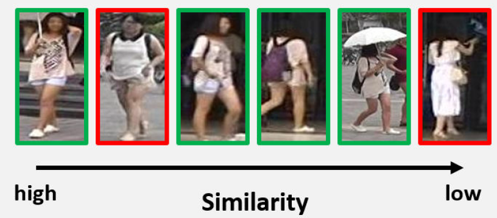
<br>
<div>图1-2 相似度排序</div>
</div>
<br>

&emsp;&emsp;假设 $t= (t_1, t_2, ..., t_m)$ 表示经排序后每张检索行人图片匹配的**第一张**身份相同的候选图片的次序，计算公式可表示为：

$$
Rank-k=\frac{\sum_{i=1}^M{1(t_i\leq{k})}}{M} \tag{1-1}
$$

&emsp;&emsp;其中， $1(·)$ 为指示函数，其值为1时说明输入条件为真，反之为0。

&emsp;&emsp;常采用Rank-1, Rank-5和Rank-10来作为衡量行人重识别模型性能的定量指标。

#### 累计匹配曲线(Cumulative Match Characteristic Curve, CMC)

&emsp;&emsp;CMC曲线以k为横坐标，rank-k进度为纵坐标，通过遍历所有k来绘制曲线。CMC曲线下面积越大，即CMC曲线形状越靠左上，代表行人重识别性能越好。实际应用中常将CMC曲线用于行人重识别算法性能的可视化对比。

#### 平均精度均值(Mean Average Precision, mAP)

&emsp;&emsp;mAP是目标检测、多标签分类和行人重识别测试中常用的评价指标。在Rank-k指标中，只关心第一张正确匹配的正样本的位置，这会导致模型在多目匹配(Multi-Shot)设定下进行评估时，不能全面地反映出所有正样本图片的位置好坏。理想情况下，所有候选集中身份匹配的正样本的排序都应该在最前面。使用mAP可以更好地反应模型的鲁棒性。mAP的计算方式是对所有检索图片的平均精度(Average Precision， AP)求均值。而AP的计算需要额外引入精确率(Precision)指标。

&emsp;&emsp;精确率衡量的是在候选集图片排序后的前k个结果中，与待检索图片 $q_i$ 身份相同的图片的数量占比，公式定义如下:

$$
Prec(k, q_i)=\frac{ {\textstyle \sum_{i=1}^{k}\mathbb{1}(g_i, q_i) } }{k} \tag{1-2}
$$

&emsp;&emsp;其中， $\mathbb{1}(\cdot)$ 为指示函数，当输入的两张行人图像身份相同时输出1，反之输出0。

&emsp;&emsp;平均精度(Average Precision)用于衡量一张检索图片 $q_i$ 在候选集中匹配上每一个身份正样本的精确率的平均。具体而言，假设对于检索图片 $q_i$ ，其在候选集中一共有n张正样本，经过候选集排序后，每个正样本所在的位置为 $k_i|^n_{i=1}$ ，则:

$$
AP(q_i)=\frac{\sum_{i=1}^n{Prec(k, q_i)}}{n} \tag{1-3}
$$

&emsp;&emsp;平均精度均值的计算公式由此可以定义为:

$$
mAP=\frac{ {\textstyle \sum_{i=1}^{M}}AP(q_i) }{M} \tag{1-4}
$$

&emsp;&emsp;**下图直观演示了Rank-k与mAP的计算过程：**

<div align="center">
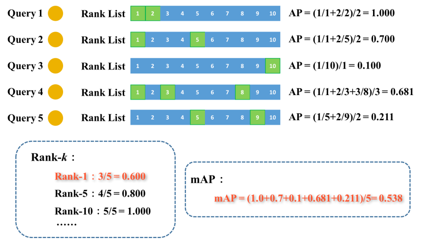
<div>图1-3 Rank-k与mAP计算演示</div>
</div>
<br>

### 1.3 损失函数

&emsp;&emsp;重识别模型在训练阶段通常会使用分类损失（在人物特征之后添加一个全连接层输出分类结果，在推理阶段这个全连接层不会使用，只使用提取的人物特征）和度量损失（通常为Triplet Loss）一起优化同一个feature，分类损失的类别数为训练集中的人物ID数。使用分类损失旨在充分利用行人图像的身份ID标签信息，使得行人特征具有表征能力；度量损失则旨在优化行人特征在特征空间中的分布，减小类内特征距离，增大类间特征距离。

<div align="center">
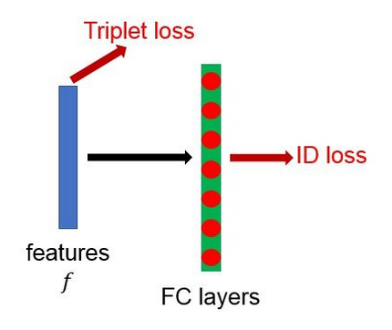
<div>图1-4 训练中损失的联合使用</div>
</div>
<br>

接着以下介绍几个最常用的损失函数。

#### 交叉熵损失函数(Cross-Entropy Loss)

&emsp;&emsp;交叉熵损失函数是分类问题中最常用的优化函数之一，其主要用于度量两个概率分布间的差异性，在训练过程中通过迭代逐步缩小真实概率和预测概率之间的交叉熵值，帮助网络模型进行学习优化。

&emsp;&emsp;在模型训练过程中，给定一张行人输入图像，经过模型运算可以输出响应值 $\{y_1,y_2,...,y_N\}$ ，其中N表示类别数量，我们先利用Softmax函数将其转为概率分布 $\{\hat{y}_1 ,\hat{y}_2,...,\hat{y}_N\}$ （ $y_i$ 分别表示该图片中人物属于第i个行人身份的概率），Softmax函数计算公式如下:

$$
\hat{y}=softmax(y_i)=\frac{e^{y_i}}{ {\textstyle \sum_{j=1}^{N}e^{y_j}} } \tag{1-5}
$$

&emsp;&emsp;假设该图像样本的真实类别标签为 $k\in \{1,2,...N\}$ ，则我们可以根据输出概率计算相应的交叉熵，公式表达为：

$$
\mathscr{L}(\hat{y},k)=- \sum_{j=1}^{N}\mathbb{1}_k(j)log(\hat{y}_j) \tag{1-6}
$$

&emsp;&emsp;其中， $\mathbb{1}_k(j)$ 表示指示函数，当 $j=k$ 时输出1。通过对多个输入样本计算交叉熵并求和，我们便可以批量地对网络模型进行优化。

#### 对比损失函数(Contrastive Loss)

&emsp;&emsp;对比损失函数因可以很好地表示成对数据样本在特征空间的匹配程度，往往被应用于识别和验证任务上。该损失函数的核心思想在于，缩小同类数据在特征空间中距离的同时，实现异类数据相应特征距离的增大。假设 $f_1$ 和 $f_2$ 分别表示两个输入样本 $x_1$ 和 $x_2$ 的图像特征， $y$ 表示识别标签，即 $y=1$ 表示两个输入样本属于同一类别，反之 $y=0$ ，则其公式定义如下:

$$
\mathscr{L}(f_1, f_2, y)=\frac1 2yD^2+\frac1 2(1-y)max(0, m-D)^2 \tag{1-7}
$$

$$
D(f_1,f_2)=\|f_1-f_2\|_2 \tag{1-8}
$$

&emsp;&emsp;其中， $D(f_1, f_2)$ 用于计算两个样本特征间的欧氏距离， $m$ 为设定的阈值，用于约束异类样本使得异类样本间的特征距离要尽可能大（至少大于 $m$ ）。该公式可以很容易地扩展到对于多对样本输入的形式。

&emsp;&emsp;对比损失函数使用了样本间类别关系标签，可以很好地优化类间区分边界。如上所述，行人重识别任务旨在判断两张输入行人图像是否为同一人，与该损失函数的设计思想非常匹配。因此，对比损失函数常被用于行人重识别研究领域中，尤其是在采用了孪生神经网络的双分支识别模型中。

#### 三元组损失函数(Triplet Loss)

&emsp;&emsp;顾名思义，三元组损失函数的输入数据由三个样本组成，其中一个样本我们一般称为锚点，另两个样本分别为对应于锚点的正样本和负样本。与对比损失函数相似，三元组损失函数也旨在特征空间中不断缩小同类样本对（锚点和其正样本）的间距，同时增大其异类样本对（锚点和其负样本）的间距。

<div align="center">
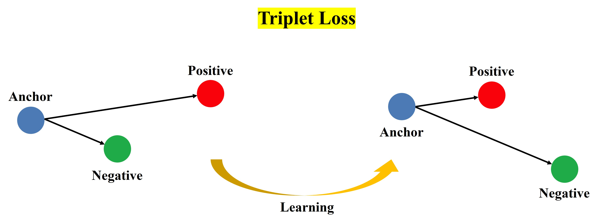
<div>图1-5 Triplet Loss学习</div>
</div>
<br>

&emsp;&emsp;与对比损失函数相比，三元损失函数在一次学习过程中可以同时优化正样本对距离和负样本对距离，因此往往表现出更加优异的类间边界学习性能。假设 $f_a$ 表示锚点样本 $x_a$ 的图像特征，其对应的正样本输入和负样本输入分别为 $x_p$ 和 $x_n$ ，特征分别为 $f_p$ 和 $f_n$ ，则该损失函数的公式定义为：

$$
\mathscr{L} (f_a,f_p,f_n)=max(D^2(f_a,f_p)-D^2(f_a,f_n)+m,0) \tag{1-9}
$$

$$
D(f_i,f_j)=\|f_i-f_j\|_2 \tag{1-10}
$$

&emsp;&emsp;其中， $D(f_i,f_j)$ 为欧氏距离度量，也可采用其他距离度量；m表示设定的阈值，一方面实现对同类数据间距离的约束，即希望该值尽可能小于异类数据间的距离，另一方面也防止特征空间过小。三元组损失函数因其优异的性能被广泛应用于行人重识别、人脸识别等研究领域中，取代了大多数模型中的对比损失函数。

###### *三元组损失函数改进——TriHard Loss*

&emsp;&emsp;三元组损失函数的性能一定程度上依赖于其输入的三元组的构成。如果输入的三元组样本构成的正负样本过于简单，则会不利于学习更好的特征表征，影响模型的泛化能力；如果构成的正负样本过于困难，则会导致模型收敛较慢甚至发散的情况。针对该问题，一系列研究工作改进优化了不同的难例挖掘方法（hard sample mining)。在行人重识别领域中，一个常用的改进方法是**Hermans**等人在2017年提出的**TriHard**损失函数。

> Xiao Q, Luo H, Zhang C. Margin Sample Mining Loss: A Deep Learning Based Method for Person Re-identification[J]. 2017.

&emsp;&emsp;对于一个给定的锚点样本，如果在整个数据中搜索其对应的难例正样本和负样本，一方面会导致找到的难例样本对过于困难而影响模型收敛，另一方面大数据的搜索空间也会严重影响模型的训练速度。因此，**TriHard**方法提出仅在一个批次的数据样本中进行难例挖掘。以行人重识别任务为例，假设一个训练批次的图像组成的集合为 $\{B|card(B)=P\times K\}$ ， $P$ 和 $K$ 分别表示行人身份数量和每个行人对应的图片数量，对于其中任意一张图像 $a\in B$ ，我们可以从集合 $B$ 中构建一个正样本子集 $\{P|N\subset B, card(N)=(P-1)\times K\} $ ，则**TriHard**损失函数可以定义为：

$$
\mathscr{L} \left( \mathbf{B} \right) \frac{1}{\mathbf{P}\times \mathbf{K}}\sum_{\mathbf{a}\in \mathbf{B}}{\max \left( \underset{\mathbf{p}\in \mathbf{P}}{\max}\mathbf{D}\left( \mathbf{a},\mathbf{p} \right) -\underset{\mathbf{n}\in \mathbf{N}}{\min}\mathbf{D}\left( \mathbf{a},\mathbf{n} \right) +\mathbf{m},0 \right)} \tag{1-11}
$$

&emsp;&emsp;其中， $(D(·,·))$ 为距离度量（如欧式，马氏等距离）， $m$ 表示设定的阈值。

&emsp;&emsp;利用**TriHard**损失函数，可以有效地构造包含难例的三元组数据用于网络的特征学习训练，进一步提升模型的鲁棒性。目前，**TriHard**三元组损失函数与**Softmax**交叉熵函数是行人重识别研究领域中最有效也最常用的两个损失函数。

#### 中心损失函数(Center Loss)

&emsp;&emsp;如果说Triplet Loss是为了拉开异类样本的距离，那么Center Loss的目的则在于拉近同类样本到其特征中心的距离。Center loss的公式如下所示:

$$
Lc=\frac{1}{2}\sum_{i=1}^{m}\left \|x_{i}-c_{y_{i}}\right \|_{2}^{2} \tag{1-12}
$$

&emsp;&emsp;其中 $c_{y_{i}}$ 代表样本i所对应类别的所有样本的平均特征(即同类样本特征的中心点)， $x_{i}$ 表示第i个样本提取的特征。由于计算整体样本数量过大，计算某一类别的平均特征很难，因此计算一个mini-batch中某个类别的中心点来近似代表整体类别的中心点，m表示mini-batch的大小。因此这个公式就是希望一个Batch中的每个样本的feature离其特征中心的距离的平方和要越小越好，也就是类内距离要越小越好。一般情况下不会同时使用Center Loss与Triplet Loss，因为可能很难保证两个loss同时收敛，即两个loss很可能会冲突。一般使用较多的是triplet loss与交叉熵损失联合训练。


### 1.4 常见挑战

当前行人重识别领域存在的问题主要归结为以下几个方面:
1. 遮挡问题
2. 不对齐问题
3. 光照问题
4. 视角变换
5. 姿态变换
6. 衣着变换

接下来讲结合图片实例演示简单分析这些问题产生的原因。

#### 遮挡问题
&emsp;&emsp;遮挡问题是行人重识别领域中最容易遇见的问题。由于摄像头中的目标人物被其他物体遮挡，从而导致模型无法有效提取行人的有效特征。演示图如下:

<div align="center">
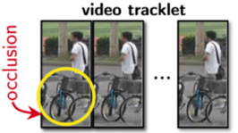
<div>图1-6 遮挡问题</div>
</div>
<br>

&emsp;&emsp;如上图所示，由于行人腿部区域被自行车遮挡，使得模型无法提取行人下半身区域的有效特征

#### 不对齐问题

&emsp;&emsp;不对齐问题发生的原因通常是因为图像在经过行人检测模块后，由于检测框未能较好的框出准确的行人区域，例如有的图像中行人只占很小的一块，而另一块图像中则是行人整个主体。由于不同图片同一区域的特征信息不一致(例如对于图像上半部分应该包含行人的头部信息，然而另一张图片上半部分却只有背景噪声)，这会带来特征不一致问题，从而降低了模型的特征提取能力。演示图如下:

<div align="center">
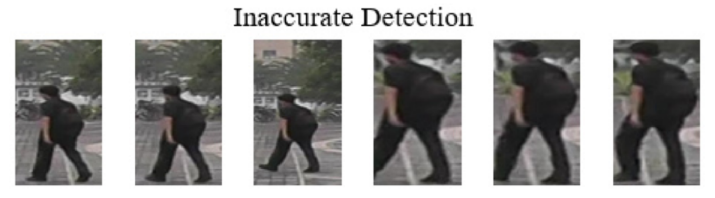
<div>图1-7 不对齐问题</div>
</div>
<br>

#### 光照问题

&emsp;&emsp;由于行人重识别识别了匹配在不同摄像机下的行人身份，因此由于不同摄像机位置不同的问题，拍摄到的行人图片往往具有不同的光照条件，无论是过暗或过亮的场景，都会对模型的特征提取产生干扰。

<div align="center">
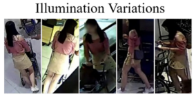
<div>图1-8 不对齐问题</div>
</div>
<br>

#### 视角变换

&emsp;&emsp;视角变换顾名思义指的就是行人在摄像机中出现的角度是在不断变化的。对于同一个身份行人，在摄像机1中可能是正脸，在摄像机2中可能就只是一个侧身，甚至在摄像机3中就只有一个背影。这就给模型的特征匹配带来了困难，因为不同视角的特征差异往往是比较大的，例如模型很有可能将人物1的背影与人物2的背影相匹配。

<div align="center">

<div>图1-9 视角变换问题</div>
</div>
<br>

#### 姿态变换

&emsp;&emsp;姿态变换类似于视角变换，不同摄像头下的行人姿势可能有这很大的差异，例如行走和跑步等等，这些不同的姿态同样可能会对模型的特征匹配造成干扰。

<div align="center">

<div>图1-10 姿态变换问题</div>
</div>
<br>

#### 衣着变换

&emsp;&emsp;由于衣着服饰往往是模型区分不同行人的重要特征，然而在长期时序的背景下，目标人物很可能穿着不同的服饰暴露在不同的摄像机下，由于服饰的变化导致模型对这一部分区域提取的特征失效，从而导致人物匹配失败。

<div align="center">
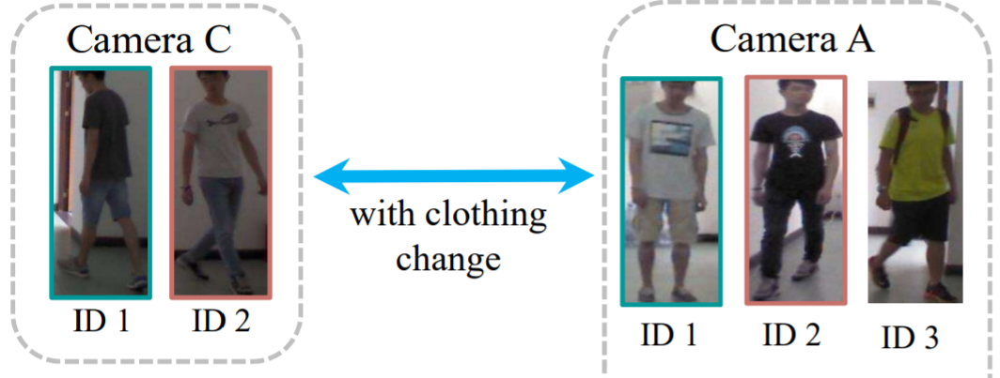
<div>图1-11 衣着变换问题</div>
</div>
<br>

### 1.5 常用方法
> &emsp;&emsp;在这一部分将简单介绍一些行人重识别领域的研究方法,具体的使用过程等细节可以结合后面章节的论文阅读模块一起学习。

#### 水平划分特征

&emsp;&emsp;水平划分特征是最早期的行人重识别领域所广泛采用的方法。一般为将图片输入进骨干网络提取出图像的特征图之后，对特征图进行水平切分，并且在水平切分的特征图上进行平均池化从而得到几个column对应这几个part的特征，通过增强学习这几个part的特征可以使模型去针对不同的人体区域位置学习到不同的特征表示。

&emsp;&emsp;对于行人重识别人物来说，由于不同的part往往对应于不同的人体结构，因此可以认为是融合了人体不同区域这种先验信息，使得模型能够对于人体不同区域分别学到不同的结构性特征和局部特征，这有助于增强模型的特征表示能力。然而这种方法的缺点在于这种水平切分是一种粗糙的切分方式，由于很可能包含大量的背景噪声，可能对模型的特征提取产生干扰。因此可能会需要一种更细粒度的切分方法。

#### 融合姿态关键点

&emsp;&emsp;由于传统的水平划分特征的方法可能会引入大量的背景噪声导致特征学习的困难，研究者们提出同时将图像输入一个姿态关键点网络得到图像中人体的关键点位置信息，从而扣出局部的人体区域，缓解可能存在的背景噪声。与之类似的还有人体解析(Human Parsing)技术。人体解析可以理解成一个图像分割任务，通过得到图像中具体的行人区域边界，这种方式同样可以缓解噪声对模型特征学习带来的干扰。

&emsp;&emsp;采用姿态关键点技术同样可以缓解行人重识别中的遮挡问题，因为姿态关键点模型返回每个关键点的同时，还会返回这个关键点的置信度，然而在行人重识别问题中，如果这个关键点的置信度比较低，我们有很大理由怀疑这个点其实是被其他物体遮挡了的。因此在对模型训练时，可以只对置信度高的区域的特征进行训练。同样的在测试阶段也可以只对置信度高的特征进行拼接，去进行相似度匹配。然而引入姿态关键点模型在给模型带来提点的同时，不可避免地增加了模型的计算开销，因此可能无法适用那些对实时性要求较高的任务。

#### 引入注意力机制

&emsp;&emsp;对于基于图像的行人重识别任务来说，模型会更倾向于关注最显眼最有区分性的特征，因此模型更多的会关注一个人的上半身区域或者一些明显的区域去鉴别行人而忽略一些细微地方的特征，而这样训练出来的模型的鲁棒性是比较低的。比如两张不同身份的行人图片都穿着红色衣服，且体型接近，然而下半身穿着不同颜色的鞋子等，模型可能就不能很好的区分这两个人。因此引入注意力机制，使得模型充分关注到人体的各个区域，防止模型走捷径。

&emsp;&emsp;对于时序特征上来说，例如一个基于视频的行人重识别任务，可以通过在时间这个维度上使用attention机制，为不同时序特征(长，中，短期时序特征)赋予不同的权重，从而自适应调节对不同时序特征的关注程度。

#### 使用3D卷积处理时序信息

&emsp;&emsp;三维卷积通常用于基于视频的行人重识别任务，因为视频与图像的主要区别就在于视频比图像多了一个时间维度。在基于视频的行人重识别任务中，帧与帧之间被认为应该包含着某种语义信息或某种联系，正是这种联系，使得视频的行人重识别拥有比图像重识别更多的特征信息，因为对于同一个人上一秒他可能被一辆车挡住而下一秒就不被车车挡住了，则被遮挡的区域的特征就可以根据上下文的同区域的特征来进行特征增强。因此能够精细去处理视频重识别中的时间维度就显得非常重要。时序信息可以简单的划分为短期时序信息和长期时序信息。在不同的场合下不同的时序信息的重要程度又是不同的，例如对于一个高速运动的物体显然短期时序信息更为重要，因为短期时序信息可以更好地对目标的运动模式进行建模。而对于一个被遮挡的物体长期时序信息就显得更为重要，因为更大的感受野可以使模型跟可能捕捉到目标局部区域未被遮挡的帧，从而对目标提取出有效的特征。3D卷积通过对同时对时间维做卷积，可以同时提取时间特征和空间特征。使用3D卷积往往搭配注意力机制使用，使得对于不同的时序特征分配不同权重，让模型自适应学习特征。3D卷积的问题在于卷积核多了一维会导致参数量的增加，使得计算开销增大。

#### 引入额外辅助信息

&emsp;&emsp;在行人重识别领域，辅助信息通常指的是摄像机id以及视角位置(如果有的话)。通过将这些额外的信息一起送入神经网络学习有助于缓解视角变换，姿态变换等问题。

#### 使用图卷积神经网络

&emsp;&emsp;图卷积网络在行人重识别领域上从2020年开始火热。相比于卷积神经网络，图卷积神经网络的优势在于它的灵活性。通过构建节点间的邻接矩阵，图卷积神经网络可以轻松的配置不同节点之间的相关性，并且用边的权重不断更新节点信息接着用节点信息不断更新边的权重依此循环，往往只需要2-3层的图卷积网络就可以将节点特征在特征空间中很好地实现聚类，即实现了特征的增强。而拉近同类样本的距离拉开异类样本的距离对行人重识别人物是有效的。由于行人重识别其实是一个开集问题，因此能否学到一个良好的特征分布将直接影响到模型的性能。目前的做法通常是将模型首先送入一个骨干网络(通常是Resnet)，然后将网络得到的特征当作是图网络中节点的特征，并通过构造邻接矩阵(自定义或由网络学习)构造一张图，接着使用图神经网络公式进行特征增强。图神经网络公式如下:

$$
H^{(l+1)}=\sigma\left(\tilde{D}^{-\frac{1}{2}} \tilde{A} \tilde{D}^{-\frac{1}{2}} H^{(l)} W^{(l)}\right) \tag{1-13}
$$

&emsp;&emsp;其中 $\tilde{A}$=$A$+$I$,$A$ 是邻阶矩阵， $I$ 是单位阵。 $\tilde{D}$代表$\tilde{A}$ 的度矩阵， $\sigma$ 是非线性激活函数。

#### 使用Transformer网络

&emsp;&emsp;传统的基于CNN的特征提取方法的局限性在于下采样操作非常容易导致细节特征的丢失从而导致匹配的失败。同时卷积核本身存在限制，卷积核的感受野无法实现大范围长距离的特征学习。Transformer结构与CNN不同的是每一层transformer都是对全局的操作，这就解决了CNN感受野失效，降采样丢失细节等问题。Vit模型首次有效实现将transformer应用到图像分类领域。由于Transformer要求接收一连串的序列作为输入，Vit作者提出采用滑动窗口将图片分patch的思想，并将它们拉平，每一个patch的特征等价于一个token，同时作者额外添加了一个分类头token，在经过L层的transformer之后，将添加的分类头token的特征作为图像的全局特征。

&emsp;&emsp;然而Transformer也存在别的问题，例如归纳偏置(先验)问题。由于CNN存在平移不变性，局部相关性等归纳偏置，因此CNN相比于Transformer更好训练。Transformer只有在经过超大规模的数据集上进行预训练之后才能获得优异于基于CNN的模型,例如Resnet。这就会引出另一个问题，即位置编码的问题。通常Transformer模型采用ImageNet21k数据集上的预训练模型，图像大小为224X224。然而当我们在自己的数据集上做精调时，图像大小往往和imagenet的图像大小是不一样的，从而使得预训练模型的位置编码失效。Vit的作者提出使用双线性插值等方法将位置编码大小还原成在imagenet数据集上训练后的位置编码的大小，解决了不同图像大小导致位置编码不能使用的问题。

## 2 行人重识别常用数据集
> &emsp;&emsp;在这一部分将具体介绍行人重识别任务的几个常用数据集。其中基于图像的行人重识别，目前使用比较广泛的数据集有Martket1501,CUHK03以及DukeMTMC-REID等。基于视频的行人重识别，目前使用比较广泛的数据集有MARS,iLIDS-VID,PRID2011等。

### 2.1 Market1501

&emsp;&emsp;Market-1501 数据集在清华大学校园中采集，夏天拍摄，在 2015 年构建并公开。它包括由6个摄像头（其中5个高清摄像头和1个低清摄像头）拍摄到的 1501 个行人、32668 个检测到的行人矩形框。每个行人至少由2个摄像头捕获到，并且在一个摄像头中可能具有多张图像。训练集有 751 人，包含 12,936 张图像，平均每个人有 17.2 张训练数据；测试集有 750 人，包含 19,732 张图像，平均每个人有 26.3 张测试数据。3368 张查询图像的行人检测矩形框是人工绘制的，而Gallery 中的行人检测矩形框则是使用DPM检测器检测得到的。该数据集提供的固定数量的训练集和测试集均可以在Single-Shot或Multi-Shot测试设置下使用

#### 目录结构

Market1501<br>
　　├── bounding_box_test<br>
　　　　　　　├── 0000_c1s1_000151_01.jpg<br>
　　　　　　　├── 0000_c1s1_000376_03.jpg<br>
　　　　　　　├── 0000_c1s1_001051_02.jpg<br>
　　├── bounding_box_train<br>
　　　　　　　├── 0002_c1s1_000451_03.jpg<br>
　　　　　　　├── 0002_c1s1_000551_01.jpg<br>
　　　　　　　├── 0002_c1s1_000801_01.jpg<br>
　　├── gt_bbox<br>
　　　　　　　├── 0001_c1s1_001051_00.jpg<br>
　　　　　　　├── 0001_c1s1_009376_00.jpg<br>
　　　　　　　├── 0001_c2s1_001976_00.jpg<br>
　　├── gt_query<br>
　　　　　　　├── 0001_c1s1_001051_00_good.mat<br>
　　　　　　　├── 0001_c1s1_001051_00_junk.mat<br>
　　├── query<br>
　　　　　　　├── 0001_c1s1_001051_00.jpg<br>
　　　　　　　├── 0001_c2s1_000301_00.jpg<br>
　　　　　　　├── 0001_c3s1_000551_00.jpg<br>
　　└── readme.txt

#### 目录介绍

1） “bounding_box_test”——用于测试集的 750 人，包含 19,732 张图像，前缀为 0000 表示在提取这 750 人的过程中DPM检测错的图（可能与query是同一个人），-1 表示检测出来其他人的图（不在这 750 人中）<br>
2） “bounding_box_train”——用于训练集的 751 人，包含 12,936 张图像<br>
3） “query”——为 750 人在每个摄像头中随机选择一张图像作为query，因此一个人的query最多有 6 个，共有 3,368 张图像<br>
4） “gt_query”——matlab格式，用于判断一个query的哪些图片是好的匹配（同一个人不同摄像头的图像）和不好的匹配（同一个人同一个摄像头的图像或非同一个人的图像）<br>
5） “gt_bbox”——手工标注的bounding box，用于判断DPM检测的bounding box是不是一个好的box

#### 命名规则
以 0001_c1s1_000151_01.jpg 为例<br>
1） 0001 表示每个人的标签编号，从0001到1501；<br>
2） c1 表示第一个摄像头(camera1)，共有6个摄像头；<br>
3） s1 表示第一个录像片段(sequece1)，每个摄像机都有数个录像段；<br>
4） 000151 表示 c1s1 的第000151帧图片，视频帧率25fps；<br>
5） 01 表示 c1s1_001051 这一帧上的第1个检测框，由于采用DPM检测器，对于每一帧上的行人可能会框出好几个bbox。00 表示手工标注框

### 2.2 CUHK03

&emsp;&emsp;CUHK03是第一个足以进行深度学习的大规模行人重识别数据集，该数据集的图像采集于香港中文大学（CUHK）校园。数据以”xxx.mat”的 MAT 文件格式存储，含有 1467 个不同的人物，由 5 对摄像头采集。

#### 目录结构

CUHK-03<br>
　　├── “detected”── 5 x 1 cell<br>
　　　　　　　├── 843x10 cell<br>
　　　　　　　├── 440x10 cell<br>
　　　　　　　├── 77x10 cell<br>
　　　　　　　├── 58x10 cell<br>
　　　　　　　├── 49x10 cell<br>
　　├── “labeled”── 5 x 1 cell<br>
　　　　　　　├── 843x10 cell<br>
　　　　　　　├── 440x10 cell<br>
　　　　　　　├── 77x10 cell<br>
　　　　　　　├── 58x10 cell<br>
　　　　　　　├── 49x10 cell<br>
　　├── “testsets”── 20 x 1 cell<br>
　　　　　　　├── 100 x 2 double matrix

#### 目录介绍

(1)”detected”—— 5 x 1 cells，由机器标注，每个 cell 中包含一对摄像头组采集的照片，如下所示：<br>
&emsp;&emsp;每个摄像头组由 M x 10 cells 组成，M 为行人索引，前 5 列和后 5 列分别来自同一组的不同摄像头。<br>
&emsp;&emsp;cell 内每个元素为一幅 H x W x 3 的行人框图像(uint8 数据类型)，个别图像可能空缺，为空集。<br>
&emsp;&emsp;843x10 cell ——> 摄像头组pair 1。<br>
&emsp;&emsp;440x10 cell ——> 摄像头组pair 2。<br>
&emsp;&emsp;77x10 cell ——> 摄像头组pair 3。<br>
&emsp;&emsp;58x10 cell ——> 摄像头组pair 4。<br>
&emsp;&emsp;49x10 cell ——> 摄像头组pair 5。<br>

(2)”labeled”—— 5 x 1 cells，行人框由人工标注，格式和内容和”detected”相同。

(3)”testsets”—— 20 x 1 cells，测试集，由 20 个 100 x 2 double 类型矩阵组成 (重复二十次)。<br>
&emsp;&emsp;100 x 2 double，100 行代表 100 个测试样本，第 1 列为摄像头 pair 索引，第 2 列为行人索引。

### 2.3 DukeMTMC-REID

&emsp;&emsp;DukeMTMC 数据集是一个大规模标记的多目标多摄像机行人跟踪数据集。它提供了一个由 8 个同步摄像机记录的新型大型高清视频数据集，具有 7,000 多个单摄像机轨迹和超过 2,700 多个独立人物，DukeMTMC-reID 是 DukeMTMC 数据集的行人重识别子集，并且提供了人工标注的Bounding Box。

#### 目录结构
DukeMTMC-reID<br>
　　├── bounding_box_test<br>
　　　　　　　├── 0002_c1_f0044158.jpg<br>
　　　　　　　├── 3761_c6_f0183709.jpg<br>
　　　　　　　├── 7139_c2_f0160815.jpg<br>
　　├── bounding_box_train<br>
　　　　　　　├── 0001_c2_f0046182.jpg<br>
　　　　　　　├── 0008_c3_f0026318.jpg<br>
　　　　　　　├── 7140_c4_f0175988.jpg<br>
　　├── query<br>
　　　　　　　├── 0005_c2_f0046985.jpg<br>
　　　　　　　├── 0023_c4_f0031504.jpg<br>
　　　　　　　├── 7139_c2_f0160575.jpg<br>
　　└── CITATION_DukeMTMC.txt<br>
　　└── CITATION_DukeMTMC-reID.txt<br>
　　└── LICENSE_DukeMTMC.txt<br>
　　└── LICENSE_DukeMTMC-reID.txt<br>
　　└── README.md<br>

#### 目录介绍
从视频中每 120 帧采样一张图像，得到了 36,411 张图像。一共有 1,404 个人出现在大于两个摄像头下，有 408 个人 (distractor ID) 只出现在一个摄像头下。<br>
1） “bounding_box_test”——用于测试集的 702 人，包含 17,661 张图像（随机采样，702 ID + 408 distractor ID）<br>
2） “bounding_box_train”——用于训练集的 702 人，包含 16,522 张图像（随机采样）<br>
3） “query”——为测试集中的 702 人在每个摄像头中随机选择一张图像作为 query，共有 2,228 张图像

#### 命名规则
以 0001_c2_f0046182.jpg 为例<br>
1） 0001 表示每个人的标签编号；<br>
2） c2 表示来自第二个摄像头(camera2)，共有 8 个摄像头；<br>
3） f0046182 表示来自第二个摄像头的第 46182 帧。

### 2.4 Mars
&emsp;&emsp;2016年郑良老师开源Mars（Motion Analysis and Re-identification Set）数据集

&emsp;&emsp;数据集包含三个文件夹，分别为bbox_train，bbox_test以及info文件夹

#### bbox_train

&emsp;&emsp;bbox_train文件夹中，有625个子文件夹（代表着625个行人id），共包含了8298个小段轨迹（tracklets），总共包含509,914张图片。

#### bbox_test

&emsp;&emsp;bbox_test文件夹中共有636个子文件夹（代表着636个行人id），共包含了12180个小段轨迹（tracklets），总共包含681,089张图片。在实验中这个文件夹被划分为图库集（Gallery）+ 查询集（Query）。其中名称为00-1子文件夹表示无用的图片集，他们对应的行人id被设为-1，一般在算法中直接无视pid = -1的图片。而名称0000子文件夹中，他们对应的行人id被设为0，表示干扰因素，对检索准确性产生负面影响。

#### info
info文件夹中包含了5个子文件(train_name.txt,test_name.txt,tracks_train_info.mat,tracks_test_info.mat,query_IDX.mat)，包含了整个数据集的信息，目的是方便使用数据集。

##### train_name.txt文件
这个txt文件里，按照顺序存放bbox_train文件夹里所有图片的名称，一共有509,914行。

<div align="center">

<div>图2-1 Mars训练数据命名方式</div>
</div>
<br>

既然在这里出现了图片名称，就顺带解释下图片的命名规则。以图片名称
0065 C1 T0002 F0016.jpg为例。
0065表示行人的id，也就是 bbox_train文件夹中对应的 0065子文件夹名；
C1表示摄像头的id，说明这张图片是在第1个摄像头下拍摄的（一共有6个摄像头）；
T0002表示关于这个行人视频段中的第2个小段视频（tracklet）；
F0016表示在这张图片是在这个小段视频（tracklet）中的第16帧。在每个小段视频（tracklet）中，帧数从 F0001开始。

##### test_name.txt文件
同样地，在这个txt文件中，按照顺序存放bbox_test文件夹里所有图片的名称，一共有681,089行。

<div align="center">
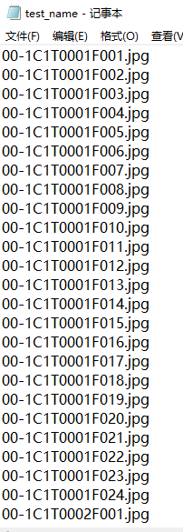
<div>图2-2 Mars测试数据命名方式</div>
</div>
<br>

##### tracks_train_info.mat文件
.mat格式的文件是matlab保存的文件，用matlab打开后可以看到是一个8298 * 4的矩阵。
矩阵每一行代表着一个tracklet；
第一列和第二列代表着图片的序号，这个序号与 train_name.txt文件中的行号一一对应；
第三列是行人的id，也就是 bbox_train文件夹中对应的子文件夹名；
第四列是对应的摄像头id（一共有6个摄像头）。

<div align="center">
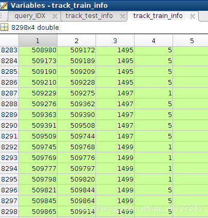
<div>图2-3 Mars训练数据信息</div>
</div>
<br>

##### tracks_test_info.mat文件
这个文件用matlab打开后可以看到是一个12180 * 4的矩阵。
矩阵每一行代表着一个tracklet；
第一列和第二列代表着图片的序号，这个序号与 test_name.txt 文件中的行号一一对应；
第三列是行人的id，也就是 bbox_test文件夹中对应的子文件夹；
第四列是对应的摄像头id（一共有6个摄像头）。

<div align="center">
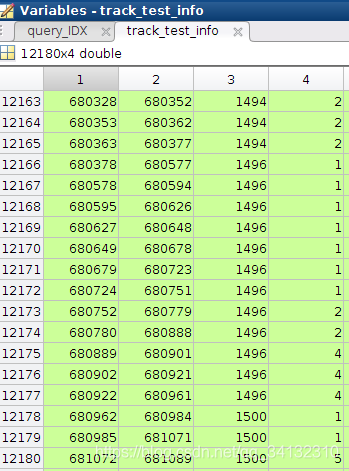
<div>图2-4 Mars测试数据信息</div>
</div>
<br>

##### query_IDX.mat文件
这个文件用matlab打开后可以看到是一个1 * 1980的矩阵，可以看到每一列是对应上面 tracks_test_info.mat文件中的第几行。
比如1978列中的值为12177，对应的是 tracks_test_info.mat文件中的第12177行。
而12177行中，可以看到其id=1496。不难发现同样id=1496的行还有12166, 12167等。其实这说明在 名称为1496子文件夹中，有多个小段视频（tracklet）。
值得注意的是， 并不是所有查询集的id，图库都有对应的相同id行人的行。在1980个查询id中，有效的id（在图库中存在相同id的行）数 = 1840。
也就是说，有些文件夹里只有1个tracklet。

<div align="center">
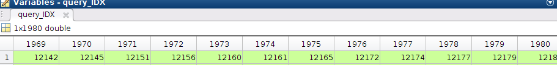
<div>图2-5 Mars查询数据信息</div>
</div>
<br>

## 3 论文介绍
> &emsp;&emsp;在此部分将介绍一些经典或最新的行人重识别领域的论文，论文中的方法基本可以对应1.5章节常用方法中介绍的方法。后续会持续对这一部分的内容做更新。

### 3.1 MGN

论文地址：[Learning Discriminative Features with Multiple Granularities for Person Re-Identification](https://arxiv.org/abs/1804.01438v1)

<div align="center">
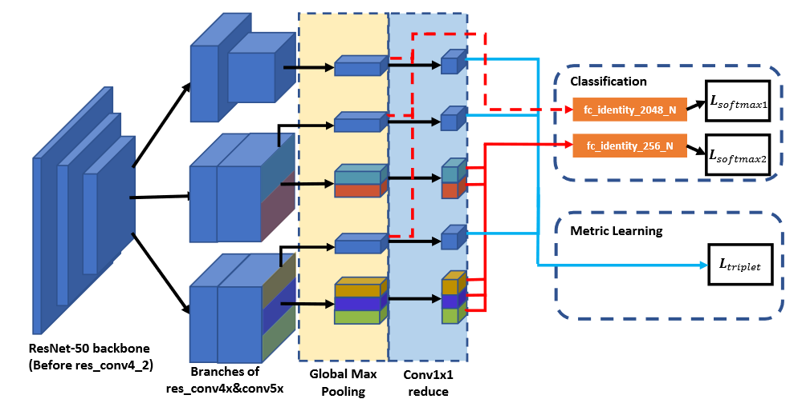
<div>图3-1 MGN模型结构</div>
</div>
<br>

&emsp;&emsp;多粒度(Multiple Granularity Network, MGN)设计了一种多粒度特征融合的行人重识别网络，使不同级别的网络分支分别关注不同粒度的信息。损失函数部分使用了非常常见的Softmax Loss与Triplet Loss。

&emsp;&emsp;局部特征与全局特征融合是人物重识别中普遍使用的一种性能改善方式，在MGN当中，作者将ResNet的前三层用来提取图像的基础特征，在这之后作者设计了3个独立分支来提取高层次的语义级特征。如图所示，第一个分支负责提取整张图片的全局信息；第二个分支将特征图水平裁剪为上下两个部分，提取中粒度的语义信息；第三个分支将特征图水平裁剪为三个部分，提取更细粒度的信息。

&emsp;&emsp;三个分支的最后一层特征会进行一次全局MaxPooling操作，将特征由2048维降为256维，最后256维特征同时计算Softmax Loss（图中红色虚线）和Triplet Loss（图中蓝色实线）。另外，作者将第二分支与第三分支的各个局部特征再进行局部的MaxPooling，用这2048维的特征额外计算一个Softmax Loss（图中红色实线）。

&emsp;&emsp;在推理阶段只需使用256维特征作为行人特征进行比较。

### 3.2 CTL

论文地址: [Spatial-Temporal Correlation and Topology Learning for Person Re-Identification in Videos](https://openaccess.thecvf.com/content/CVPR2021/html/Liu_Spatial-Temporal_Correlation_and_Topology_Learning_for_Person_Re-Identification_in_Videos_CVPR_2021_paper.html)

<div align="center">

<div>图3-2 CTL模型结构</div>
</div>
<br>

&emsp;&emsp;CTL模型融合了姿态关键点，图卷积等网络，任务是基于视频的人物重识别。损失函数除了使用了ID Loss与Triplet loss外，作者还设计了Loss名为Div Loss

&emsp;&emsp;首先图片不但会送入一个骨干网络(resnet50)提取特征，还会同时送入一个姿态关键点网络，获得一组热力图，分别代表每一张图片不同的关键点位置信息。将热力图与特征相乘就可以得到不同part的特征。通过将这些part的特征继续聚合作者最终得到三粒度的特征图。将骨干网络提取出的特征作为图网络中节点的特征，并在context block模块初始化邻接矩阵，这样就构建出了图网络，后面经过正常的图网络的消息传递机制进行节点的特征增强即可。由于对于不同的粒度都构建了各自的图网络，因此在cross-scale模块进行图网络不同粒度下特征的融合。最后将三个层级粒度的图的特征融合到最低层级粒度的图上。

&emsp;&emsp;作者额外设计了名为Div Loss的损失，是为了增强局部特征之间的多样性从而增强模型的特征表示能力。Div Loss损失函数如下表示:

$$
\mathcal{L}_{d i v}=\left\|\boldsymbol{V}_{p} \boldsymbol{V}_{p}^{T}-\boldsymbol{I}\right\|_{F}^{2} \tag{3-1}
$$

&emsp;&emsp;其中 ${V}_{p}$ 代表局部特征

### 3.3 BiCnet

论文地址: [BiCnet-TKS: Learning Efficient Spatial-Temporal Representation for Video Person Re-Identification](https://openaccess.thecvf.com/content/CVPR2021/html/Hou_BiCnet-TKS_Learning_Efficient_Spatial-Temporal_Representation_for_Video_Person_Re-Identification_CVPR_2021_paper.html)

<div align="center">
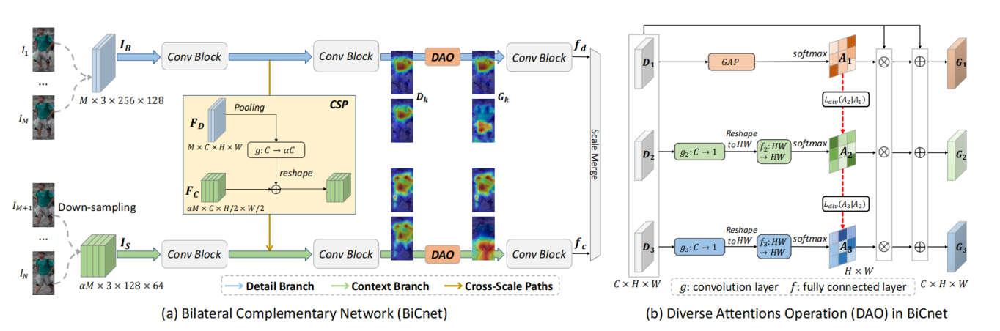
<div>图3-3 BiCnet模型结构</div>
</div>
<br>

&emsp;&emsp;Bicnet模型只使用了3D卷积实现的resnet网络并在网络中插入了attention机制，模型简单，是一种轻量级的网络，因此所需要的算力很少。另外作者设计了Loss名为Div Loss来扩大注意力图之间的多样性使得模型关注到更多的区域。

&emsp;&emsp;模型分为上下两个分支，不同的分支采用不同的分辨率，上部分为高分辨率，下部分为低分辨率。高分辨率部分主要负责提取图像的空间特征，而低分辨率部分则主要负责提取图片间的上下文信息。在CSP模块中将高分辨率分支提取出的特征信息送入低分辨率分支，使得低分辨率分支能够专注于提取输入图片的上下文信息。通过3D-CNN的方式同时处理图像的时间，大小三个维度，并且针对时间维度采用空洞卷积的方式在不增加参数量大小的情况下构建了不同大小的感受野从而可以实现针对不同的时序信息进行建模。为了使模型更多的关注到行人不同的区域特征，设计了DAO模块负责对特征图计算不同位置的注意力，如图3-3-b所示。最上部分表示全局注意力，下面两个分支使模型关注于人体上下两个区域，同时设计了Div Loss去计算注意力图之间的相关性，通过拉低注意力图间的相关性迫使模型学习到不同位置的注意力图，从而实现对图像不同位置的特征提取

&emsp;&emsp;Div Loss表达式如下:

$$
L_{\operatorname{div}}\left(A_{k} \mid A_{l}\right)=1-\operatorname{sim}\left(A_{k}, A_{l}\right) \tag{3-2}
$$

&emsp;&emsp;测试时直接使用模型提取出的2048维特征进行相似度计算。

### 3.4 TransReid

论文地址: [TransReID: Transformer-based Object Re-Identification](https://arxiv.org/abs/2102.04378)

<div align="center">
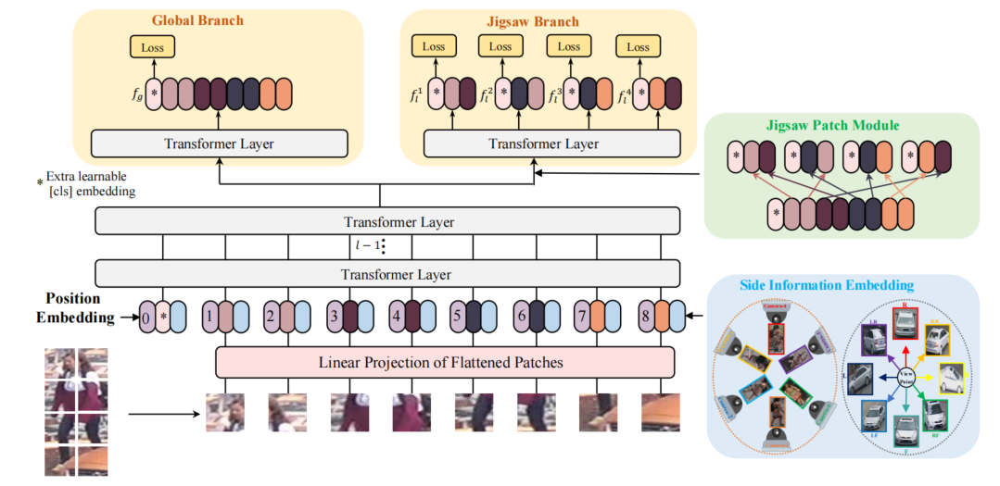
<div>图3-4 TransReid模型结构</div>
</div>
<br>

&emsp;&emsp;模型TransReid是第一个使用纯Transformer进行行人重识别任务的研究，且在行人和车辆重识别任务上表现均达到sota。损失函数只使用了经典的ID Loss以及Triplet Loss。

&emsp;&emsp;由于Transformer要求接收一个序列，因此需要将二维的图像拉伸成一维的序列。模型通过滑动窗口生成重叠图像块，由于滑动窗口中的步长S小于窗口大小P，使得块与块之间拥有一定的重合部分，这一点与Vit是不同的。这个小trick消除了原始Vit中无重叠图像块采样导致的分块丢失临近结构信息的问题。重叠图像块的生成公式如下公式所示:

$$
\mathrm{N}=\left \lfloor \frac{\mathrm{H}+\mathrm{S}-\mathrm{P}}{\mathrm{S}}\right\rfloor \times \left \lfloor \frac{\mathrm{W}+\mathrm{S}-\mathrm{P}}{\mathrm{S}}\right\rfloor \tag{3-3}
$$

&emsp;&emsp;其中S代表滑动窗口步长，P代表patch块的大小，当S小于P时，生成重叠的图像块，S越小重叠的图像块越多，理论上来说块越多可以得到更好的性能，然而这会带来计算能力的增加。作者创新地提出了JPM模块与SIE模块。SIE模块相当于是辅助信息，例如图像的Camera ID信息或是视角信息。通过将这些先验信息在输入时嵌入输入Patch的编码，缓解了不同Camera或不同相机视角带来的图像域偏差，从而提高模型性能。JPM模块则设置在Transformer层的最后一层之前，首先将不同token做分组操作，分成K个组，接着对每一个组进行偏移和打乱操作，使得每一个组都能关注到全局中其他Patch的信息。

&emsp;&emsp;模型整体的损失函数表达式如下所示:

$$
\mathcal{L}=\mathcal{L}_{I D}\left(f_{g}\right)+\mathcal{L}_{T}\left(f_{g}\right)+\frac{1}{k} \sum_{j=1}^{k}\left(\mathcal{L}_{I D}\left(f_{l}^{j}\right)+\mathcal{L}_{T}\left(f_{l}^{j}\right)\right) \tag{3-4}
$$

&emsp;&emsp;其中 $f_g$ 代表全局分支得到的特征， $f_{l}^{j}$ 则代表不同part的局部特征。在模型的测试阶段，则直接将全局特征与局部特征进行简单的拼接进行相似度计算。

### 3.5 PFD

论文地址: [Pose-guided Feature Disentangling for Occluded Person Re-identification Based on Transformer](https://arxiv.org/abs/2112.02466)

<div align="center">
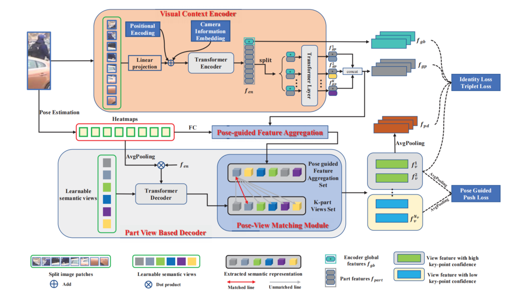
<div>图3-5 PFD模型结构</div>
</div>
<BR>

&emsp;&emsp;模型PFD同样也采用了Transformer结构，且融合使用了姿态关键点模型，在遮挡的DUKE等数据集上取得了巨大的提点。

&emsp;&emsp;模型主体分为两个架构，Encoder部分与Decoder部分。对于输入的行人图像，在进行分Patch的同时，也送入姿态估计模型获取行人图像的姿态关键点。分Patch操作与TransReid中的分Patch操作相同。在Encoder阶段，PFD模型也类似于Transreid模型，得到图像的全局特征以及K个Part的特征。接着将姿态关键点的热力图点乘Concatenate全局特征后的局部特征，相当于是对姿态关键点的局部特征进行特征增强，且将置信度信息同时融合进这个Part中，这些增强了的特征被放进Pose guided Feature Aggregation Set中被用作后面Pose-view Matching Module里的候选集。在Decoder阶段，首先初始化v个可学习的语义块，结合Encoder得到的特征与交叉注意力机制(cross-attention)对v个语义块进行特征学习。在Pose-view Matching Module模块中根据预先相似度匹配v个语义块。采用余弦相似度的匹配方法分别如下两个公式所示:

$$
k=\underset{j}{\arg \max }\left(\frac{\left\langle v_{i}, S_{j}\right\rangle}{\left\|v_{i}\right\|\left\|S_{j}\right\|}\right) \tag{3-5}
$$

$$
f_{v}^{i}=v_{i}+S_{k} \tag{3-6}
$$

&emsp;&emsp;公式含义即,在Pose Guided Feature Aggregation Set的K个候选集中针对v个语义块的每一块找出其最相近的Part的特征(来自Encoder)，并加上这部分特征。由于姿态关键点模型返回的置信度可以用来判定当前位置是否是被遮挡区域且候选集中的特征包含这些置信度信息，从而可以将v个语义块分为两部分，分别是未遮挡部分特征以及遮挡部分特征。

&emsp;&emsp;作者设计了Push Loss用于拉开遮挡部分特征与未遮挡部分特征的差异，因为我们认为被遮挡的区域特征和行人特征是非常不同的。Push Loss的公式如下:

$$
\mathcal{L}_{p}=\frac{1}{B} \sum_{i}^{B} \frac{\left\langle f_{p h}^{i}, f_{p l}^{i}\right\rangle}{\left\|f_{p h}^{i}\right\|\left\|f_{p l}^{i}\right\|} \tag{3-7}
$$

&emsp;&emsp;其中 $B$ 代表Batch_Size大小，由于采用余弦相似度公式，则遮挡部分特征与未遮挡部分特征越相似Loss就越大。

&emsp;&emsp;作者通过ID loss以及Triplet loss对Encoder和Decoder的特征(不含未遮挡区域)的联合训练，大大提高了模型的拟合能力。值得注意的是被遮挡部分区域的特征不会被送入ID loss以及Triplet loss中训练。在模型的测试阶段，将Encoder的全局特征，局部特征以及Decoder的未被遮挡部分区域的特征进行拼接，用来进行相似度计算。模型总体Loss表达式如下:

$$
\begin{aligned}
\mathcal{L}_{d e} &=\mathcal{L}_{i d}\left(\mathcal{P}\left(f_{p h}\right)\right)+\frac{1}{L} \sum_{i=1}^{L} \mathcal{L}_{i d}\left(\mathcal{P}\left(f_{h}^{i}\right)\right) +\mathcal{L}_{t r i}\left(f_{p h}\right)+\frac{1}{L} \sum_{i=1}^{L} \mathcal{L}_{t r i}\left(f_{h}^{i}\right)
\end{aligned} \tag{3-8}
$$

