# 2D人体姿态估计

## 1 基础知识
> &emsp;&emsp;人体姿态估计是计算机视觉领域的一个重要分支，该任务将图像或视频中的人体实例建模为骨架图的形式，充分利用了人体信息，有着广泛的应用前景，在虚拟现实，电影动画，医疗康复等领域都起着重要的作用。

### 1.1 任务定义

&emsp;&emsp;人体姿态估计是根据图像或者视频作为输入数据来定位人体关节点位置或者空间位置并构建人体骨架图的过程。人体姿态估计根据预测的关节点位置坐标维度有2D人体姿态估计和3D人体姿态估计之分。

&emsp;&emsp;**2D人体姿态估计**

&emsp;&emsp;在像素级别上从图像或者视频帧中预测人体关节点的2D位置，包括X和Y两个维度。其示意图如图1-1 2D人体姿态估计示意图所示。

<div align="center">
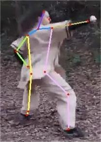


<div>图1-1 2D人体姿态估计示意图</div>
</div>

&emsp;&emsp;**3D人体姿态估计**

&emsp;&emsp;大部分3D人体姿态估计任务使用视频作为输入，预测人体实例关节点的三维空间排列，在X和Y的维度基础上增加了Z维度。其示意图如图1-2 3D人体姿态估计示意图所示。

<div align="center">
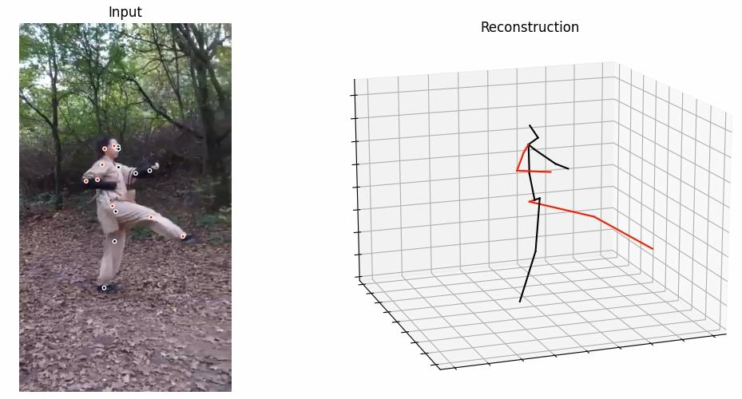


<div>图1-2 3D人体姿态估计示意图</div>

</div>

### 1.2 评价指标
&emsp;&emsp;**正确关节点占比(Percentage of Correct Keypoints，PCK)**

&emsp;&emsp;PCK是一种常见的用来衡量在给定阈值内不同关节点定位精度的指标。若阈值设置为每个人头部段长度的50%，则记为PCKh@0.5，当阈值设置为躯干直径的0.2倍时，记为 PCK@0.2。PCK指标计算检测到的关节点和对应的标签间的归一化距离小于设定阈值的比例，数值越高，模型性能越好。

&emsp;&emsp;**目标关节点相似度(Object Keypoint Similarity，OKS)**

&emsp;&emsp;OKS是目前常用的人体关节点检测算法的评价指标，在欧式距离的基础上引入了尺度因子，目的是为了计算真实标签和预测的关节点的相似度。计算方式如公式1-1所示：

$$OKS_p =\frac{\sum_i exp(-d^2_{pi}/2S^2_p\sigma^2_i)\delta(\nu_{pi}>0)}{\sum_i\delta(\nu_{pi}>0)}\ \tag{1-1}$$

&emsp;&emsp;公式中参数的含义如下：

&emsp;&emsp;p：当前图片标签中id为p的行人，p在0在M之间，M表示当前图中行人的总数。

&emsp;&emsp;i：id为i的关节点。

&emsp;&emsp;$d_{pi}$：表示在标签中存在的行人中id为p的人其关键点i与检测出的关键点i的之间的欧几里得距离。

&emsp;&emsp;$S_p$：尺度因子，值等于相应的行人检测框面积的平方根。

&emsp;&emsp;$\sigma_i$：id为i的关节点归一化因子，所有的样本集中的各类关节点标签由于人工标注与真实值存在标准差，关节点归一化因子便与其有关，$\sigma$越大表示此类型的关节点越难标注。例如，对COCO数据集中5000个样本进行统计，可以得到17类关节点的归一化因子，取值可以为{鼻子：0.026，眼睛：0.025，耳朵：0.035，肩膀：0.079，手肘：0.072，手腕：0.062，臀部：0.107，膝盖：0.087，脚踝：0.089}，该值可以看作常数，但使用的类型仅限于这个集合里面，如果使用的关节点类型不在此当中，可以使用另外一种统计方法计算此值。

&emsp;&emsp;$\nu_{pi}$：表示关节点标签中id为p的行人第i个关节点的可见性，其中$\nu_{pi}$=0表示关节点未标记，可能的原因是图片中不存在，或者不确定在哪，$\nu_{pi}$ =1表示关节点无遮挡并且已经标注，$\nu_{pi}$ =2表示关节点有遮挡但已标注。同样，预测的关节点有两个属性：$\nu_{pi}'$ =0表示未预测出，$\nu_{pi}'$=1表示预测出。$\delta(\*)$：表示如果条件*成立，则值为1，否则为0，这里表示仅计算标签中已标注的关节点的OKS。

&emsp;&emsp;**平均精度(Average Precision， AP)**

&emsp;&emsp;AP和AR是目标检测、多标签分类等任务中常用的评价指标。AP也可以用于计算姿态估计模型在测试集上的精度，单人姿态估计和多人姿态估计的计算方式稍有不同。

&emsp;&emsp;单人姿态估计中，进行姿态估计后可以得到一组关节点，计算真实标签与预测出的关节点的相似度，然后根据给出的阈值T，可以计算其平均精度值，计算方式如公式1-2所示：

$$AP=\frac{\sum_p\delta(oks_p>T)}{\sum_p1}\ \tag{1-2}$$

&emsp;&emsp;多人姿态估计可以通过自顶向下的方法和自底向上的方法来实现，如果通过自顶向下的方法来实现，则与单人姿态估计AP计算方式一样，如果采用自底向上的方法实现，则可以假设一张图片中共有M个人，预测出N个人，由于不知道预测出的N个人与标签中的M个人的一一对应关系，因此需要计算标签中每一个人与预测出的N个人的关节点相似度，可以获得一个大小为M × N的矩阵，矩阵每一行为标签中的一个人与预测结果的N个人的关节点像低俗，找出每一行中最大的值作为该标签中的人的oks值，根据给出的阈值T，可以计算出所图像中的多人姿态估计AP，计算方式如公式1-3所示：

$$AP=\frac{\sum_m\sum_p\delta(oks_p>T)}{\sum_m\sum_p1}\ \tag{1-3}$$

&emsp;&emsp;姿态估计常用的评估指标中还有AP的一些变体，下面将对一些常用的AP指标的变体进行说明。在此之前，需要明确的是，oks=0.5表示T取0.5，即oks大于0.5时，$\delta(*)$才取1。

&emsp;&emsp;AP：在姿态估计中，AP相当于$AP^{oks=0.50:0.05:0.95}$，表示从oks=0.50开始，每次递增0.05，一直到0.95为止，对中间所有的oks取平均值。

&emsp;&emsp;$AP^{50}$和$AP^{75}$：分别相当于$AP^{oks=50}$和$AP^{oks=75}$。

&emsp;&emsp;$AP^S$、$AP^M$、$AP^L$：表示数据集中小目标，中等目标，大目标的AP值。在数据集中，根据目标所占区域的大小区分了小目标，中等目标和大目标，其中对于小目标，其面积$area<32^2$，对于大目标，其面积$area>96^2$，中等目标面积处于大小目标面积之间。

&emsp;&emsp;**平均召回率(Average Recall，AR)**

&emsp;&emsp;由表1-1 二分类任务中样例类别划分表可知真正例，假反例，假正例，真反例的含义，召回率（Recall）主要反映出来的是预测结果中的漏检率，其计算方式如公式1-4所示。

$$R=\frac{TP}{TP+FN}\ \tag{1-4}$$

&emsp;&emsp;在姿态估计任务中，正样本即为目标关节点相似度大于给定阈值T的样本。常用的AR相关指标有$AR^{50}$，$AR^{75}$和$AR^S$、$AR^M$、$AR^L$，其含义和相应的AP指标含义一致，此处不再赘述。

<div align="center">

|          |      | 真实标签  | 真实标签  |
| -------- | ---- | ----- | ----- |
|          |      | 正样本   | 负样本   |
| **预测结果** | 正样本  | 真正例TP | 假反例FP |
| **预测结果** | 负样本  | 假正例FN | 真反例TN |

<center>表1-1 二分类任务中样例类别划分表</center>

</div>

### 1.3 任务难点

&emsp;&emsp;虽然目前人体姿态估计算法精度较高，但仍存在一些难点：

* **姿态灵活多变**
  由于人体具有相当的灵活性，人体任何一个部位的微小变化都会产生一种新的姿态，复杂且相互依赖的关节和高度自由的肢体可能导致罕见复杂的姿态，如图1-3 复杂姿态示意图所示。目前的方法对常见动作的估计效果较好，但对复杂和幅度较大的动作估计精度并不高。

  <div align="center">
  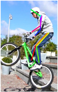
  
  
  <div>图1-3 复杂姿态示意图</div>
  
  </div>
* **环境视角多变**

  一方面受遮挡、光照、雾等环境的影响，关节点的可辨识度较差，如图1-4 强光照例图所示，这种情况就容易导致漏检和误检。

  <div align="center">
  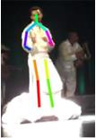


  <div>图1-4 强光照射例图</div>

  </div>
  另一方面由于拍摄角度的变化，可能导致人体部位存在自遮挡的情况，如图1-5 拍摄角度带来的自遮挡所示，因此给相应图片的姿态估计带来困难。

  <div align="center">
  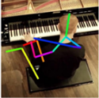


  <div>图1-5 拍摄角度带来的自遮挡例图</div>

  </div>

  在一些复杂背景下，姿态估计算法性能也会受到一定的影响，如图1-6 复杂背景影响例图所示。

  <div align="center">
  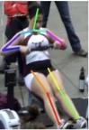


  <div>图1-6 复杂背景影响例图</div>

  </div>

* **遮挡**

  一方面，在复杂的环境场景下，可能会存在前景遮挡的情况，例如图1-7 前景遮挡示意图所示，人体右膝盖和右脚脚踝关节点被遮挡。

  <div align="center">
  


  <div>图1-7 前景遮挡示意图</div>

  </div>

  另一方面，在人体实例较多的情况下，如图1-8 不同个体互相遮挡示意图所示，不同个体之间也可能存在一定的遮挡，对姿态估计算法准确性也会造成一定的影响。

  <div align="center">
  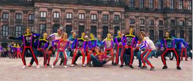


  <div>图1-8 不同个体互相遮挡示意图</div>

  </div>

* **训练数据不足**
  目前，2D人体姿态识别在数据集方面比3D人体姿态估计成熟，2D数据集中包含很多户外，自然环境下的数据，但是3D数据集几乎都是在室内通过动作捕捉设备，制作成本高并且相对匮乏，虽然可以融合人体模型与背景环境来合成数据，但是合成场景还是难以完全模拟真实的室外环境。另一方面，由于动作捕捉设备的限制，数据集中多是肢体运动幅度不大，速度不快的日常动作，缺少较为复杂的动作。


### 1.4 应用场景

&emsp;&emsp;人体姿态估计课题的发展已经越来越贴近实际，有着广泛的应用前景，在虚拟现实，人机交互，医疗康复，自动驾驶，运动分析等领域都有重要的应用场景。

* **虚拟现实**

  虚拟现实技术可以应用在很多领域中，例如教育和娱乐，人体姿态估计技术可以进加强人与虚拟世界的关系，增强互动体验。

* **人机交互**

  人体姿态估计可以帮助机器人更好的理解人的位置和行为，变得更加智能。
* **医疗康复**

  人体姿态估计可以为医生提供病人的运动信息，用于康复训练和物理治疗。
* **自动驾驶**

  人体姿态估计技术可以帮助汽车对行人的运动有一定的了解，从而做出正确的反应。
* **运动分析**

  通过对人体连续的姿态进行估计，可以对其运动进行分析。例如对体育视频中运动员的姿势进行估计，可以得到其各项指标的统计分数，获取动作细节，从而做出更客观的评价。


## 2 方法论
> &emsp;&emsp;人体姿态估计可以通过传统方法和基于深度学习的方法来实现。传统方法一般是基于图结构和形变部件模型，设计2D人体部件检测器，使用图模型建立各部件的连通性，并结合人体运动学的相关约束不断优化图结构模型来估计人体姿态 [1]。传统方法使用的部件模型结构单一并且无法充分利用图像信息，有很大的限制。基于深度学习的神经网络有着强大的信息提取能力，从2014年Deeppose被提出后，其在人体姿态估计领域取得了丰富的成果。

### 2.1 算法框架
&emsp;&emsp;总体上，基于深度学习的人体姿态估计方法从单人发展到多人，由2D发展到3D，本章所述模型以及相关论文的介绍主要以基于深度学习的2D多人姿态估计方法为主。

&emsp;&emsp;2D多人姿态估计目的是得到图像或者视频帧中人体关节点的2D坐标并按照人体骨架结构进行连接，由于人体姿态复杂多变，直接回归关节点坐标的方式很难得到精确的关节点坐标，同时直接回归关节点坐标的方式也没有利用人体结构信息，在对尺度多变的人体进行姿态估计时泛化性能较差。目前模型大部分采用热图检测的形式来实现人体姿态估计，相较于直接回归关节点坐标，构建了基于概率分布的标签热图，具有更好的性能，本章所述模型介绍以及相关论文的介绍，将以热图检测的方法为主。

&emsp;&emsp;2D的多人姿态估计方法主要分为两大类，一类是自底向上（Bottom-up）的方法，先将图中所有的关节点检测出来，再进行聚类根据实例将关节点进行划分；另一类方法是自顶向下（Top-down）的方法，先通过目标检测算法将每一个实例个体识别出来，然后针对单个人进行姿态估计。

&emsp;&emsp;不同于上述两种两阶段实现姿态估计的方法，CenterNet将两种方式进行结合，一阶段实现了多人姿态估计。同时CenterNet还将回归关节点坐标和热图检测的方式进行了结合，进一步提高了姿态估计的准确性。

### 2.2 2D多人姿态估计方法模型简介

&emsp;&emsp;2D多人姿态估计相关数据集给出的标签均为关节点坐标，而现在的模型方法大多采用热图检测的方式来实现，所以实现2D多人姿态估计通常包括三个流程，即预处理阶段，主要包括利用关节点坐标生成目标热图，图像预处理；网络预测阶段，将第一阶段得到的结果输入到网络中预测其相应的输出；后处理阶段，根据网络预测得到的热图得到关节点坐标。接下来也将逐阶段进行介绍。

#### 预处理阶段

&emsp;&emsp;该步骤利用关节点的真实坐标生成目标热图，并进行图像的预处理。图像的预处理包括翻转，旋转等数据增强基本方法，最后采用仿射变换将图像转化为网络要求的输入大小。

&emsp;&emsp;**1.目标热图的生成**

&emsp;&emsp;基于概率值的热图中每个值代表了该点为真实关节点的概率，在转化过程中，首先根据网络的下采样率（一般为4）计算出对应分辨率下的真实坐标并取整，然后在真实的关节点坐标处应用均值为1 的高斯分布，其公式如公式2-1所示，其中$(p_x,p_y)$表示真实坐标值，$\sigma_p$表示标准差。

$$Y_{truth}=exp(-\frac{(x-p_x)^2+(y-p_y)^2}{2\sigma^2_p})\ \tag{2-1}$$

&emsp;&emsp;真实关节点处像素点的值为1，其周围像素点的值随着距离真实关节点的距离增大而变小。若某一像素点落在了超过一个高斯分布区域中，即存在多个可能的值，则取最大值。在实际中，为了适应人体实例多尺度的变化，也有采用自适应方差的工作。

&emsp;&emsp;**2.数据增强**

&emsp;&emsp;数据增强一般包含随机旋转，随机尺度变换和翻转操作。随机旋转角度大部分在([−45&deg;, 45&deg;])；随机尺度变换即改变输入图像的分辨率大小，一般采用[0.65, 1.35]的尺度因子进行变换。

#### 网络预测阶段

&emsp;&emsp;该步骤将预处理后的图像输入到选定的模型中，得到最终的预测结果。主要有自底向上，自顶向下以及一阶段的实现方式。

1. **自底向上**

   &emsp;&emsp;算法首先检测出图像中所有的关节点，然后对检测出的关节点进行聚类，属于同一个人的关节点属于同一类别，在对个体关节点进行分配后，构建最终的姿态表示。其算法流程如图2-1 自底向上算法流程图所示。

   <div align="center">
   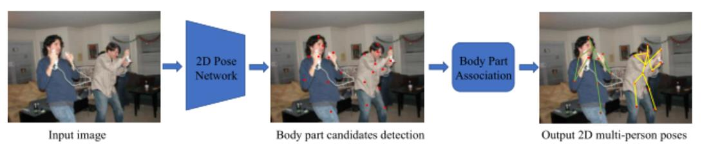


   <div>图2-1 自底向上算法流程图</div>

   </div>

   &emsp;&emsp;如何精确高效的对检测出的关节点进行聚类是自底向上方法中一个重要的部分，到目前为止，已经提出了多种多样的聚类方法，例如HGG, associative embedding等。

   &emsp;&emsp;自底向上的方法将时间性能和图像中人的数量进行了解耦，大大提升了算法的时间效率，例如openpose在实时姿态估计任务中表现优秀；同时不依赖于目标检测算法，使得该方法对处理存在较多重叠的拥挤场景也有着更大的潜力。但目前为止，自底向上的方法准确率相较于自顶向下的方法普遍较低。

2. **自顶向下**

   &emsp;&emsp;自顶向下的多人姿态估计方法首先利用目标检测算法检测出图像中所有的人，然后根据单人姿态估计方法对检测出的每一个人的部分分别进行单人的姿态估计，最终结合预测出的所有实例的关节点得到整幅图像的姿态估计结果。其算法流程如图2-2 自顶向下算法流程图所示。

   <div align="center">
   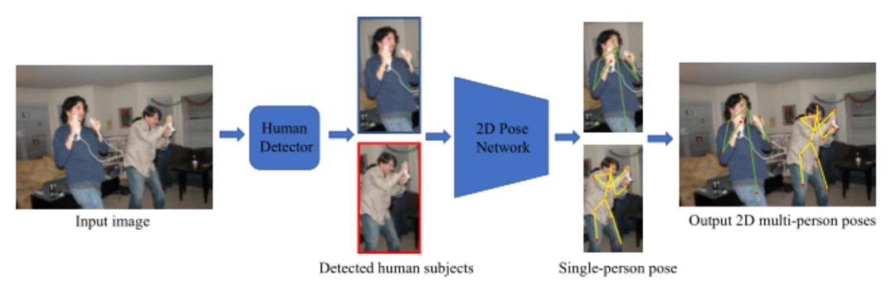


   <div>图2-2 自顶向下算法流程图</div>

   </div>

   &emsp;&emsp;第一阶段目标检测的结果直接关系到最终姿态估计的效果，所以有算法致力于改进检测框筛选算法，例如使用soft NMS代替NMS等。另一方面在网络结构的改进上也有许多优秀的研究成果，例如HRNet网络在整个过程中都保持着高分辨率的图像信息，极大的提升了姿态估计的性能。

   &emsp;&emsp;自顶向下的方法在设计思路上比较直观自然，由于单人姿态估计比较成熟，根据可靠的检测结果进行单人姿态估计可以达到非常高的精度。但随着图像中人数的增加，不可避免地会出现更多重叠的情况，检测时就会更容易出现漏检，重检，误检等情况，进而影响整个算法的效果；另外对每个检测出的实例都需要进行单人的姿态估计，图像中的人数多少和对其进行姿态估计所需的时间有很大的关系，随着图像中人数的增加，时间效率不可避免会变低。

3. **一阶段实现方式**

   &emsp;&emsp;目前为止的一阶段实现方式较少，具有代表性的就是CenterNet，该方法将每个实例简化为点，得到中心点的坐标，各关节点相对于中心点的位移，即可计算出关节点位置，同时结合各关节点的热图，与预测出的关节点坐标进行匹配进一步提高精度。根据网络得到的中心点坐标以及检测框的长和宽，就可以得到实例的检测框。该方法将在论文介绍部分进行详述。

#### 后处理阶段

&emsp;&emsp;所有在第二阶段网络预测得到热图的方法均需要进行后处理得到预测的关节点坐标。在网络预测阶段，对于每一类关节点，会得到一张热图，即数据集定义了K种关节点，网络会输出K张热图。每张热图执行相同的计算得到该类关节点的位置。

&emsp;&emsp;首先将每张热图的形状改变，变为一维向量；根据实例个数的限制取图中最大的k个值，值解释为该点为关节点的概率，即置信度，同时记下每个值在向量中的位置index。在大部分自底向上的算法中，实例个数阈值设为30，而在自顶向下的算法中，进行单人姿态估计，阈值固定为1；根据相应的置信度要求，删去低于置信度阈值的点；最后剩下的点根据其index值除以热图的宽取整，取余即可得到该点在热图中的位置。

&emsp;&emsp;从输入图像到热图之间经过下采样操作不可避免存在偏移误差，即关节点位置取整带来的误差，在将关节点位置映射到输入图像时，有的模型或方法采用最高值向次高值方向偏移0.25个像素值来减小偏移误差。最后将坐标乘以下采样率即可得到预测关节点在原图中对应的坐标位置。


## 3 论文介绍
> &emsp;&emsp;自2014Deeppose被提出以来，有许多基于深度学习的姿态估计方法，其中不乏优秀的方法。本节将选取2D多人姿态估计中具有代表性的方法，对其论文和模型进行概括和综述。
### 3.1 HRNet

论文地址：[Deep High-Resolution Representation Learning for Human Pose Estimation](https://arxiv.org/pdf/1902.09212)

#### 论文概述

&emsp;&emsp;HRNet是目前为止姿态估计任务中最常用的网络结构之一，在多个2D姿态估计和3D姿态估计模型中都发挥着重要的作用。在网络预测的整个过程中都保持着高分辨率的表征，网络采用了多分支的结构，每个分支的特征图分辨率在整个过程中都保持不变，多分辨率的结构也使得网络对实例个体的多尺度特性有着良好的适应性。除此之外，网络中还存在融合模块，对不同分辨率的特征图进行融合，使得网络在保持高分辨率特征图的同时也能够很好的学习到图片中蕴含的深层语义信息，对最终姿态估计的效果有促进作用。

#### 模型方法

&emsp;&emsp;HRNet模型的整体结构如图3-1 HRNet网络结构图所示。由图可知，HRNet共包含4个阶段，不同阶段包含的不同分辨率特征图分支数不同。在经过初步的提取特征后，第一阶段采用残差卷积块Bottleneck块加深网络，提取更深层次的信息。在此后的二三四阶段，均根据指定的参数，从上一阶段最低分辨率的分支创建新的分支，显得分支中特征图分辨率更低，采用BasicBlock网络块提取特征后将不同分辨率分支的特征图进行融合，再次调整通道数，提取特征后进入下一阶段。

<div align="center">
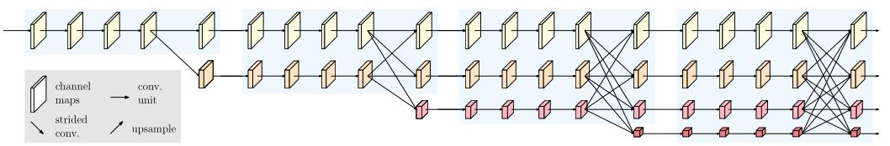


<div>图3-1 HRNet网络结构图</div>

</div>

&emsp;&emsp;其融合模块结构如图3-2 HRNet融合模块示意图所示。该阶段所有分辨率特征块均调整分辨率到融合目标分辨率，再进行连接得到融合后的特征块。由图可知，相邻分辨率特征块之间，由低向高分辨率转换通过双线性上采样以及1 × 1卷积调整通道数来实现；由高向低分辨率转换通过步长为2的3x3卷积实现。不相邻分辨率特征块根据其所处的分辨率分支编号差值多次执行上述分辨率转换操作来实现。

<div align="center">
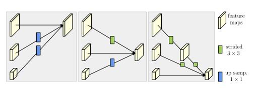


<div>图3-2 HRNet融合模块示意图</div>

</div>

&emsp;&emsp;HRNet具有强大的特征提取能力，在多种任务中均适用，[5]提出了三种不同的head，分别使用了不同分支的特征图，其示意图如图3-3 HRNet网络不同head示意图所示。HRNetV1只使用最高分辨率分支的表示，忽略其他输出；HRNetV2将不是最高分辨率分支的输出都进行双线性上采样，不改变通道数，将四种表示连接起来；HRNetV3先将不是最高分辨率分支的输出都进行双线性上采样，不改变通道数，将四种表示连接起来，然后向下采样到多个级别来构建多级表示。实验发现HRNetV1和HRNetV2在姿态估计任务中性能几乎相同，由于HRNetV2计算复杂度比较低，所以选择选择HRNetV1来进行姿态估计。

<div align="center">
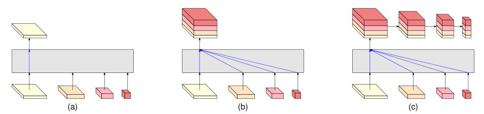


<div>图3-3 HRNet网络不同head示意图</div>

</div>

&emsp;&emsp;根据模型中特征图的通道数多少，即取48的倍数还是32的倍数，论文中提出了一大一小两个网络：HRNet-W48和HRNet-W32。

#### 模型效果

&emsp;&emsp;模型将通过目标检测任务得到的人体实例检测框进行扩展，得到固定的长宽比4：3，然后调整到固定的输入大小，256 × 192 或者384 × 288，采用了包括随机翻转 ([−45&deg;, 45&deg;])，随机尺度变换([0.65, 1.35])和翻转的数据增强操作，在网络整个训练过程中使用Adam算法作为学习率优化器，自动调整学习率，使模型能够更快达到收敛。其最终性能如表3-1 HRNet在姿态估计任务中的最终性能所示，表中展示了HRNet-W32和HRNet-W48的参数量以及GFLOPs，以及在输入图像为384x288时达到的最终性能。

<div align="center">

| Method               | Backbone  | Input Size | #Params | GFLOPs | $AP$ | $AP^{50}$ | $AP^{75}$ | $AP^{M}$ | $AP^{L}$ | $AR$ |
| -------------------- | --------- | ---------- | ------- | ------ | ---- | --------- | --------- | -------- | -------- | ---- |
| HRNet-W32            | HRNet-W32 | 384x288    | 28.5M   | 16.0   | 74.9 | 92.5      | 82.8      | 71.3     | 80.9     | 80.1 |
| HRNet-W48            | HRNet-W48 | 384x288    | 63.6M   | 32.9   | 75.5 | 92.5      | 83.3      | 71.9     | 81.5     | 80.5 |
| HRNet-W48+extra data | HRNet-W48 | 384x288    | 63.6M   | 32.9   | 77.0 | 92.7      | 84.5      | 73.4     | 83.1     | 82.0 |

<center>表3-1 HRNet在姿态估计任务中的最终性能</center>

</div>

### 3.2 HigherHRNet

论文地址：[HigherHRNet: Scale-Aware Representation Learning for Bottom-Up Human Pose Estimation](https://arxiv.org/abs/1908.10357)

#### 论文概述

&emsp;&emsp;HRNet网络证明了高分辨率特征图对人体姿态估计的准确率有一定的提升效果，HigherHRNet利用这一特性，利用HRNet得到的最高分辨率的特征图，通过反卷积模块进一步增大分辨率。HigherHRNet遵循自底向上的pipeline，使用Associative Embedding作为聚类关节点的方式。

#### 模型方法

&emsp;&emsp;HigherHRNet的模型如下图3-4 HigherHRNet网络结构示意图所示，在得到HRNet最高分辨率分支的输出后，输出包含了用于关节点定位的热图和用于关节点分类的tagmap。此后再通过两个反卷积模块，将特征图进行上采样，生成更高分辨率的热图和tagmap，生成的特征图与原HRNet最高分辨率分支的输出同时参与最终损失的计算。

&emsp;&emsp;上采样通过4x4的反卷积，即转置卷积以及BatchNorm和ReLU对输入特征图进行上采样，在此后，可以进一步添加指定数量的残差卷积块来进一步细化特征。

<div align="center">
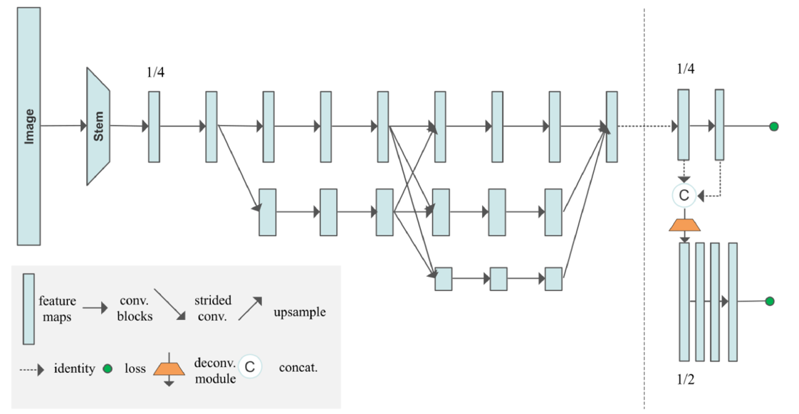


<div>图3-4 HigherHRNet网络结构示意图</div>

</div>

#### 模型效果

&emsp;&emsp;实验采用了包括随机翻转 ([−45&deg;, 45&deg;])，随机尺度变换([0.65, 1.35])和翻转在内的数据增强操作。整个训练过程使用Adam算法作为学习率优化器，自动调整学习率。采用目标关节点相似度oks的平均精度（AP）作为评估指标，其最终性能如表3-2 HigherHRNet在姿态估计任务中的最终性能所示，其中multi-scale test多尺度测试是指将输入的图像根据不同的尺度因子改变其尺寸，将这些图像都输入到网络中进行姿态估计，最终综合网络预测的所有热图得到关节点在原图中的坐标。多尺度测试对不同尺寸的人体实例有更好的适应性，因此对姿态估计最终的性能有一定的提升效果。在2D多人姿态估计任务中，Top-down的方法性能普遍优于Bottom-up的方法，HigherHRNet虽然不是SOAT算法，但性能优于之前的Bottom-up算法。

<div align="center">

| Method          | multi-scale test | Input Size | Params | GFLOPs | $AP$ | $AP^{50}$ | $AP^{75}$ | $AP^{M}$ | $AP^{L}$ |
| --------------- | ---------------- | ---------- | ------ | ------ | ---- | --------- | --------- | -------- | -------- |
| HigherHRNet-W32 | No               | 512        | 28.6M  | 47.9   | 66.4 | 87.5      | 72.8      | 61.2     | 74.2     |
| HigherHRNet-W48 | No               | 640        | 63.8M  | 154.3  | 68.4 | 88.2      | 75.1      | 64.4     | 74.2     |
| HigherHRNet-W48 | Yes              | 640        | 63.8M  | 154.3  | 70.5 | 89.3      | 77.2      | 66.6     | 75.8     |

<center>表3-2 HigherHRNet在姿态估计任务中的最终性能</center>

</div>

### 3.3 CenterNet

论文地址：[Objects as Points](https://arxiv.org/abs/1904.07850?context=cs)

#### 论文概述

&emsp;&emsp;CenterNet将图像中的人物实例看作一个点，可以应用在目标检测，3D目标检测，2D姿态估计等多种任务中，这里主要围绕CenterNet在姿态估计任务中的应用对其进行介绍。不同于两阶段的实现方式，Centernet将预测关节点坐标和检测热图结合起来，同时借鉴自顶向下和自底向上的方法，一阶段实现了2D多人姿态估计。

#### 模型方法

&emsp;&emsp;CenterNet选用不同的backbone网络提取原图像的特征，利用提取出的特征得到图像中关节点的坐标。通过backbone网络得到的特征以及其对应的通道数和作用如表3-3 CenterNet网络框架中backbone网络提取到的特征所示。

<div align="center">

| 名称        | 通道数        | 作用                                       |
| --------- | ---------- | ---------------------------------------- |
| hm        | 1          | 得到实例个体中心点位置（x，y）                         |
| wh        | 2          | 检测框长宽信息w和h                               |
| hps       | 2$\times$k | 关节点相对于中心点的偏移量$x_{offset},y_{offset}$     |
| reg       | 2          | 弥补因分辨率降低带来的中心点位置偏移损失$x_{c\_loss},y_{c\_loss}$ |
| hm_hp     | k          | 关节点的heatmaps，可得到关节点坐标$x_k,y_k$           |
| hp_offset | 2          | 弥补因分辨率降低带来的关节点位置偏移损失$x_{k\_loss},y_{k\_loss}$ |

<center>表3-3 CenterNet网络框架中backbone网络提取到的特征</center>

</div>

&emsp;&emsp;根据hm,reg可以得到修正后的中心点位置（$x_c,y_c$），计算方式如公式3-1所示。

$$x_c=x+x_{c\_loss};\      y_c=y+y_{c\_loss}\ \tag{3-1}$$

&emsp;&emsp;根据修正后的中心点位置以及网络得到的人体实例检测框的长和宽，可以计算得到其检测框，检测框用左上角和右下角坐标来进行标识，检测框左上角和右下角坐标计算方式分别如公式3-2和公式3-3所示。

$$x_{left,top}=x_c-w/2;\ y_{left,top}=y_c-h/2\ \tag{3-2}$$

$$x_{right,down}=x_c+w/2;\ y_{right,down}=y_c+h/2\ \tag{3-3}$$

&emsp;&emsp;根据修正后的中心点位置以及关节点相对于中心点的偏移量可以得到关节点坐标，使用hp_offset可以进一步精确关节点位置，关节点计算方式如公式3-4所示：

$$x_{keypoint}=x_c+x_{offset}+x_{k\_loss};\ y_{keypoint}=y_c+y_{offset}+y_{k\_loss}\ \tag{3-4}$$

&emsp;&emsp;参照自顶向下的方式得到实例的检测框以及关节点坐标后，为了进一步提高关节点定位精度，网络还参照自底向上的方法，预测各类关节点的热图。将根据热图计算的到的关节点坐标与基于中心点回归得到的关节点位置进行匹配，若根据热图计算得到的关节点满足下列条件，则认为是同一个关节点：1.落在检测框内 2. 该点置信度得分高于置信度阈值 3. 与基于中心点回归出的对应关节点距离不超过检测框尺寸的0.3倍。实验证明，该方法也可以明显提升姿态估计性能。

#### 模型效果

&emsp;&emsp;本文选取DLA-43和Hourglass-104作为backbone在COCO数据集上进行实验，在COCO test-dev数据集上取得的效果如表3-4 CenterNet在COCO test-dev数据集上实验效果所示，其中-reg/-jd分别表示直接基于中心点回归和将回归结果与热图检测结果进行匹配。

<div align="center">

| Method  | $AP^{kp}$ | $AP^{kp}_{50}$ | $AP^{kp}_{75}$ | $AP^{kp}_{M}$ | $AP^{kp}_{L}$ |
| ------- | --------- | -------------- | -------------- | ------------- | ------------- |
| DLA-reg | 51.7      | 81.4           | 55.2           | 44.6          | 63.0          |
| HG-reg  | 55.0      | 83.5           | 59.7           | 49.4          | 64.0          |
| DLA-jd  | 57.9      | 84.7           | 63.1           | 52.5          | 67.4          |
| HG-jd   | 63.0      | 86.8           | 69.6           | 58.9          | 70.4          |

<center>表3-4 CenterNet在COCO test-dev数据集上实验效果</center>

</div>

&emsp;&emsp;由表可知，Hourglass-104作为backbone的效果明显优于DLA-34，以及将直接回归出的关节点坐标与由热图检测得到的关节点进行匹配也能大大提升姿态估计效果。

### 3.4 DCpose

论文地址：[Deep Dual Consecutive Network for Human Pose Estimation](https://arxiv.org/abs/2103.07254)

#### 论文概述

&emsp;&emsp;最先进的2D人体姿态估计模型在静态图像上表现出了显著的效果，但应用于视频序列时，其表现并不尽如人意，这是因为基于图像的模型方法忽略了视频帧之间的时空连续性，不能很好的处理运动模糊、视频失焦和姿势遮挡等情况。本文的DCPose模型基于在图像中表现最优的HRNet模型，增加了时间维度，提出了3DHRNet，即在预测每帧结果时同时预测前后相邻帧的结果。此后，又设计了三个模块化组件对姿态进行优化，姿态时间合并器PTM对姿态的时空信息进行编码，以产生有效的搜索范围；姿态残差融合模块PRF在前后两个方向上计算加权姿态残差；最后的姿态校正网络PCN处理这些数据，以有效地完善姿态估计。

#### 模型方法

&emsp;&emsp;DCPose整个模型框架如下图3-5 DCPose网络结构示意图所示，首先输入连续三帧视频帧进行基于图像的姿态估计，得到人体实例的关节点热图，这一部分使用3DHRNet来完成，此后，将连续三帧的热图并行的送入姿态残差融合模块PRF和姿态时间合并器PTM，最后，融合两个模块的输出输入姿态矫正网络PCN中进一步处理完善。下面将对这些模块分别进行介绍。

<div align="center">


<div>图3-5 DCPose网络结构示意图</div>

</div>

**3DHRNet**

&emsp;&emsp;本文采用的3DHRNet在HRNet的基础上，增加了一个时间维度。在对一个实例当前帧的姿态进行估计时，同时将前后两帧中该实例的图像输入网络中，分别得到其热图用于后面的模块。

**姿态残差融合模块PRF**

&emsp;&emsp;PRF旨在计算姿态残差作为额外的时间线索，其计算方式如公式3-5，3-6，3-7所示：

$$\psi_i(p,c)=h_i(c)-h_i(p)\ \tag{3-5}$$

$$\psi_i(c,n)=h_i(n)-h_i(c)\ \tag{3-6}$$

$$\psi_i=\psi_i(p,c)\oplus\psi_i(c,n)\oplus\frac{n-c}{n-p}\psi_i(p,c)\oplus\frac{c-p}{n-p}\psi_i(c,n)\ \tag{3-7}$$

&emsp;&emsp;$\psi_i$将原始姿势残差$\psi_i(p,c)$、$\psi_i(c,n)$和它们的加权版本连接起来，权重根据时间距离得到的，之后通过3x3残差块的堆叠处理，得到最终的姿势残差特征$\psi_i(p,c,n)$。

**姿态时间合并器PTM**

&emsp;&emsp;PTM用来编码基于初始预测的关节点空间，提供一个压缩的搜索范围，便于在一个有限的范围内完善和纠正预测的姿态。网络希望从前后两帧中提取额外的信息来修正当前帧的预测结果，因此进行了加权，所占比重与它们与当前帧的时间距离成反比，计算方式如公式3-8所示：

$$H(p,c,n)=\frac{n-c}{n-p}h_i(p)+h_i(c)+\frac{c-p}{n-p}\ \tag{3-8}$$

&emsp;&emsp;$h_i(p),h_i(c),h_i(n)$分别表示3DHRNet预测出的前一帧，当前帧，下一帧中实例i的热图

&emsp;&emsp;基于卷积操作可以调整（特征）权重的想法，文中利用卷积神经网络来实现上述公式的想法。对于每个关节点，只使用包括它自己特定时间信息的热图来计算其合并的关节点热图，通过一个组卷积实现，公式如下所示：

$$\phi_i(p,c,n)=\bigoplus^N_{j=1}\frac{n-c}{n-p}h_i^j(p)\oplus h_i^j(c)\oplus\frac{c-p}{n-p}h_i^j(n)\ \tag{3-9}$$

&emsp;&emsp;其中⊕表示串联操作，上标j索引第j个关节，共N个关节，随后得到的特征张量被送入3x3残差块，进行堆叠处理，产生合并的关节点热图$\phi_i(p,c,n)$。

&emsp;&emsp;这种方法不仅消除了不相关关节的干扰，而且消除了冗余，减少了模型的参数量。比起直接求和的操作，分组卷积操作允许在像素级有不同的权重，有利于学习端到端模型。

**姿态矫正网络PCN**

&emsp;&emsp;基于PTM得到了合并的关节点热图$\Phi_i(p,c,n)$，基于PRF得到了姿态残差特征向量$\Psi_i(p,c,n)$，姿态矫正网络PCN利用其得到调整后的最终关节点热图。首先将$\Phi_i(p,c,n)$和$\Psi_i(p,c,n)$进行串联，将串联后的特征向量分别输入五个扩张率不同的平行的3×3卷积层，其扩张率d分别为{3，6，9，12，15}，产生五组偏移量，其计算方式如公式3-10所示：

$$\Phi_i(p,c,n)\oplus\Psi_i(p,c,n)\xrightarrow[residual\ blocks]{stack\ of\ 3\times3}\xrightarrow[convolution\ layers]{dilation\ rate\ d}O_{i,d}\ \tag{3-10}$$

&emsp;&emsp;不同的扩张率对应于不同的感受野，扩张率越大，感受野越大。较小的扩张率专注于局部外观，对于捕捉微妙的运动上下文更为敏感。相反，大的扩张率可以对全局表示进行编码，并捕获更大空间范围的相关信息。除了偏移计算之外，将合并的关节点热图送入类似的卷积层，并获得五组掩码$M_d$，其计算方式如公式3-11所示：

$$\Phi_i(p,c,n)\oplus\Psi_i(p,c,n)\xrightarrow[residual\ blocks]{stack\ of\ 3\times3}\xrightarrow[convolution\ layers]{dilation\ rate\ d}M_{i,d}\ \tag{3-11}$$

&emsp;&emsp;两组计算参数互相独立，掩码$M_d$可以视为卷积核的权重矩阵。

&emsp;&emsp;利用合并的关节点热图$\Phi_i(p,c,n)$，通过可变形卷积DCNv2网络，在不同扩张率下实现了姿态矫正，并输出扩张率为d时实例i的姿态热图，计算方式如公式3-12所示：

$$(\Phi_i(p,c,n),O_{i,d},M_{i,d})\xrightarrow[DCN v2]{dilation\ rate\ d}H_{i,d}(c)\ \tag{3-12}$$

&emsp;&emsp;将所有扩张率下得到的输出进行汇总归一化，就可以得到最终该帧下实例i的最终姿态预测结果。计算方式如公式3-13所示：

$$\underset{d\epsilon\{3,6,9,12,15\}}{\Sigma}H_{i,d}(c)\xrightarrow{normalization}H_i(c)\ \tag{3-13}$$

#### 模型效果

&emsp;&emsp;整个模型在数据集Posetrack2017和PoseTrack2018上进行训练，在训练过程中，使用了包括随机旋转、缩放、截断和水平翻转在内的数据增强来增加变化。输入图像大小固定为384×288。前后帧默认的时间间隔设置为1。采用Adam优化器，基础学习率为0.0001，batch_size被设为32。

&emsp;&emsp;如表3-5 DCPose实验效果所示，DCPose网络不仅在多帧人物姿势估计挑战中取得了较好的结果，同时对相对困难的关节的性能提升也是明显的。

<div align="center">

| Method | Dataset             | Head | Shoulder | Elbow | Wrist | Hip  | Knee | Ankle | Total |
| ------ | ------------------- | ---- | -------- | ----- | ----- | ---- | ---- | ----- | ----- |
| DCPose | PoseTrack 2017 test | 84.3 | 84.9     | 80.5  | 76.1  | 77.9 | 77.1 | 71.2  | 79.2  |
| DCPose | PoseTrack 2018 test | 82.8 | 84.0     | 80.8  | 77.2  | 76.1 | 77.6 | 72.3  | 79.0  |

<center>表3-5 DCPose实验效果</center>

</div>

## 4 常用数据集

&emsp;&emsp;基于深度学习的方法通常需要数据驱动，因此需使用大规模的数据集进行训练以得到效果更好的模型。表4-1 2D姿态估计任务常用数据集中列出了2D姿态估计中常用的数据集，并对其所适用的任务，定义的关节点数，包含的图像数以及评价指标进行了概括总结。

<div align="center">

| Name      | Year | Single-Preson/ Multi-Person | Image/<br>Video | Joints   | TrainSet Size | ValSet Size | TestSet Size | Evaluation Protocol |
| --------- | ---- | --------------------------- | --------------- | -------- | ------------- | ----------- | ------------ | ------------------- |
| FLIC      | 2013 | Single                      | Image           | 10       | 5k            | -           | 1k           | PCP&PCK             |
| LSP       | 2010 | Single                      | Image           | 14       | 1k            | -           | 1k           | PCP                 |
| MPII      | 2014 | Single       Multiple       | Image<br>Image  | 16<br>16 | 29k<br>3.8k   | -<br>-      | 12k<br>1.7k  | PCPm/PCKh<br> mAP   |
| COCO2016  | 2016 | Multiple                    | Image           | 17       | 45k           | 22k         | 80k          | AP                  |
| COCO2017  | 2017 | Multiple                    | Image           | 17       | 64k           | 2.7k        | 40k          | AP                  |
| CrowdPose | 2019 | Multiple                    | Image           | 14       | 10k           | 2k          | 8k           | mAP                 |
| PoseTrack | 2017 | Multiple                    | Video           | 15       | 292           | 50          | 208          | mAP                 |

<center>表4-1 2D姿态估计任务常用数据集</center>

</div>

&emsp;&emsp;目前比较常用的数据集为基于图像的MPII，COCO以及基于视频的PoseTrack，下面也将分别进行介绍。

#### Max Planck Institute for Informatics (MPII)

&emsp;&emsp;MPII包含约25000张图像，其中包含40000多个带注释身体关节的实例个体。整个数据集涵盖410项人类活动，所有图像都有标签。每个图像都是从YouTube视频中提取的，并提供了前后未注释的帧。MPII中的图像适用于2D单人或多人姿态估计，姿态采用16个关节点进行表示，其关节点以及骨架对应关系如下图4-1 MPII数据集关节点标注示意图所示。数据集链接： http://human-pose.mpi-inf.mpg.de/#

<div align="center">
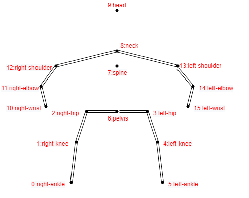


<div>图4-1 MPII数据集关节点标注示意图</div>

</div>

#### Microsoft Common Objects in Context (COCO)

&emsp;&emsp;COCO数据集是使用最广泛的大规模数据集，不仅可以用于姿态估计，还适用于目标检测，图像分割任务。其中包含超过330000张图像和200000个带有关节点标记的实例个体。姿态估计的COCO数据集有两个版本：COCO keypoints 2016和COCO keypoints 2017，区别在于训练集、验证集和测试集的划分。COCO数据集广泛用于多人姿态估计任务中，每个姿态采用17个关节点进行表示，其关节点以及骨架对应关系如下图4-2 COCO数据集关节点标注示意图所示。数据集链接： https://cocodataset.org/#home

<div align="center">
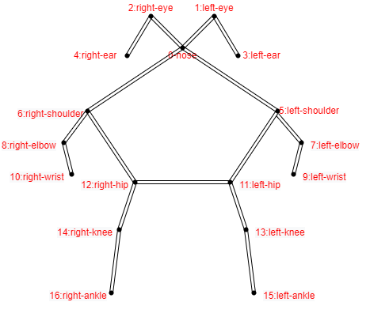


<div>图4-2 COCO数据集关节点标注示意图</div>

</div>

#### PoseTrack

&emsp;&emsp;PoseTrack是用于多人姿态估计和关节跟踪的大型数据集，视频中的每个人都有一个带有标注的唯一轨迹ID。其中包含1356个视频序列，约46000个带注释的视频帧和276000个姿态标注，每个姿态采用15个关节点进行表示，不包含COCO数据集关节点定义中的左耳和右耳，其关节点以及骨架对应关系如下图4-3 PoseTrack数据集关节点标注示意图所示。数据集链接：https://posetrack.net/

<div align="center">
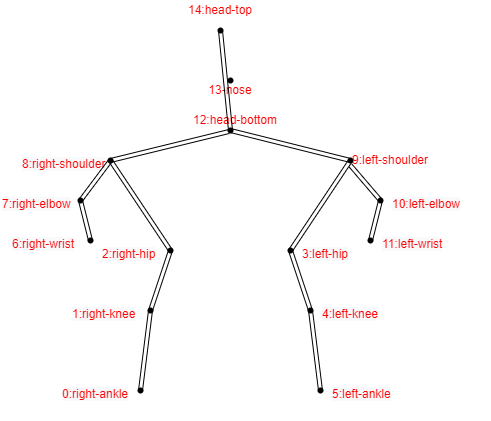


<div>图4-3 PoseTrack数据集关节点标注示意图</div>

</div>


## 5 任务实践
> &emsp;&emsp;针对2D多人姿态估计的相关任务，FudanVIA提供了一套较为完整的解决方案，其中已封装了具有代表性的2D多人姿态估计模型的对应功能接口，可供系统开发和学习交流使用。本节将基于这些接口介绍具体的任务实践。
### 5.1 模型组件介绍
*介绍算法库中有关2D姿态估计任务的组件及其构成，简单阐述工作原理*

&emsp;&emsp;针对2D姿态估计任务，FudanVIA提供了pose_estimation_2d_img对图像进行姿态估计。该模型组件接口支持输入单张图像的路径或者包含多张图像的文件夹路径，所有模型对单张图片进行姿态估计，得到人体关节点的在图像中的2D坐标。在推断时，支持输入单张图像的路径或者包含图像的文件夹路径，可根据需要保存可视化图像。该接口目前添加了HRNet，HigherHRNet和CenterNet模型。

### 5.2 模型组件接口调用
&emsp;&emsp;若要调用接口，首先需要对FudanVIA库进行引入：

```python
import FudanVIA
```

&emsp;&emsp;2D人体姿态估计`get_pose_eatimation_2d_img_component()`含有一个参数`model_name`，为字符串类型数据。在该参数中输入需要使用的2D人体姿态估计模型的名称，`getPoseEstimation2DComponent()`方法将会返回一个PoseEstimation2DComponent类的实例化对象，其中包含了与名称对应的初始化2D姿态估计模型：

```python
poseest2d_model = FudanVIA.get_pose_eatimation_2d_img_component("HRNet")
```

&emsp;&emsp;目前可输入的名称范围为("HRNet", "HrHRNet", "CenterNet")，分别对应了三个模型；输入其他字符串则将报错。后续将逐步在算法库中更新更多2D人体姿态估计模型。

  由此，通过接口调用完成了一个2D人体姿态估计模型组件的初始化。接下来，通过调用模型组件的接口，即可完成模型训练、模型测试、模型预测等功能。

#### 模型初始化

  调用`init_model()`方法以初始化模型权：

```python
poseest2d_model.init_model(is_train=False)
```

&emsp;&emsp;该接口接收1个输入参数`is_train`，为布尔型参数，用于指定是否为训练模式；该接口无返回值。

#### 权重加载

  调用`load_checkpoint()`方法以加载预先完成训练的模型权重：

```
poseest2d_model.load_checkpoint(weight_dir="PATH_TO_WEIGHT")
```

&emsp;&emsp;该接口接收1个输入参数`weight_dir`，为字符串型参数，用于指定权重路径；而该接口无返回值，直接将权重参数载入已完成初始化的模型中。

#### 模型训练
&emsp;&emsp;若要实现模型的训练功能，应调用模型组件的train()方法：

```python
poseest2d_model.train()
```

&emsp;&emsp;`train()`方法没有输入参数；仅完成对2D人体姿态估计模型的训练。`train()`方法没有返回值，训练结果将直接以计算机文件的形式进行持久化。

#### 模型测试
&emsp;&emsp;若要实现模型的测试功能，应调用模型组件的test()方法：

```python
poseest2d_model.test()
```

&emsp;&emsp;`test()`方法没有输入参数；`test()`方法实则在测试数据集上仅执行一次验证功能的`train()`方法，输出在相应权重下的测试结果，不同模型方法评估指标不同，例如HRNet模型使用$AP$，$AP^{50}$，$AP^{75}$，$AP^{M}$，$AP^{L}$，$AR$，$AR^{50}$，$AR^{75}$，$AR^{M}$，$AR^{L}$进行评估。

#### 模型预测
&emsp;&emsp;模型预测功能需要调用模型组件的inference()方法：

```python
pred=poseest2d_model.inference(
    imgs,
    save_img,
    save_img_path)
```

&emsp;&emsp;需要向其传入三个参数：

- `imgs`：字符串型参数，指定需要推断的图像所在的路径或者包含图像的文件夹路径；
- `save_img`：布尔型参数，指定是否保存图像的可视化结果。
- `save_img_path`：字符串型参数，若save_img为True，指定图像可视化结果保存的路径。

&emsp;&emsp;`inference()`方法返回所有图像或者视频帧的预测结果，格式为numpy数组格式。

### 5.3 任务范例
&emsp;&emsp;根据FudanVIA提供的模型组件接口，可基本实现2D姿态估计的全部内容。本节将给出一个基于FudanVIA的模型组件接口的简易2D姿态估计器的实现。

#### 训练模块代码

```python
import FudanVIA

def training_module():
    poseest2d_model = FudanVIA.get_pose_eatimation_2d_img_component("HRNetW48")
    poseest2d_model.init_model(is_train=True)
    poseestor.train().train()
    test_acc=poseestor.test()
    return test_acc
```

#### 预测模块代码

```python
import cv2
import FudanVIA

def inferring_module():
    model_name = 'HrHRNetW48'
    imgs='/home/gyj/data/images/2_zt/'
    save_img=True
    save_img_path='/home/gyj/outputs/hrnet/2_zt/'
    cfg = 'PATH_TO_WEIGHT'
    poseestor =get_pose_eatimation_2d_img_component(model_name)
    poseestor.init_model(is_train=False)
    poseestor.load_checkpoint()
    pred=poseestor.inference(imgs,save_img,save_img_path)
```

   

### 5.4 常见问题Q&A
**在此列出开发实践过程中遇到的有记录价值的问题，并给出详细解答*


## 参考文献
[1]  邓益侬, 罗健欣, 金凤林. 基于深度学习的人体姿态估计方法综述[J]. 计算机工程与应用, 2019, 55(19):21.

[2] Sun K , Xiao B , Liu D , et al. Deep High-Resolution Representation Learning for Human Pose Estimation[J]. arXiv e-prints, 2019.

[3] Wang J , Sun K , Cheng T , et al. Deep High-Resolution Representation Learning for Visual Recognition[J]. 2019.

[4]Cheng B , Xiao B , Wang J , et al. HigherHRNet: Scale-Aware Representation Learning for Bottom-Up Human Pose Estimation[J]. 2019.

[5]Zhou X , Wang D , P Krhenbühl. Objects as Points[J]. 2019.

[6]Liu Z , Chen H , Feng R , et al. Deep Dual Consecutive Network for Human Pose Estimation[C]// 2021.
