# 步态识别

## 1 基础知识

```
　　步态识别是一种极具吸引力的生物特征识别方法，旨在根据人走路的方式来识别人，已在许多领域得到应用，如影响分析、体育科学、健康和用户识别。在本文中，我们只讨论基于计算机视觉的步态识别，在基于计算机视觉的步态识别系统中，使用成像传感器捕捉步态数据，而不需要受试者的合作，甚至可以从很远的距离采集步态信息。
```

### 1.1 任务定义

　　步态识别通常通过利用不同传感器的多种输入数据，如RGB图像、轮廓图、步态模板、身体骨架等来提取人类步态信息，以达到识别人的目的。

　　**RGB 图像**：RGB图像是计算机视觉中最常用的数据输入形式，它包含许多用于识别不同对象的信息，但是当步态识别算法直接应用于RBG图像时，会引入纹理和服装偏差，固RGB图像在步态识别方面具有很大的潜力。 

　　**轮廓图（Silhouette）:**轮廓图是指去除背景的人体表示。轮廓图主要是在早期通过背景减法获得的，目前基于深度学习的分割算法可以提供比背景减法更好的人体轮廓质量。即使去除了颜色和纹理，人体轮廓仍然包含信息丰富的外观，但人体内部结构信息在轮廓中部分丢失。轮廓很容易受到衣服和摄像机视图的影响。由于其效率和简单性，轮廓图是目前最流行的步态数据类型。

　　**步态模板（Gait Template）：**虽然轮廓图高效且简单，但轮廓序列是高维的。在深度学习广泛应用于视觉识别之前，使用传统机器学习方法从序列轮廓中提取特征并不容易。因此产生了步态模板数据，如：**GEI（Gait Energy Image，步态能量图）**将整个循环轮廓序列平均到单个步态模板中，以增加对不完整轮廓的鲁棒性，GEI包含与序列轮廓相当的信息，其数据维度要小得多。除GEI外，还提出了一些其他类似特征，如：**MEI（Motion Energy Image， 运动能量图）**、**Gait Entropy Image（步态熵图）**等等。

　　**人体骨架（Body Skeleton）：**早期的许多方法都使用身体结构来提取步态特征。与基于轮廓的步态识别方法相比，基于骨架的步态识别方法对视觉和服装变化更具鲁棒性。然而，目前提取高精度人体模型并不容易。近年来，基于深度学习的人体姿态估计取得了令人鼓舞的进步。基于人体模型的步态识别又重新成为了研究热点，提出了一系列方法和数据集。

###1.2 评价指标

　　步态识别解决方案的评估协议通常可分为受试者相关和受试者无关。如图所示，在受试者相关协议中，训练集和测试集都包括来自所有受试者的样本。然而，在受试者无关协议中，测试受试者与训练受试者是不相交的。在后一种协议下，测试数据被进一步分为注册集和验证集，然后用在不相交的训练对象上学习到的模型来提取注册集和验证集的特征。最后，使用分类器将验证特征与注册特征进行比较，以识别最相似的步态模式，并将它们标记为来自相同的人。在步态识别中，受试者相关和受试者无关协议被广泛采用。 例如，在TUM GAID数据集中，经常使用受试者相关协议，而在CASIA-B和OU-MVLP大规模数据集中，则使用受试者无关协议。文献中的步态识别结果都是使用rank-1识别精度进行测量和表示的。（图1-1）

<div align="center">
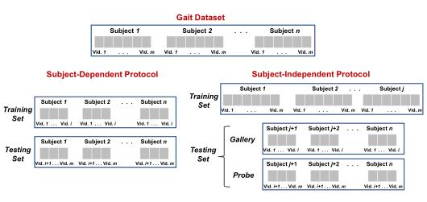
<br>
<div>图1-1 步态识别评估协议</div>
</div>


### 1.3 任务难点

　　基于计算机视觉的步态识别系统的性能主要受以下几个方面的影响：

　　**个人外观变化**：例如携带手提包/背包或穿着诸如帽子或外套等衣物；

　　**摄像机角度变化**；

　　**遮挡因素**：例如，在某些视角（也称为自遮挡）中，受试者身体的一部分被物体部分覆盖，或者被受试者自身身体的一部分覆盖；

　　**环境因素的变化**：例如复杂背景和高或低水平照明，这通常使分割和识别过程更加困难。

　　

### 1.4 应用场景

　　步态识别是一种生物识别技术，依赖于人类行走姿势的独特性。由于人体步态可以在远距离条件下捕捉，并且识别过程不需要主体的合作，因此步态识别可以广泛应用于许多领域，例如视频监控、智能交通、体育科学、健康和用户识别等。

## 2 方法论

### 2.1 身体表示

​		如图2-3左1所示，该方法与身体表示识别的方式有关，可以基于轮廓或骨骼。轮廓表示是文献中最常用的身体表示法，通过从背景中减去包含受试者的每个图像，然后进行二值化，可以很容易地计算出轮廓。步态轮廓被证明可以有效且方便地以较低的计算成本在单个帧中描述身体状态。这种身体表征迫使识别解决方案专注于“步态”，而不是服装和其他非步态因素，而从分类器的角度来看，这些因素可以用于识别。一系列轮廓可以表示有用的步态特征，如速度、步频、腿部角度、步态周期时间、步长、步幅以及摆动和站立阶段之间的比率。还可以对其进行处理以提取运动数据，例如使用光流图计算。尽管如此，步态轮廓对个体外观的变化更为敏感，例如不同的服装和携带条件。

​		一般可以使用深度感应相机捕获骨架身体表示，或者使用姿势估计方法进行估计。步幅、速度、距离和关节之间的角度等静态和动态特征，可以从以骨架形式连接的身体关节中获得。由于考虑了关节位置，基于这种身体表征的步态识别方法通常对视角变化更稳健。基于骨架的方法对外观变化也更加稳健，因为姿势估计步骤通常会学习检测不同服装条件下的身体关节，而步态轮廓则不然。然而，由于这些方法严重依赖于身体关节的准确检测，它们通常对遮挡更敏感 。 此外，姿态估计器的使用给这些识别系统带来了计算开销。


### 2.2 时间表示

​		如图2-3左2所示，这个方法处理用于表示步态序列中的时间信息的方法。文献中通常使用两种表示形式，模板和体积。下面我们将描述这些表示。

​		模板将时间上的行走信息汇总到一张图中的一连串轮廓上，例如通过对至少一个步态周期的剪影进行平均。一旦模板图被创建，这种操作使识别方案不受帧数的影响。关于深度步态识别体系结构，步态轮廓可以聚合在网络的初始层（图2-1-a），称为时间模板，其中聚合的图可以由后续层处理。步态轮廓也可以在几个卷积和池化层（图2-1-b）之后聚集在网络的中间层，称为卷积模板。时间模板的例子包括：（i）步态能量图（GEI），它在一个序列中计算平均步态轮廓（图 2-1-c）； (ii) 计时步态图像 (CGI) ，它提取每个步态图像中的轮廓，然后使用多通道映射函数以单个图的形式进行编码（图 2-1-d）； (iii) 帧差能量图 (FDEI)，当轮廓不完整时使用聚类和去噪算法保留动力学信息（图 2-1-e）； (iv) 步态熵图 (GEnI)，计算步态帧中每个像素的熵，然后在单个步态模板中进行平均（图 2-1-f）； (v) 周期能量图 (PEI)，GEI 的一种概括，它通过利用基于帧幅度的多通道映射函数来保留更多空间和时间信息（图 2-1-g）。卷积模板的例子包括集合池化和步态卷积能量图 (GCEM)，它们在整个序列上平均由几个卷积层和池化层获得的卷积图。
​		为了保存步态序列中帧的顺序和关系并从中学习，提出了序列体积表示法（见图2-3左二）。为了学习时间信息，采用了两种不同的方法。在第一种方法中，使用循环学习策略（例如循环神经网络）学习序列上的时间动态，其中每个帧都根据其与前一帧的关系进行处理。 第二种方法首先从序列中可用的时空信息创建三维张量，其中张量的深度表示时间信息。然后学习这些张量，例如使用3D CNN或图卷积网络（GCN）。

<div align="center">
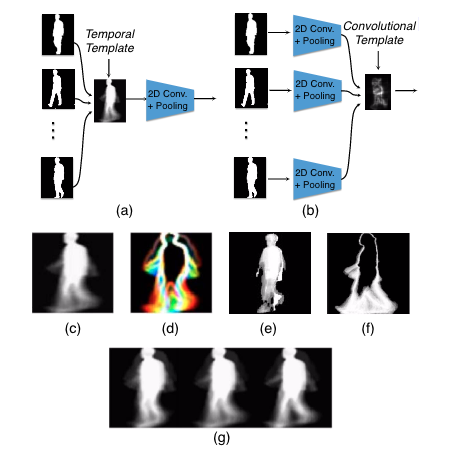
<br>
<div>图2-1 步态识别时间表示</div>
</div>

### 2.3 特征表示

​		这个方法是基于表示学习的表示法，可以是全局表示学习，也可以是局部表示学习。整体学习轮廓或骨架的过程称为全局表示学习。在学习局部表示时，步态数据被分成局部区域，例如切片、身体组成部分和垂直/水平切块（见图 2-3左三），然后进一步通过循环神经网络、胶囊网络、基于注意力的网络或全连接层等方法处理这些局部区域。基于全局表示的方法往往对遮挡和外观变化以及缺少关键身体部位更为敏感。局部区域往往对最终识别性能保持不同的贡献，因此了解它们的重要性可以提高步态识别方法的整体性能。此外，这些部分特征之间的关系可以被学习，从而保留了位置属性，如比例、旋转和位置，这提高了步态识别方法对方向和视角变化的鲁棒性。


### 2.4 基于神经网络

​		深度神经网络（DNN）使用多个非线性变换的层次结构捕获高级抽象信息。针对步态识别问题设计了不同的神经架构，其描述如下：

#### 2.4.1基于卷积神经网络

​		卷积神经网络（CNN） 在步态识别中的应用最为广泛。通常用于学习在特征空间中对表示为轮廓或骨架的身体形状进行编码的嵌入位置。具体来说，CNN通常由不同类型的层组成，包括卷积层、池化层和完全连接层。卷积层将学习过的滤波器与输入图像卷积在一起，以创建激活特征映射，捕获具有不同细节级别的特征。卷积层还包括激活函数，例如ReLU或tanh函数，以增加输出中的非线性。然后，池化层通过使用非线性下采样策略（如平均池或最大池）减小特征地图的空间大小，从而降低网络的复杂性。最后使用完全连接的层将生成的2D特征图学习为1D矢量，以便进一步处理。根据目前已有的工作可以看出，在步态识别任务上不需要使用最先进的CNN架构。这是因为输入的步态数据，无论是轮廓还是骨骼，在纹理信息方面都不存在相当大的复杂性。因此，即使不到10层的CNN架构也足以对步态帧进行编码，这与许多其他领域相反。此外，一些研究中中的分析表明，分辨率为64×64和128×128的多个CNN框架的步态识别结果最好，其中输入分辨率为128×128略优于64×64。然而，由于较高的输入分辨率意味着更多的卷积和池层，为了限制解的计算复杂性，最广泛地采用了64×64的输入分辨率。 

#### 2.4.2基于深度置信网络

​		深度置信网络（DBN）是一种概率生成模型，由受限玻尔兹曼机组成，用于从训练数据中提取层次表示。每个受限玻尔兹曼机是一个两层生成性随机模型，包括一个可见层和一个隐藏层，相邻层之间有连接，每个层内的单元之间没有连接。单元的权重和偏差定义了可见单元和隐藏单元联合状态的概率分布。目前在某些工作中，DBN已用于步态识别。从轮廓提取拟合、身体参数和形状特征，然后由DBN学习，从而提取更具区分性的特征。在一些工作中，步态首先被表示为运动和空间分量，并为每个分量训练了两个单独的DBN。提取的特征最终连接起来表示最终特征。 


#### 2.4.3 基于循环神经网络

​		循环神经网络（RNN）已被广泛地应用于时间或序列学习问题，在不同的任务中取得了有竞争力的表现，包括步态识别。RNN层通常由几个单元组成，每个单元对应于序列的一个输入元素，例如步态视频的一帧。RNN还可以堆叠多个层以使模型更深。在不同的 RNN 架构中，长短期记忆 (LSTM)和门控循环单元 (GRU)是使用最广泛的 RNN 架构，它们被用于使用记忆状态和可学习的门控函数来学习步态序列中可用的关系。在LSTM网络中，单元有一个公共单元状态，该状态沿整个LSTM单元链保持长期依赖性，由两个门控制，即所谓的输入门和忘记门，从而允许网络决定何时忘记以前的状态或使用新信息更新当前状态。每个单元的输出，即隐藏状态，由一个输出门控制，该门允许单元在给定更新单元状态的情况下计算其输出。GRU是RNN的另一种形式，与LSTM相反，它不使用输出激活函数。该体系结构还包括一个更新门，允许网络根据新信息更新当前状态。门的输出，也称为复位门，仅保持与单元输入的连接。

​		在深度步态识别系统中使用RNN有三种不同的方法。第一种方法（图2-2-a）主要用于骨架表示，使用RNN从关节位置的时间关系中学习。在第二种方法（图 2-2-b）中，RNN 与其他类型的神经架构相结合，尤其是 CNN，用于学习空间和时间信息。最近在（图2-2-c）中采用的最后一种方法是使用RNN从单个步态模板（例如GCEM）反复学习局部表示之间的关系。

<div align="center">

<br>
<div>图2-2 步态识别3种RNN方法</div>
</div>

#### 2.4.4 基于深度自编码器

​		深度自动编码器（DAE）是一种网络类型，旨在使用编码器-解码器结构提取瓶颈特征或潜在空间表示。编码器将输入数据转换为特征表示，解码器部分将表示转换回原始输入数据。编码器通常包括几个完全连接层或卷积层组成，而解码器由执行反向操作的层组成。DAE网络通常经过训练，目的是将测量原始输入和重建版本之间差异的重建错误降至最低。一旦对DAE进行了训练，就会提取瓶颈特征，这些特征是原始输入知识的潜在压缩表示，用于分类。有些方法中提出使用DAE网络，首先用四个卷积层对输入时间模板进行编码，以提取特征。然后，解码器使用四个反卷积层从提取的特征重建输入。在一些工作中，使用了一个具有7个完全连接层以及输入和输出层的自动编码器来提取健壮的步态特征。在一些工作中中，DAE用于将输入时间模板分解为身份和协变量特征。编码器的主干基于GoogLeNet中的Inception模块，提取多尺度身份和协变特征，然后解码器将这些特征作为输入，使用反卷积层重建时间模板。 

#### 2.4.5 基于生成对抗网络

​		生成对抗网络（GAN）包括一个生成器和一个鉴别器，其中生成器旨在通过合成与真实样本相似的假样本来欺骗鉴别器。反过来，鉴别器的目的是区分假样本和真样本。由于这两个分量之间的这种极大极小博弈，GAN可以生成真实的合成样本。在步态识别方面，GAN可用于解决由于服装、视角和携带条件而导致步态变化的问题。例如，GAN可以将步态数据从一个视图转换到另一个视图，或者更改受试者穿着的衣服类型，甚至可以移除受试者最初携带的背包。这种身份与混杂因素的分离通常会导致步态识别系统性能的提高。然而，在处理步态数据时，最重要的挑战之一是在表示空间中修改外观特征的同时保留人类身份特征。为此，通常使用两个鉴别器。第一个鉴别器用于区分真假样本，以确保生成的图像看起来逼真。第二个鉴别器，通过将一对源图像和目标图像作为输入并产生输入对是否属于同一个人的标量概率来确保身份信息得到保存。

​		最近，不同类型的GAN被用于步态识别。多任务GAN（MGAN）已被提出用于交叉视野步态识别，其中CNN用于学习时间模板作为潜在空间中的视图特定特征。使用视图变换层将特征从一个视图变换到另一个视图，对网络进行多任务对抗和像素级损失训练。在另一篇论文中，辨别步态GAN（DiGGAN）考虑了使用两个独立的鉴别器将GEIs转换为特定的 视角转换为不同的视角，同时保留身份信息。在其他工作中，提出了一种双流GAN（TS-GAN），用于在将具有不同视角的GEI时间模板转换为具有标准视图的GEI时态模板时，学习全局和局部特征表示。

#### 2.4.6 基于胶囊网络

​		胶囊网络被提议通过分别利用胶囊激活值和协议路由算法，解决CNN中的两个重要缺陷，即通过池化操作实现的标量激活限制和较差的信息传递。胶囊网络由胶囊组成，胶囊是一组神经元，它们明确编码对象不同部分中可用的内在视点不变关系。在步态表示学习的背景下，胶囊网络使用可学习的姿势矩阵，建模并理解身体各部分之间的结构关系，例如腿和脚、上半身和下半身以及躯干和四肢之间的关系。胶囊网络还可用于在视频中建模对象的多个步态轮廓或骨骼关节坐标之间的内部层次表示。这与CNN中常用的标准池层形成对比，后者无法保留人体中的位置属性，例如位置、比例、旋转和身体部位之间的关系。胶囊网络通常包括两个区块，初级和高级胶囊组。第一个块用几个层编码空间信息，包括卷积层、重塑层和挤压层，第二个块学习层次子部分之间更深的部分-整体关系。胶囊网络的概念最近被用于步态识别中，提出的方法首先使用CNN学习GEI模板的属性，然后使用一个具有动态路由的胶囊网络来保留每个模板内的关系，以便找到更健壮的特征。胶囊网络还可以与其他类型的深层网络相结合。 

#### 2.4.7 基于3D卷积神经网络

​		3D卷积神经网络（3DCNN）最近被用于步态识别，以学习整个步态序列的时空动力学。3D CNN能够提取对摄像机视点和被摄体外观变化更为稳健的特征。3D CNN以3D张量形式的叠加步态帧作为输入，然后使用多个3D卷积滤波器和池操作来提取空间角度表示。3DCNN用于步态识别的局限性在于处理可变长度序列缺乏灵活性。在某些工作中，通过利用多个3D CNN来整合不同尺度的时间信息，解决了这一缺陷。在其他工作中，为步态识别设计了一个包含13个3D卷积滤波器和池化层以及两个完全连接层的3D CNN网络。有些方法由几个全局和部分3D卷积层组成，其中修改了标准3D池化层，以聚合本地剪辑中的时间信息。

#### 2.4.8 基于图卷积网络

​		图卷积网络 (GCN) 以使用任意结构的图和图卷积滤波器将 CNN 扩展到更高维度的域。 GCN 可以对步态序列中可用的结构信息和时间关系进行联合建模，以便学习关于相机视点和主体外观的判别性和鲁棒性特征。 基于 GCN 的步态识别方法将步态序列体积视为步态识别的时间表示。 在一些工作中，步态特征是通过从可用视频序列中形成时空图来提取的。 然后使用关节关系学习方案通过将步态特征映射到关于人体结构和步行模式更具判别力的子空间来获得最终特征。

<div align="center">
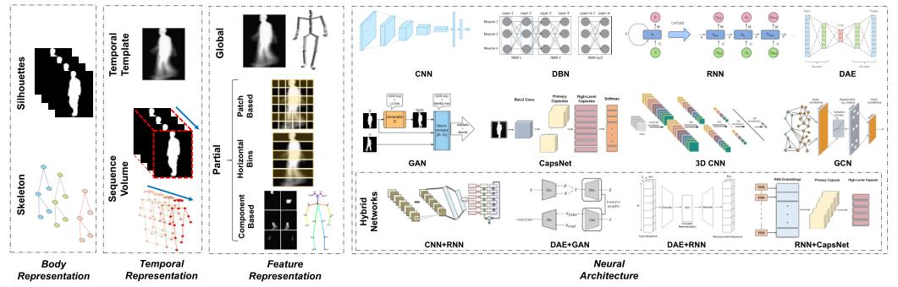
<br>
<div>图2-3 步态识别4种方法</div>
</div>


## 3 论文介绍

　　近年来的步态识别领域在有关基于深度学习方法的相关研究上有了迅猛推进，在每年的各大CV会议和期刊上不乏出现令人眼前一亮的方法。本节将选取步态识别任务中具有代表性和特殊意义的方法，对其论文和模型进行概括和综述。

### 3.1 Gaitset

　　Gaitset是复旦大学发表于 AAAI 2019 的工作，在2021年继续改进了其中细节，其思路具有创新性，第一次将步态序列看做图像集合。

​		**论文地址**： https://arxiv.org/abs/1811.06186 （AAAI2019）

​							https://arxiv.org/abs/2102.03247（2021）

​		**论文概述**：

​		作为一种可以远距离识别的独特生物识别功能，步态识别在预防犯罪，法医鉴定和社会保障方面具有广泛的应用。为了描绘步态，现有的步态识别方法利用步态模板（其中时间信息难以保存）或步态序列，其必须保持不必要的顺序约束并因此失去步态识别的灵活性。在本文中，我们提出了一种新颖的视角，其中步态被视为由独立帧组成的（图像）序列。我们提出了一个名为GaitSet的新网络来学习（图像）序列中的身份信息。

​		基于（图像）序列视角，本方法不受帧的排列的影响，并且可以自然地整合来自不同视频的帧，这些视频已经在不同的场景下被完成，例如不同的视角，不同的衣服/携带条件。

​		实验表明，在正常步行条件下，我们的单模型方法在CASIAB步态数据集上实现了平均95.0％的一次命中准确度，在OU-MVLP步态数据集上达到了87.1％的准确度。在各种复杂场景中，模型具有显着的鲁棒性。它分别对携带背包和穿大衣的行走条件达到了87.2％和70.4％的准确率。

​		**方法优越性**：

​		灵活性

​		本模型非常灵活，因为除了轮廓的大小之外，模型的输入没有任何限制。 这意味着输入的序列可以包含在不同视点下具有不同行走条件的任意数量的非连续轮廓。 
​		快速性

​		本模型直接学习步态的表示，而不是测量一对步态模板或序列之间的相似性。 因此，每个样本的表示仅需要计算一次，然后可以通过计算不同样本的表示之间的欧式距离来完成识别。
​		有效性

​		本模型极大地提高了CASIA-B和OUMVLP数据集的性能，显示了其对视图和行走条件变化的强大鲁棒性以及对大型数据集的高泛化能力。

​		**问题表述**：

​		首先，将步态视为一组序列。 给定一个数据集，数据集中一共N个人，每个人用yi表示（共有y1,y2,...yN这么多个表示）。假设某个人的步态轮廓分布Pi只与这个人的ID有关（就是说一个人的轮廓和这个人是一一对应的，不会搞错，其实就是步态识别的可行基础，即每个人的步态独具特色）。因此，在一个或多个序列中，所有的轮廓可以被看做是Xi = {x(ij) | j = 1,2,...,n}, 其中 x(ij) ∼Pi。以CASIC-B数据集为例：

​		数据集中有N=124个人，每个人用yi表示，比如ID=109的那个人的视频好多连人都没出现视频就结束了，那么在这个论文中就说y109视频不全。在全部数据集中闭着眼睛任选出来一个轮廓怎么表示那？假如选到的轮廓图所在序列一共有20帧，选的的轮廓图是序列中的第3帧，那么表示方法就是x(20 3)，其所在序列表示为X20。在这个假设下，我们通过3个步骤解决步态识别任务，表述为：
$$
f_i=H(G*F(X_i))
$$


​		其中F是卷积网络，旨在从每个步态轮廓中提取帧级特征。函数G是用于将一组帧级特征映射到序列级特征的排列不变函数。该函数通过Set Pooling（SP）实现，函数H用于从序列级特征中学习Pi的辨别表示。（就是对序列级特征进行分类，对应到每个人身上）这个函数是通过一个叫做Horizontal Pyramid Mapping的结构实现的。输入Xi是具有四个维度的tensor，分别是序列维度，图像通道维度，图像高度和图像宽度维度。tensor.shape=(n帧,2通道,64,64)

​		**Set Pooling**：

​		Set Pooling(SP)的目的在于收集一下整个序列的步态信息。

​		此处有两个约束条件。

​		第一，将序列作为输入，它应该是一个排列不变函数

​		第二，因为现实生活场景中，一个人的步态轮廓数可是是任意的，函数G应该可以输入任意基数的序列。（就是这个序列可长可短，多少帧都行，这是GaitSet宣传的一大优势）

​		**Statistical Functions 统计函数**

​		在满足不变约束的要求下，SP一个很自然的选取是在序列维度上应用统计函数。 考虑到典型性和计算成本，研究了三个统计函数：max（·），mean（·）和median（·）。 

​		**Attention 注意力机制**

​		由于视觉注意力已成功应用于大量任务中，因此我们使用它来提高SP的性能。

​		其结构如图3-1所示。主要思想是利用全局信息来学习每个帧级特征图的元素注意力图，以便提炼更有价值信息。

<div align="center">
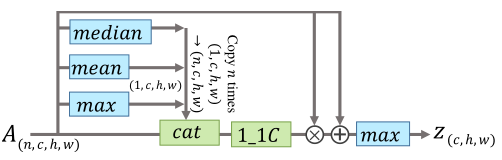
<br>
<div>图3-1 Set Pooling(SP)应用注意力机制的结构。1_1C和cat分别代表1×1卷积层和连接。乘法和加法都是逐点的。</div>
</div>

​		首先由左侧（上面）的统计函数收集全局信息。然后，将其与原始特征图一起送入1×1卷积层计算注意力以精炼特征信息。通过在所设置的帧级特征映射的集合上使用MAX来提取最终的设置级特征z。最终的序列级特征z将被MAX应用在序列维度。残余结构可以加速并稳定收敛。

​		**Horizontal Pyramid Mapping**

​		在文献中，将特征图分割成条的方式经常用于人的重新识别任务。根据行人大小裁剪图像并将其尺寸调整为均匀尺寸，但辨别部分仍然因图像而异。

​		如图3-2所示，我们对每个池化后的特征使用独立的完全连接层（FC）将其映射到判别空间，而不是在合并后应用1×1卷积层。我们称这样的操作为Horizontal Pyramid Mapping (HPM)。

<div align="center">

<br>
<div>图3-2 HPM结构</div>
</div>

​		**实验训练细节**

​		在所有的实验中，输入都是一系列64×44的对齐轮廓。轮廓有数据集直接提供并且对齐是基于Takemure的方法。训练集使用每个人每个序列的30张图片。优化器是Adam优化器。HPM种的尺度S=5。三元损失BA+的margin设置为0.2。用8个NVIDIA 1080TI GPU训练的模型。

​		CASIA-B中，mini-batch由p=8,k=16两部分组成。将C1和C2的通道数设置成32，C3和C4的通道数设置成64，C5和C6的通道数为128。按照这种设置，我们模型的平均计算复杂度是8.6GFLOPs。学习率是1e-4。ST训练时，模型训练50000轮，MT 60000轮，LT80000轮。

​		OU-MVLP中比CASIA-B多了20倍的序列，因此我们使用更深的卷积层（C1 = C2 = 64,C3 = C4 = 128,C5 = C6 = 256）并且训练的batch size更大（p = 32,k = 16）。前150000轮学习率是1e-4，后100000轮学习率衰减到1e-5。
​		**主要结果**

<div align="center">
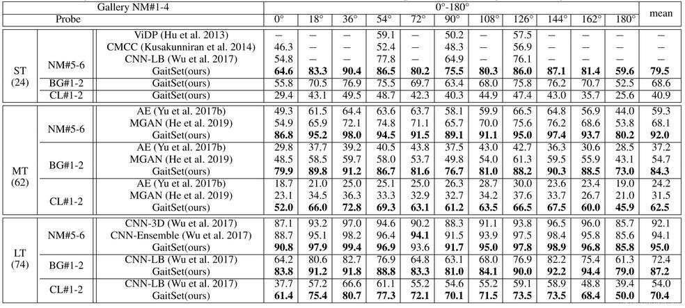
<br>
<div></div>
</div>

​		**结论**

​		在本文中，我们提出了一种新的视角，将步态视为一组序列，从而提出了一种GaitSet方法。GaitSet可以比那些将步态作为模板或序列的现有方法更有效地提取空间和时间信息。它还提供了一种从不同序列聚合有价值信息的新方法，以提高识别准确性。两个基准步态数据集（公开标准数据集）的实验表明，与其他最先进的算法相比，GaitSet实现了最高的识别精度，并在各种复杂环境中显示出广泛的灵活性，在实际应用中显示出巨大的潜力。后续，我们将研究更有效的Set Pooling（SP）实例化，并进一步提高复杂场景的性能。

### 3.2 GaitPart

​		基于时间部件的[步态识别](https://so.csdn.net/so/search?q=步态识别&spm=1001.2101.3001.7020)模型
 		作者 | Chao Fan, Yunjie Peng, Chunshui Cao, Xu Liu, Saihui Hou, Jiannan Chi, Yongzhen Huang, Qing Li, Zhiqiang He
​		 单位 | 北京科技大学；北航；WATRIX.AI；联想
​		 代码 | https://[github](https://so.csdn.net/so/search?q=github&spm=1001.2101.3001.7020).com/ChaoFan96/GaitPart	

**论文概述**：

​		步态是描述一个人行走模式的一种生理和行为生物特征。与其他生物识别方式相比，比如面部、指纹和虹膜。它可以很容易地在远距离捕获，不需要感兴趣目标主题的合作。因此，步态识别在犯罪调查、门禁和社会安全方面具有巨大的潜力。步态识别作为一项视觉识别任务，其基本目标是从人体形态的时间变化特征中学习独特的、不变的表征。然而，在现实场景中，变化，如拎包，穿衣服和摄像机视点导致步态外观的巨大的变化，这给步态识别带来重大挑战。为了缓解这些问题，许多基于深度学习的方法已经提供了很有前途的解决方案。Thomas等利用3D-CNN对时空信息进行解析，试图找到人类步态的基本描述符。GaitNet提出了一种自动编码器框架，从原始RGB图像中提取步态相关特征，然后使用LSTMs对步态序列的时间变化进行建模。而GaitSet则假设轮廓的外观包含了其位置信息，因此将步态视为可提取时间信息的序列。这些方法将整个人体形状作为一个单元来提取时空信息，以进行最终的识别。然而，我们观察到人体不同部位在行走过程中具有明显不同的形状和运动模式，如图3-4(a)所示。

<div align="center">
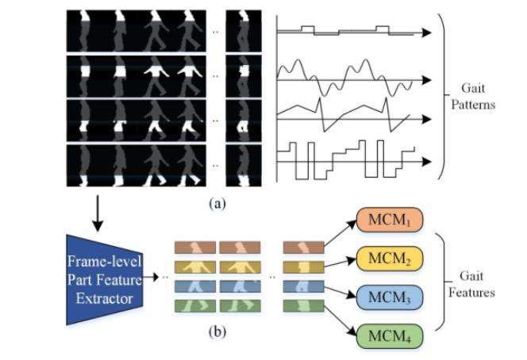
<br>
<div>图3-4 步态表示</div>
</div>

​		更多证据表明，人体描述的部分特征可以提供更精细的信息，有利于个性化识别任务。对于时间变化特征，一些最新的方法没有明确地建模时间特征，这导致在时间序列中丢失重要的不变特征。其他一些方法通过深度叠加3d-卷积或重复操作来建模远程依赖关系，以再现步态序列的全局理解。然而，这些方法被认为保留了不必要的长时间序列约束周期步态，从而失去步态识别的灵活性。
 		基于上述研究结果，我们提出了一个新的基于时态部分的框架GaitPart。如图3-4(b)所示，步态-部分由两个新颖设计的部件组成，即步态-部分帧级部件特征提取(FPFE)和微动作捕捉模块(MCM)。
​		 GaitPart的输入是一系列步态轮廓。FPFE是一个特殊但简洁的堆叠CNN，首先将每一帧作为输入，然后对输出的feature map进行预定义的水平划分。这样，我们可以得到图3-4(b)中重新上色的几个部分级空间特征序列，每个序列都对应于人体的某个预定义部分，相应的MCM将捕捉其微运动模式。 注意，这些并行mcm之间的参数是独立的，这反映了GaitPart是一种部分独立的方法。最后的步态表征是通过简单地简化这些MCMs的输出来形成的。
​	

​		**方法优越性：**

 		在FPFE中，我们提出了一种简单而有效的卷积应用，称为焦点卷积(focalconvolution, FConv)，以促进部分层次空间特征的细粒度学习。其核心思想是让顶层的卷积核关注输入帧中每个特定部分的更多局部细节，直观地挖掘出更细粒度的局部信息。
 		在MCM中，我们认为局部的短时空间特征(微运动模式)是对周期性步态最具鉴别性的特征，而长期的依赖关系是冗长和低效的。此外，还提出了一种基于注意力的MCM来模拟局部微运动特征和对整个步态序列的全局理解。
  		我们提出了一种新的基于时间部分的步态识别框架，称为GaitPart。在广泛使用的步态数据库CASIA-B和OU-MVLP上进行的大量实验表明，GaitPart大大优于现有的先进步态方法，显示了其优越性。在CASIA-B上进行了大量严格的消融实验，进一步证明了GaitPart内各部件的有效性。	

​		**问题表述**：

​		步态时间变化的建模方法一般可分为三类:基于3dcnn的、基于lstm的和基于Set的。其中，基于3dcnn的方法直接提取时空特征用于步态识别，但这些方法通常难以训练，不能带来相当可观的性能。Zhang等人提出了一种新的自动编码器框架，从原始RGB视频中提取姿态特征，并使用三层LSTM在时间序列中聚合这些姿态特征，生成最终的步态特征。
​		 然而，基于LSTM的方法被认为保留了周期性步态必要的顺序约束。GaitSet假设一个轮廓的外形包含了它的位置信息，提出将步态作为一个集合，采用时间池的方法提取其时空特征。
 		这种方法足够简洁和有效，但没有显式地对时间变化建模。
  		与上述情况相比，我们观察到具有相似视觉外观的框架在周期性步态中很可能呈现周期性，这表明在完成一个完整的步态周期后将不会获得有区别的信息。这一现象意味着长距离依赖(例如，比一个完整的步态周期长)可能是多余的，对步态识别无效。因此，GaitPart将注意力转向了局部短时建模，并提出了微动作捕捉模块。

​		**框架图**：

<div align="center">
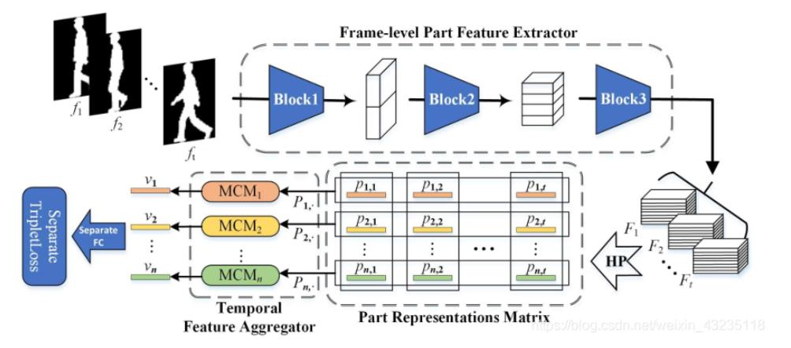
<br>
<div>图3-5 GaitPart框架图</div>
</div>

​		**Frame-level Part Feature Extractor**

​		帧级部分特征提取器(FPFE)由三个块组成，每个块由两个焦点卷积层(FConv)组成，目的是提取每帧的部分信息空间特征。接下来，将首先详细描述FCon- v，然后是FPFE的确切结构。
 	**定义** FConv是卷积的一种新应用，它可以先将输入特征图原形地分割成若干部分，然后对每一部分分别进行规则的卷积。设p为预定义部分的数量，特别地，当p = 1时，FConv相当于常规的卷积层。
 	**动机**为了增强对部分知情空间特征的细粒度学习，发展了FConv，如图3-6(a)所示。通过在FConv中设置超参数p，可以使顶层神经元的感受野小于正常情况下的感受野，如图3-6(a)所示：

<div align="center">
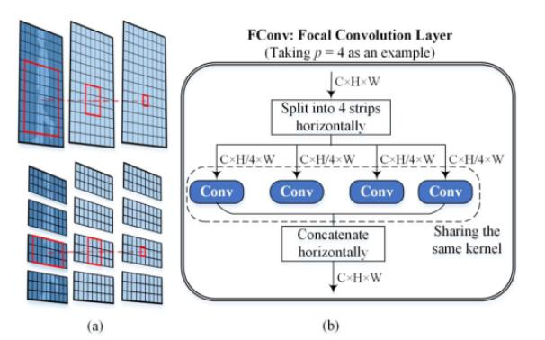
<br>
<div>图3-6 帧级部分特征提取器(FPFE)</div>
</div>

​		随着网络的深入，通过在FConv中设置超参数p，可以使顶层神经元的感受野小于正常情况下的感受野，这使得即使在深度网络中，顶层神经元也有可能聚焦于输入帧中相应部分的更多局部细节。
​		如上图3-6(b)所示，首先将输入的feature map水平分割为p个预定义的部分，然后对这些部分分别进行规则的卷积运算。之后，将输出的feature map水平连接，作为F-Conv的最终输出。

​		**Temporal Feature Aggregator**

​		时间特征聚合器(TFA)由n个并行的微运动捕捉模块(MCMs)组成，每个MCM负责对对应部分的短距离时空表征进行建模。
​		 MCM包括两个部分:分解动作模板编辑器Template Builder (MTB)和时间池化(TP)。
​		 设 Sp = {p i |i =  1,2，…，t}是PR-Matrix的一行，PR-Matrix是一个序列和通道维度的二维张量。MTB是为了将部分级特征向量Sｐ映射为微运动特征向量序列，表示为Sm = MTB(Sp)。之后，通过聚合序列Sm，TP模块提取最具鉴别性的运动特征向量v，表示为v =  TP(Sm)，用于最终识别。
 		**Micro-motion Template Builder**
​		将部分已获取的帧级特征向量映射为分解动作特征向量。
​		假设短程时空表征(分解动作特征)是周期步态最具鉴别性的特征，并且认为在任意时刻的分解动作模式应该完全由它自己和它周围的坐标系决定。

<div align="center">
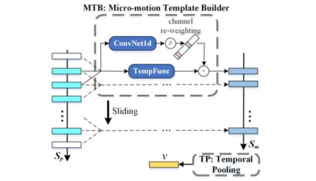
<br>
<div>图3-7 微运动捕捉模块(MCMs)</div>

​		将模板函数应用于Sp的每个时刻，我们实际执行的是kernel size为2r + 1的一维全局平均池化和一维全局最大池化。从而得到分解动作特征向量序列Sm。此外，为了获得对分解动作更有鉴别性的表示，引入了通道注意机制来对每个时刻的特征向量重定权重。在实际应用中，采用一维卷积核。

​		如图3-7所示，MTB就像一个滑动窗口检测器。一方面，所有窗口内的帧级特征向量将被TempFunc压缩成一个分解运动矢量。另一方面，引入通道注意机制，能够模型根据窗口内的特征存储微分解动作向量的权重，从而得到更有辨别力的表达，为最终的识别提供依据。


​		**实验训练细节**

​		F- PFE由FConv层、最大池化层和Leaky  ReLU激活函数组成。需要指出的是FCon-v中预定义零件编号p的设置，当p较大时，对感受野的约束更强。当p=1时，FConv相当于常规卷积层，约束将被重新移动。因此，随着网络的深入，设置p值的经验也在增加。

​		损失函数：GaitPart的输出s为n列特征向量。在本文中，我们使用单独的BatchAll (BA +) triplet  loss来训练网络，并使用不同样本之间对应的列特征向量来计算损失。训练批次大小为(pr,k)，其中pr为人员数量，k为训练批次中每个人的样本数量。此外，在测试阶段，原始步态视频将直接输入到模型;在训练阶段，由于步态视频的长度不确定，采样器需要采集一个固定长度的片段作为输入:首先截取一个30-40帧长的片段，然后随机提取30个已排序的帧进行训练。特别地，如果原始视频的长度小于15帧，它将被淘汰。当长度大于15帧小于30帧时，将重复采样。

​		**主要结果**

<div align="center">

<br>
<div></div>
</div>

​		**结论**

​		在这篇论文中，我们针对行走过程中不同的视觉外观和人体之间的运动模式，提出了人体各部分需要各自的时空建模的新观点。因此，GaitPart预先提出了由FConv组成的帧级部件特征模块和由多个并行且相互依赖的微动作捕捉模块组成的时间特征模块。这两部分的核心目标分别是增强局部级有限元模型的细粒度学习和提取局部短程时空数据。最后在著名的公共数据库CASIA-B和OU-MVLP上进行了实验，实验证明了GaitPart及其各组成部分的优越性。

### 3.4 GaitGL

​		论文题目：Gait Recognition via Effective Global-Local Feature Representation and Local Temporal Aggregation
​		paper是北京交通大学、悉尼科技大学发表在ICCV 2021的工作
​		论文地址：https://arxiv.org/abs/2011.01461

​		**论文概述**：

​		步态识别是一种依赖于人类行走姿势独特性的生物识别技术。由于可以在远距离条件下捕捉人体步态，识别过程不需要受试者的配合，因此步态识别可以广泛应用于视频监控、智能交通等诸多领域。然而，步态识别的性能受到许多条件的影响，例如衣服变化、携带条件、跨视角、速度变化和分辨率。因此，在复杂的外部环境中提高步态识别的性能仍然是非常有必要的。

​		近年来，许多现有的步态识别方法采用卷积神经网络（CNN）来生成步态特征表示，取得了比传统方法更好的识别性能。通常，特征表示可以分为两类：基于全局特征的表示和基于局部特征的表示。基于全局特征的步态表示方法从整个步态帧中提取步态特征。Shiraga等人使用2D CNN从步态能量图（GEI）中提取全局步态特征。Chao等人也使用2D CNN来提取帧级的全局特征。基于局部特征的表示方法从局部步态部分提取和组合局部步态特征。Zhang 等人将人类步态划分为不同的局部部分，并使用多个单独的 2D CNN 来提取局部特征。Fan等人设计了一个焦点卷积层，以进一步从特征图中提取局部特征。

​		 然而，上述方法仅利用全局或局部特征进行表示，从而限制了识别性能。特别是全局特征表示可能对步态的细节不够重视，而局部特征表示可能会丢失步态的全局上下文信息而忽略局部区域之间的关系。此外，Wolf 等人引入 3D CNN 来提取稳健的时空步态特征。然而，传统的 3D CNN 需要固定长度的步态序列进行分类，因此无法直接处理不同长度的视频。

​		 为了解决上述问题，在本文中，通过学习全局和局部特征的有效表示，提出了一个新的跨视角步态识别框架。具体来说，本文在三维CNN框架中建立了一个新的特征提取模块，称为全局和局部特征提取器（GLFE），以便从步态帧的全局和局部信息中获得判别性的表示。

​		在GLFE模块中，设计了一个新的全局和局部卷积层(GLConv)，以principle方式提取全局和局部特征。全局特征提取器关注整个视觉步态外观，而局部特征提取器关注步态细节。GLFE 模块由多个 GLConv 层组成。通过结合全局和局部步态特征图，GLFE 模块能够获得更具判别性的特征表示。

​		 由于现有的基于2D CNN的方法通常使用空间池化层来降低特征的分辨率，空间信息将逐渐丢失。为了充分利用空间信息，开发了一种新的局部时间聚合 (LTA) 操作来替代传统的空间池化层并聚合局部剪辑中的时间信息。以这种方式利用时间分辨率来获得更高的空间分辨率。

​		由于该方法采用3D卷积，因此将时间卷积应用于时间信息的聚合。


​		**方法优越性**：

​		1. 提出了一个新的步态识别框架，以获得一个有判别性的步态表示。在这个框架中，引入了一个新的全局和局部特征提取（GLFE）模块以及全局和局部卷积层（GLConv）。

​		2.提出了一种新的局部时间聚集（LTA）操作来聚集局部时间信息，同时保留空间信息。

​		3.该方法已在公共数据集CASIA-B和OUMVLP上进行了评估。实验结果表明，它可以达到最先进的性能，特别是在复杂的条件下。

​		**Overview**：

​		所提出方法的概述如图3-9所示，其目的是为步态识别提取更全面的特征表示，包括三个关键组成部分。首先，使用卷积从原始输入序列中提取浅层特征。接下来，局部时间聚合（LTA）操作被设计用来聚合时间信息，并保留更多的空间信息进行权衡。之后，用全局和局部特征提取器（GLFE）来提取融合全局和局部信息的组合特征。然后，利用时间池化和 GeM 池化层来实现特征映射。最后，选择三元组损失和交叉熵损失来训练所提出的模型。

<div align="center">
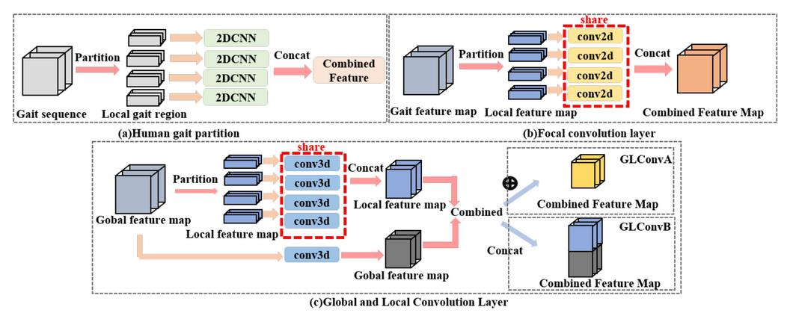
<br>
<div>图3-10 不同步态特征提取器的架构。 ⊕ \oplus ⊕代表逐元素相加，Concat”是指将不同部分的特征图水平串联起来。“2DCNN”表示二维卷积神经网络，“conv2d”表示2D卷积操作，“conv3d”表示3D卷积操作。</div>

​		**Local Temporal Aggregation**

​		以前的工作使用特定模式“CL-SP-CL-SP-CL”来提取特征，其中 CL 表示卷积层，SP 表示空间池化层。然而，空间信息可能会因 SP 下采样操作而丢失。考虑到步态序列中的时间信息是周期性的，提出了LTA操作来代替第一个空间池化层，它可以整合局部剪辑的时间信息并保留更多的空间信息。

​		**Global and Local Feature Extractor**

​		除了全局步态特征，最近的一些研究人员提出了利用局部步态信息的不同步态识别框架，如图2(a)(b)所示。例如，Zhang等人提出 ACL 框架通过使用多个单独的 2D CNN 来提取局部步态特征。Fan等人开发了一个焦点卷积层来提取局部特征，然后将它们组合起来。虽然它比全局步态特征包含更详细的信息，但局部步态特征并不关注局部区域之间的关系。因此，提出了一种新的GLFE模块来提取特征，该模块可以利用全局和局部信息。GLFE 模块由 GLConv 层实现，GLConv层包含全局和局部特征提取器。全局特征提取器可以提取整个步态信息，而局部特征提取器用于从局部特征图中提取更多细节。由于组合不同，GLConv有两种不同的结构，例如GLConvA和GLConvB。如图1所示，GLFE模块包括四层，“GLConvA-SP-GLConvA-GLConvB”。
​		基于以上形式的GLGonv层，可以构建GLFE模块，在LTA操作后提取步态特征。在实验中，GLConvA被用来实现前几个GLGonv块，GLConvB被用来实现GLFE模块中的最后一个块。

​		**Feature Mapping**

由于输入步态序列的长度可能不同，引入了**时间池化**来聚合整个序列的时间信息。为了提高特征表示能力，研究者开发了**加权求和的空间特征映射操作**。在时间池化之后，步态特征图被分成**条带**，并使用两个统计函数 max 和 average 来聚合每个条带的信息。

​		**Loss Function**

​		为了有效地训练所提出的步态识别模型，同时使用了**三元组损失和交叉熵损失**。


​		**实验训练细节**

​		Training Stage. 在训练阶段，首先将输入的步态序列输入到所提出的网络中生成步态特征表示。然后，使用组合损失函数计算损失，并采用Batch ALL (BA)作为采样策略.具体来说，每批包含 P个受试者ID，从每个受试者ID中选择K个样本。相应地，批大小为 P × K P\times K P×K。在训练阶段，考虑到内存限制，将输入序列的长度设置为 T。

​		 Test Stage. 在测试阶段，将整个步态序列放入提出的网络中以获得步态特征表示。然后，可以展平为一个特征向量，然后作为样本。为了计算 Rank-1 准确率，测试数据集分为两组，即注册集（gallery set）和验证集（probe set）。注册集被视为要检索的标准视角，而probe的特征向量被用来匹配gallery视角中的特征向量。多种度量策略，如欧氏距离和余弦距离，可用于计算注册集和验证集之间的相似度。具体而言，选择欧氏族距离作为度量策略。

​		采用与GaitSet相同的预处理方法来获得 CASIA-B 和 OUMVLP 数据集的步态轮廓。每帧的图像都归一化为 64 × 44 64\times44 64×44 的大小。网络参数如表1所示。三元组损失公式中的 m m m设置为 0.2。GeM公式中的 p p p被初始化为6.5。CASIA-B 数据集中的批大小参数 P P P和 K K K均设置为 8。由于OUMVLP数据集比CASIA-B大得多，因此批大小 P × K P\times K P×K设置为 32 × 8 = 256 32\times 8 = 256 32×8=256。在训练阶段，输入步态序列的长度设置为30。在测试阶段，将整个步态序列放入所提出的模型中以提取步态特征。在 ST、MT 和 LT 的设置中，epoch数分别设置为 60K、80K 和 80K。所有的实验都以 Adam 作为优化器。 CASIA-B 数据集的权重衰减设置为5e-4。对于ST的设置，学习率设置为1e-4。对于MT和LT的设置，学习率首先设置为1e-4，70K次迭代后重置为1e-5。对于 OUMVLP 数据集，epoch数设置为 210K。学习率首先设置为1e-4，在 150K 和 200K 迭代后分别重置为 1e-5 和 5e-6。特别的，因为OUMVLP的ID比CASIA数据集多100倍，所以将标签平滑操作加入交叉熵损失中。对于 OUMVLP 数据集，权重衰减首先设置为 0，然后在200K后重置为 5e-4。


​		**主要结果**

<div align="center">
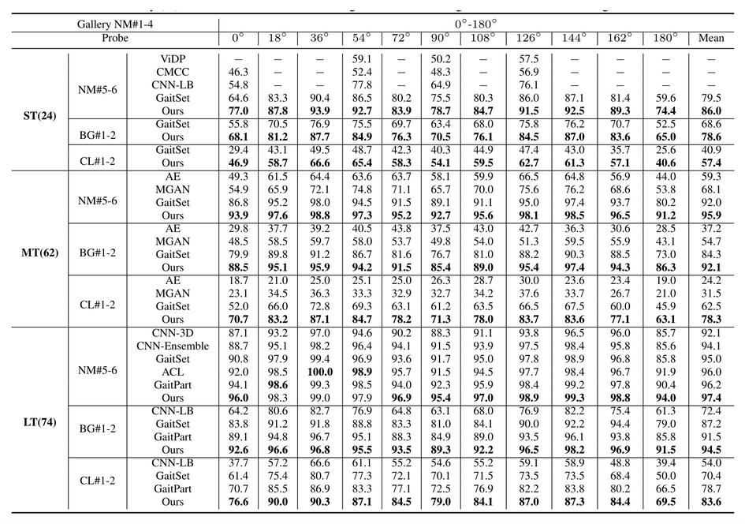
<br>
<div></div>
</div>

​		**结论**

​		本文提出了一个新的步态识别框架，在三维卷积公式下产生判别性的特征表示。首先，为了提取更全面的步态信息，提出了一个全局和局部特征提取器来提取稳健的步态特征进行表示。其次，为了利用更多信息，还探索了不同下采样方法的效果，并引入了局部时间聚合来代替传统的空间池化层。此外，引入了广义均值池化层来自适应地聚合空间信息，从而提高特征映射性能。在公共数据集上的实验结果验证了所提方法的有效性。


## 4.数据集


　　基于深度学习的步态识别方法通常需要数据驱动，因此需使用大规模的数据集进行训练以得到效果更好的模型。目前流行的数据集包括了与采集视角、环境条件和受试者外观相关的各种参数。 表4-1中概述了著名步态数据集的主要特征。这些特征包括数据的类型和模式、受试者和序列的数量、视角的数量，以及每个数据集中包含的变化。为了展示这些数据集基于时间的演变，表1中发布日期的顺序对这些数据集进行了排序。

| **Dataset**      | **Year** | **Data Type**           | **Subjects & Sequences** | **Environment**  | **Views** | **Variations**                                               |
| ---------------- | -------- | ----------------------- | :----------------------: | ---------------- | --------- | ------------------------------------------------------------ |
| CMU MoBo         | 2001     | RGB;Silhouette          |          25/600          | Indoor           | 6         | 3 Walking Speeds; Carrying a Ball                            |
| SOTON            | 2002     | RGB;Silhouette          |         115/2128         | Indoor&Outdoor   | 2         | Walking on a Treadmill                                       |
| CASIA-A          | 2003     | RGB                     |          20/240          | Outdoor          | 3         | Normal Walking                                               |
| CASIA-B          | 2006     | RGB;Silhouette          |        124/13680         | Indoor           | 11        | Normal Walking;Carrying a Bag;Wearing a coat                 |
| CASIA-C          | 2006     | Infrared;Silhouette     |         153/1530         | Outdoor          | 1         | 3 Walking Speeds; Carrying a Bag                             |
| OU-ISIR Speed    | 2010     | Silhouette              |          34/306          | Indoor           | 4         | 9 Walking Speeds                                             |
| OU-ISIR Clothing | 2010     | Silhouette              |         68/2746          | Indoor           | 4         | 32 Combinations of clothing                                  |
| OU-ISIR MV       | 2010     | Silhouette              |         168/4200         | Indoor           | 25        | 24 azimuth views and 1 top view                              |
| OU-ISIR          | 2012     | Silhouette              |        4007/31368        | Outdoor          | 4         | Normal Walking                                               |
| OU-ISIR LP Bag   | 2017     | Silhouette              |       62528/187584       | Indoor           | 1         | Seven different carried objects                              |
| OU-MVLP          | 2018     | Silhouette              |     10,307 / 259,013     | Indoor           | 14        | Normal Walking                                               |
| CASIA-E          | 2020     | Silhouette              |    1014 / Undisclosed    | Indoor & Outdoor | 15        | 3 Scenes; Normal Walk; Carrying a Bag; Wearing a Coat        |
| OU-MVLP Pose     | 2020     | Skeleton                |     10,307 / 259,013     | Indoor           | 14        | Normal Walking                                               |
| ReSGait          | 2021     | Silhouette;Skeleton     |         172/870          | Indoor           | 1         | cl, carrying, trajectories                                   |
| GREW             | 2021     | RGB;Silhouette;Skeleton |      26,345/128,671      | Wild             | 882       | view, distractor, carrying,  dressing, occlusion, surface, illumination, speed,shoes, trajectories |

　　**CMU MoBo:** The CMU Motion of Body (MoBo)数据集是文献中第一个步态数据集，由25名在跑步机上行走的不同受试者的RGB和轮廓数据组成。 此数据集涵盖三个子集，包括慢速行走、快速行走和持球行走。

　　**SOTON**: SOTON数据集包含115名受试者的步态数据。所有的序列在室内和室外都被记录下来，用一个固定的摄像机，捕捉沿着一条笔直的路径行走的受试者。在跑步机上行走时，从受试者身上获取了室内步态数据。不同的论文将该数据集划分为不同的训练集和测试集，并且没有预定义的测试协议可与该数据集一起使用。
　　**CASIA-A**: CASIA-A数据集，包括20名受试者在室外环境中的步态序列。受试者沿着一条直线行走，三个摄像头位于0^o^,45^o^,90^o^。拍摄的步态视频，平均每个序列90帧。跨视角测试协议是该数据集最广泛使用的协议，其中测试协议使用所有可用视角进行训练，不包括用于测试的视角。
　　**CASIA-B:** CASIA-B数据集是使用最广泛的步态数据集，包含124人的RGB和轮廓形式的多视角步态数据。从11个不同的视角进行采集，范围从0^o^到180^o^增量为 18^o^该数据集考虑了三种不同的行走条件，即正常行走（NM）、穿外套行走（CL）和携包行走（BG），每个人每个视角分别有6、2和2个步态序列。 CASIA-B最常用的测试协议是受试者无关协议，该协议使用前74名受试者的数据进行训练，其余50名受试者进行测试。 然后将测试数据拆分为一个注册集，其中包括NM步态数据中的前四个步态序列，验证集由其余序列组成，即每个受试者每个视角的剩余2个NM、2个CL和2个BG序列。 结果主要针对所有视角报告，不包括角度与参考相同的probe序列。
　　**CASIA-C:** CASIA-C 数据集包括来自 153 个不同受试者的红外和轮廓数据，并且序列是在夜间不同变化下捕获的。这些变化包括三种不同的步行速度，即慢走 (SW)、正常步行 (NW) 和快速步行 (FW)，以及携包行走 (BW)。 每个受试者有 4 个 NW、2 个 SW、2 个 FW 和 2 个 BW 序列。 测试协议考虑了跨速步态识别测试。

　　**OU-ISIR Speed**： OU-ISIR Speed数据集提供34名受试者的轮廓数据。该数据集适用于评估步态识别方法对步行速度的鲁棒性，因为它包括九种不同的速度，从2km/h到11km/h不等，间隔为1km/h。该数据集采用了跨速度测试。

　　**OU-ISIR Clothing**： OU-ISIR Clothing数据集包括68名受试者的数据，他们穿着多达32种不同类型的服装组合。在同一天的两次室内采集过程中收集步态序列。与数据集OU-ISIR一起提供了一个受试者无关的测试协议，该协议将数据划分为预定义的训练、测试和验证集，特别是与服装条件有关的数据集。

　　**OU-ISIR MV**: OU-ISIR MV数据集包含168名受试者的步态轮廓，受试者年龄范围很广，从4岁至75岁，男女受试者人数几乎相等。数据是从大范围的视角变化中获取的，包括24个方位角视图和1个俯视图。跨视图测试协议已被广泛用于该数据集。

　　**OU-ISIR**: OU-ISIR：OU-ISIR数据集是一个大规模的步态数据集，由4007个性别分布几乎相等、年龄从1岁到94岁不等的受试者的步态数据组成。 步态序列是在室内大厅的两个不同采集过程中使用四个以55^o^ 、65^o^、75^o^、85^o^。 放置的摄像机捕获的。 由于每个受试者有两个序列可用，测试协议使用第一个序列作为注册样本，另一个作为验证样本。
　　**OU-ISIR LP Bag**： OU-ISIR LP Bag数据集由62528名受试者携带物体的步态视频组成，在受限的室内环境中使用一台摄像机拍摄。每个受试者获得了三个序列，一个带有携带物体，两个没有携带物体。按照提出的测试方案，训练集包含来自29097名受试者的数据，其中有两个序列，带或不带携带物体，测试集包括其他29102的受试者。为了将测试集划分为验证集和注册集，分别在协作和非协作场景下采用了两种方法。对于协作场景，注册集仅包含不携带物体的序列，其中验证集包括带七种不同类型携带物体的序列。在非协作场景中，随机形成注册和验证集，以便它们都包含带或不带携带物体的序列。

　　 **OU-MVLP**： OU-MVLP 数据集是就步态序列数量而言最大的可用步态数据集 (259,013)。 该数据集提供轮廓的视频，并在每个受试者的两个采集过程中获得。 受试者的性别分布几乎相等，年龄范围为 2 至 87 岁。 该数据集是从 0° 到 90° 和 180° 到 270° 的 14 个不同视角中获取的，其中每一步的角度变化为 15°。 已指定 5153 和 5154 名受试者的预定义列表，并与数据集一起分别作为训练集和测试集提供。 为了测试，来自第一和第二采集过程的序列分别形成注册集和验证集。 在最近的大多数步态识别论文中，都考虑了所有或四个视角，特别是 0°、30°、60° 和 90°。

　　**CASIA-E**: CASIA-E数据集由1014名受试者的步态轮廓组成，每个受试者有数百个视频序列，在三种场景中捕获，分别为简单静态背景、复杂静态背景和复杂动态背景。这些数据是根据三种不同的行走条件采集的，包括正常行走（NM）、带外套行走（CL）和带包行走（BG）。该数据集是从 15 个不同的视角获得的，包括两个高度为 1.2 m 和 3.5 m 的垂直视角，以及 13 个从 0° 到 180° 以 15° 为增量的水平视角。该数据集最近用于 2020 年 TC4 远程人类识别竞赛和研讨会，其中训练集包括前500名受试者的全部数据，而最后514名受试者的25个序列用于验证（validation）。最后514名受试者的剩余序列用于测试。

　　**OU-MVLP Pose**： OU-MVLP Pose数据集建立在OU-MVLP的基础上，从OUMVLP中可用的RGB图像中提取人体骨骼形式的姿势序列。使用OpenPose和AlphaPose的预训练版本创建了两个子集，以提取人体关节信息。测试协议类似于为OU-MVLP提出的协议。

　　**ReSGait**：步态数据集由172名受试者和870个视频序列组成，记录时间超过15个月。 此外，这些视频还被贴上了性别、服装、携带条件、行走路线、是否使用手机等标签。 在该数据集中，受试者在行走时执行诸如打电话和跳跃等动作。 此外，受试者可以自由选择他们的服装，观点可以因步行路线而改变，时间跨度可以反映外观的变化，以及许多其他情况的合并，使该数据集成为文献中最真实和最困难的数据集之一。每个剪影序列都有一个对应的姿态或骨架点序列。 其中剪影图像尺寸为128x128，人体姿态格式为标准的COCO-18关键点姿态骨架。  

　　**GREW**：GREW数据集由具有多个摄像头的自然流构建而成。来自原始视频的身份信息被手动注释，从而产生 26K 个对象、128K 个序列和 14M个 框，用于无约束步态识别。此外，丰富的人类属性，包括性别、年龄组、携带和穿着风格都被标记出来，以便进行精细的性能分析。实际上，gallery规模是识别准确性的关键问题。为此，作者增加了一个超过23.3万个序列的干扰物集，使其更适合于现实世界的应用。由于有一系列使用不同输入数据类型的步态识别框架，GREW 通过自动处理提供轮廓、步态能量图像 、光流图、2D 和 3D 姿势图。与CASIA-B和OU-MVLP等受控步态数据集相比，GREW是完全不受约束的，并且有更多不同的、实用的视角变化，而不是预定义的。GREW中存在各种挑战因素，如干扰物集、复杂背景、遮挡、携带、穿戴等。

## 5 任务实践

> &emsp;&emsp;针对2D多人姿态估计的相关任务，FudanVIA提供了一套较为完整的解决方案，其中已封装了具有代表性的2D多人姿态估计模型的对应功能接口，可供系统开发和学习交流使用。本节将基于这些接口介绍具体的任务实践。

### 5.1 模型组件介绍

*介绍算法库中有关2D姿态估计任务的组件及其构成，简单阐述工作原理*

&emsp;&emsp;针对2D姿态估计任务，FudanVIA提供了pose_estimation_2d_img对图像进行姿态估计。该模型组件接口支持输入单张图像的路径或者包含多张图像的文件夹路径，所有模型对单张图片进行姿态估计，得到人体关节点的在图像中的2D坐标。在推断时，支持输入单张图像的路径或者包含图像的文件夹路径，可根据需要保存可视化图像。该接口目前添加了HRNet，HigherHRNet和CenterNet模型。

### 5.2 模型组件接口调用

&emsp;&emsp;若要调用接口，首先需要对FudanVIA库进行引入：

```python
import FudanVIA
```

&emsp;&emsp;2D人体姿态估计`get_pose_eatimation_2d_img_component()`含有一个参数`model_name`，为字符串类型数据。在该参数中输入需要使用的2D人体姿态估计模型的名称，`getPoseEstimation2DComponent()`方法将会返回一个PoseEstimation2DComponent类的实例化对象，其中包含了与名称对应的初始化2D姿态估计模型：

```python
poseest2d_model = FudanVIA.get_pose_eatimation_2d_img_component("HRNet")
```

&emsp;&emsp;目前可输入的名称范围为("HRNet", "HrHRNet", "CenterNet")，分别对应了三个模型；输入其他字符串则将报错。后续将逐步在算法库中更新更多2D人体姿态估计模型。

  由此，通过接口调用完成了一个2D人体姿态估计模型组件的初始化。接下来，通过调用模型组件的接口，即可完成模型训练、模型测试、模型预测等功能。

#### 模型初始化

  调用`init_model()`方法以初始化模型权：

```python
poseest2d_model.init_model(is_train=False)
```

&emsp;&emsp;该接口接收1个输入参数`is_train`，为布尔型参数，用于指定是否为训练模式；该接口无返回值。

#### 权重加载

  调用`load_checkpoint()`方法以加载预先完成训练的模型权重：

```
poseest2d_model.load_checkpoint(weight_dir="PATH_TO_WEIGHT")
```

&emsp;&emsp;该接口接收1个输入参数`weight_dir`，为字符串型参数，用于指定权重路径；而该接口无返回值，直接将权重参数载入已完成初始化的模型中。

#### 模型训练

&emsp;&emsp;若要实现模型的训练功能，应调用模型组件的train()方法：

```python
poseest2d_model.train()
```

&emsp;&emsp;`train()`方法没有输入参数；仅完成对2D人体姿态估计模型的训练。`train()`方法没有返回值，训练结果将直接以计算机文件的形式进行持久化。

#### 模型测试

&emsp;&emsp;若要实现模型的测试功能，应调用模型组件的test()方法：

```python
poseest2d_model.test()
```

&emsp;&emsp;`test()`方法没有输入参数；`test()`方法实则在测试数据集上仅执行一次验证功能的`train()`方法，输出在相应权重下的测试结果，不同模型方法评估指标不同，例如HRNet模型使用$AP$，$AP^{50}$，$AP^{75}$，$AP^{M}$，$AP^{L}$，$AR$，$AR^{50}$，$AR^{75}$，$AR^{M}$，$AR^{L}$进行评估。

#### 模型预测

&emsp;&emsp;模型预测功能需要调用模型组件的inference()方法：

```python
pred=poseest2d_model.inference(
    imgs,
    save_img,
    save_img_path)
```

&emsp;&emsp;需要向其传入三个参数：

- `imgs`：字符串型参数，指定需要推断的图像所在的路径或者包含图像的文件夹路径；
- `save_img`：布尔型参数，指定是否保存图像的可视化结果。
- `save_img_path`：字符串型参数，若save_img为True，指定图像可视化结果保存的路径。

&emsp;&emsp;`inference()`方法返回所有图像或者视频帧的预测结果，格式为numpy数组格式。

### 5.3 任务范例

&emsp;&emsp;根据FudanVIA提供的模型组件接口，可基本实现2D姿态估计的全部内容。本节将给出一个基于FudanVIA的模型组件接口的简易2D姿态估计器的实现。

#### 训练模块代码

```python
import FudanVIA

def training_module():
    poseest2d_model = FudanVIA.get_pose_eatimation_2d_img_component("HRNetW48")
    poseest2d_model.init_model(is_train=True)
    poseestor.train().train()
    test_acc=poseestor.test()
    return test_acc
```

#### 预测模块代码

```python
import cv2
import FudanVIA

def inferring_module():
    model_name = 'HrHRNetW48'
    imgs='/home/gyj/data/images/2_zt/'
    save_img=True
    save_img_path='/home/gyj/outputs/hrnet/2_zt/'
    cfg = 'PATH_TO_WEIGHT'
    poseestor =get_pose_eatimation_2d_img_component(model_name)
    poseestor.init_model(is_train=False)
    poseestor.load_checkpoint()
    pred=poseestor.inference(imgs,save_img,save_img_path)
```

   

### 5.4 常见问题Q&A

**在此列出开发实践过程中遇到的有记录价值的问题，并给出详细解答*

